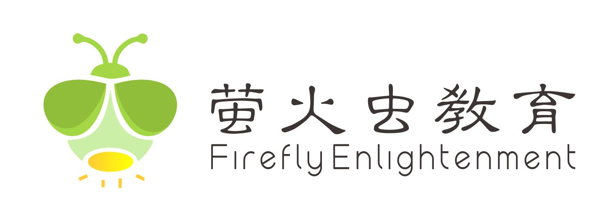

✨萤火之光·点亮远方✨
CCL 咨询请找小助手
771
771
12. 那真是太好了。我很高兴您能对我们的活动提出任何改进建议。我自己也一直在寻
求新的想法。
(That’s really great. I’m happy you can give any suggestions to improve our
programs/activities. I myself have always been looking for new ideas.)
13. That’s good to know. Once I am all familiar with everything the center does, I am
sure I will be able to come up with some ideas.
(真好。等我把中心的各项工作都熟悉了，我肯定能想出一些点子。)
14. 太棒了。我相信我们会合作的非常愉快。
(Great. I'm sure we'll work together very well. / I believe we’ll work together very happily.
/ I’m sure we’ll enjoy working together. / I’m sure we’ll have a great time working
together.)
— End of Dialogue —
\n

\n✨萤火之光·点亮远方✨
CCL 咨询请找小助手
772
772
#70243. Urgent Lawyer Appointment for Job Contract
Review–Legal
Briefing: This dialogue is a conversation between an English speaking lawyer and a
client. The client has been offered a new job and wants help to review the employment
contract before they sign. The conversation takes place at the lawyer’s office. The
dialogue begins now.
1. Hello, please, come in and sit down. It’s nice to meet you.
（你好，请进，坐吧。很高兴认识你。）
2. 你好，谢谢。我也很高兴认识你。感谢你这么快就见我。
(Hello, thank you. I’m also pleased to meet you. Thanks for seeing me so quickly/on such
short notice.)
3. It’s no problem at all. My assistant said you needed some help quickly. Luckily, I
had another client who canceled the appointment.
（完全没问题。我助理说你需要尽快帮忙。碰巧有个客户取消了预约。)
4. 这时间真是刚刚好。我刚收到一家跨国公司的录用通知。对我来说，是职业上的一
大进展。
(This timing is perfect. I’ve just received an offer from a multinational company and it’s a
big step forward/ a major milestone/an important move in my career.)
【萤火虫老师Tips】
这里“进展”用progress 不是最合适的。因为progress 通常指“过程中的进步、逐
步改善”，强调的是连续性、发展过程，比如I’ve made a lot of progress in my English
（我的英语进步很多）。
而原文这里想表达的是一个明确的职业跳跃/提升，用milestone / step forward /更合
适。
\n

\n✨萤火之光·点亮远方✨
CCL 咨询请找小助手
773
773
5. That’s great. Congratulations! You must be very excited about that. Tell me how I
can help with your new job offer.
（太好了，恭喜！你一定很激动。告诉我怎么能帮你处理这份新工作邀约。)
6. 公司发给我一份雇佣合同。文件很长，在签之前，我想知道，有没有需要特别注意
的地方。
(The company has sent me an employment contract. It’s a long document, and before I
sign, I want to know if there;s anything I should pay special attention to.)
7. Of course, that’s a good idea. You mentioned that you have briefly read it. Is there
anything you thought was concerning？
（当然，这是个好主意。你说你粗略看过了，有没有什么让你觉得担心的地方？)
8. 没有。我没能仔细看完。因为里面有很多法律术语。跟我以前签过的合同不太一样。
(No. I couldn’t read it properly/carefully, because there are lots of legal terms in it. It’s not
quite like the contracts I’ve signed before.)
9. I understand. A global company is likely to have more comprehensive contracts. I
will read through it for you and see what’s included.
（我明白。跨国公司的合同往往更全面。我会帮你读完合同，看看里面都包含了什
么。)
10. 太好了。我确实试着读完合同。但实在太难懂了。所以决定找专业人士帮忙。
(Great. I did try reading the whole contract, but it was so hard to understand. So, I decided
to get a professional to help.)
11. Lawyers do love using complicated language when writing contracts. Has the
company given you a deadline to return the signed contract?
（律师写合同时, 确实喜欢用复杂的措辞。公司有没有给你一个把签好合同交回去的
截止日期？)
\n

\n✨萤火之光·点亮远方✨
CCL 咨询请找小助手
774
774
12. 是的。他们希望我本周末前交回合同，不过，如果需要的话，可以延后一点。
(Yes. They want me to return it by this weekend, but they said it can be pushed back a
little if needed.)
13. Perfect. That gives me enough time to review it properly. We can schedule a quick
call to review my note when I am done.
（很好。那我就有足够时间好好看合同了。等我看完，我们可以安排打个简短的电
话，把我的意见/我整理的记录过一遍。)
【萤火虫老师Tips】
这里的note 本质上是律师在审阅合同后写下的要点、记录或提示。它不仅是“笔
记”，也包含专业意见或建议，所以可意译成“意见”。
14. 好主意，谢谢，希望你没发现什么问题。
(Good idea, thanks. Hope you won’t find any problems.)
— End of Dialogue —
\n

\n✨萤火之光·点亮远方✨
CCL 咨询请找小助手
775
775
#70244. Seeking Advice After Workplace Layoffs
–
Business
Briefing: This dialogue is a conversation between a Mandarin-speaking female employee
and an English-speaking career advisor. They are discussing the possibility of changing
careers. The dialogue begins now.
1. Hi, I am surprised to get your call. When we talked last time, you were happy with
your work.
（你好。接到你的电话，我还挺吃惊的。我们上次聊的时候，你对你的工作还挺满
意的。）
2. 你好，是的，我记得我们上次交流是在去年。那时候，一切都好。但是，现在的情
况变了
(Hello, yes, I remember we last communicated last year; everything was fine then, but
now the situation has changed.)
3. Oh, I see. That’s not good to hear. You can tell me what happened. I will give you the
best options for you to choose from.
（哦，懂了。那可不太妙啊。你可以给我讲讲怎么了。我会给你几个最好的方案/选
择让你来选。）
4. 我最近的工作压力很大，工作时间也很长，连见朋友的时间都没有了。
(I’ve had a lot of work pressure recently and my work hours are also very long. I don’t
even have time to see my friends.)
5. I am sorry to hear that. It is important to balance your workload and daily life.
（听你这么说，我很遗憾。平衡你的工作负荷/量和日常生活是很重要的。）
\n

\n✨萤火之光·点亮远方✨
CCL 咨询请找小助手
776
776
6. 是的，平衡工作和生活对我来说很困难。有太多事情要做了，我想要换个职业。
(Yes, balancing work and life is too difficult for me. There are too many things to do. I
want to change my career.)
7. Okay. Could you tell me why you are so busy these days? Did a new contractor come
and increase your workload?
（好。你能告诉我为什么你最近这么忙吗？是来了新的合同工，增加了你的工作量
吗？）
【萤火虫老师Tips】
这一段回忆很可能不准确。回忆也不确定是contract 还是contractor，是increase 还
是lessen。建议猛练听力，考试如果再遇到这个题，使劲听。
8. 噢，如果那样还好。情况更糟糕，公司开除了几个人，但没有招新的人来替代他们。
(Oh. I wish they had done that/ I wish it had been the case/ If that had been the case, it
would have been fine. It was worse. The company laid off several people/let a few people
go but didn't hire new people to replace them.)
【萤火虫老师Tips】
第一句要用虚拟语气。对于【过去】发生的事情的假设虚拟：如果【当时】是
公司来新的人/活儿，那就好了。可惜，【当时】不是。【当时】反而是公司裁
员的猎杀时刻。
公式：If + 主语+ had + 过去分词, 主语would have + 过去分词
平替公式：某人+ wish
+ 某人+ had + 过去分词
这里开除别用fire：这个词一般带有“因员工不合格/有过错而被解雇”语气。
9. No one could have predicted this situation. I would suggest looking for a new job in
the same industry.
（没人能料到这种情况。我建议你在同行业找找新的工作。）
\n

\n✨萤火之光·点亮远方✨
CCL 咨询请找小助手
777
777
10. 好的，我觉得我别无选择，但是发生这种情况让我怀疑我是不是喜欢这个职业了。
(Okay, I feel I have no choice, but this situation makes me doubt whether I even like this
career.)
【萤火虫老师Tips】
job = 一份具体的工作/职位，偏日常和具体。例：I like my job.（我喜欢我的工作）。
career = 职业生涯，带长期发展色彩。例：She wants a career in medicine.（她想在医
疗领域发展）。
profession = 专业职业，通常需要资格或高技能（医生、律师、教师等）。例：Teaching
is a noble profession.
这段表达更接近对整个行业和长期选择的怀疑，另外也不知道这人啥职业，因此
career 比较保险。
11. A career change is a considerable step, but finding a new job will be worth it for you.
（职业改变是件大事儿，但是对你来说，能找到新工作也值了。）
12. 我认为, 就算我想要改变职业，我也需要一些时间来接受培训。
(I think even if I want to change my career, I'll also need some time for training/to get
training.)
13. Why don’t you find a job in the same industry and get training at the same time?
Let’s see what will happen in the next few months.
（不如一边找同行业工作一边培训？我们看看接下来几个月会是什么情况。）
14. 这是个好主意，谢谢你的帮助和建议。
(That’s a good idea, thank you for your help and advice.)
— End of Dialogue —
\n

\n✨萤火之光·点亮远方✨
CCL 咨询请找小助手
778
778
#70245. ABN
and
Business
Structure
Questions
–
Business
Briefing: This dialogue is a conversation between an English-speaking Government
Business Cooperation Centre staff member and a Mandarin-speaking woman. They are
discussing how to register a new business. The dialogue begins now.
1. Good morning. Welcome to the Government Business Cooperation Centre. How may
I help you today?
（早。欢迎来政府商业合作中心。今天我能怎么帮到你？）
2. 你好，我计划开展我的新事业，我有一些问题不清楚，想要问一下。
(Hello, I plan to start my new business. There’re some questions that I'm unclear
about/I’m not clear about and I’d like to ask.)
3. Congratulations! Starting a new business is very exciting. I’m happy to help you.
What kinds of questions do you have?
（恭喜！开始新事业很让人兴奋啊。我很乐意帮你。你有什么问题？）
4. 我知道开展新事业需要申请澳大利亚商业号。但是我不知道最好的方法是什么样的。
(I know that starting a new business requires applying for an Australian Business Number.
But I don't know what the best way is.)
5. The easiest way to apply for a registration number is by using the online system. The
process is guided step by step, and you can easily follow it.
（申请注册号，最简单的方法是使用线上系统。流程都有每一步的指导，很容易照
做。）
6. 那太好了，那我还需要提供什么信息呢?
(That’s great, what other information do I need to provide?)
\n

\n✨萤火之光·点亮远方✨
CCL 咨询请找小助手
779
779
7. You’ll need to provide your personal details, information about your business plan,
your business structure, business activities and the future projects of your company.
（你需要提供你的个人资料、商业计划信息、你的商业结构、经营/业务活动和公司
未来的项目。）
8. 听起来很多啊！我不理解什么是商业结构，你可以给我解释一下吗?
(That sounds like a lot. I don’t understand what a business structure is. Could you explain
it to me?)
9. Sure. You need to decide whether your business will operate as a company, a sole
trader, or a partnership. These choices make up your business structure.
（当然。你需要决定你的生意是以公司、个体经营者，还是合伙企业的形式运营。
这些选择构成了你的商业结构。）
10. 噢,我理解了，我想进行个体营业，我还会用我的名字作为我生意的名字。
(Oh, I understand. I want to operate as a sole trader, and I will also use my name as my
business’s name.)
【萤火虫老师Tips】
这段涉及到的重要背景知识(大课也讲过)：
在土澳，sole trader（个体经营者）不是“公司（company）”，而是一种business
structure（商业架构）。你可以用自己的名字做生意，但这不等于你“成立了一
家公司”。
而公司是一个独立的法律实体，大多责任有限，法律上和你个人分开。
所以，这个对话里“公司”二字千万慎用。没听到原文说，千万别用。
11. If you want to operate as a sole trader and use your personal name as your
registered business name, the application process will be much easier.
（如果你想以个体经营者身份经营，并用你个人的名字作为注册的生意的名字，申
请过程会容易得多。）
\n

\n✨萤火之光·点亮远方✨
CCL 咨询请找小助手
780
780
12. 我觉得我已经提供足够多的信息了，但我担心我遗漏了什么。
(I think I have already provided enough information, but I'm worried I might have missed
something.)
【萤火虫老师Tips】
might have missed = 对过去的不确定性
含义：我担心我可能不小心漏掉了什么，但不确定。
更地道、自然。尤其口语里常用“might have + 过去分词” 来表示“可能发生但
不确定的过去行为”。
13. Don’t worry. You can still find your information and save your application. You can
always come back and continue it later.
（别担心。你还能找到你的信息，也还能保存申请。你可以随时再回来继续完成。）
14. 太好了，谢谢你提供这些有价值的信息。我今天会在线上申请的。祝你今天开心!
(Great, thank you for providing this valuable information. I will apply online today. Wish
you a happy day/Have a lovely day!)
— End of Dialogue —
\n

