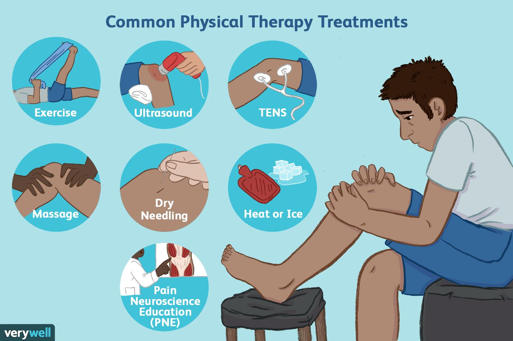

✨萤火之光·点亮远方✨
CCL 咨询请找小助手
101
101
#70027. TAFE Course consultation - Education
Briefing: The following dialogue takes place between a mandarin speaking student and
an officer from a Technical and Further Education institute. The student would like to
enquire about physiotherapy courses. The dialogue starts now.
1.
Officer：Hello, this is Jimmy from Glen Technical and Further Education. How can
I help you?
(你好。我是格伦技术和继续教育学院的吉米。我能如何帮到你呢？)
【萤火虫老师Tips】

TAFE，Technical and Further Education, 很重要的一个词，可能大家都知道TAFE
但是没想过怎么翻译。注意记忆哟(CCL 必考词汇)
2.
Student：你好，我想成为一名物理治疗师，想咨询一下这个文凭入学的要求。
(Hi, I want to become a physiotherapist and I’d like to ask about the admission
requirements for this diploma.)
3.
Officer：Well, first you need to successfully complete senior high school level studies
and pass a literacy and numeracy exam.
(首先你需要完成高中教育，然后你需要通过一个读写和算术考试。)
4.
Student：哦，我上完高中了，不过是在中国上的。可以吗？
(I see. I have finished senior high school, but it was in China. Is that okay?)
5.
Officer：That’s okay. For those who complete high school studies in non-English
speaking countries, they need to sit for an authorized English test and achieve at
least 80% in Writing, Reading and Speaking.
(可以的。对于在非英语国家完成高中学习的申请人来说，他们需要参加一个通过认
可的英语语言测试，并且在写作，阅读和口语几项中分数至少要达到80%。)
【萤火虫老师Tips】
\n

\n✨萤火之光·点亮远方✨
CCL 咨询请找小助手
102
102

Sit for a test: 参加考试；

Authorized：在这个语境下，翻“经过认可的”更合适。
6.
Student：我之前从来没有参加过英语考试，我都是在家自学的。我可以在你们这里
学习英语考试课程吗？
(I’ve never taken any English tests before. I usually teach myself/learn by myself at home.
May I take any courses here to pass that English test?)
7.
Officer：You can take this brochure with a list of authorized English tests inside. We
also have courses available to help improve your English.
(你可以拿一本这个小册子，上面列出了我们认可的英语语言测试。我们也有课程可
以帮你提高英语。)
8.
Student：好的，那请问, 如果我通过了英语考试，并且被学校录取了，学费是多少
呢？
(Okay. Then may I please know how much the tuition is if I pass the English test and be
admitted?)
9.
Officer ：Tuition fees don’t apply for this course. However, you can apply for a
student loan to pay all or part of your tuition fees from the Department of
Education and Training if you were an Australian citizen or a permanent resident
and meet the residence requirements.
(学费不适用于这个课程。不过，如果你是澳大利亚公民或者永久居民，并且满足居
住要求，你可以向教育和培训部申请学生贷款，来支付你所有或者部分的学费。)
【萤火虫老师Tips】

这段话，几个英语基础不错的考试同学皆表示有点逻辑困惑，但是都表示确实
听到了tuition fee doesn’t apply for this course)
10. Student：好的，如果政府帮我交了学费，以后我还要还钱吗？我现在没有工作，也
没有任何积蓄。
\n

\n✨萤火之光·点亮远方✨
CCL 咨询请找小助手
103
103
(Okay. Do I need to pay it back in the future if the government helps me with the tuition
fee? I don’t have a job or any savings at the moment.)
11. Officer：You need to pay the tuition reimbursement back after you find a paid job.
To get this loan, you’ll need a tax file number and a request form, which must be
filled in and submitted to your education provider before the census date.
(在你找到带薪工作以后，你需要把政府给你报销的学费还回去。如果要申请这笔贷
款，你需要提供你的税号，申请表，并且要在学校截止日之前，填好并交给你申请
的学校。)
【萤火虫老师Tips】

TFN：Tax file number 税号；

补充-ABN：Australian Business Number: 澳大利亚商业编号也是我们business
生词表上的一个重点词
12. Student：谢谢您提供的信息。原来还有这么多需要准备的东西啊！不过这样可以激
励我。我会在截止时间之前提交所需要的文件的。
(Thank you for the information provided. It turns out that I have a massive list of things
to prepare. It can motivate me though. I’ll submit all the documents required before the
deadline.)
— End of Dialogue —
\n

\n✨萤火之光·点亮远方✨
CCL 咨询请找小助手
104
104
#70028. Adult Migrant English Program - Immigration
Briefing: Ms. Wu, a Mandarin speaking woman, recently arrived in Australia two
months weeks ago as a refugee. She’s now meeting with an immigration case officer to
enquire about some future assistance she may get. The dialogue starts now.
1.
Hi, Ms. Wu. Please take a seat.
(早上好，吴女士。请坐吧。)
2.
早呀。我希望你能帮助我。
(Good morning. I hope you could help me.)
3.
Let’s see… if the information is correct, you arrived in Australia as a refugee 2
weeks ago.
(让我看看…如果信息正确的话，你是两周前以难民身份来到澳大利亚的。)
【萤火虫老师Tips】

Refugee 难民(CCL 必考词汇)

Refuge 避难所与难民读音不一样(CCL 必考词汇)
4.
可不是么，但是我还是摸不到头脑。
(That’s right. But I still feel so confused.)
5.
That’s what we’re here for. We have a range of programs that are designed to help
you settle in Australia. First you can receive an assistance of learning English. Our
goal is to help you understand everything.
(我们的职责就是帮助你。我们有一系列帮助你在澳定居的计划。首先你可以接受学
英语的帮助。我们的目标就是帮你把一切都弄明白。)
【萤火虫老师Tips】

That's what I'm here for: That's my role/my job
\n

\n✨萤火之光·点亮远方✨
CCL 咨询请找小助手
105
105
6.
好的，我听说你们有新移民英语课程。
(Okay. I heard that you have an English course for newly arrived migrants.)
【萤火虫老师Tips】

“新移民”的英文是官方的固定搭配，不要自己发明再创造哈。
7.
Yes. Under this scheme, our clients can have access to a 500-hour English course,
but all participants can join it voluntarily.
(是的，根据这个计划，我们的客户可以上500 个小时的英语课程。但是所有人都是
自愿参加的。)
8.
哦, 我想找新工作，所以我需要参加这个课程。
(Oh, I want to find a new job, so I need to take this course.)
9.
Yes, all humanitarian entrants are eligible to receive assistance after newly arriving
in Australia. Let’s go through all the paperwork.
(是的，所有的人道主义入境者都有资格在刚到澳大利亚后接受帮助。我们过一下所
有的文件吧。)
10. 听你这样说我就舒服多了，这里的费用太高了，我不知道如何筹谋生计，我一点积
蓄都没有。
(I feel much relieved to hear that. Everything is so expensive here and I don’t know how
to make a living. I don’t have any savings.)
11. I totally understand what you are concerning, but you have access to our income
support, just like other permanent residents.
(我完全理解你的担心，但是你就跟其他永久居民一样，可以有得到收入补助的资
格。)
12. 我姑母和我表妹和我讲过，她们6 个月以前就来澳大利亚了，她们知道的比我多。
(My aunt and my cousin have told me about that before. They arrived in Australia six
\n

\n✨萤火之光·点亮远方✨
CCL 咨询请找小助手
106
106
months ago and they know more than I do.)
13. That’s good to hear. Do you live with them?
(那很好啊。你跟她们住一块吗？)
14. 没有。真是可惜呀，她们和别人住在狭小的公寓里，我和别人合租一个公寓，我希
望这不要持续太久。
(No. What a pity. They are living in a tiny apartment with others and I’m living in a
shared apartment. I hope this won’t last long. )
15. So, you’d rather live with your relatives. I can add you onto the waiting list for
public housing if you meet the eligibility requirements.
(所以你更想跟亲人住在一起啊。如果你符合资格要求的话，我可以把你加到公屋的
等候名单里。)
【萤火虫老师Tips】

Would rather：If you say that you would rather do something or you'd rather do it,
you mean that you would prefer to do it. If you say that you would rather not do
something, you mean that you do not want to do it. 宁愿/宁愿不

例：If it's all the same to you, I'd rather work at home.如果对你来说都一样，我宁
愿在家工作。

例：Kids would rather play than study.孩子们宁愿玩而不愿学习。
16. 那可太好了，我可太想和她们一起住了。
(That would be great. I’m dying to live with them.)
17. I totally understand you. Well, I hope I have answered all the questions you have
today.
(我很能理解你。嗯，我希望我回答了你今天所有的问题。)
\n

\n✨萤火之光·点亮远方✨
CCL 咨询请找小助手
107
107
18. 太感谢了。你真是太好了，不是所有人都像你一样。我会预约一个时间，下周二吧，
我再过来。拜拜，最后再次感谢你。
(Thank you so much. It’s very nice of you. Not everyone is like you. I’ll make another
appointment. Let’s make it next Tuesday. I’ll be here again. Bye, and thank you again.)
— End of Dialogue —
\n

\n✨萤火之光·点亮远方✨
CCL 咨询请找小助手
108
108
#70029. Meeting a lawyer about a car accident - Legal
Briefing: Mr. Li was having an initial consultation with a lawyer at the lawyer’s
chamber. He wants to enquire about a car accident he was involved in. The dialogue
starts now.
1.
Lawyer：Good morning, Mr. Li. Could you explain to me what occurred to you?
(早上好，李先生。您能给我解释一下发生了什么吗？)
2.
Mr. Li：您好。我出了车祸。我当时在等交通灯变绿，突然后面的车就撞上了我的
车，还撞了两次。
(Hi. I had a car accident. I was waiting for the traffic light to turn green when the car
behind me hit my car. I got hit twice.)
【萤火虫老师Tips】

Red light 红灯

Yellow/amber light 黄灯

Run a/the red light 闯红灯

例句：The police pulled over the car, which had run several red lights. 警察命令这
辆连闯多个红灯的车靠边接受检查。
3.
Lawyer：Hit you twice? That’s unusual. Were the police called to the scene?
(撞了你两次？这不太常见。现场有警察来吗？)
4.
Mr. Li：是的，我们报警了。那个司机跟警察说，她当时在发短信，所以才撞了我
两次。
(Yes. We called the police. That driver told the police that she was texting, so she hit me
twice.)
5.
Lawyer：If she told the police that she was texting, it would be much simpler for you
to win the case.
Did you see the doctor after the accident? Were you injured?
\n

\n✨萤火之光·点亮远方✨
CCL 咨询请找小助手
109
109
(如果她跟警察说她当时在发短信，你要赢这个官司就简单多了。车祸以后你去看医
生了吗？你受伤了吗？)
6.
Mr. Li：是的。我去看过了。我的脖子一扭就感到刺痛。我朋友开车送我去了附近
医院的急诊。
(Yes, I did. I felt a stabbing pain in my neck when I turned it. My friend drove me to the
emergency room in a nearby hospital.)
7.
Lawyer：I’m sorry to hear that. Did you have any tests at the hospital? What did the
doctor say?
(听到这个我很遗憾。你在医院检查了吗？医生怎么说？)
8.
Mr. Li：医生说我的脖子扭伤了。我需要带六周(也有同学回忆是六个月哈)的颈托，
还要做三个月的物理治疗。
(The doctor said my neck was twisted. I need to wear a neck brace/collar for six weeks
and receive physiotherapy treatments/receive physiotherapy for three months.)
【萤火虫老师Tips】

理疗：physiotherapy 或者physical therapy, 后面可加treatments 也可以省略。
\n

\n✨萤火之光·点亮远方✨
CCL 咨询请找小助手
110
110
9.
Lawyer：Generally speaking, rear-end collision accidents are usually the fault of the
driver who hit the car in front. Since she told the police she was texting, we might
attempt to get a higher compensation.
(一般来说，追尾事故通常都是撞前车的后车为过错方。因为她跟警察说她在发短信，
我们可以试试争取更多索赔。)
【萤火虫老师Tips】

Rear-end 追尾，可以做名词，也可以做动词
10. Mr. Li：好的，我相信你们一定会赢的，因为这很明显就是她的错。你有可能从警
察那里拿到报告吗？
(Okay, I’m sure you can win this case because it’s obviously her fault. Do you think you
can get the report from the police?)
11. Lawyer：I can’t see that being a problem. We have a “no win no pay” policy. That
means, you don’ t owe us anything if we lose the case. I look forward to working
closely with you.
(这应该不是问题。我们有一个不赢官司不收费的政策，也就是说，如果我们官司打
输了，您不需要支付我们任何费用。我很期待跟您密切合作。)
12. Mr. Li：好的, 谢谢你。那我应该什么时候再来见你呢？
(Okay. Thank you. When should I see you again?)
13. Lawyer：In two months, I think. Please see the receptionist on your way out.
(我觉得，再过两个月吧。您出去的时候记得找一下前台。)
【萤火虫老师Tips】

Receptionist 前台的人

Reception 是前台那个地方
14. Mr. Li：好的，谢谢您，祝您有个愉快的一天。
\n

