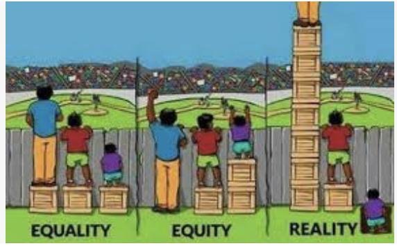

✨萤火之光·点亮远方✨
CCL 咨询请找小助手
121
121
#70033. Enquiring
about
Australian
Citizenship
–
Immigration
Briefing: Mrs. Lin, a mandarin speaking woman, is talking with Chris, an officer from
the Department of Home affairs. Mrs. Lin would like to enquire about how to apply for
Australian Citizenship. The dialogue starts now.
1.
Chris：Good afternoon. This is Chris from the Department of Home Affairs. How
can I help you today?
(下午好。我是内政事务部的克里斯。我今天能怎么帮到您呢？)
2.
Mrs. Lin：下午好。我想了解一下我是否有资格申请澳大利亚公民。我听说需要交
300 澳币左右的申请费呢。
(Good afternoon. I’d like to know if I’m eligible to apply for Australian citizenship. I
heard that I need to pay an application fee of around 300 Australian dollars.)
3.
Chris：Well, the standard Australian citizenship for General eligibility costs $285 for
the test and certificate. If you apply via partner visa, it would cost around $10, 000
or more.
(符合一般资格要求的澳洲公民的标准申请，费用是285 澳币，其中包含了公民考
试和证书。如果你通过伴侣签证申请，费用大约是一万澳币或者更多。)
【萤火虫老师Tips】

Citizen 公民

Citizenship 公民身份

Be eligible to do sth/for sth 有资格做某事

Eligible 的名词：eligibility 资格(注意发音) (CCL 必考词汇)
4.
Mrs. Lin：我四年前和我老公持临时签证来的澳大利亚。我老公后来拿到了雇主担
保签证。六个月前我们拿到了澳洲绿卡。
(I came to Australia with my husband on temporary visas four years ago. Then he got an
\n

\n✨萤火之光·点亮远方✨
CCL 咨询请找小助手
122
122
employer nomination scheme visa. We became permanent residents six months ago.)
【萤火虫老师Tips】

Permanent resident 永久居民

这里还有同学补充了一句：“有人告诉我，要在澳大利亚呆4 年，才能申请成为
公民”(I was told that I have to be in Australia for four years to become a
citizen/apply for citizenship. )
5.
Chris：To be eligible for Australian citizenship, you must have been an Australian
permanent resident for at least 1 year and been a lawfully resident in Australia for
at least 4 years before you apply.
(如果要符合澳大利亚公民申请资格，你必须已经至少成为澳大利亚永久居民一年，
并且在申请之前，已经在澳大利亚合法居住至少四年。)
【萤火虫老师Tips】

这里的“1 year”，也有同学听到的是“12 months”。大家注意，遇到数字和日期，
千万要仔细听，别翻错。

这里的“4 years”,
有一个同学说听到了“6 年”，大家如果考到，注意听到底是哪
个数字。
6.
Mrs. Lin：好吧，那我再等六个月。我听说还需要参加一个考试，这个考试是考什
么呢？
(Okay. I’ll wait for another six months. I heard that there’s also a test. What’s on the
test?)
7.
Chris：Yes. There’s a knowledge test about Australia. To pass the test, you need to
have equitable knowledge about Australia, as well as the rights and privilege of
being a citizen.
(是的。这是一个考察对澳大利亚知识了解程度的考试。如果要通过考试，你需要对
澳大利亚有公正合理的了解，并且了解作为公民需要有的权利和特权。)
\n

\n✨萤火之光·点亮远方✨
CCL 咨询请找小助手
123
123
【萤火虫老师Tips】

Equitable，表示公正合理的，名词是equity，跟equality 很像，但是不一样，区
别可以看下面很直观也很讽刺的这个图：
8.
Mrs. Lin：听起来很复杂啊。我能怎么准备这个考试呢？有没有什么备考材料呢？
(It sounds complicated. What can I do to prepare for this test? Are there any materials for
it?)
9.
Chris：We do have online resources that would help you prepare for this test. We
also have four practice tests.
(我们确实有网络资源可以帮你备考。我们还有四套练习题。)
10. Mrs. Lin：哎。这些练习题是不是都是英语的啊？英语不好真吃亏。我老公英语就
很好。他还有几年的专业工作经验呢。
(Are these practice tests in English? It’s a huge disadvantage when my English is not
good. My husband’s English is good. He also has several years of professional work
experience.)
\n

\n✨萤火之光·点亮远方✨
CCL 咨询请找小助手
124
124
【萤火虫老师Tips】

Experience 表示经验时，不可数；表示经历时，可数。

这里有同学补充了一句：但是我不一定能通过考试(But I’m not sure if I can pass
the test.)
11. Chris：Unfortunately, one of the aims of this test is to assess the candidate’s basic
knowledge of English language.
(很遗憾，这个考试的目的之一就是测试应试者的基本英语知识。)
12. Mrs. Lin：那我肯定过不了。我的英语太差了。不过还是谢谢你的帮助。
(Then I bet I won’t pass it. My English is so poor. Thank you for your help anyway.)
— End of Dialogue —
\n

\n✨萤火之光·点亮远方✨
CCL 咨询请找小助手
125
125
#70034. Travel Insurance Claim - Business
Briefing: The following dialogue takes place between Mr. Wong, a mandarin-speaking
tourist and Jessica, an English-speaking staff from an insurance company. Mr. Wong
lost his mobile phone and would like to make a claim. The dialogue starts now.
1.
Jessica：Hi, Mr. Wang. This is Jessica from your travel insurance company. I’m
ringing you for the online claim application you submitted last week.
(您好，王先生。我是您旅游保险公司的杰西卡。我给您打电话是为了您上周递交的
线上理赔申请的事。)
2.
Mr. Wong：你好, 杰西卡。感谢你打电话给我。我都开始怀疑是否理赔申请程序一
切正常了。
(Hello, Jessica. Thanks for calling me. I even begin to doubt if there’s anything wrong
with the claim application process. )
【萤火虫老师Tips】

Make a claim 申请理赔(CCL 必考词汇)
3.
Jessica ：There’s a slight delay. You didn’t submit the documents we required. I
can’t process your claim without these documents.
(稍微有些延误。您没有递交我们需要的文件，没有这些文件，我是不能处理您的理
赔的。)
4.
Mr. Wong：是这样的。我在曼谷旅游的时候，包里的手机被偷了。手机的原始收据
已经找不到了。我不清楚要提交什么样的文件。
(Here’s the thing: My cellphone in my bag was stolen when I was traveling in Bangkok.I
can’t find the. original receipt of the cellphone. I’m not sure what documents I need to
submit. )
【萤火虫老师Tips】
\n

\n✨萤火之光·点亮远方✨
CCL 咨询请找小助手
126
126

Receipt 注意发音，“p”不发音
5.
Jessica ：We need the original receipt. If you purchased this mobile phone in
Australia, you can contact the store to reprint the receipt.
(我们是需要原始收据的。如果您这部手机是在澳大利亚买的，您可以联系店家重新
打印收据。)
6.
Mr. Wong：哦，好主意。我都没想到。我确实是在澳大利亚买的！我回头就去联系
店家。我还需要提交什么文件吗？
(Good idea! That never occurred to me before. I did purchase the cellphone in Australia.
I’ll contact the store later. What other documents do I need to submit?)
7.
Jessica：Well, you also need to provide the proof that you own this mobile phone. A
bank statement would be ideal. Did you report to the police after the following
incident?
(嗯，您还需要提供能证明您是手机主人的证据。最好能有银行的流水单。出事之后
您报警了吗？)
【萤火虫老师Tips】

Report to the police 报警(CCL 必考词汇)
8.
Mr. Wong：当时我发现被偷以后，我马上就去附近的警察局了。不过警察的报告不
是英文的，是泰文的呢。
(I went to the police station nearby immediately after I found my cellphone was stolen.
However, the police report is in Thai, not in English.)
9.
Jessica：That’s great. You need to arrange a certified translation then.
(太好了。那您需要提供它的认证翻译。)
10. Mr. Wong：没问题。我还留着手机原始的包装盒呢！让人惊讶的是我还有原始的包
\n

\n✨萤火之光·点亮远方✨
CCL 咨询请找小助手
127
127
装盒。这会有用吗？
(No problem. I still keep the original packing box of the cellphone! It’s so surprising that
I still have it! Would it be helpful?)
11. Jessica：Yes, it would be helpful, because you also need to provide your phone’s
IMEI number, which is a 14-digit number noted on the phone box.
(会有帮助的，因为您还需要提供您手机的国际移动设备识别码。这是一组14 位的
号码，在手机盒上有。)
【萤火虫老师Tips】

IMEI：International Mobile Equipment Identity.

考试时IMEI 是每个字母分开读的，没有拼读成“I
MAY”
12. Mr. Wong：好的，还有其他的吗？我可以把所有的东西都发给你。
(Okay. Is there anything else? I can send everything to you.)
13. Jessica：That’s all. The sooner you could submit them to us, the sooner we could
process your claim. You can send them to us via the E-Mail address on our website.
(就这些了。您越快把这些发给我们，我们就能越快处理您的理赔。您可以通过我们
网站上的电邮地址把它们发过来。)
14. Mr. Wong：太好了，谢谢你的帮助。我会尽快提交所有的材料给你。
(That’s great. Thanks for your help. I’ll submit all the materials to you as soon as
possible.)
— End of Dialogue —
\n

\n✨萤火之光·点亮远方✨
CCL 咨询请找小助手
128
128
#70035. Visitation Right Dispute Mediation - Legal
Briefing: The following dialogue takes place between a mandarin-speaking woman and
an English-speaking mediator. The mediator is trying to resolve the woman’s visitation
right dispute with her husband. The dialogue starts now.
【萤火虫老师Tips】
这篇对话长度偏长，并且语速非常快，说话者非常情绪激动，
1.
Mediator：Hello. I’m John Smith. I’ll be the mediator in this mediation.
(你好，我是约翰史密斯。我是这次调解会的调解员。)
【萤火虫老师Tips】

Mediate 动词调解

Mediation 名词调解(这个过程)

Mediator 名词调解员(CCL 必考词汇)
2.
Lady：你好，很高兴见到你。
(Hello. Nice to meet you.)
3.
Mediator：Please bear in mind that this is a 2-hour long session, it’s confidential and
it’s aimed to solve the issues concerning your son’s visitation rights. Your husband
is not here upon your request.
(请记住，这是个会议时长为两小时，内容保密，旨在解决你儿子探视权的问题。根
据你的要求，你丈夫不会在场。)
【萤火虫老师Tips】

Visitation right 探视权(CCL 必考词汇)
\n

\n✨萤火之光·点亮远方✨
CCL 咨询请找小助手
129
129
4.
Lady：我太害怕他了。他一直威胁我，还折磨我的孩子。
(I’m so afraid of him. He keeps threatening me and he also tortured my child.)
5.
Mediator：Okay. I’ll note it down. I can understand why you don’t want to have this
conversation with your husband in one room. Could you be more specific?
(好的。我会记下来的。我可以理解你为什么不想跟你丈夫共处一室进行这个会谈。
你可以再具体说说吗？)
6.
Lady：他这人太不可信了。上周本来应该是我去接孩子，结果他去接了，他还说孩
子在学校的行为有问题。
(He’s very untrustworthy. I should have picked up my child last week, yet he did it. He
also said my child had behavior problems at school.)
7.
Mediator：I’m sorry, but I have to say that you’re undermining your visitation right
as you didn’t pick up your son on the designated date as discussed.
(我很抱歉，但是我不得不说，因为你没有按照讨论好的指定日期去接孩子，你正在
削弱你的探视权。)
8.
Lady：我养了孩子13 年啊！13 年！结果换来了什么？过去3 个月我都没见到他啊！
我丈夫太没良心了！
(I have raised my child for 13 years! 13 years! What did I get in exchange? I haven’t seen
him for the past 3 months! My husband has no conscience at all!)
9.
Mediator：Please control your emotions and listen carefully. Being emotional won’t
solve any problems. You need to make sure you can pick up your child on your next
visitation date.
(请您控制下您的情绪，仔细听好。情绪化不能解决任何问题。你需要确保下次探视
时间你可以去接孩子。)
\n

\n✨萤火之光·点亮远方✨
CCL 咨询请找小助手
130
130
10. Lady：他的律师威胁我说，我这辈子都别想见到孩子了！他真是个没心没肺的东西！
(His lawyer threatened me that I could never see my child for the rest of my life! He is
really heartless!)
11. Mediator：Please control your emotions and listen carefully. You need to understand
your right that according to the court order, you can pick up your son every
fortnight. So, you can forget what his lawyer said.
(请你控制下您的情绪，仔细听好。你需要明白你的权利，根据法院法令，每过两周
你可以去接一次儿子。所以不要管他的律师怎么说。)
12. Lady：你能建议我再做些什么吗？你得让他的律师停止威胁我。我最近简直是白天
也坐立不安，晚上也睡不好啊！
(What else would you suggest doing? You need to ask his lawyer to stop threatening me.
I’ve been on pins and needles recently during the day and I can’t sleep well in the night!)
【萤火虫老师Tips】

be on pins and needles: to be very nervous and unable to relax 如坐针毡
13. Mediator：I’m afraid I can’t, as I only wear one hat, which is your mediator. Good
luck.
(我恐怕不能这么做, 因为我的身份/职责只能有一个，就是你的调解员。祝你好运。)
【萤火虫老师Tips】

Hat 在此处是比喻意义，指身份，职位，职责。
14. Lady：怎么能这样！他这个没心没肺的东西，和他的律师一起就这么一直欺负我吗！
(How come! He is heartless! He’s just been walking all over me with his lawyer!)
15. Mediator：I understand that you are distressed, but accusation won’t be helpful.
You need to abide by the agreement. You were so distressed that you forgot to pick
up your son.
If you continue like this, you may lose your visitation right.
\n

