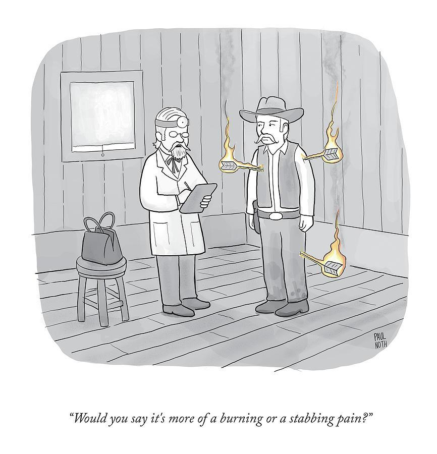

✨萤火之光·点亮远方✨
CCL 咨询请找小助手
151
151
(That’s wonderful! That’s such an amazing result. You must have been very proud as the
Principal.)
13. Yes. Indeed. You don’t have to worry about our school’s academic standard.We’ll
ensure that we provide our students with above-average education.
(是啊。确实。你不需要太担心我们学校的学术水平。我们会确保给我们的学生提供
高水准的教育服务。)
14. 我会再跟我女儿谈谈。我希望我们尽快解决这件事。谢谢你提供的这些介绍。
(I’ll have another talk with my daughter. Hopefully, we could settle this as soon as
possible. Thank you for the introduction.)
— End of Dialogue —
\n

\n✨萤火之光·点亮远方✨
CCL 咨询请找小助手
152
152
#70042. Job Seeking Agency – Social welfare
Briefing: The following dialogue takes place between Davison, an officer from a job
seeking agency and Ms. Li, a mandarin speaking mother of two children. The dialogue
starts now.
1.
Hello, Ms Li, thanks for coming today. I have good news for you.
(李女士你好，谢谢你今天过来。我有好消息告诉你。)
【萤火虫老师Tips】

news 不可数，所以不要说a good news,
如果要表示一个好消息可以说a piece of
good news
2.
真的吗？是什么好消息？您帮我找到工作了吗？
(Really? What’s the good news? Have you found a job for me?)
3.
Yes. Based on your previous work experience listed on your resume, I’ve found a
part-time job for you in a bakery.
(是的，根据你简历上列出来的以往工作经验，我在一家面包房给你找了一份兼职工
作。)
4.
太好了！这样我就可以补贴家用，还可以照顾我的两个孩子了。
(That’s great! Then I can use the money to cover our living expenses and look after/take
care of my two children.)
5.
I’m glad to hear that. Your employer would like to give you a staff induction, where
he’ll brief you on the roster and your responsibilities in the workplace. It’s next
Thursday around 9:30 a.m. Do you think you’ll be able to attend?
(听到这个我很高兴。你的老板想给你做一个入职培训，他会给你大概讲下执勤表的
事情，还有你要负责班上/工作场所中的哪些事。时间是下周四早上, 大概九点半左
右。你可以参加吗？)
\n

\n✨萤火之光·点亮远方✨
CCL 咨询请找小助手
153
153
【萤火虫老师Tips】

星期之前的介词使用，以Thursday 为例，可以说next Thursday/on Thursday/Every
Thursday, 但是不能说on next Thursday.
6.
我一定会去的。那天我会先把孩子送到学校，然后我就直接过去。您可以把地址发
到我的邮箱里吗？
(I’ll definitely be there. I’ll drop the kids at school first and go straight there. Could you
email the address to me? )
【萤火虫老师Tips】

If you drop sb/sth (off) somewhere, you take them somewhere and leave them there:
将某人/某事送到某地
7.
Sure. Your employer will also need you to sign and provide some documents on that
day, such as your offer of employment, tax file number document and your
nominated Superannuation fund.
(当然可以。那天你的老板也会需要你签一些文件，再提供一些材料，比如你的聘用
书，税号文件，以及你指定的退休公积金的材料。)
8.
没问题。我前几天已经收到澳大利亚税务局给我发的税号了。现在我需要找一家管
理退休金的公司就可以了，是吗？
(No problem. I’ve received my tax file number from the Australian Taxation Office
several days before. Now I just need to have a Superannuation Provider, right?)
9.
That’s correct. I’ll send you a list of Superannuation Providers. Your employer will
also go through the safe work instructions with you and let you know how to report
potential hazards in the workplace.
(是的。我会给你发一个管理退休公积金的公司名单的。你的老板也会带你过一遍工
作安全指导，并且告知你如何报告工作中的潜在隐患/风险。)
\n

\n✨萤火之光·点亮远方✨
CCL 咨询请找小助手
154
154
10. 好的。我之前也学习过如何安全操作机器。我知道食品卫生非常重要,
遵循食品安
全标准也很重要。
(Okay, I’ve learnt how to safely operate machinery before. I know that food hygiene is
crucial and it’ s important to adhere to food safety standards.)
11. That’s good to hear. I’ll also attach your employer’s contact details to the email in
case you need to contact him.
(那很好啊。我在给你发的邮件里也附上了你老板的联系方式，以免你需要跟他联
系。)
12. 好的。刚刚您说会推荐管理退休金的机构给我，我是可以自己选一家吗？
(Okay. You just said that you would recommend some Superannuation Providers to me.
Do I get to pick one/Can I pick one by myself?)
【萤火虫老师Tips】

萤火虫老师注：To "get to do" something means that you are enabled or given the
opportunity to do something
13. Yes. I’ve got some printed materials and brochures, you can have a look.
(是的。我这有一些书面材料和小册子，你可以看看。)
— End of Dialogue —
\n

\n✨萤火之光·点亮远方✨
CCL 咨询请找小助手
155
155
#70043. Heat Rash - Medical
Briefing: The following dialogue takes place in a clinic between an English-speaking
doctor and a mandarin-speaking patient. The patient is seeing the doctor regarding his
blister and rash. The dialogue starts now.
1.
Good morning, Mr. Huang. You look unwell. What’s the matter?
(黄先生，早上好。你看上去不太好，你怎么了？)
2.
医生，从昨天开始，我身上就起红疹和水泡了，又疼又麻。
(Hello doctor, I’ve got rashes and blisters on my body since yesterday. It’s numb and
painful.)
3.
Let me have a look. Oh, you have heat rash!
(让我看看。呀！你起痱子了！)
4.
天啊！有俗话说，如果身上疹子长成了一个圈，就活不了了，这是真的吗？
(Gosh! There’s a saying that you’ll die if the rashes make a circle around your body. Is
that true?)
【萤火虫老师Tips】

长成一个圈那个是带状疱疹(shingles)，又名缠腰龙(不建议去搜图片)
5.
Don’t worry. 添加一句回忆There is indeed an old saying. But you just have the
rash because your skin cannot breathe very well during the hot weather.
(别担心。确实有句老话。但是你长疹子只是因为天气热，皮肤不透气而已。)
6.
好吧。可是医生，我疼的要死，好像火烧和刀割一样，有什么办法缓解吗？
(Fine. But doctor, the pain is killing me. It feels like a burning pain and a stabbing pain.
Is there a way to relieve/alleviate/ease the pain?)
\n

\n✨萤火之光·点亮远方✨
CCL 咨询请找小助手
156
156
【萤火虫老师Tips】

Burning pain 灼痛

Stabbing pain 刺痛

Relieve/ease/alleviate the pain 缓解疼痛
7.
In that case, I can prescribe you some anti-inflammatory medicine and some
painkillers.
(这样的话，我可以给你开些消炎药和止痛药。)
8.
好的医生，我这个疹子会传染吗？
(Okay, doctor. Are the rashes infectious/contagious?)
【萤火虫老师Tips】

这里加了一句：那我就认命吧：I will take/accept it then.
\n

\n✨萤火之光·点亮远方✨
CCL 咨询请找小助手
157
157
9.
No, it’s not infectious. It can itch a lot, but it’s not dangerous. Scratching it could
lead to an infection, though.
(不传染的。这疹子会让你觉得很痒，但是它并没有什么危险。不过，你要是挠它的
话，可能会感染。)
10. 那医生你能跟我老婆解释一下吗？我老婆因为这个，不让我进屋，也不让我接触孩
子，也不让我碰她。她说这个会传染。
(In that case, could you explain this to my wife? I’m not allowed to be in the room or be
with the children because of it. I’m not allowed to have body contact with her either. She
said that it’s infectious/contagious.)
【萤火虫老师Tips】

In everyday English, people usually say that someone is not allowed to do something
rather than someone is forbidden to do something.

这段加了一句“我老婆蛮不讲理”(My wife has been unreasonable/ridiculous).
11. I’d be happy to talk to her. But we need to treat it carefully, because if the rash
spreads, it will become more painful.
(我很乐意去跟她说一下的。不过这个需要小心医治，因为疹子扩散了会更疼的。)
12. 我以前起过疹子，但是后来消了。这次我又起疹子了，我会不会以后一直得啊？
(I had a rash before, but it went away/disappeared later. Now I have a rash again. Will
this be continual?)
【萤火虫老师Tips】

“Continual” means “repeated many times, often in a way that is harmful or
annoying.”
“Continual” means start and stop, while “continuous” means never-ending.
13. Heat rash occurs because your skin cannot breathe properly. However, it can be
prevented if you expose your skin, wear thinner cloth and wash your body regularly.
\n

\n✨萤火之光·点亮远方✨
CCL 咨询请找小助手
158
158
(你会起痱子，是因为你的皮肤不太透气。不过，要是你能把皮肤多露出来些，穿薄
点的衣服，并且经常洗澡的话，痱子还是可以预防的。)
14. 最近我家在装修，到处都乱七八糟的，真烦人，应该就是这个原因。除了口服药，
有什么外用药或者外敷药膏吗？
(My place is under renovation recently and it’s been a mess everywhere. It’s so annoying.
That should be the reason. Apart from oral medication, are there any medicines for
external use or ointment?)
15. You can purchase an over-the-counter cream or spray from the Chemist. You also
need to take anti-inflammatory medicine.
(你可以去药店买非处方药膏或者喷雾。你也需要吃消炎药。)
16. 好的，麻烦您给我开消炎药，我之后就去药店。谢谢医生。
(Okay. Please prescribe me some anti-inflammatory medicines. I’ll go to the pharmacy
later. Thank you, doctor.)
— End of Dialogue —
\n

\n✨萤火之光·点亮远方✨
CCL 咨询请找小助手
159
159
#70044. Roof Leakage - Business
Briefing: The following dialogue takes place between a mandarin speaking public tenant
and an officer from the Department of Health and Human Services. The dialogue starts
now.
1.
Good afternoon, Mr.Yan. Sorry to have delayed setting up the meeting. Do you have
any issues about your rental house?
(严先生下午好。很抱歉这次会谈安排晚了。您租的房子有什么问题吗？)
2.
谢谢，我住的房子有点问题。屋顶漏水了，真麻烦。我猜是排水沟被树叶堵住了。
(Thanks. There’s something wrong with the house I live in. My roof is leaking. It’s so
annoying. I guess it’s because the gutter has been blocked by leaves/has been clogged up
with leaves.)
3.
Oh, it’s not pleasant when things like this happen in the middle of winter!
(哎，大冬天这种事发生真的是很烦人啊！)
4.
是啊。我给你们办公室打了很多次电话了，但是你们也没有派人过来解决问题。我
该怎么办呢？
(Yes, tell me about it! I’ve called your office so many times. But you’ve never sent
anyone. What should I do?)
【萤火虫老师Tips】

“Tell me about it”is used to say that one understands what someone is talking about
because one has had the same or a similar experience.
5.
We will arrange our repairman to come to your house and have a look at your roof.
Then we’ll decide what action we should do to solve the problem.
(我们会安排我们的修理工上门查看一下您的房顶。然后我们再决定下一步该怎么做
来解决问题。)
\n

\n✨萤火之光·点亮远方✨
CCL 咨询请找小助手
160
160
6.
谢谢。你们的修理工都有资质吗？我看了一下，我们周围有关修理的活儿啊，做的
都不怎么样。
(Thank you. Are your repair people qualified? I have checked around the repair jobs done
around us. They were not well done/They were not properly done./None of them were
properly done./None of them were in good hands.)
7.
All our repairmen are very experienced. They all have their ID and are authorized
by us to solve the problem. There is no doubt they’ll repair your roof in the best way.
(我们所有的修理人员都是经验丰富的。他们都有证件，由我们授权为您解决问题。
毫无疑问，他们会用最优方案来修理您的屋顶。)
8.
太好了。我知道我们的费用是通过健康与人类服务部来负责的。作为低收入家庭，
我们没有很多存款。所有的钱都用来养家糊口啦。而且，现在什么东西都很贵啊。
(That’s great! I know the repair fees will be covered by the Department of Health and
Human Services. As a low income family, we don’t have much savings. All of our
income has been used to support my family. Besides, everything is so expensive now!)
9.
It may depend on the cause of the leakage, but the roof repair fee will be covered by
the office. I will make a call to make sure when the repair man can come to your
house.
(这要取决于漏水的原因了，但是房顶的维修费用是由我们部门/健康与人类服务部
来负责的。我会打个电话，确认一下修理工什么时候来您家。)
10. 好的。我明天就在家里等着你们的电话。顺便说一下，我希望修理工不要在我的房
子里面抽烟。
(Okay. I will wait for your call at home tomorrow then. By the way, I don’t want the
repairman to smoke at my house. )
11. No workers are allowed to smoke on the premises. You’ll just need to make sure
that they have access to the roof.
\n

