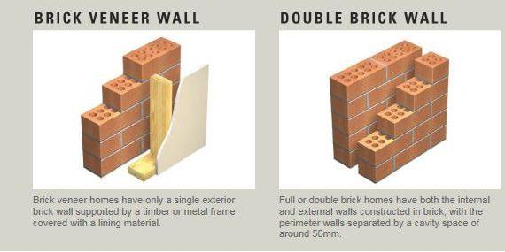
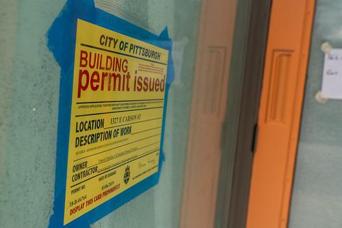

✨萤火之光·点亮远方✨
CCL 咨询请找小助手
11
11
#70216. Resident Alerts Police to Speeding Driver - Legal...............................................682
#70217. Clarifying Local Dog Leash Rules - Legal............................................................685
#70218. Van Theft Report and Insurance Steps – Legal...............................................688
#70219. Understanding Bill Payment Delays – Business...............................................691
#70220. Tenant Requests Pest Control – Business.........................................................695
#70221. Friendly Support for the New Town Doctor– Social........................................ 698
#70222. Bystander Assistance to Paramedic – Medical.................................................701
#70223. Discovering the Neighbourhood Post Office – Business..................................704
#70224. Kitchen Cabinet Hinge Repair– Business......................................................... 707
#70225. Over‑ the‑ Counter Drugs for Indigestion– Medical.....................................711
#70226. Retail & Hospitality Jobs for New Migrant– Business.................................... 714
#70227. Handmade Sausage Rolls and Pies for Café Menu – Business.......................717
#70228. First-Day Onboarding with HR – Business......................................................721
#70229. Getting Insured After Moving Out – Business.................................................725
#70230. Support for Aging Parents – Business.............................................................. 728
#70231. Designing a Relaxing Indoor-Outdoor Space– Business..................................732
#70232. Ceiling Leak Emergency Report – Business.................................................... 736
#70233. Excavator Theft – Business................................................................................739
#70234. Small Town Doctor & Grocer– Social................................................................742
#70235. Late Fee and Direct Debit – Business............................................................... 745
#70236. Shed to Park: Planting Volunteers – Social......................................................748
#70237. New Immigrant's Banking Adjustment – Business......................................... 751
#70238. Ordering Oat Milk in a Small Town– Business................................................ 755
#70239. Light-Filled Home Office Plans –Business........................................................758
\n

\n✨萤火之光·点亮远方✨
CCL 咨询请找小助手
12
12
#70240. A New Creamy Leather Lounge Chair –Business.............................................763
#70241. Suite Bathroom Design Clarification–Business................................................. 766
\n

\n✨萤火之光·点亮远方✨
CCL 咨询请找小助手
13
13
#70001. Build a House - Housing
Briefing: The following dialogue takes between a builder and a mandarin speaking
woman who would like to make an inquiry about steps of building her dream house. The
dialogue starts now.
1.
Wang: 你好，感谢您百忙之中抽空见我。
(Hello! Thank you for taking time out of your busy schedule to see me.)
【萤火虫老师Tips】

引申词组：take your time 慢慢来

感谢您见我/抽空见我/百忙之中抽空见我/抽出宝贵时间见我，都是CCL 常考套
话。同学们可以在我们的【套话大全.PDF】中找到。
2.
Builder: Hello, that’s totally fine. What can I do for you?
(你好！这没有什么。我能为你做些什么呢？)
【萤火虫老师Tips】

引申词组：在购物时有销售人员问“Do you need any help” 时，通常会回答“No,
I’m fine” 或“No, it’s fine” 来表达“没事，不用”，“No, that’s fine” 是不常用的。
3.
Wang：我最近买了一块地。我想建一个我做梦都想要的房子。而且这块地已经有
了建筑许可证，我可以建一个两层砖木结构的房子。
(I bought a block of land recently. I would like to build my dream house. And I’ve got a
building permit for this block of land to build a two-storey brick veneer house.)
【萤火虫老师Tips】

引申词组：block size: 房子大小

砖木结构和双砖结构：都是考过的难点词
\n

\n✨萤火之光·点亮远方✨
CCL 咨询请找小助手
14
14

建筑许可证：注意permit 的重音
4.
Builder: We have 10 years’ professional experience in this industry. And we are
fully licensed. We are a fully insured company. I am sure we can help you build
your dream house.
(我们在这个行业有10 年的专业经验。我们有全部的执照和全部的保险，我相信我
们可以帮你建造你梦想中的房子。)
【萤火虫老师Tips】
\n

\n✨萤火之光·点亮远方✨
CCL 咨询请找小助手
15
15

引申词组：汽车的全险：Comprehensive insurance

汽车的第三险：third-party insurance
5.
Wang: 是的，我的中介也强烈推荐您。既然您在这一行业有那么好的经验。您能告
诉我大致的建房步骤是什么吗？
(Right, my agent strongly recommended you too. Since you have such great experience in
this industry, could you briefly let me know the steps of building a house?)
【萤火虫老师Tips】

“experience”表示“经验” 时是不可数名词，表示“经历” 时是可数名词，比如：
It was a pleasant experience：那是一次很愉悦的经历。
6.
Builder: Normally there are 4 steps. Step one is signing a contract.
(通常有四个步骤。第一步是签订合同。)
7.
Wang: 哦，是这样。合同中一般有什么呢？
(Ok, I see, then what’s usually included in the contract?)
8.
Builder: The contract will have the design and details of the floor plan, the lump
sum of payment, available payment methods and stages of payment.
(合同里会有平面图的细节信息，设计信息，一次性付款信息，可选的付款方式和付
款步骤。)
【萤火虫老师Tips】

中文译文可以补上“信息”，更符合中文习惯

例如floor plan, lump sump payment 都是CCL 常考高频词，要好好记忆
9.
Wang: 哦，那是不是签完合同就可以立即开工了呢？
(All right. Would you be able to start once the contract is signed?)
10. Builder: Yes, we will start to build after you sign the contract.
\n

\n✨萤火之光·点亮远方✨
CCL 咨询请找小助手
16
16
(是的，签合同后我们就会开始建房子。)
11. Wang: 好的，那另外两个步骤是什么呢？
(Ok, what are the other two steps then?)
12. Builder: The other two steps include a final inspection after the building is
completed. If you are satisfied with the construction, we will hand over the keys to
you.
(另外两个步骤包括房子建好后的最终验房。如果您觉得房子盖得很满意，我们会把
钥匙交给您。)
【萤火虫老师Tips】

注意这里的对话录音，应该是after the building is “completed”
13. Wang: 好的，既然你们在这个行业如此有权威，那我相信我们的工程会进展很顺利。
(Ok, since you are a leading authority in the industry/an industry guru, I believe our
project will go smoothly.)
【萤火虫老师Tips】

guru /ˈɡʊr.uː/ 行业专家---例

a fashion guru 时尚大师
14. Builder: I believe it would be so. Thank you.
(我也相信。谢谢您。)
— End of Dialogue —
\n

\n✨萤火之光·点亮远方✨
CCL 咨询请找小助手
17
17
#70002. Home Visit Cleaning Support - Social Welfare
Briefing: The following dialogue takes place between a mandarin speaking person and
Mr. Smith, a government officer who comes to do a home visit. The dialogue starts now.
1.
Officer: Good morning. I am David Smith. I am coming to do a home visit.
(早上好！我叫David Smith。今天过来想做一个上门访问。)
【萤火虫老师Tips】

home visit: 上门访问/家访(CCL 必考词汇)
2.
Lady: 你好，史密斯先生。请进。
(Hello, Mr. Smith. Please Come in.)
3.
Officer: Thank you. The government cleaning support provides the housing
cleaning for the aged people. I just want to ask you, what are you concerned about
most when cleaning house.
(谢谢您！政府清洁支持计划为老年人提供房屋清洁服务。我只是想问一下您最担
心的房子清洁问题是什么？)
4.
Lady: 我年纪大了。很多活都做不动了。我需要有人帮我收拾家里。我很想让我的
地毯有人清洁。因为房子的年限也老了，地毯看起来总是不干净。
(I’m old and I’m not capable of doing most of the housework anymore. I need someone
to help me tidy up the house. I really want my carpets cleaned as well, because the house
is also old and the carpets always look dirty.)
5.
Officer: Ok, I will write this down and we will get someone to do the vacuum
cleaning for you.
(好的，我把这个记下来。而且，我们会找人帮你吸尘。)
\n

\n✨萤火之光·点亮远方✨
CCL 咨询请找小助手
18
18
【萤火虫老师Tips】

拓展词汇：vacuum cleaner 吸尘器
6.
Lady: 太感谢了。我不喜欢尘土太多，因为我有哮喘。
(Thank you so much! I do not like it when there is too much dust because I have asthma.)
【萤火虫老师Tips】

asthma (哮喘) /ˈæsmə/ 是CCL 重点词，往往会跟eczema /ˈeksɪmə/(湿疹)一起考，
且读音很像，需要注意区分。
7.
Officer: How about other parts of the house? Do you need someone to do the kitchen
or the bathroom for you?
(那房子的其他地方呢？需要有人为您打扫厨房或浴室吗？)
8.
Lady: 是的，最好也有人能帮我把厨房、卫生间、浴室弄干净。如果你们方便的话，
能不能也找人来帮我打理一下花园，顺便帮我把前院的草除一下?
(Yes, it would be better if someone could help me clean my kitchen, toilet and bathroom.
If it is convenient for you, could you also get someone to do the gardening and
meanwhile weed the front yard while they are at it?)
9.
Officer: Yes, I will write this down, but I am not quite sure whether gardening
services will be part of this government program.
(是，我会记下来。但我不太确定园艺服务是不是政府计划的一部分。)
10. Lady: 好的，谢谢你们。你们这个服务真是太好了。
(Ok, thank you! This service is wonderful!)
11. Officer: You are welcome. That’s what we are here for. Any other cleaning parts
that concern you?
(不客气。这是我们的工作。您还有什么其他关于清洁的问题吗？)
\n

\n✨萤火之光·点亮远方✨
CCL 咨询请找小助手
19
19
【萤火虫老师Tips】

“That’s what we are here for” 与“that’s our job” 的意思相同
12. Lady: 对了，我的窗户也不太干净。去年圣诞的时候，我本来想做大扫除，但是上
面的窗户太高了，我差点摔下来。
(Yes, my windows are quite dirty too. Last Christmas, I was going to do a thorough clean,
but the top window’s so high that I almost fell down/off.)
13. Officer: Yes, I can see you have a really big window. And it is really dangerous for
you to climb up and clean the top one.
(是，我能看到您有一扇很大的窗户。爬上去清洁上面的那一扇是很危险的。)
14. Lady: 太感谢你们了，目前没有其他事情了。
(Thank you very much, there is nothing else at the moment/that’s all for now.)
— End of Dialogue —
\n

\n✨萤火之光·点亮远方✨
CCL 咨询请找小助手
20
20
#70003. Domestic Violence - Legal
Briefing: The following dialogue takes between the duty lawyer of the magistrate’s court
and a mandarin speaking woman regarding her application for her family violence
intervention order. The dialogue starts now.
1.
Lawyer：Good afternoon, Ms Chen. I am the duty lawyer for the court today. I
understand that you came here to apply for the family violence intervention order,
right?
(陈女士下午好。我是今天法庭的值班律师。我知道你今天来是要申请家暴干预令的，
对吗？)
2.
Lady：是的，我现在又害怕又心碎。我的丈夫经常打我，还向我大声吼叫。我今天
就是想要申请一个干预令。我丈夫这已经算家暴了吧？
(Yes. I’m now scared and heart-broken. My husband often beats me and yells at me. I just
want to apply for an intervention order today. What my husband does can be counted as
family violence, right?)
3.
Lawyer：Yes. Family violence is behavior between family members that causes fear.
It includes emotional and financial abuse, as well as physical violence and sexual
abuse.
(是的。家暴包括了家庭成员之间可以引起恐惧的行为。这包括情感虐待，经济虐待，
肢体暴力和性虐待。)
【萤火虫老师Tips】

经济虐待也是虐待的一种，比如限制配偶的花费

Abuse 这个多义词很重要，表示虐待时：child abuse 儿童虐待；sexual abuse 性
虐待；

还会听到：drug abuse 表示药品的滥用
4.
Lady：好的，您这边也有我丈夫之前施暴的警察笔录吧？
\n

