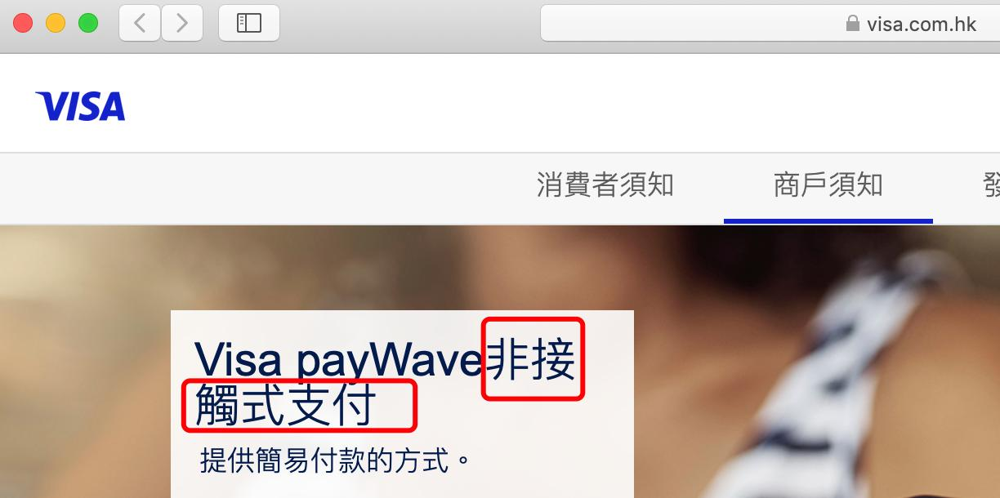
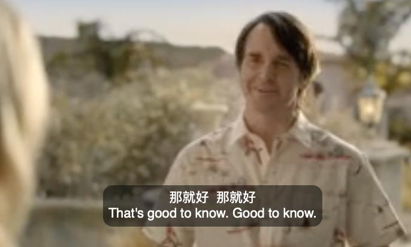
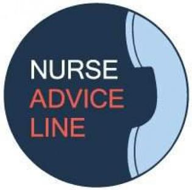

✨萤火之光·点亮远方✨
CCL 咨询请找小助手
191
191
【萤火虫老师Tips】

Get back to sb: to talk to someone again
— End of Dialogue —
\n

\n✨萤火之光·点亮远方✨
CCL 咨询请找小助手
192
192
#70054. Bank card enquiry - Business
Briefing: The following dialogue takes place between an English-speaking bank clerk
and a mandarin speaking old lady, who would like to make an enquiry about a new card
she has received. The dialogue starts now.
1.
Good morning. How can I help you?
(早上好，我能如何帮到您呢？)
2.
早上好。我收到了一个邮寄来的银行卡，我不清楚这个卡是在自动取款机上用的呢,
还是在别的地方用的呢？
(Good morning. A band card was mailed to me and I’m not sure whether it’s an ATM
card or something else.)
3.
Let me have a look. Oh, actually, it can be used with an ATM, but you can also use it
when you are shopping. It is called the pay wave card.
(我看下。哦，其实这个卡可以在自动取款机上用的，但您购物时也能用。这个叫非
接触式支付卡。)
【萤火虫老师Tips】

Paywave 是Visa(维萨卡)的支付方式，这个固定翻译来自Visa 中文官网。
\n

\n✨萤火之光·点亮远方✨
CCL 咨询请找小助手
193
193
4.
哦。我不喜欢欠钱。我从来没用过信用卡。如果我要买东西，我都是先把钱存起来
的。
(Okay. I don’t like the idea of owing someone money. I have never used a credit card
before. I always save before buying something.)
【萤火虫老师Tips】

Owe 这个词的固定搭配：

Owe someone money;

Owe money to someone
5.
When you use it to shop, it uses the money that’s already in your account. It is
different from a credit card.
(您用这张卡买东西时，卡里划掉的是已经在您账户里的钱。这个跟信用卡不一样
的。)
6.
是吗？就像手机支付一样吗？我看见过别人用的。他们都不要收据的。
(Really? Just like paying by phone? I’ve seen others doing it. They don’t need receipts.)
7.
It’s similar but much simpler. You. just need to tap the card on a small mechaine at
the checkout counter.
(是有些像，但是比手机支付简单多了。您只需要在结账柜台那儿的一个小小的机器
上，用卡轻轻碰一下就可以了。)
【萤火虫老师Tips】

Tap the card = touch/place the card 用卡轻触读卡机

Swipe the card: 刷卡(有从上到下在卡槽里刷卡的动作)

Insert the card：插卡

搜索“萤火虫CCL”公众号，里面的三分钟英翻中课堂对刷卡的表达有配合视频
的讲解哈
8.
哦，原来是这样。现在高科技发展的很快啊！
\n

\n✨萤火之光·点亮远方✨
CCL 咨询请找小助手
194
194
(Oh, I see. High technology is growing so fast now!)
9.
Yes. New technology is amazing. New things are invented all the time.
(是的，新科技太棒了。总能有新发明。)
10. 对于像我这样的人来说, 太难了。我之前试着去本地的图书馆，学习怎么用电脑和
网络，但是最终我放弃了。用这个卡的话，我不用输入密码或者签字吗？
(It’s so difficult for people like me. I tried learning how to use a computer and the
internet in a local library, but I gave up in the end. Does it mean that I don’t have to enter
my password or give my signature with this card?)
【萤火虫老师Tips】

输入密码：enter the password

Try doing something: 尝试做某事(试一试，看看有没有效果)

Try to do something: 努力做某事(等于try one’s best to do something)
11. No, not if the total amount is under 100 dollars. If it’s beyond that, you need to enter
a. 4-digit password. But please remeber not to put the number on your card.
(不用的，低于100 块的都不用。如果超过100 块，您需要输入一个四位数的密码。
不过您得记着，别把密码写到卡上。)
12. 不会的，我还没那么傻。但是万一卡被偷了怎么办呢？信用卡至少还需要签字，这
个卡多容易被别人偷走盗用啊！
(I won’t. I’m not that silly. But what if the card is stolen? A credit card at least requires a
signature. It’s quite easy for others to steal and use it!)
13. If the card is lost or stolen, you should contact us immediately so that we can cancel
the card for you.
(如果卡丢了，或者被偷了，您要马上联系我们，这样我们就可以帮您取消这张卡。)
14. 好的，我会试试这个卡的。太感谢你的帮助了。
\n

\n✨萤火之光·点亮远方✨
CCL 咨询请找小助手
195
195
(Okay. I’ll give it a go. Thank you so much for your help.)
【萤火虫老师Tips】

Give it a go/give it a try: 试一试
— End of Dialogue —
\n

\n✨萤火之光·点亮远方✨
CCL 咨询请找小助手
196
196
#70055. Carer Allowance – Social Welfare
Briefing：The following dialogue takes place between an English-speaking Centrelink
officer and a mandarin speaking woman, whose husband has severe senile dementia.
The dialogue starts now.
1.
Good morning! How can I help you?
(早上好，我能如何帮到您呢？)
2.
早上好, 医生建议我来咨询一下我丈夫的事情。
(Good morning. The doctor suggested that I should come here and make some enquiries
about my husband.)
3.
I see. Please talk to me about your husband’s problems these days, if you don’t
mind.
(原来是这样/我了解了。如果您不介意的话，请您跟我说说您丈夫目前的问题吧。)
4.
医生说，我丈夫的老年痴呆最近越来越严重了。我觉得靠我自己一个人照顾他，越
来越困难了。
(According to the doctor, my husband’s senile dementia has been getting worse and
worse recently. I think it’s been more and more difficult to take care of him all by
myself.)
5.
That must be very difficult for you. Could you please tell me about your current
financial situation?
(您一定很辛苦吧！您可以跟我说下你们现在的经济状况吗？)
6.
我和我丈夫现在靠养老金生活。不过，至少我们现在住的房子是我们自己的。所以
日子过得没有其他人那么差。
(My husband and I are living off our age pension. But at least we live in our own place,
so life is not as bad as others’ .)
\n

\n✨萤火之光·点亮远方✨
CCL 咨询请找小助手
197
197
【萤火虫老师Tips】

Live off something/someone 靠…生活
7.
It’s good to know. Do you have other family members to help you with his day to
day care?
(那挺好的。你有其他的家人可以帮你日常护理你丈夫吗？)
8.
没有人了。我的孩子们都在城里工作，他们的孩子们周末有各种各样的活动要参加，
所以他们没工夫来看我。
(No. All my kids work downtown, and their kids have all kinds of activities to attend
during weekends. So they don’t have time to visit me.)
9.
I totally understand. We can help you to apply for Carer Allowance. You might also
want to contact Carers Australia to see if they can give you any extra support.
(我完全理解。我们可以帮您申请照顾者津贴。你或许还可以联系澳大利亚照顾者协
会，看看那边能不能给您提供更多的帮助。)
10. 我从来没听说过这个澳大利亚照顾者协会啊。他们是干什么的啊？
(I have never heard of this “Carers Australia”. What do they do?)
\n

\n✨萤火之光·点亮远方✨
CCL 咨询请找小助手
198
198
11. It is an organization that provides support and information to people like you as a
carer. You might find them helpful to you in your carer role.
(这是一个给像您这样的照顾者提供帮助和信息的机构。作为照顾者，您可能会觉得
他们有帮助。)
12. 有帮手我当然是很乐意的。他们都能帮我做什么呢？再像这样下去，我就要撑不住
了。
(I would definitely be happy with a helper. What help could they offer?/ What can they
help me with? I can’t hold on anymore if things continue like this.)
【萤火虫老师Tips】

撑住：hold on；
Hold on 还有稍等的意思。
13. They may help you find someone to look after your husband once a week, or on a
whole weekend to help give you a break.
(他们或许能帮您找人每周照顾您丈夫一次，或者整个周末都帮忙照顾您丈夫，来让
您休息一下。)
14. 可算救我一命。我现在可远不能和我年轻的时候比了。每天从早到晚的事耗尽了我
所有的时间和精力。
(That’s a life saver. I’m way not who I was when I was younger. All my time and energy
have been consumed by doing chores all day long.)
【萤火虫老师Tips】

“我现在可远不能和我年轻的时候比了”不能翻成“I can’t compare myself to who I
was when I was younger”

可以翻译为“I’m not who I was when I was younger.”“ I’m not who I used to be
when I was younger.”或者“ I’m no longer the person I used to be.”
\n

\n✨萤火之光·点亮远方✨
CCL 咨询请找小助手
199
199
15. Here are the contact details and an application form for Carers Australia.
(这里是澳大利亚照顾者协会的联系方式和申请表。)
16. 好的，我会尽快填写好, 递交申请表的。非常感谢你的帮助。
(OK. I’ll fill in the application form and submit it as soon as possible. Thank you very
much for your help. )
— End of Dialogue —
\n

\n✨萤火之光·点亮远方✨
CCL 咨询请找小助手
200
200
#70056. Fever - Medical
Briefing:
The
following
dialogue
takes
place
over
the
phone
between
a
mandarin-speaking father and an English-speaking nurse. The dialogue starts now.
1.
Hi, thanks for calling nurse advice on-call, I’m Sarah, how can I help you tonight?
(你好，感谢致电当值护士建议专线。我是萨拉，今晚有什么可以帮你的吗？)
【萤火虫老师Tips】

On call: 随叫随到；待命

NURSE-ON-CALL 是一项政府卫生计划，可以一周7 天，每天24 小时联系到
由注册护士，寻求即时的专业健康建议的电话服务。官方的翻译手册中，
NURSE-ON-CALL 是翻译成当值护士专线。
2.
你好萨拉，我很担心我儿子的情况。他咳嗽，睡不着觉，出汗而且身体很烫。我怀
疑是病毒感染。
(Hello, Sarah. I’m worried about my son. He’s coughing and he can’t sleep. He’s
sweating and his body is burning. I doubt if it’s a viral infection.)
\n

