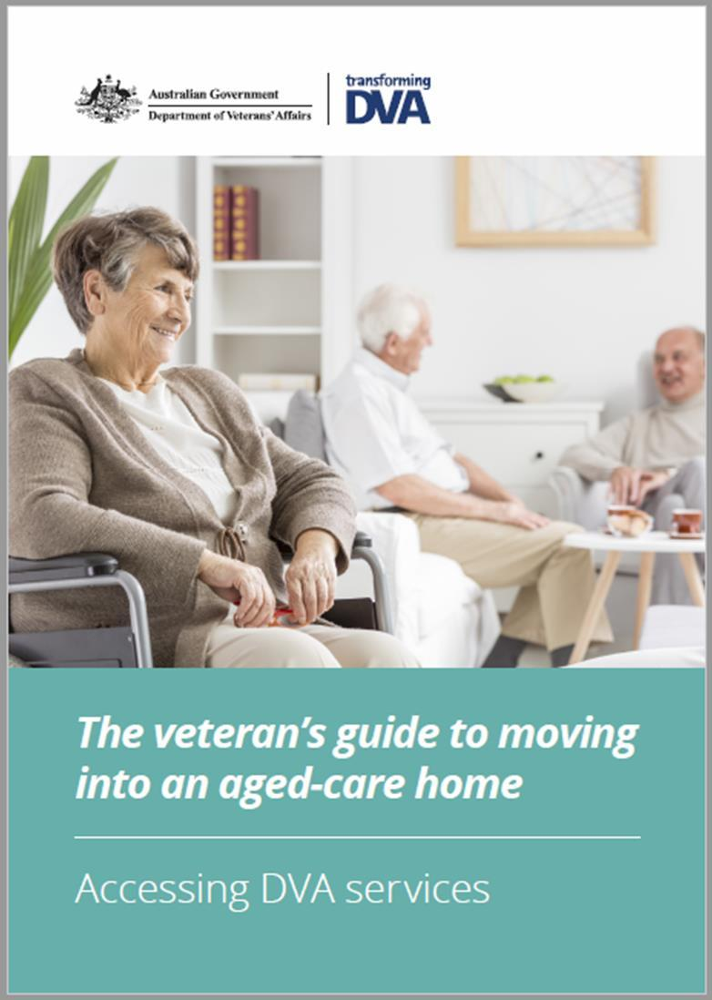

✨萤火之光·点亮远方✨
CCL 咨询请找小助手
271
271
migrants like me. You have been really helpful and kind.)
— End of Dialogue —
\n

\n✨萤火之光·点亮远方✨
CCL 咨询请找小助手
272
272
#70081. Opening a bank account - Business
Briefing: The following dialogue takes place between Jane, an English-speaking bank
teller and a Mandarin-speaking client who wants to open a new account. The dialogue
starts now.
1. Hi, I am Jane. What can I do for you today?
(您好，我是简。今天我能为您做些什么呢？)
2. 你好, 简。我最近刚开始一份全职工作。我想开一个新的银行账户。
(Hello, John. I’ve recently started a full-time job and I’d like to open a new bank
account.)
3. Well, I’m more than happy to help you with that. There are some people who open
an account for automatic transactions so it’s more convenient for them to pay their
bills; and there are some people who open an account for saving money.
(嗯，这个我很乐意为您效劳。有些人开户是用来自动转账的，这样他们支付账单就
更方便了。而有些人开户是用来存钱的。)
4. 我想要开一个储蓄账户，这样我就可以存钱买物业了。我已经有一个支付账户了。
(I’d like to open a savings account so that I can save (up) for a property/save money to
buy a property. I already have a debit account.)
5. That’s good to hear. It will be much easier to apply for a home loan from a bank if
you already have a savings account.
(那很好。如果您已经有储蓄账户了，跟银行申请房贷就容易得多了。)
6. 那太好啦。能找到全职工作真的很好，这样我就能存更多的钱了。
(That’s good. It’s great that I’ve found a full-time job so that I can save more money.)
\n

\n✨萤火之光·点亮远方✨
CCL 咨询请找小助手
273
273
7. You may choose to deposit money weekly or monthly after you open a savings
account. The amount of your interest will depend on how much you deposit.
(在您开了存款账户以后，您可以选择按周存，或者按月存。您能拿多少利息，要看
您存多少钱。)
8. 好的，那对我来说，最简单的方法就是每个月存一次钱啦，因为我每个月发一次工
资。我可以选择存款数额吗？
(Okay. The easiest way for me is to deposit money every month because I get paid
monthly. Do I get to decide the amount deposited?)
9. Well, you have to make a minimum deposit of $200 every month. There’s no
maximum limit though.
(这个嘛，每个月您最少得存200 澳币，不过没有上限。)
10. 200 澳币可以的。我肯定能存200 澳币以上的。
($200 is acceptable. I’ll definitely deposit more than $200. )
11. That’s great. Apart from that, you can withdraw money monthly without having to
pay any fees.
(那很好。另外呢，您还可以每个月取钱，这个是不会额外收费的。)
12. 太好啦。我应该不会取钱的。你能告诉我要怎么开户吗？我已经把身份文件都带来
了。
(That’s great. I don’t think I’ll withdraw money. Could you explain to me how to open an
account? I’ve already got my identity documents here.)
13. That’s great. I just need your identity documents since you have already had an
account with us. I will help you open a new account now.
(那很好。因为您已经在我们这开过户了，您把身份文件给我就可以了。我现在就帮
您开新账户。)
\n

\n✨萤火之光·点亮远方✨
CCL 咨询请找小助手
274
274
14. 谢谢你，太好啦。我希望我能早点存够钱去买物业。
(Thank you. This is really great. I hope I could save enough money to buy a property as
soon as possible.)
— End of Dialogue —
\n

\n✨萤火之光·点亮远方✨
CCL 咨询请找小助手
275
275
#70082. Rent an apartment-Business
Briefing: The following dialogue takes place between a Mandarin-speaking person who
is making an enquiry about a rental application and Anni, an English-speaking real
estate agent. The dialogue starts now.
1. Good morning! I’m Anni and I’m a real estate agent. Have you already looked
around at the apartment?
(早上好，我是安妮，我是一名房产中介。您已经看过这个公寓了吗？)
2. 你好，安妮。我已经看过公寓了。这个公寓真好啊！我有些问题想问您。
(Hello, Anni. I have inspected this apartment. This is such a lovely apartment! I have
some questions for you.)
3. Sure. May I ask what you’d like to know?
(当然可以了。请问您想了解些什么呢？)
4. 我注意到洗衣房里有一台洗衣机。这套公寓里面有洗衣机吗？我是没有洗衣机的。
如果公寓里有，就太方便啦。
(I noticed that there’s a washing machine in the laundry. Is there a washing machine in
this apartment? I don’t have one. It would be quite convenient if the apartment comes
with one. )
5. Yes, this apartment comes with a washing machine. It will be very convenient. You
don’t need to buy one for yourself.
(是的，这套公寓里是带洗衣机的。这就非常方便了。您不用自己买洗衣机了。)
6. 那太好啦。我在来的时候，我看到别的公寓里有只小狗。请问这个公寓可以养狗吗？
(That’s great. On my way here, I saw a puppy/little dog in another apartment. May I ask
if I can have a dog in the apartment? )
\n

\n✨萤火之光·点亮远方✨
CCL 咨询请找小助手
276
276
7. Yes, there’re some rules though. You also need to get permission from the owner.
Keeping large animals is not allowed. But usually a small animal such as a kitten or a
puppy is acceptable.
(可以的。不过您要遵守一些规定。您还要得到房主的允许。养大型动物是不行的。
不过通常来说，像小猫小狗这样的小动物是可以的。)
8. 我自己没有狗，但是我确实想买一只。租客要能在公寓里养小狗，真的是太棒了。
(I don’t have a dog. However, I do want to buy one. It would be great if tenants are
allowed to have puppies in their apartments.)
9. Some tenants do have small pets. They fill the apartment building with happiness for
everyone.
(有些租客确实养了小宠物。它们让这个公寓楼里的每个人都感觉到了满满的开心/
感觉到非常开心。)
10. 太好啦。我在你们的网站上看到了租房申请表。我已经填完了。我觉得应该没什么
问题。
(That’s great. I saw a rental application form on your website and I have already filled it
out. I think there should be no problem.)
11. It certainly won’t be a problem. Your application is the first one I have received
regarding this apartment. Let me check the relevant details…yes, everything is good.
There should be no problem.
(当然没问题的。您的申请是我收到的关于这个公寓的第一份申请。让我来看看相关
的细节信息…嗯，都很好。应该没问题的。)
12. 谢谢你！我填表的时候特别小心，因为英语不是我的第一语言。如果申请成功了，
我希望我能尽早知道啦。
(Thank you! I was very careful when I was filling out the form, because English is not
my first language. I hope I could know as soon as possible if the application is
successful. )
\n

\n✨萤火之光·点亮远方✨
CCL 咨询请找小助手
277
277
13. I’ll go through all the applications next Monday and then make a decision. If your
rental application is approved, I’ll give you a call and ask you to come sign the rental
agreement.
(我会在下周一的时候看一下所有的申请，然后作决定。如果您的租房申请通过了，
我会给您打电话，让您过来签租赁协议。)
14. 我真的很喜欢这个公寓。期待下周一接到您的电话！
(I really like this apartment. I’m looking forward to your call next Monday!)
— End of Dialogue —
\n

\n✨萤火之光·点亮远方✨
CCL 咨询请找小助手
278
278
#70083. Aged care courses - Social + Education
Briefing: The following dialogue takes place between a Mandarin-speaking client and an
English-speaking carer. The client is making an enquiry about aged care job training
courses. The dialogue starts now.
1. Hi, what can I do for you today?
(你好，我今天能为您做些什么呢？)
2. 你好，我想要了解一下照顾老人的课程。
(Hello. I would like to know more about aged care courses. )
3. So, you are interested in aged care. That’s great.
(所以您对老年护理感兴趣啦。太棒了。)
4. (这段回忆缺失一句)
5. 我来澳大利亚之前就在一家养老院工作，这是我毕生的职业，我希望我可以一直在
这个行业工作。
(I worked in an aged-care home before I came to Australia. This is my life-long
occupation and I hope I can keep working in this industry.)
\n

\n✨萤火之光·点亮远方✨
CCL 咨询请找小助手
279
279
6. ged care is a very important industry in Australia. It’s growing so fast. There are a
lot of jobs available. We need dedicated people like you.
(老年护理这个行业在澳大利亚很重要，发展非常快，还有很多工作岗位。我们需要
像您这样爱岗敬业的人。)
7. 我之前申请过工作，但是这些工作都需要我有资格。
(I applied for jobs before, but I’m always required to have a qualification.)
8. (这段回忆缺失一句)
9. Don’t worry, we have several courses to suit your needs.
(别担心。我们这有好几种课程可以满足你的需求。)
10. (这段回忆缺失一句)
11. 谢谢，我有点担心我的英语水平，我能听懂英语，能说英语，但是我的口音很重。
我担心这个可能是个问题。
(Thanks. I’m a bit concerned about my English. I’m okay with understanding and
speaking English, but my accent is very strong. I’m worried that this may be a problem. )
12. Our courses do have a minimal requirement of English, but if you can understand
English, accent should not be a problem.
(我们的课程确实对英语有一个基本的要求，不过如果你能听懂英语，有口音不会是
什么问题的。)
13. 好的，我还想知道完成这个课程需要多久时间以及需要多少学费。
(Okay，I also want to know how long it takes to complete this course and how much the
tuition fee is.)
14. The government helps students to pay for tuition fees. I have a brochure, which
shows how it works.
\n

\n✨萤火之光·点亮远方✨
CCL 咨询请找小助手
280
280
(政府会帮助学生支付学费的。我这有小册子，里面写了可以怎么操作。)
15. 我希望我可以尽快完成课程，这样我就可以开始找工作了。
(I hope I can complete the course as soon as possible so that I’ll be able to start looking
for jobs.)
16. I’m sure that your previous experience will help you complete the course. Please
come back to see me if you have any questions.
(我确信您之前的经验一定会对您完成课程有帮助的。如果您还有任何问题，随时回
来找我。)
17. 谢谢你提供的资料。在决定学哪个课程之前，我需要看很多东西。
(Thank you for your information. I have a lot to read before deciding which course to
take. )
— End of Dialogue —
\n

