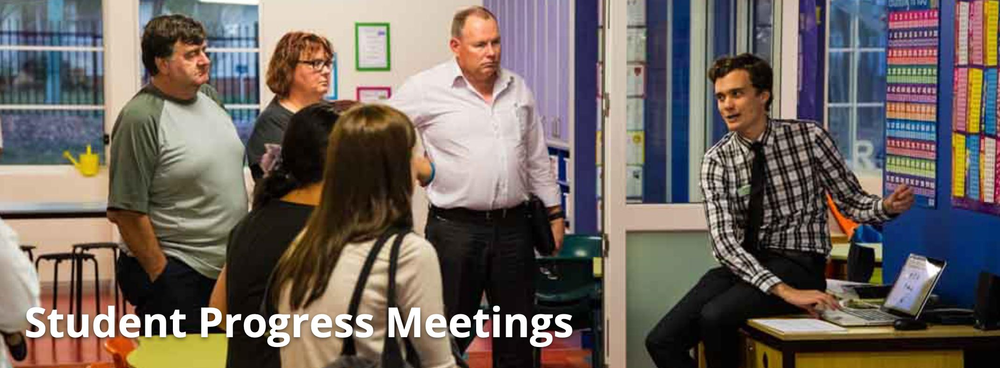

✨萤火之光·点亮远方✨
CCL 咨询请找小助手
291
291
7. It will be helpful if you can sit with her every night and supervise her homework. We
will arrange a teacher’s aide, 1 on 1 during the class for her.
(如果您可以每个晚上陪她一起坐下来，看着她写作业，就可以帮到她。我们会安排
一个教学助理，在课上一对一地帮助她。)
8. 听起来真好，莎莉。我會尽力帮她的。但是我的数学也不怎么好啊。
(That sounds really good, Sally. I’ll try my best to help her. But I’m not really good at
math either.)
9. Don’t worry. I am sure you will be fine at that level. She will improve quickly with
such extra help.
(别担心。那个程度的数学你肯定没问题的。有了额外的帮助，她会进步得很快的。)
10. 太棒了，你觉得她是否需要课后辅导吗? 我知道学校的其他小朋友都有请家教。
(That’s great. Do you think she needs after-school tutoring? I know that all the other kids
at school have tutors. )
11. I don’t think she needs that yet. We will review her progress a few months later, and
then make a decision. She is certainly doing well in other subjects.
(我觉得她还不需要。我们过几个月再看一下她的进度，然后再定吧。她其他的科目
都很不错的。)
12. 这听起来是个不错的计划。非常感谢你莎莉，我真的很感激。
(That sounds like a good plan. Thank you very much Sally. I really appreciate it.)
— End of Dialogue —
\n

\n✨萤火之光·点亮远方✨
CCL 咨询请找小助手
292
292
#70088. City Sports Centre - Education
Briefing: This dialogue takes place between a parent and an employee at a Sports
Centre. The parent is asking the employee how to enrol in sports lessons.
1. Good afternoon, welcome to the City Sports Centre.
(下午好，欢迎来到城市体育中心。)
2. 你好，我们最近刚搬到这里，我儿子很想参加体育活动，他今年九岁了。
(Hi, we just moved here. My son really wants to do some sports. He is nine years old
now. )
3. We offer different kinds of activities for his age group. What activities does your son
like?
(我们为他这个年龄段提供不同种类的活动。您儿子喜欢什么样的活动呢？)
4. 我儿子喜欢足球篮球和网球。他一定很高兴参加体育活动，这样他就可以认识新朋
友了。
(My son likes soccer, basketball, and tennis. He must be thrilled about playing sports,
since he can make more new friends.)
5. We provide soccer, basketball and tennis courses. The most popular at his age group
is tennis.
(我们的确也提供足球、篮球和网球的课程。他这个年龄段的孩子最喜欢网球。)
6. 我儿子很喜欢在电视上看网球比赛。我想他应该想学习网球吧，特别是跟同龄的小
朋友一起。
(My son likes watching tennis games on TV. He might want to learn tennis, I guess,
especially he can play with kids of similar age.)
7. The tennis coach is on fridays. it starts from 4pm and ends at 5pm. we also have
\n

\n✨萤火之光·点亮远方✨
CCL 咨询请找小助手
293
293
tennis competitions each Saturday.
(这个网球教练每周五上课，下午4 点开始，5 点结束。我们每个礼拜六还有网球比
赛。)
8. 我不确定我儿子是不是想参加比赛。希望不参加比赛教练也让我们报名。
(I’m not sure if son wants to compete in a contest. I hope we can still get enrolled if we
don’t attend the competitions. )
9. Of course. Many students enjoy the coached lessons without attending the
competitions.
(当然可以。很多学生没有参加比赛，也很喜欢教练课程。)
10. 那我就放心了。学会打网球之后，可能会参加比赛。请问学费是多少？
(That’s a relief. He might attend competitions after he knows how to play tennis, though.
May I please know the fees?)
11. The fee is $150 per term. you can pay in cash or by credit card if that’s easier for
you.
(学费是每学期150 澳币。您可以现金支付，也可以信用卡支付，如果您觉得更方便
的话。)
12. 我有现金，现在就可以支付。我想让他尽快上课。
(I have cash with me. I can pay now. I would like him to start as soon as possible.)
13. You can start this week. please fill out this registration form. we need your address,
phone number and details of any medical conditions.
(您可以这周就开始上课。请填写这个注册表格。我们需要您的住址、电话号码，以
及(他的)任何身体状况。)
14. 好的，我们还没有网球拍(tennis racket)，我们需要买拍子吗？
(Okay. We don’t have a tennis racket yet. Do we need to buy one?)
\n

\n✨萤火之光·点亮远方✨
CCL 咨询请找小助手
294
294
15. To begin with you can hire, that way, you’ll know if your son likes it before buying
one.
(您可以先租一个拍子，这样您可以知道您儿子到底是否喜欢，然后再决定要不要买。)
16. 谢谢，这主意太棒了。你给了我们很大的帮助。很期待第一节课.
(Thank you! That’s a great idea. You’ve been helping us a lot. We are looking forward to
the first lesson.)
— End of Dialogue —
\n

\n✨萤火之光·点亮远方✨
CCL 咨询请找小助手
295
295
#70089. Learning Progress Interview - Education
Briefing: This dialogue takes place between a mandarin-speaking parent and Anna, an
English-speaking teacher. They are having a student progress meeting at school.
1. Good evening, my name is Anna. Won’t you come in? I’m glad to meet you.
(晚上好，我是安娜。您请进吧！很高兴见到你。)
2. 谢谢你安娜。这是我第一次参加学生进度会议。我不太清楚要做些什么。
(Thank you Anna. It’s my first time ever attending a student progress meeting. I’m not
quite sure what to do.)
\n

\n✨萤火之光·点亮远方✨
CCL 咨询请找小助手
296
296
3. This is just a short meeting to discuss about how well your daughter is performing at
school. You may also ask me some questions if you like.
(这就是开个小会，讨论一下您女儿在学校的表现如何。如果您有问题，也可以问我。)
4. 我明白了。我女儿跟我说她很喜欢上学，还交了朋友。我希望她有努力学习。
(I see. My daughter told me that she’s keen to go to school and she’s also made some
friends. I hope she’s been studying hard.)
5. She is. She is a quick learner, especially considering that she has just come to the
school.
(有的。她学得很快，尤其是她才刚来这个学校。)
6. 听您这么说我很高兴。我一直担心她的英语不够好。
(I’m glad to hear that. I always worry that her English may not be good enough. )
7. She could benefit from practicing spelling, but it’s not a big problem. She can keep
up in all her subjects.
(她可以练练拼写，会对她有帮助的。不过问题不大。所有的科目她都能跟得上。)
8. 我能做些什么来帮助她提高拼写能力呢？我们每天晚上都会一起读书，但是我们没
有做拼写练习。
(Is there anything I can do to help her improve that? We read together every evening, but
we never did any spelling practice. )
9. I can give you some extra worksheets. You may start by helping her complete one of
them every evening. She’ll improve soon if you do so.
(我可以多给您几页练习题。您可以先每天晚上帮她完成一个。这样她会进步很快
的。)
10. 谢谢您。我会保证她做完练习再去做美术的。她特别喜欢素描和绘画。
(Thank you. I’ll make sure that she finishes the practice before making fine art. She’s
\n

\n✨萤火之光·点亮远方✨
CCL 咨询请找小助手
297
297
fond of sketching and drawing.)
11. She is indeed talented. I think it will be a great idea if she attends an art class. I’ll
give you the phone number of a teacher.
(她确实很有天赋。我想如果她去学美术课会很棒的。我把老师的电话给你吧。)
12. 好的，谢谢您。她一直都想参加美术课。还有什么是我需要知道的吗？
(Okay, thank you. She’s always keen to attend an art class. Anything else I should
know?)
13. No. She has been pleasant in class. If you do have any questions during the term,
here’s my school email address.
(没有啦。她在课上一直表现都很好。如果您这学期还有什么问题，可以联系我这个
学校邮箱。)
14. 太好了。如果我想到什么问题的话，我就给您发邮件。很高兴见到您安娜。再见。
(That’s great. I’ll email you if I have any further questions. It’s great to see you, Anna.
Bye.)
—End of Dialogue —
#70090. Disability support organization and cricket- Social
\n

\n✨萤火之光·点亮远方✨
CCL 咨询请找小助手
298
298
This phone conversation is between a Mandarin-speaking potential client and an
English-speaking staff from a disability support organization. The client wants to see if
there’re any support program services for his brother who has disabilities. The dialogue
starts now.
1. Good morning, Paul speaking. How can I help you?
(早上好，我是保罗。我能怎么帮助您呢？)
2. 你好，保罗。我今天打电话是想问问有没有什么帮助服务可以提供给我兄弟，他有
残疾。
(Hello, Paul. I called today to see if there’re any support program services for my brother
who has disabilities.)
3. Sure！We have social groups，sports groups and employment groups, and we also
provide support for families and carers.
(当然啦。我们有社交小组，体育小组和求职小组，我们还为家人和照顾者提供帮助。)
4. 他今年28 岁了，他希望能多认识一些同龄的有残疾的朋友。
(He’s 28 this year and he wants to know more friends of his age who also have
disabilities.)
5. Ok. Then the social group may be good for him. The group has people from 20-30
years old. It’s on Wednesday every week, from 6-8 pm.
(好的。那社交小组应该对他来说是不错的。这个小组里的成员都是20-30 岁左右，
时间是每周三的晚上6-8 点。)
6. 那听起来太棒了，我会问问他是不是感兴趣的。他很害羞, 所以他可能会感觉到焦虑。
(That sounds great. I’ll see if he’s interested. He’s quite shy, so he may feel anxious.)
7. That’s fine. We also have supportive social workers who can take good care of him.
\n

\n✨萤火之光·点亮远方✨
CCL 咨询请找小助手
299
299
It’s a nice group and I’m sure he will make lots of friends.
(没关系的。我们的社工都很帮忙的，他们会好好照顾他的。这个小组很不错，我相
信他能交到很多朋友的。)
8. 谢谢你，能交到朋友就太好了。他对运动很感兴趣，尤其是板球
(Thank you. That would be great if he gets to make some friends. He’s keen on sports,
especially cricket.)
9. We have cricket, tennis and soccer every Saturday. He’s welcomed to play just for
fun, or he can also join one of the competition groups.
(我们每周六都有板球，网球和英式足球。我们欢迎他来，可以打着玩，或者也可以
参加一个我们的竞技小组。)
10. 太好了，他喜欢板球, 经常打。我想他会很乐意加入这个小组的。
(That’s great. He’s keen on cricket and he plays it all the time. I think he’ll love to join
this group.)
11. That’s great！We are looking for new players, and our next cricket program will
start in 2 weeks. You can sign up now if you like.
(太好啦。我们也在找新的队员。我们下个板球项目两周后就开始了。如果你想的话，
可以现在就报名。)
12. 谢谢，请给他留个位置吧。那他需要什么特殊装备或者运动服吗?
(Thank you. Please do save a place for him. Does he need any special equipment or
sweats?)
13. We have all the equipment here，but he does need an uniform. I will give u all the
information on Wednesday.
(我们这儿所有的装备都有的，不过他确实需要一套制服。周三的时候我把所有的信
息都给你。)
\n

\n✨萤火之光·点亮远方✨
CCL 咨询请找小助手
300
300
14. 这正是我们想要的，我很高兴我找到了你。我都迫不及待想要告诉他了。
(That’s exactly what we want. I’m glad that I find you. I can’t wait to tell him.)
15. I’m glad that you find us as well. I’m looking forward to seeing both of you on
Wednesday.
(我也很高兴你找到我们了。期待周三见到你们俩。)
16. 谢谢你的帮助，保罗。
(Thanks for your help, Paul.)
— End of Dialogue —
\n

