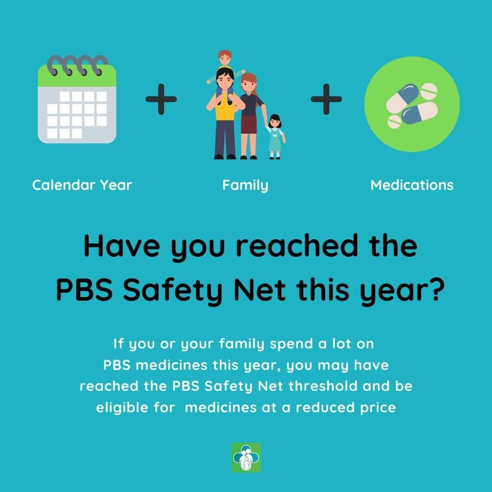

✨萤火之光·点亮远方✨
CCL 咨询请找小助手
321
321
#70098. The PBS Safety Net - Social+Medical
Briefing: The following dialogue takes place between an English-speaking pharmacist
who’s introducing the PBS Safety Net to a Mandarin-speaking patient.
1. Hello, it’s nice to meet you. It takes about 20 minutes to collect your prescription
medicines.
(你好，很高兴见到你。要拿处方药的话您需要等大概20 分钟。)
2. 你好。没关系，我可以等。我没有别的事要做了。
(It’s okay. I can wait. I don’t have any other things to do.)
3. Is that so? Okay, I can see your prescription and dispense record and seems you
have reached the threshold amount of the PBS Safety Net. This is great. You may be
able to fill your prescription at a reduced price.
(是这样吗？好的，我能看到你的处方药开药和配药记录。似乎您已经达到了药品安
全网的门槛金额。这很好。您也许可以用更低的费用来配药。)
\n

\n✨萤火之光·点亮远方✨
CCL 咨询请找小助手
322
322
4. 那很好。但是我还不知道为什么我的药品比较便宜。我也不知道药品安全网是什么。
(That’s great. But I’m not sure why my medicines are cheaper. I also have no idea of
what the PBS Safety Net is.)
5. Didn’t anyone tell you? The PBS Safety Net helps you pay less for medicines after
you’ve reached a certain amount in a calendar year.
(没有人告诉您吗？当您在一个日历年内，花费超过一定额度后，药品安全网可以让
您花更少的钱买药。)
6. 哦，我以前完全都不了解。生病的代价非常的昂贵，我需要去看医生，我还需要吃
各种各样的药品。我真的是应付不过来。
(Oh, I had no idea of it. Getting sick can be really expensive. I need to see the doctor and
take multiple medicines. I really can’t handle it. )
7. The PBS Safety Net is exactly for people like you. For healthy people, they only need
it occasionally while you need it all the time.
(药品安全网就是为了帮助像您一样的人的。对于健康的人来讲，他们只是偶尔需要
这个。您是一直都需要的。)
8. 是的。我真希望我并不需要经常吃药。但是如果我不吃药的话，我就不能离开家，
只能躺在床上。这太糟糕了。
(Yes. I wish I wouldn’t have to take medicines often. But without them, I wouldn’t be
able to leave home and could only stay in bed. This is awful.)
9. Yes. The PBS Safety Net can help you purchase medicines at a lower price and ease
your financial burden.
(是的，药品安全网就是可以帮助你们用更低的价格购买药品，减轻你的经济负担。)
10. 这确实很有帮助。现在我应该做什么呢？我要填表吗？
(It’s really helpful. What shall I do now? Do I need to fill in any forms?)
\n

\n✨萤火之光·点亮远方✨
CCL 咨询请找小助手
323
323
11. You don’t have to. We have your prescription records, and you’ll get discounts if you
keep purchasing medicines from us.
(不需要的。您的处方药记录在我们这边有。如果你一直在我们这买药的话，会有折
扣。)
12. 有的时候我感到不舒服，不能离开家。我的母亲会在她回家的路上帮我取药。
(Sometimes I feel unwell and have to stay home. My mother will collect medicines for
me on her way home.)
13. That won’t be a problem. We’ll give you a card with your number on it. You just
need to make sure this card is shown to us each time.
(没有问题，我们会给你一张卡，上面会有你的号码。你只需要确保每次都出示这张
卡就行了。)
14. 很好。这样就简单多了。我很开心。谢谢你。
(That’s great. This is much easier. I’m glad. Thank you.)
— End of Dialogue —
\n

\n✨萤火之光·点亮远方✨
CCL 咨询请找小助手
324
324
#70099. Severe Storm Damage- Social
Briefing: The following dialogue takes place between a mandarin speaking tenant,
whose rental house is damaged during a severe storm and Michael, an officer from the
Department of Health and Human Services.
1. Hi, I’m Michael. I’ve received your message. How can I help you today?
(你好，我是迈克尔。我收到你的信息了。我今天能怎么帮到你呢？)
2. 你好，迈克尔。我遇到的事情很急。我租的那个房子被损坏了。
(Hello, Michael. What happened to me is really urgent. The house I rent is damaged.)
3. That’s really unfortunate. I’m so sorry to hear that. Could you tell me what
happened? We’ll try our best to settle this for you within today.
(这太不幸了。很抱歉听到这个。能跟我说下发生了什么吗？我们会尽量今天帮你解
决的。)
4. 昨天晚上有暴风雨, 我的屋顶漏了。我只能用水桶去接水。
(There was a storm last night and my roof leaked. I had to use a bucket to catch the
drips.)
5. That doesn’t sound good. I hope you’re okay. The storms this year are quite severe.
(这可不太好。我希望你没事。今年的暴风雨都很严重。)
6. 是的。太可怕了。我时不时可以听到“砰”的一声。我房子周围树的树枝都不见了。
(Yes, it was horrible. I could hear a bang every now and then. The branches of the trees
around my house are all gone.)
7. That’s really terrible. I heard that some roofs are crushed, and some houses are
smashed by falling branches.
(那真的很糟了。我听说有的房顶被压坏了。有的房子被掉下来的树枝给砸坏了。)
\n

\n✨萤火之光·点亮远方✨
CCL 咨询请找小助手
325
325
8. 是的，我也是这么认为的。雨水淹了我客厅的地板。还有水从浴室的灯上滴下来。
(Yes, I believe so. The floor in my living room is water damaged and water is dripping
down from the bathroom light.)
9. Okay. Make sure you shut off the power at the breaker box. Otherwise, it could be
dangerous. Is it still raining now?
(好的。你要关了你电源箱内的电源。不然的话可能会很危险。现在还在下雨吗？)
10. 是的。风非常大。雨还在下着呢。
(Yes. The wind is so strong and it’s still raining.)
11. We’ll arrange for someone to fix the roof for you to prevent additional water damage.
But you may have to wait until the rain stops.
(我们会安排人给您修理屋顶，防止再进水。不过您可能要等雨停以后了。)
12. 谢谢，我需要把我的地板弄干。我知道我不能继续呆在这，但是我没有地方可以去。
(Thank you. I need to dry the floor. I know that I can’t stay here anymore, but I have
nowhere to go.)
13. Don’t worry, we’ll find a place for you and help you repair the floor and the roof.
You just need to ensure electrical safety.
(不用担心，我们会给你找个地方的。我们会帮你修地板和房顶的。你只要确保电力
安全。)
14. 谢谢你，迈克尔。我会等你们给我安排一个安全的住所。现在我只能把我水桶里的
水倒掉了。
(Thank you, Michael. I’ll wait for you to arrange a safe accommodation for me. Now I
have to pour the water from my bucket.)
— End of Dialogue —
\n

\n✨萤火之光·点亮远方✨
CCL 咨询请找小助手
326
326
#70100. Small Business Directory – Business
Briefing：The following dialogue takes place between a Mandarin-speaking business
owner and Allen, an English-speaking local council officer. The conversation is about
leasing a directory managed by the Council. The dialogue starts now.
1. Good morning. Thanks for reaching the City Council. I’m Allen. How can I help you
today?
(早上好，感谢致电市政厅。我是艾伦，今天能如何帮到您呢？)
2. 你好，艾伦。我打电话来, 是因为我知道市政厅有负责这个区域的小型企业网页名录。
(Hello, Allen. I’m calling because I’m aware that the City Council manages a web
directory of small businesses in this area.)
3. Yes, we do. If you would like to add your business to the directory, I can send you an
information pack. It explains how to do it.
(是的，我们提供的。如果您想把您的企业加到名录里，我可以给您发一个信息包，
里面有讲怎么操作。)
4. 那太好了，艾伦。如果你现在有时间的话，可以请你具体跟我解释一下怎么操作吗？
(That’s great, Allen. Could you please explain to me how to do it in detail if you’ve got
time now?)
5. Of course. The directories help people to identify local businesses for them to buy
from. Here’s a list in detail including their location, website, and phone number.
(当然可以了。名录可以帮助人们查找当地企业，以便他们购买。这里有一份详细的
清单，里面包括了企业的地址，网站和电话号码的信息。)
6. 这正是我在找的。我的小公司已经经营一段时间了, 我需要更多新顾客。
(This is exactly what I’m looking for. I’ve been running a small business for a while and I
need more new customers.)
\n

\n✨萤火之光·点亮远方✨
CCL 咨询请找小助手
327
327
7. The directories do help business to be visible for more customers. There are more
resources to help you expand business and apply for funds, such as grants.
(企业名录确实可以帮助企业被更多的顾客看到。还有更多的资源可以帮您扩大企业
规模，以及申请比如像补助这样的资金。)
注：“apply for funds” 这里回忆不确定。
8. 哦，我之前都不知道这个。我的生意目前还可以，不过我确实需要扩大规模，以保
持良好的运营，来养活一家人。
(Oh, I had no idea of it before. My business is doing okay now, but I do need to expand it
to make sure it’s running properly to support my whole family.)
9. Some information about the grants is provided on the government business website.
Also, you may want to be involved in the local business support group.
(政府商业网站上有关于补助的一些信息。除此之外，你或许也想参与到当地企业互
助小组中去。)
10. 我听说这个小组可以学到管理的技巧，这很有用啊。还可以认识其他企业经营者。
之前，我因为生意太忙，所以一直没有考虑要参加。
(I heard that you can learn how to manage a business with this group. This is quite useful.
Besides, you get to meet other business owners. I was quite busy before, so it didn’t occur
to me to be a part of it.)
11. This is the way small business is like, isn’t it? If you want, I can give you a list of
support groups, along with the directories’ information pack. Is this what you like?
(小企业就是这样的，不是吗？如果你需要，我可以把互助小组清单跟企业名录信息
包一起给你，怎么样？)
12. 好的，麻烦你了。麻烦把那份清单发给我吧，我一定会好好考虑。非常感谢你，艾
伦。你今天帮了我不少忙。
\n

\n✨萤火之光·点亮远方✨
CCL 咨询请找小助手
328
328
(Yes, please. I would really appreciate it if you could send me the list. I’ll definitely think
about it. Thank you so much, Allen. You’ve been so helpful today.)
— End of Dialogue —
\n

\n✨萤火之光·点亮远方✨
CCL 咨询请找小助手
329
329
#70101. Rescued dog and animal shelter – Social
Briefing ：This is a dialogue between an English-speaking local dog owner, and a
Mandarin-speaking newly arrived migrant who would like to buy a dog in the local area.
This conversation takes place in a local Park.
1. Hi there. It's a beautiful morning!
(你好。真是个美丽的早晨啊。)
2. 您好，是啊，雨停了真好。你的狗真可爱！
(Hello. Yes, it’s great that the rain has stopped. You have such a cute dog!)
3. Thank you. He is 3 years old. We have him since he was a puppy. Do you have a dog?
(谢谢你，它三岁啦。它还是小狗的时候我就养它了。你养狗吗？)
4. 没有，不过我想养一只。我和我家人刚搬到这里。我一直在想哪里可以去买一只狗。
(No, I don’t. But I do want to have one. I just moved here with my family. I’ve been
thinking about where to buy one.)
5. That depends on what sort of dog you want. Some people like a particular breed and
someone only wants a puppy.
(这要看你想要什么类型的狗啦。有些人喜欢特定品种的狗，或者有些人只想要小
狗。)
6. 我不在乎是狗的品种、年龄，这些都不重要。只要它友善，跟孩子们相处得好就行。
(It doesn’t matter what breed the dog is or how old it is, as long as it is friendly and gets
along with the kids.)
7. In that case, a rescued dog may suit you. There is a shelter in the main street.
There’re many nice dogs waiting for a good family.
(如果是这样的话，需要救助的狗狗可能适合你呢。在主街上有一个动物收容所，那
\n

\n✨萤火之光·点亮远方✨
CCL 咨询请找小助手
330
330
里有很多可爱的狗狗，都在等着能找个好人家。)
8. 这真是一个好主意，谢谢你。如果我去那里挑一只狗，我可以免费带他回家吗？
(That’s a really good idea. Thank you. May I take a dog home free of charge if I choose a
dog there? )
9. They will help you choose a dog that suits your family. You may need to pay some
money, but it won’t be too much.
(他们会帮你选择一只适合你家养的狗的。你可能要付点钱，但不会太多的。)
10. 那听起来很不错。恩，我这周末去看看。找到一只狗比我原来想的要简单多了。
(That sounds nice. Well, I’ll go take a look this weekend. Finding a dog is much easier
than I thought.)
11. I hope so. When you do get a dog, you also have to register it with the city council, in
case it goes missing.
(希望如此。当你养了狗以后，你需要在市政厅那边帮狗狗登记一下，以防狗丢了。)
12. 这是一个好主意，我还想在这附近找一个好的宠物医生。希望这不会太困难。
(That’s a good idea. I also want to find a good vet in the area. I hope it won’t be too
difficult.)
13. I know a great vet. I can give you my phone number. You can call me if you want me
to forward this to you, when you get a dog.
(我知道一个不错的兽医。我可以把我的电话号码给你。等你养了狗以后，如果你要
我把兽医的电话发你，就给我打电话。)
14. 太感谢你了。我很愿意啊。真的很高兴能遇见你。
(Thank you very much. I’d love that. It’s really nice meeting you.)
— End of Dialogue —
\n

