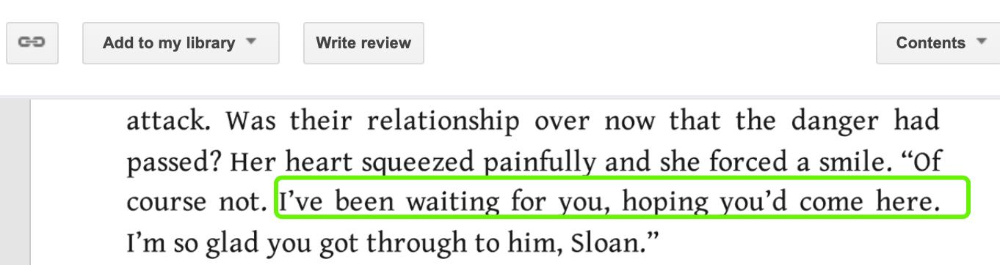
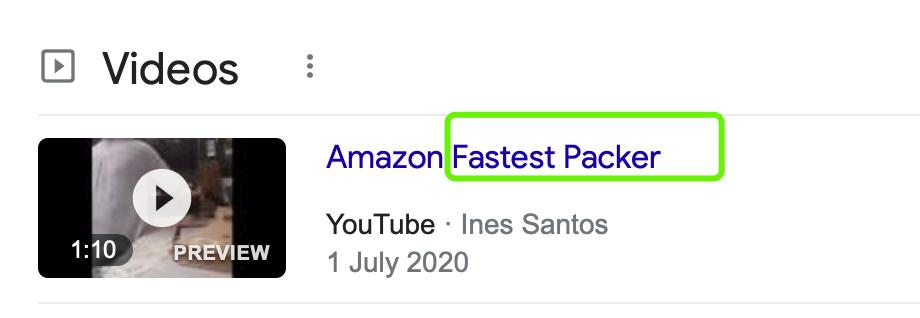

✨萤火之光·点亮远方✨
CCL 咨询请找小助手
361
361
13. Yes, you just need to pay 4 weeks’ rent as your deposit and sign the tenancy
agreement. Then you can move in.
(是的。你只需要交四周的租金作为押金，再把租房合同签了，就可以搬进来了。)
14. 谢谢。我马上签好租赁协议，并在上午之前把押金打到您的账户上。
(Thanks. I’ll sign the rental agreement and transfer my deposit/bond to your account
before noon.)
— End of Dialogue —
\n

\n✨萤火之光·点亮远方✨
CCL 咨询请找小助手
362
362
#70113. Seeking for more weekend shifts – Business
Briefing：The following dialogue takes place in a factory between a Mandarin-speaking
worker and Mr. Howard, the owner of the factory. The worker wants to ask for extra
shifts. The dialogue starts now.
1. Hello. I thought you must have finished work and gone home.
(你好, 我以为你都做完工作回家了。)
2. 没有，我在等着跟您商量事情。我想问一下我能不能在周末多工作一点时间。
(No. I’m waiting for you to discuss something/ I’m waiting for you, hoping to discuss
something with you. I wonder if I could ask for more weekend shifts.)
【萤火虫老师Tips】

“I’m waiting for someone, hoping …” 这个句式更委婉客气。
3. It is early to ask more shifts because you’ve just started here. How about we wait for
a month and see how it’s going?
(因为你才刚开始工作，要求多排点班太早了。要不我们再等一个月，看看情况再
说？)
4. 我知道我才刚开始在这工作，但是我工作得很卖力。我的经理说我是包装最快的工
人之一。
(I know that I have just started here. But I work really hard. My manager said I was one
of the fastest packers.)
【萤火虫老师Tips】
\n

\n✨萤火之光·点亮远方✨
CCL 咨询请找小助手
363
363
5. Yes, I know. You did a very job. If it is OK for you, maybe you can take more night
shifts with more wages.
(是的，我知道。你做得非常好。如果你可以的话，或许你可以多上一些工资更高的
夜班。)
6. 但是我只能在周末和平时工作日的白天工作。我在晚上要上英语课程和其他的一些
课程。很抱歉我不能上夜班。
(But I could only work during weekends and weekday daytime. I have to take English
classes and some other classes during evenings. I’m sorry I can’t take night shifts. )
【萤火虫老师Tips】

Daytime 作名词的时候不可数。
7. Don’t be sorry. It is good for you to improve your education level. I am impressed.
(不要觉得抱歉。你想提高自己的教育程度是件很好的事。我很佩服你。)
【萤火虫老师Tips】

Be impressed by/with sb/sth: feeling admiration for sb/sth because you think they are
particularly good, interesting, etc. (对…)钦佩，敬仰，有深刻的好印象
8. 太谢谢你了！我在努力完成我的课程，但是钱对我来说是个问题，所以我才想增加
工作时间。
(Thank you so much! I’m trying to complete my courses, but money is a problem for me.
\n

\n✨萤火之光·点亮远方✨
CCL 咨询请找小助手
364
364
That’s why I want more shifts.)
9. I see. Our shifts right now are full, but there will be someone away from work or sick.
I don’t know if you can accept short notice to come to work.
(我了解了。我们现在的排班都很满了。但是会有人上不了班或者生病的时候。我不
知道你能不能接受临时被叫来上班。)
10. 可以的。我很乐意随叫随到。只要我有时间，我就会来上班的。
(Yes. I’d love to be on call. I’ll come to work as long as I’m available.)
【萤火虫老师Tips】

If someone is on call, they are ready to go to work at any time if they are needed.
11. I know that you take public transportation to work. But the service on the weekend
starts after the shifts end.
(我知道你是乘坐公共交通来上班的。但是周末的公共交通是在上班时间结束以后才
有的。)
12. 这对我来说不是个问题。我有个朋友也在周末上班，我可以坐他/她的车。上班不会
迟到。
(It won’t be a problem for me. I have a friend who also works during weekends and could
offer me a ride. I won’t be late for work.)
13. Well, it sounds that you have sorted out the problem. I will tell your supervisor to
call you if there are shifts on weekend.
(嗯，听上去你已经把问题都解决了。如果周末有班的话，我会让你主管给你打电话
的。)
14. 太好了。非常谢谢你霍华德先生。我不会让您失望的。
(That’s great. Thank you so much Mr. Howard. I won’t let you down. )
---- End of Dialogue —
\n

\n✨萤火之光·点亮远方✨
CCL 咨询请找小助手
365
365
#70114. Calling for police assistance – Legal
Briefing ：The
following
dialogue
takes
place
over
the
phone
between
a
Mandarin-speaking resident and an English-speaking operator. The resident is calling
to ask for police assistance because of the noise in the neighborhood. The dialogue starts
now.
1. Hello, you have reached the police assistance line. This number is only for
non-urgent situations.
(你好。你已接通警方求助热线。本号码是仅限于非紧急情况的。)
2. 您好，这不是一个紧急的情况。我只是想报告有一群喝醉了的人在我们街区里非常
吵闹。
(Hi. This is not an urgent situation. I just want to report a bunch of drunk people being
very noisy in our neighborhood. )
3. I see. How long has this been happening? If they are still there, I can dispatch a
parole police car to come to your neighborhood now.
(我了解了。他们这样有多久了？如果他们还在那，我现在可以派一辆巡逻警车去你
们那。)
4. 他们现在已经不在了。但是我担心这种情况还会发生。这已经是第三个晚上了。我
们社区以前很安静的。
(They are not here now. But I’m worried that his may happen again. This is the third
night already. Our neighborhood used to be very quiet. )
5. Ok. Could you give me more details? What were they doing and who are they?
(好的。你能再跟我详细说说吗？他们之前在那做什么？他们是什么人？)
6. 他们是一群年轻人。他们开两辆噪音很大的车快速地到我们街的尽头。然后他们就
开始喝酒和大喊大叫。
\n

\n✨萤火之光·点亮远方✨
CCL 咨询请找小助手
366
366
(They are a group of young people. They got two awfully noisy cars and drove quickly to
the end of our street. Then they started to drink and yell. )
【萤火虫老师Tips】

Start to do sth: 强调开始某次具体的动作；

Start doing sth: 强调开始长期或习惯性的活动。
7. I understand why you find it disturbing. This happened a lot in a lot of
neighborhoods. I am happy that you gave us this call.
(我能理解你为什么觉得这很烦了。这种事在很多区都经常发生。我很开心你能给我
们打电话。)
8. 我有点担心，如果他们觉得无聊了，他们会开始砸车和闯入民宅。你们可以做些什
么吗？你们可以阻止他们或者逮捕他们吗？
(I’m a bit worried that if they feel bored, they may start to smash cars and break into
private properties. Could you do something? Do you think you could stop them or arrest
them? )
9. If they have left now, there is nothing I can do. I will send the details to the local
police station just in case this happens again.
(如果他们现在已经走了，我就什么都做不了了。我会把详细信息发到当地的警察局，
以防再出现这种情况。)
10. 如果他们明天还来的话，我可以打电话给你吗？
(May I give you another call if they show up again tomorrow?)
11. You can directly call the local police station. The details have been sent to them so it
will be quicker if you call them.
(你可以直接给当地警察局打电话。我已经把详细信息发给他们了，所以如果你给他
们打电话，还更快一些。)
\n

\n✨萤火之光·点亮远方✨
CCL 咨询请找小助手
367
367
12. 好的，我希望警察能来得快一些。在他们的行为变得更严重之前抓住他们。
(Okay. I hope the police could come sooner and catch them before their behaviors get
worse. )
13. You can call the police as soon as you hear the noise of the cars. Let the police handle
them and don’t go outside.
(你一听到他们车子的噪音，就可以给警察打电话。让警察去处理，你不要出去。)
14. 我不会出去的，我不想让他们把怒气撒在我身上。谢谢您，您帮了很大的忙。
(I won’t go outside. I don’t want them to take it out on me. Thank you. You have been
very helpful.)
【萤火虫老师Tips】

Take it out on sb: to make another people suffer for one's own anger, bad temper, etc.
拿某人撒气。
— End of Dialogue —
\n

\n✨萤火之光·点亮远方✨
CCL 咨询请找小助手
368
368
#70115. Gym full membership – Business
Briefing：The following dialogue takes place in a gym between a Mandarin-speaking
woman who would like to join the gym and Brad, an English-speaking gym manager.
This conversation is about the membership options and gym opening hours. The
dialogue starts now.
1. Hi, my name is Brad. How can I help you today?
(您好，我叫布莱德。我今天能如何帮到您呢？)
2. 你好，布拉德。我想加入你们健身房。我想了解一下你们哪些入会的选择。
(Hello, Brad. I’d like to join your gym. I would like to know the membership options I
have.)
3. We provide several options based on how often you would like to come and if you
want to join our classes or just use the equipment.
(我们有几种选择，要看您想多久来一次，是想上我们的课，还是只想使用器材。)
4. 那太好了。我想我很愿意上课，这样我能认识更多人。
(That’s great! I think I’m happy to take classes so that I get to meet more people.)
5. I get that. We provide a free session with a trainer when you join our gym. He will
show you how to use the equipment.
(我明白。当您加入我们健身房以后，我们会给您提供一节教练的免费课。教练会给
您演示怎么使用器材。)
6. 我想上自行车课，那个看上去很不错。我也想试试举重课。一旦我适应了，我每周
都会来使用设备的。
(I’d like to join that cycling class. It looks good. I’d like to try that weightlifting class as
well. Once I get used to these, I’ll come to use the equipment every week.)
\n

\n✨萤火之光·点亮远方✨
CCL 咨询请找小助手
369
369
【萤火虫老师Tips】
7. No problem at all. Our classes are friendly to all people. Here is our timetable and
price list, you can have a look at what classes we have.
(完全没问题。我们的课程对所有程度的人都很友好。这里是我们的时间表和价目表。
你可以看看我们都有哪些课程。)
8. 我计划大概每天都来，有时候我工作到很晚，所以我想下班后来，或者是清晨的时
候过来。
(I want to hit the gym every day. Sometimes I work late, so I’d like to come here after
work or in the morning. )
9. It sounds like full membership is the best option for you. Our casual membership is
suitable for people who only come 1 to 2 days per week.
(听起来正式会员最适合您。我们的临时会员比较适合每周只来一两天的人。)
10. 那太好了。我想我更愿意成为正式会员。最好能让我看一下会员费的价格。
(That’s great. I think I prefer that full membership. It would be better if you could show
me your membership price. )
11. We open from 6am to midnight every day. With our full membership, you can join
many classes you like without any extra costs.
(我们每天从早上六点到午夜十二点都营业。如果您加入我们的正式会员，您可以参
\n

\n✨萤火之光·点亮远方✨
CCL 咨询请找小助手
370
370
加很多您喜欢的课程，并且不需要额外付费。)
12. 谢谢。我很期待。我想尽快开始。我会常来你们健身房的。
(Thank you. I’m really looking forward to it. I hope I could start as soon as possible. I’ll
frequent your gym/I’ll come to your gym frequently. )
13. I will give you a copy of our membership price list and timetable. You can read it
and come back to me when you are ready. I will sign you up.
(我给您一份我们的会员价目表和时间表。您可以看看，想好了以后回来找我。我给
您报名。)
14. 谢谢。我很期待。我想尽快开始。我会常来你们健身房的。
(Thank you. I’m really looking forward to it. I hope I could start as soon as possible. I’ll
frequent your gym/I’ll come to your gym frequently. )
【萤火虫老师Tips】

第14 段，众多同学回忆都说，是跟第12 句一模一样，“考的时候都惊呆了”, “我
以为我按错了，但是没有”, 大家做好心理准备。
— End of Dialogue —
\n

