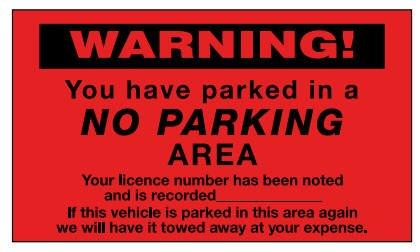

✨萤火之光·点亮远方✨
CCL 咨询请找小助手
371
371
#70116. House, townhouse and apartment – Business
Briefing：The following dialogue takes place between a Mandarin-speaking first home
buyer and Jerry, an English-speaking real estate agent. The dialogue starts now.
1. Hello, my name is Jerry, I saw you were looking at the listings of properties in our
window.
(你好，我是杰瑞。我看到您刚刚在看我们橱窗里的房源。)
2. 你好杰瑞。我看到你们的选择非常多，事实上，我觉得真是太多了。
(Hello, Jerry. I can see there’re lots of options. Actually, I think there’re too many
options.)
3. I'm sure I can find the right one for you. Could you please tell me what kind of
property you are looking for?
(我相信我能帮您找到合适的房子的。您能跟我说说您想找什么样的房子吗？)
4. 我还不确定，我想买一个带院子或者后院的独栋房或者公寓。如果我的孩子们能有
一个花园那会很棒，但是预算可能也是个问题。
(I’m not sure yet. I want a house or an apartment with a yard or a backyard. It would be
great if my kids could have a garden. But budget may also be a problem.)
5. We have many listed houses and apartments as well. Have you considered any other
options? Have you considered buying a townhouse?
(我们也有很多独栋房和公寓的房源。您有考虑过其他的选择吗？您考虑过买联排别
墅吗？)
6. 也许，你可以给我解释一下什么是联排别墅，我只知道独栋房屋和公寓。
(Maybe you could explain to me what a townhouse is. I only know house and apartment.)
\n

\n✨萤火之光·点亮远方✨
CCL 咨询请找小助手
372
372
【萤火虫老师Tips】

不能不加介词直接说‘explain me, him, her, etc.’
比如：可以说：Can you explain the situation to me?
不能说：Can you explain me the situation?
可以说：I'll explain to you why I like it.
不能说：I'll explain you why I like it.
7. Townhouse is a row of similar houses that are connected together and share a wall.
They are cheaper than houses, but bigger than apartments. Plus, a townhouse comes
with a garden or a courtyard.
(联排别墅是一排相似的连在一起的房子。房子之间会共享一堵墙。联排别墅的价
格要比独栋别墅低，但是要比公寓的面积更大。另外，联排别墅是带花园或者院子
的。)
8. 我明白了，这听起来很不错，你可以给我看看你们联排别墅的选择，如果价钱合适，
这会是一个很好的选择。
(I see. It sounds great. You could show me your options of townhouses. That would be a
great choice if the price is good. )
9. Normally, a townhouse will cost less than a house, but it depends on the area.
(通常来说，联排别墅的价格要比独栋房低，但是也要看面积多大。)
10. 你说的对，我觉得如果一个联排别墅比独栋房屋便宜，比公寓要大，我觉得我不介
意共享一堵墙。
(You are right. I don’t think I mind sharing a wall if a townhouse is cheaper than a house
and bigger than an apartment. )
11. It is very expensive to buy a property right now. Of course, we have lots of listings of
townhouses on sale.
I will give you this brochure, and there is more information on
our website as well.
\n

\n✨萤火之光·点亮远方✨
CCL 咨询请找小助手
373
373
(现在买房的价格很高。当然，我们有很多联排别墅的房源在打折。我把这本小册子
给您。我们网站上还有更多的信息。)
12. 谢谢你杰瑞，我今晚会看一下这些信息，对比一下这些房子，我会尽快给你答复的。
(Thank you Jerry. I’ll take a look at the information tonight and compare the properties.
I’ll get back to you as soon as possible. )
— End of Dialogue —
\n

\n✨萤火之光·点亮远方✨
CCL 咨询请找小助手
374
374
#70117. Overturning a parking fine – Legal
Briefing ：The following dialogue takes place between Mark, an English-speaking
consultant in a community legal center, and a Mandarin-speaking driver who received a
parking fine. The driver wants to seek advice to dispute the fine. The dialogue starts
now.
1. Good morning. My name is Mark. How can I help you today?
(早上好，我是马克。我今天能如何帮到你呢？)
2. 你好，马克，我想了解一下怎样免交我上周收到的停车罚单。
(Hello, Mark. I’d like to know how to avoid paying a parking ticket I received last week.)
3. It is possible to avoid paying your parking fine. It depends on the circumstances.
What happened?
(你是有可能不用交停车罚款的。这个要看情况。发生什么了？)
4. 当时我把我的车停在购物中心外，然后我让我妈妈下车了，我再带她去购物中心。
但是，等我回到车上以后，一位停车查票员说我把我的车停在了不该停车的区域。
(At that time, I parked my car outside a shopping center and asked my mother to get off
the car. Then I took her to the shopping center. But after I went back to the car, a parking
inspector told me that I parked my car in a no parking area.)
【萤火虫老师Tips】
\n

\n✨萤火之光·点亮远方✨
CCL 咨询请找小助手
375
375
5. Was there a no parking sign in the area you parked the car?
(你停车的地方有不能停车的标志吗？)
6. 那个标志已经坏了，只有一根空柱子。我开过去的时候，根本没注意到。
(That sign was already broken and there was only a pole/pillar with nothing on it. I didn’t
notice it at all when I drove there.)
7. From what I understand, parking signs must be visible where drivers park their
vehicles. Otherwise, a fine can be overturned.
(据我所知，在驾驶员停车的地方，停车标志必须是清晰可见的。否则的话，罚款是
可以被撤销的。)
8. 那个查票员说，那跟这件事完全没关系。我本来就应该知道那里是不能停车的区域。
这个罚单超过了一百澳元呢，我根本付不起。
(That inspector said it had nothing to do with this and I should have known it’s a no
parking area. This ticket costs more than a hundred Australian dollars and there’s no way
I could afford it. )
9. Did you take any photos of the missing sign? A picture that shows there’s no visible
sign can help you dispute the fine.
(你有没有拍任何可以显示停车标志缺失的照片呢？要是有显示并没有清晰标志的
照片，可以帮你申诉罚款。)
10. 有的。我有用手机拍了好几张照片。照片里面显示停车场的边缘有一个坏掉的标志。
(Yes. I used my cellphone to take several photos, in which there’s a broken sign on the
edge of that parking lot.)
11. Your next step is to apply for a review of your infringement notice with the city
council that issued you with the parking ticket. You can either do it online or in
writing. There are instructions on the back of your infringement notice.
(下一步你就需要向给你开停车罚单的市政厅去申请罚单复议。你可以在网上操作，
\n

\n✨萤火之光·点亮远方✨
CCL 咨询请找小助手
376
376
或者书面的形式也可以。你的罚单背面有相关说明。)
12. 我想我会写信的。我该怎么说呢？你可以帮帮我吗？
(I think I’ll write a letter. What should I say? Could you help me?)
13. Of course. Just include your infringement number, a short description of what
happened, and the photos you took which could show the missing sign.
(当然可以。你只需要在信里附上罚单号码，简短地说明一下发生了什么，再附上你
拍的可以显示标志缺失的那些照片。)
14. 谢谢你，马克。你今天帮了我一个大忙。
(Thank you, Mark. You have helped me a lot today.)
— End of Dialogue —
\n

\n✨萤火之光·点亮远方✨
CCL 咨询请找小助手
377
377
#70118. A story time program in a community center –
Education
Briefing：The following dialogue takes place between Andy, an English-speaking officer
of a community center and a Mandarin-speaking parent. The parent wants to make an
enquiry about a story time program. The dialogue starts now.
1. Hello. I am Andy. Welcome to the community center. How may I help you today?
(你好，我是安迪。欢迎来到社区中心。我今天可以怎么帮助你呢？)
2. 您好，我听说这里有给孩子们讲故事的活动，我想多了解一下相关的信息。
(Hello. I heard that there is a story-telling program here for children. I’d like to know
more about it.)
3. Ah, you meant the story time program! It’s starting soon. It has a good response
from the local parents. They all want to get their children enrolled.
(哦，你指的是讲故事活动！这个活动马上开始了。本地的家长们反响都很好。他们
都想给自己的孩子报名。)
【萤火虫老师Tips】

Enrol：If you enrol or are enrolled at an institution or in a class, you officially join it.
注册；登记
例：Her mother enrolled her in acting classes.她母亲给她报了表演班。
4. 是的，我在我儿子的学校看到广告。我觉得这个对我女儿再合适不过了。她今年4
岁了，需要参加一些额外的活动。
(Yes, I saw the ad in my son’s school and I think it’s very suitable for my daughter. She’s
four years old this year and she needs to participate in some extracurricular activities.)
\n

\n✨萤火之光·点亮远方✨
CCL 咨询请找小助手
378
378
【萤火虫老师Tips】

此处的“额外的活动”之所以可以翻译为extracurricular activities，是因为：If your
child is not yet in school, an extracurricular activity can be defined as any organized
enrichment activity they routinely participate in.
5. This program has been popular at the town library, so we would like to give it a try
at the community center. I hope the program would be a big success.
(这个活动在镇上的图书馆很受欢迎，所以我们也想在社区中心试试看。我希望这个
活动可以非常成功。)
6. 我也希望是这样的。我女儿一周三天要去参加表演小组，剩下两天没有活动。请问
讲故事活动是在哪天呢？
(I also hope so. My daughter needs to attend an acting group for three days a week and
she’s free for the other two days. May I ask when the story time program is?)
7. It’s due on the first Friday of February. It runs till the end of the school term, taking
breaks during school holidays.
(这个活动是从二月的第一个星期五开始, 直到学期结束。学校假期的时候休息。)
8. 那对我们正合适！我女儿周三和周五有时间。这意味着她不会错过表演小组或讲故
事小组，也不会错过游戏活动。
(That suits us well! My daughter is free on Wednesdays and Fridays and this means she
won’t miss the acting group, the story time program and her game time.)
9. Here’s a program booklet with all the information you need to know, including time,
date, and location. I can add your name to the list right now.
(这里是一本活动的小册子，里面有所有你需要知道的信息，包括时间，日期和地点。
我也可以现在就把你们的名字加到名单里。)
10. 谢谢您，安迪！我注意到这个活动不收费，我想很多家长都会很感激的，也会让更
多的孩子参加。现在很多儿童活动都很昂贵呢！
\n

\n✨萤火之光·点亮远方✨
CCL 咨询请找小助手
379
379
(Thank you, Andy. I noticed that this program is free. I think many parents would really
appreciate this and would want more kids to attend it. Lots of children’s programs are
very expensive now!)
11. True. We hope this program is accessible to everyone. If the program runs well, we
are planning to run it each school term in the future.
(确实。我们希望这个活动是面向所有人的。如果这个活动成功的话，我们接下来就
计划每学期都举办。)
12. 我希望这个项目能取得巨大成功！我期待尽快带我的女儿来参加第一次活动。我确
信她会乐在其中的。
(I hope it would be a big success! I‘m looking forward to taking my daughter here for the
first session. I’m sure she’ll enjoy it.)
— End of Dialogue —
\n

\n✨萤火之光·点亮远方✨
CCL 咨询请找小助手
380
380
#70119. Applying
for
an
intervention
order
at
The
Magistrates’ Court – Legal
Briefing：The following dialogue takes place at the Magistrates’ Court between Simon,
an English-speaking duty lawyer and Mrs. Liu, a Mandarin-speaking woman. Mrs. Liu
is at the Magistrates’ Court to discuss her husband’s violent behavior. The dialogue
starts now.
1. Good afternoon, I’m Simon. Are you Mrs Liu? I got your intervention order
application due to your husband’s abusive behavior.
(下午好，我是西蒙。您是刘太太吗？我接到了您就您丈夫的暴力行为提出的干预令
申请。)
2. 下午好，法官大人。我丈夫真不是个人。是的，他经常家暴我。他今天上午还打了
我的胳膊。你看我的胳膊都肿了。
(Good afternoon, Your Honor. My husband is a scum. Yes, he often abuses me. He hit
me on the arm this morning. See? It’s swollen.)
【萤火虫老师Tips】

Hit 的过去式和过去分词都还是hit.
3. I am not a judge; I am a duty lawyer at the Magistrates’ Court. I saw that your
husband was arrested by the police this morning. Is that right?
(我不是法官。我是地方法庭的值班律师。我这边看到今早您的丈夫被警察逮捕了，
是吗？)
【萤火虫老师Tips】

本段讲英文的人自我介绍的第一句，原文不是很完整。
4. 是的，我丈夫现在应该在监狱，而不是警察局。他真是坏透了。
(Yes. My husband is supposed to be in prison, instead of the police station. He is such an
\n

