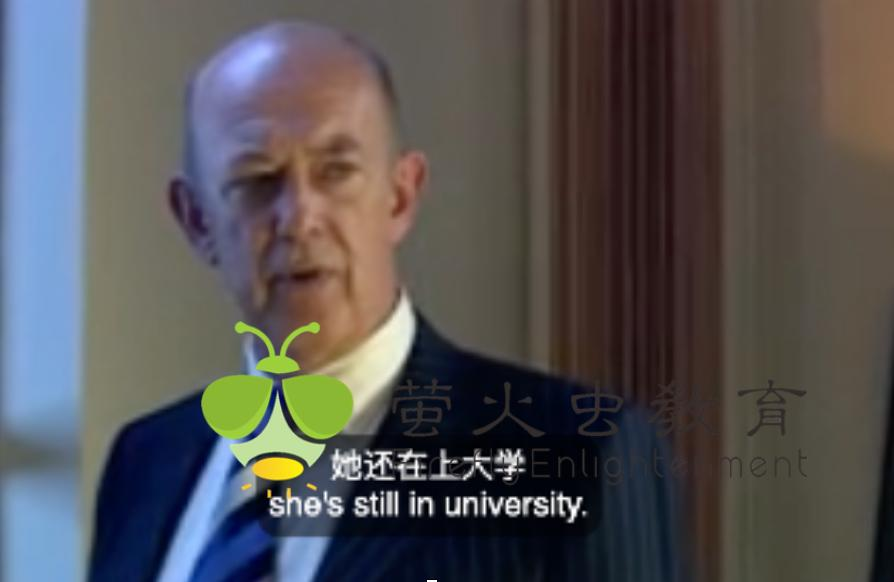

✨萤火之光·点亮远方✨
CCL 咨询请找小助手
381
381
awful person.)
5. Do you want to apply for a domestic violence intervention order?
(您想申请家暴干预令吗？)
6. 是的，警察让我来开这个干预令，我还不知道它怎么才能帮助我。
(Yes. The police asked me to apply for this intervention order. I still don’t know how it
could protect me.)
7. The domestic violence intervention order can help you get rid of your husband’s
violent behavior and protect you and your property. Do you have family nearby?
(家暴干预令可以帮助您摆脱您丈夫的暴力行为，还可以保护您和您的财产安全。您
有住在附近的家人吗？)
【萤火虫老师Tips】

本段的原文不是很完整。
8. 没有住在附近的。我只有一个弟弟也在澳大利亚，但是他住的非常远。他还在上大
学，住的是租的房子，我不想麻烦他。
(I don’t have any family nearby. I only have one younger brother in Australia. But he
lives quite far away from here. He’s still in university and the place he lives in is a rental.
I don’t want to bother him.)
【萤火虫老师Tips】

Rental 做名词时，可表示a house, car, or piece of equipment that you can rent ：租
来的房屋(或汽车、设备等)
例句：-‘Is this your own car?’ - ‘No, it's a rental.’
-“这是你自己的车吗？”
-“不，是租来的。
\n

\n✨萤火之光·点亮远方✨
CCL 咨询请找小助手
382
382
9. Do you have any other places where you can live safely? Like your friends’?
(您有没有其他安全的地方可以住呢？比如您朋友那儿？)
10. 我有朋友住在附近，但是我不想告诉他们我被家暴了。他们会看不起我的，这实在
太难堪了。
(I have friends who live nearby. But I don’t want to tell them that I was abused. They’ll
look down on me. This is so embarrassing.)
11. Having a safe place is the most important thing. We don’t know your husband’s
situation yet, so I suggest you contact your friends just in case.
(有个安全的地方住是最重要的事。我们还不了解您丈夫的情况，所以我建议您联系
一下您的朋友，以防万一。)
12. 那好吧，我给我最要好的几个朋友打个电话，看看谁能收留我。请问我可以在这里
打电话吗？我感觉到外面会很不安全。
(Okay. I’ll call some of my best friends and see who could let me stay. May I ask if I can
make phone calls here? I don’t feel safe outside.)
13. Of course, you can make calls in the chamber next door. I will call you if everything
is ready for you.
(当然可以了。您可以在隔壁的房间打电话。都准备好以后，我会给您打电话的。)
\n

\n✨萤火之光·点亮远方✨
CCL 咨询请找小助手
383
383
【萤火虫老师Tips】

本段“chamber”这个词，原文中不是很确定。
14. 太谢谢你了，我这就去打电话。
(Thank you so much. I’ll go and make some calls now.)
— End of Dialogue —
\n

\n✨萤火之光·点亮远方✨
CCL 咨询请找小助手
384
384
#70120. An elderly patient with a history of heart disease
-Medical
Briefing ：The following dialogue takes place in a local medical center between Dr.
Brown, an English-speaking GP and a Mandarin-speaking elderly patient. The patient is
a newly arrived migrant who has a history of heart disease. The dialogue starts now.
1. Good evening. What seems to be the problem?
(晚上好。您怎么啦？)
2. 医生你好，我刚来澳大利亚，我有心脏病史，请问你可以给我开一些药嘛？
(Hello, doctor. I just came to Australia. I have a history of heart disease. Could you
prescribe me some medicine, if I may ask?)
3. Of course, I am happy to help you. Could you please show me your medical history
first?
(当然可以。我很乐意帮您。您能先给我看一下您的病史吗？)
4. 我的病史现在找不到了，可能是留在我老家了。我过来的很匆忙，很多东西都没带。
我只有这份那边的医生开的药单。
(I can’t find it now. It’s probably left in my hometown. I came here in a hurry, and I left
lots of things behind. I only have this prescription with me. It’s given by a doctor in my
hometown.)
5. Let me see. Judging from your medicine, your heart disease should not be serious.
How are you feeling now?
(让我看一下。从您的药来看，您的心脏病应该不是很严重。您现在感觉怎么样？)
6. 不是的，医生。我的心脏病很厉害的，我已经得了7 年了。不过我最近确实好一些
了，平时也不太难受。
(No, doctor. It’s very serious. I have had it for seven years. But it’s true that I’ve felt
\n

\n✨萤火之光·点亮远方✨
CCL 咨询请找小助手
385
385
better recently, and I usually don’t feel unwell. )
7. Alright, I got it. Where is your family?
(好的，我了解了。您的家人都在哪呢？)
8. 他们都很忙。我有两个儿子和一个女儿在这边。平时我跟我大儿子住，他特别忙。
我不想成为他的负担。
(They’re all very busy. I have two sons and a daughter here. I usually live with my older
son. He’s very busy. I don’t want to be his burden. )
9. Well, we don’t have these medicines here, but I can prescribe some similar medicines
for you. They have the same effects, but the dosages are different. You also need to
check regularly to make sure there are no side effects.
(嗯，我们这边没有这些药。但是我可以给您开一些类似的药。他们效果是一样的，
但是剂量不一样。您还需要经常检查，确保没有副作用。)
【萤火虫老师Tips】

这段有一句不确定的医生告知服药剂量的“You need to XXX medicine XXX
daily”。
10. 好，请问这些药贵吗？
(Okay. Are they expensive, if I may ask?)
11. They are not cheap, but if you are eligible for the PBS Safety Net, you can save some
money.
(这些药不便宜。但是如果您有资格加入药品安全网计划的话，您可以省下一些钱。)
12. 你说的这个药品安全网是什么呀？你能跟我详细说说嘛？
(What’s that PBS Safety Net you mentioned? Could you tell me more about it?)
\n

\n✨萤火之光·点亮远方✨
CCL 咨询请找小助手
386
386
13. This is a scheme for patients who need a large number of long-term medications.
Many patients in Australia are eligible for the PBS Safety Net. Here is a brochure,
you can take a look.
(这是针对需要长期服用大量药物的病人的一项计划。澳大利亚的很多病人都有资格
加入药品安全网计划。这是一本小册子，您可以看一下。)
【萤火虫老师Tips】

这段有部分回忆不确定。
14. 太好了，请问我可以把这个小册子带回家看嘛？我的英语不好，需要我儿子帮我看。
(That’s great. May I ask if I can take the brochure home to read? My English is limited
and I need my son to help me with it.)
15. Sure. This is your prescription. You can buy these medicines at the pharmacy on the
corner of the main street.
(当然可以。这是您的处方。您可以在主街拐角的药店买到这些药。)
16. 好的，谢谢你医生。我这就去买药。
(Okay, thank you doctor. I’ll buy these medicines now.)
— End of Dialogue —
\n

\n✨萤火之光·点亮远方✨
CCL 咨询请找小助手
387
387
#70121. Canceling a credit card – Business
Briefing：The following dialogue takes place in a bank between an English-speaking
clerk and a Mandarin-speaking client, who wants to cancel a credit card. The dialogue
starts now.
1. Good afternoon. How can I help you today?
(下午好，我今天能如何帮到您呢？)
2. 你好，我想取消我的信用卡，可以吗？
(Hi. I’d like to cancel my credit card. Is that okay?)
3. Certainly! I just need your account details and check if there is any money owing on
your card.
(当然可以。我只需要您的账户信息，然后看一下您卡上是否有欠款。)
4. 没问题。这是我最近的银行账单。请看上面的账户信息吧。麻烦您帮我看看我的信
用卡是否有欠款。
(No problem. This is my recent bank statement and here’s the account details. Please help
me check if there’s any credit card debt. )
【萤火虫老师Tips】

很常考的信用卡欠款：credit card debt 或者credit card balance(balance 在这里就
不是余额了)

Debt 作为欠款的时候不可数。
5. No problem. I can cancel your credit card today. But your account still has $50 to
pay.
(没问题。我今天就可以帮您取消信用卡。但是您的账户里还有五十澳币需要支付。)
6. 好的，没问题。我会尽快支付的。那是不是从今天开始我就再不能使用信用卡了呢？
\n

\n✨萤火之光·点亮远方✨
CCL 咨询请找小助手
388
388
(Okay, no problem. I’ll pay it as soon as possible. Then does it mean that I won’t be able
to use this credit card from today?)
7. Yes, correct. That means you won’t be able to make any payments arranged from
this credit card.
(是的，没错。这就意味着您不能再用这张信用卡付款了。)
【萤火虫老师Tips】

Payment 做名词表示“支付的款项”时，是可数的。

这段最后一句“make”这个动词不确定，但是“arranged from this credit card”据说
是很确定的。
8. 我想我的健身房会员的月费是用这个卡支付的。我会把它改了。多谢你的提醒。
(I think this card pays the monthly payment of my gym membership. I’ll change that.
Thank you for reminding me. )
9. You are welcome. A lot of people forget to change the payment method when they
change the card. This is a common mistake.
(不客气。很多人在换卡的时候都会忘记改支付方式。这个错误挺常见的。)
10. 是啊，我不想错过任何一次付款啊，因为我不想交滞纳金。我取消信用卡的目的就
是为了省钱。
(Yes. I don’t want to miss any payments because I don’t want to pay a late fee. The
reason of canceling this card is exactly to save money.)
11. I understand. Even though I have cancelled your card, you are still charged interest
on this $50 until it is paid.
(我明白。即便我取消了您的这张卡，这五十澳币的欠款还是会一直收您利息，直到
您付清欠款。)
\n

\n✨萤火之光·点亮远方✨
CCL 咨询请找小助手
389
389
12. 我不知道这个啊。感谢你告诉我。我会尽快还的。我可不想一直付利息啊。
(I didn’t know that. Thank you for letting me know. I’ll repay it as soon as possible. I
don’t want to keep paying interest.)
13. It’s all done. I’ve cancelled the card. You will receive a letter of confirmation for the
cancellation in the next couple of days.
(都好了。我已经把卡取消了。您过几天就会收到一封取消的确认信。)
14. 感谢你。非常感谢你的帮忙。祝你今天过的愉快！
(Thank you. I really appreciate your help. Have a lovely day!)
— End of Dialogue —
\n

\n✨萤火之光·点亮远方✨
CCL 咨询请找小助手
390
390
#70122. Home plus policy – Business
Briefing：The following dialogue takes place between an English-speaking claim officer
and a Mandarin-speaking client. The dialogue starts now.
1. Good afternoon. How can I help you today?
(下午好。今天能如何为您效劳呢？)
2. 你好。我打电话就是想问一下我的保单有没有包含暴风雨造成的损失？
(Hello. I’m calling to ask if my policy covers storm damage.)
【萤火虫老师Tips】

Damage 作为名词时，除了“赔偿金”一定用复数：damages 之外，其他所有作为
名词表示“损坏，损失，伤害”时，都不可数。
3. I see. Storm damage is always not covered. If you can provide more details, I can
help you check.
(我了解了。暴风雨造成的损失通常是不予理赔的。如果您能多给我提供一些信息，
我可以帮您查一下。)
4. 我买的是房屋复合险，买了两年了，从来没报过。昨晚一棵树倒在我的屋顶上了。
(I’m a home plus policy holder. I purchased it two years ago and I’ve never made a claim.
A tree fell on my roof last night.)
5. I’m sorry to hear that. Is there anyone injured? The storm was bad last night, I
received several calls to make claims.
(听到这个我很遗憾。有人受伤吗？昨晚的暴风雨很大，我接到好几通理赔电话了。)
6. 没有，没有人受伤。但房顶上有个洞，修要好多钱。
(No. No one is injured. But there’s a hole on the roof and it costs a lot of money to repair
it.)
\n

