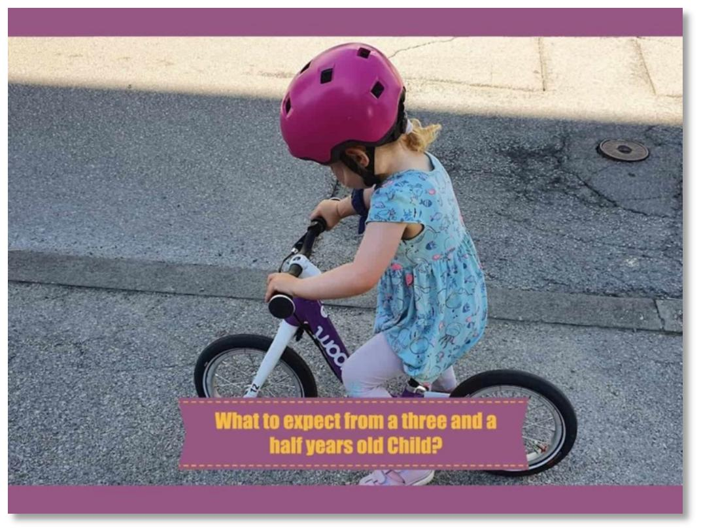

✨萤火之光·点亮远方✨
CCL 咨询请找小助手
31
31
6.
Mr. Lin：我记得上次我们吃海鲜，她有点胃不舒服，后来还拉肚子了。但是我猜她
应该是食物中毒了，而不是过敏。
(I remember that last time we had seafood, she got an upset stomach and had diarrhea
later. However, I guess it was food poisoning, instead of allergy.)
【萤火虫老师Tips】

注意胃不舒服，拉肚子的说法；

注意allergy 的发音：跟allergic 的重音不同。
\n

\n✨萤火之光·点亮远方✨
CCL 咨询请找小助手
32
32
7.
Doctor：We’ll check that later to rule out the possibility of allergy. The school also
asks her to take cholesterol tests and heart rate measuring. That’s something
unusual.
(我们会晚些来检查一下，排除掉过敏的可能性。学校还要去她测一下胆固醇和心率。
这要求有点不正常了。)
8.
Mr. Lin：我也觉得很奇怪。我自己去年也被要求测试过胆固醇和血糖，这我可以理
解。可是我女儿还这么年轻，为什么要测她的胆固醇呢？
(I find it odd too. I was asked to test my cholesterol and blood glucose levels last year. I
can understand it. But my daughter is so young. Why does she need a cholesterol test?)
【萤火虫老师Tips】

Cholesterol，胆固醇
9.
Doctor：I see. The last section of the form is about giving your consent to treatment
for your daughter and this requires your signature.
(我了解了。表格的最后一部分是你要同意治疗你女儿，这个需要你签字。)
10. Mr. Lin：我能问一下，这个同意书是关于什么的呢？
(May I ask what this consent form is about?)
11. Doctor：The medical consent form ensures that even if teachers in the camp site are
not able to contact you in the event of an emergency, they can still provide medical
treatment to your daughter.
(这个医疗同意表是为了确保如果有紧急情况发生，就算野营地的老师联系不上你，
他们也可以向你女儿提供治疗。)
12. Mr. Lin：我明白了。非常感谢您，布朗医生。如果有其他问题，我再来找您。
(I see. Thank you very much, Dr. Brown. I’ll come to you again if I have any other
questions.)
—End of Dialogue —
\n

\n✨萤火之光·点亮远方✨
CCL 咨询请找小助手
33
33
#70007. Coroner’s Office - Legal
Briefing ：An officer from the coroner’s office is talking to Mr. Li about the legal
procedures after his mother’s death. The dialogue begins now.
1.
Officer：Good morning, Mr. Li. I know that you’ve come to see me today regarding
your mother’s death. I have some questions for you.
(早上好，李先生。我知道你今天来是有关你母亲的死亡。我有些问题要问你。)
2.
Mr. Li：你好。我正好想问你呢。你们把我母亲的遗体放在哪儿了？我什么时候可
以取回我母亲的遗体呢？
(Hello. I was about to ask you. Where do you keep my mother’s body? When can I get it
back?)
3.
Officer：Your mother’s body is currently in the morgue of a local hospital. We still
need time to exam your mother’s body. How did you find out about her death?
(你母亲的遗体目前在一家当地医院的停尸房里。我们还需要时间来检验它。你是怎
么发现你母亲的死亡的？)
4.
Mr. Li：那天早上我起来以后，发现她躺在客厅的地上。我叫她，她没有回应。于
是我打电话叫了救护车。
(That morning, after I got up, I found her lying on the floor of the living room. I called
her, but there was no response. So, I called an ambulance.)
【萤火虫老师Tips】

这一段要注意全部用过去式，否则扣分就很多了.
5.
Officer：Unfortunately, your mother has passed away before the ambulance arrived,
so they have to contact the police for further investigation. Because your mother
does not have any medical records in Australia, we have to perform an autopsy on
her body to determine the cause of death. How did your mother come to Australia?
\n

\n✨萤火之光·点亮远方✨
CCL 咨询请找小助手
34
34
(遗憾的是，在救护车来之前，你母亲就已经去世了，所以他们只能联系警方来做进
一步调查。因为你母亲在澳大利亚没有任何就医记录，我们必须要做尸检来查明死
因。你母亲是怎么来澳大利亚的呢？)
6.
Mr. Li：我母亲是持旅游签证来到澳大利亚的。虽然她年纪很大，但是精神一直很
好，平时也几乎不生病，所以她没有在澳大利亚看过医生。
(My mother came to Australia on a tourist visa. Although she was quite old, she was
always full of energy and she barely got sick. That’s why she didn’t see any doctors in
Australia.)
【萤火虫老师Tips】

因为斯人已逝，提到母亲的时候记得都要用过去式
7.
Officer：We need to investigate this further. The coroner will order a post mortem to
decide if there is any medical cause behind your mother‘s death.
(我们需要进一步调查此事。死因裁判官会安排尸检，来看看她的死亡背后是否有任
何医学上的原因。)
【萤火虫老师Tips】

“medical cause”这里也有回忆称是“unnatural cause”：非自然原因。
8.
Mr. Li：我很尊重澳大利亚的法律，但是作为中国人，是很忌讳这个的，能不能保
持她的全尸呢？我想在最后一刻尽一份孝心。
(I respect the law of Australia, however, as Chinese, we see it as a big taboo. Could you
keep her body intact?
I want to fulfill my filial piety at the last moment.)
【萤火虫老师Tips】

忌讳，更多表示因为风俗习惯而不要去做的事情。所以taboo 这个词是最合适的。
\n

\n✨萤火之光·点亮远方✨
CCL 咨询请找小助手
35
35
9.
Officer：As her next of kin, if you intend to object to the post mortem, you can
submit an objection in writing with your concerns to the coroner’s office, stating
your reasons.
(作为她的最近亲，如果你想反对验尸，你可以递交一封书面反对书，写明你的担忧，
并且陈述你的反对原因，交给死因裁判官办公室，)
10. Mr. Li：那我究竟什么时候可以取回我母亲的遗体呢？希望你们好好处理她的遗体，
我母亲生前信佛，对下葬的时辰有讲究。我想尽快安排她的葬礼。
(So when exactly can I get my mother’s body back? I hope you can take care of her body
properly. She was a Buddhist, and she was particular about the timing of burying her. I
want to arrange her funeral as soon as possible.)
11. Officer：Your rejection may delay the release of the corpse. We will assist you in the
process of returning the body. Should there be any updates, we will notify you at the
earliest convenience.
(你的反对可能会推迟尸体发还的时间。我们会在返还尸体的过程中协助你的。如果
有任何进展，我们会在方便的第一时间通知你的。)
12. Mr. Li：好的，谢谢你，那我就等你的通知了。
(Okay, thank you. Then I’ll just wait for you notice.)
— End of Dialogue —
\n

\n✨萤火之光·点亮远方✨
CCL 咨询请找小助手
36
36
#70008. Suspected Drug Taking - Medical
Briefing: A mandarin speaking mother, Mrs. Jin, is talking to a doctor about her son
John’s suspected drug taking. The dialogue begins now.
1.
Doctor：Good morning, Mrs Jin. I understand that you would like to discuss about
your son John’s suspected drug taking with me, is that right?
(早上好，金太太。我理解你想跟我聊一聊你儿子约翰疑似吸毒的事情，对吗？)
2.
Mrs. Jin：医生你好。是的，我很担心我儿子，我想我的儿子正在吸毒，我很担心
他。
(Hello, doctor. Yes, I’m very concerned about my son. I think he’s taking drugs. I’m so
worried about him.)
3.
Doctor：Before we get into more details, are you sure that he’s on drugs? I mean,
actually there are many different kinds of drugs, including meth, ecstasy, marijuana,
heroin, cocaine and amphetamine. Could you give me more details, please?
(在我们讨论更多细节信息之前，你确定他在吸毒吗？我是说，毒品实际上有很多种，
包括冰毒，摇头丸，大麻，海洛因，可卡因和安非他命。你可以告诉我更多细节信
息吗？)
4.
Mrs. Jin：这是我最近在给他洗衣服的时候发现的。他的衣服上有很难闻的烟味。
并且有时候他回到家之后，昏昏沉沉，眼睛也红红的。听我儿子最好的朋友的母亲
Janette 说，这是吸食大麻的表现。
(I found that when I was washing his clothes a while ago. There was a terrible smoke
smell on his clothes. Apart from that, sometimes after he got home, he was drowsy with
red eyes. According to Janette, who is my son’s best friend’s mother, those are the
symptoms of taking marijuana.)
\n

\n✨萤火之光·点亮远方✨
CCL 咨询请找小助手
37
37
5.
Doctor：Well, these are indeed symptoms of using marijuana, but let’s not jump into
conclusion yet, Mrs. Jin. Have you noticed any mood swings or behavioral change
with him lately?
(这个嘛，这些确实是吸食大麻的症状。不过金太太，咱们先别急着下结论啊。你有
没有注意到最近他是否有什么情绪波动，或者行为举止上的变化吗？)
【萤火虫老师Tips】

易混词辨析：mood swings=moody 情绪多变；情绪波动

Emotional：情感丰富的

Sentimental 多愁善感的

Sensitive 敏感的
6.
Mrs. Jin：是的。他有时候变得非常暴躁，很容易生气，但是有的时候他又会突然
变得很开心。而且他以前从来都不去国家公园和音乐节，但是现在他都会去了，而
且是他的朋友们来接他去的
(Yes. Sometimes he is very grumpy and easily irritated, but sometimes he suddenly
becomes very happy. Also, he never went to National parks or music festivals before.
However, he goes to those places now and his friends would pick him up.)
7.
Doctor ：Using marijuana not only has a negative impact on his emotions and
behaviors, but is also harmful to his stomach, intestines and lungs. Have you talked
about all these with him?
(吸食大麻不仅仅对他的情绪和行为有不好的影响，也会对他的肠胃和肺有伤害。你
有跟他坦诚地聊过这些吗？)
8.
Mrs. Jin：我有谈过的。但是我儿子说，吸食大麻的危害比抽烟小多了。他还说，
在美国和澳大利亚，吸食大麻是合法的。
(I did, but my son said that the harm of taking marijuana was much lower than that of
smoking cigarette. He also said that it was legal to take marijuana in America and
Australia.)
\n

\n✨萤火之光·点亮远方✨
CCL 咨询请找小助手
38
38
9.
Doctor：Not really. It is legal to smoke, sell and possess marijuana in many states in
America. However, Australia doesn’t authorize the legitimate usage for individuals.
It’s only legal for scientific and medical purposes nationwide.
(并非如此。在美国的很多州，吸食，出售和持有大麻是合法的。然而，在澳大利亚，
个人使用大麻并未得到许可，它的合法使用仅限于全国性的科研和医用。)
10. Mrs. Jin：天呐，那我现在该怎么办呀？听说吸食大麻对他的身心都有很大的伤害。
我不想让这个毁了他的一生。我想让他有个新的开始。求你帮帮他吧！
(My goodness. Then what should I do now? I heard that taking marijuana is harmful to
him physically and mentally. I don’t want this to ruin his life. I want him to have a new
start. Please help him!)
11. Doctor：He can go to alcohol and smoking rehabilitation programmes for problem
teenagers. And also, his school counsellor and psychologist will help him. I will write
the referral.
(他可以参加为问题青少年设立的戒烟戒酒康复项目。与此同时，他的学校辅导员和
心理医生也会帮助他。我会写转诊信的。)
【萤火虫老师Tips】

Rehabilitation，表示康复，比如rehabilitation center 康复中心(CCL 必考词汇)
12. Mrs. Jin：那就麻烦你帮我写转诊信了，非常感谢你医生。
(Then please help me with the referral letter. Thank you very much, doctor.)
— End of Dialogue —
\n

\n✨萤火之光·点亮远方✨
CCL 咨询请找小助手
39
39
#70009. Childcare Centre – Education
Briefing：This conversation takes place at an early learning centre between Ms. Feng, a
Mandarin speaker, and Kelly, who is the director. Ms. Feng wants to enroll her child at
the centre. The dialogue begins now.
1.
您好。我的大女儿现在三岁半了。我想把她送到你们的托儿中心。
(Hi. My elder daughter is now three and a half years old. I’d like to send her to your
childcare centre.)
【萤火虫老师Tips】

大女儿小女儿不要说big daughter, small daughter

三岁半的说法应该是three and a half years old
2.
We do provide long day care services for children aged 0-6. But unfortunately, there
are no vacancies now. We can put your child’s name on our waiting list.
(我们确实为0-6 岁的儿童提供全日制托管服务。不过，遗憾的是我们现在没有空位
了。我们可以把你孩子的名字加到我们等候名单上。)
【萤火虫老师Tips】
\n

\n✨萤火之光·点亮远方✨
CCL 咨询请找小助手
40
40

Unfortunately 在这里不要翻成“不幸的是”，不太符合中文表达习惯！
3.
现在的托儿服务都太抢手了。我打了好几个电话。都是没有空位了。请问在你们中
心排队要等多久呢？
(The childcare services now are in high demand. I made quite a few calls and they all
have no vacancies. May I ask how long the queue is in your centre? )
【萤火虫老师Tips】


4.
The average wait time is 1-2 years. Have you considered other types of care?
(平均的等待时间是一到两年。您有考虑过其他的托儿服务吗？)
\n

