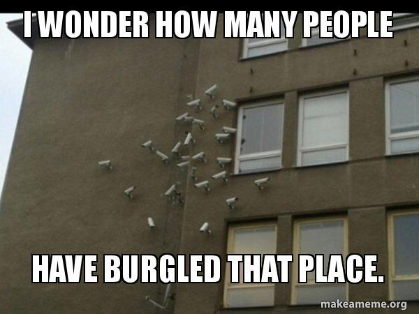

✨萤火之光·点亮远方✨
CCL 咨询请找小助手
391
391
【萤火虫老师Tips】

补充词汇：把那个洞补上：patch the hole
7. Your home plus policy is our top product. It covers the storm damage. We can help
you repair your roof.
(您的房屋复合险是我们的顶级产品。这个保险包含暴风雨造成的损失。我们可以帮
您维修屋顶。)
8. 听上去不错，感谢。我以前没报过保险，不知道怎么报。
(That sounds good. Thank you. I have never made a claim before. I don’t know how to do
it.)
9. You need to take photos of the damage and send them to us, then we can send
someone to your house to do assessments.
(您需要把损坏的情况拍照，发给我们。之后我们可以派人去您家里做评估。)
10. 好的。我拍好照，用邮箱发给你们，你们就能看到损失有多严重了。
(Okay. After I take the photos, I’ll email them to you, and you can see how bad the
damage is. )
11. If your application is successful, you only need to pay a little bit, and we will pay the
rest.
(如果您的申请成功了，您只需要支付一小部分费用，我们会支付剩下的费用。)
12. 听上去不错。需要多长时间？我担心再下雨会造成进一步的损失。
(Sounds good. How long will it take? I’m worried that it will cause more damage if it
rains again.)
13. I will arrange an appointment this afternoon if that’s available for you. How about
2pm?
(如果您有空，我帮您预约今天下午的时间。下午两点钟可以吗？)
\n

\n✨萤火之光·点亮远方✨
CCL 咨询请找小助手
392
392
14. 好的，很感谢。我感觉好多了。
(Okay. Thanks a lot. I feel much better.)
— End of Dialogue —
\n

\n✨萤火之光·点亮远方✨
CCL 咨询请找小助手
393
393
#70123. A bad escalator fall – Legal
Briefing：The following dialogue takes place between an English-speaking clerk in a law
firm and a Mandarin-speaking client. The client is seeking some legal advice. The
dialogue starts now.
1. Hi! Welcome to Smith Lawyers. How can I help you today?
(你好。欢迎来到史密斯律师事务所。我今天能如何帮到您呢？)
2. 你好。上个月我在商场里发生了意外，我想知道我可不可以拿赔偿金。
(Hi. I had an accident in a shopping mall last month. I want to know if I could get any
compensation.)
3. Sorry to hear you had an accident. If you can tell me what happened, I can direct
you to the right lawyer for your situation.
(很遗憾听到您发生意外。如果您能告诉我发生了什么，我可以根据您的情况，把您
转给适合的律师。)
4. 嗯，我当时在商场里，站在扶梯上去底层。但扶梯停了，我摔倒了。伤的很严重。
(Well, I was in that shopping mall and I was standing on an escalator to go to the ground
floor. But the escalator stopped, and I fell down/over. I was badly injured.)
5. That sounds terrible, I can set up an appointment with one of our personal injury
lawyers. They specialize in this type of cases.
(这听上去太糟糕了。我可以帮您约一位我们的人身伤害律师。他们很擅长这类官
司。)
6. 谢谢, 我不想把事情闹大。但是我在医院住了好几周了, 我到现在都没有办法回去
上班。
(Thank you. I don’t want to make a fuss, but I have been living in the hospital for weeks
and I haven’t been able to go back to work. )
\n

\n✨萤火之光·点亮远方✨
CCL 咨询请找小助手
394
394
7. I see. It can be very difficult to get back to the normal routine if you had an accident.
Recovery takes time.
(我了解。出了意外再回归正轨是很难的。康复也需要时间。)
8. 是的, 我朋友当时在扶梯下等我, 他看到了一切, 他说我应该寻求法律建议。
(Yes. At that time, my friend was waiting for me down the escalator. He saw everything
and he said I should seek legal advice.)
9. It is always a good idea to speak to a lawyer to find out what your rights are.
(跟律师聊聊，了解您的权利，永远都是明智的。)
10. 您觉得他们能给我理赔吗？
(Do you think I can get any compensation?)
11. I am not qualified to answer this question. When you talk with the lawyer, you will
find more. Should I arrange an appointment this week?
(我没有资格来回答您这个问题。您跟律师谈的时候, 会了解更多的。我这周帮您约
个时间可以吗？)
12. 好的，希望安排在下午。因为上午我要做物理治疗。
(Okay. Hopefully, it’s in the afternoon because I have physiotherapy in the morning. )
13. No problem. I can book you in at 2pm on Thursday. Bring a medical report if you
have one.
(没问题。我帮您约周四下午两点钟。如果您有医疗报告的话, 也记得带着。)
14. 我一定会带的。谢谢你的帮助。
(Will do. Thank you for your help.)
— End of Dialogue —
\n

\n✨萤火之光·点亮远方✨
CCL 咨询请找小助手
395
395
#70124. Obtaining a business insurance policy – Business
Briefing: The following dialogue takes place over the phone between Natalie, an
English-speaking insurance company employee and a mandarin-speaking potential
customer. The customer wants to make an enquiry about obtaining a business insurance
policy. The dialogue starts now.
1.
Good afternoon. My name is Natalie. What assistance could I provide to you today?
(下午好。我的名字是娜塔莉。今天我能帮您些什么呢？)
2. 你好，娜塔莉。我新买了一家咖啡店。我想买一份商业保险。
(Hello, Natalie. I just purchased a coffee shop. I’d like to purchase business insurance.)
3.
Congratulate you on buying a new business！We have a range of policies available,
especially ones that are designed for a small business.
(恭喜您买了新生意。我们有一系列的保单可供选择，尤其是针对小生意的保单。)
4. 这听起来很好呀。我想要确保如果店里起火了，或者是设备被偷了，我的生意是有
保障的。
(It sounds great! I’d like to make sure that if a fire breaks out in the shop or some
equipment is stolen, my business would be protected.)
【萤火虫老师Tips】

Equipment 不可数。
5. We have a basic small business insurance policy, which is very popular. It covers a
range of events, for example, fire and theft. And it is affordable.
(我们有一个基本小生意保单，很受欢迎。它可以承保一系列的意外事件，比如火灾
和盗窃。价格也是可以接受的。)
\n

\n✨萤火之光·点亮远方✨
CCL 咨询请找小助手
396
396
6. 我的预算不充裕。买得起的保险是很重要的。如果顾客在我的店里受伤了的话，这
个保险可以报销吗？
(My budget is tight. It’s important that the insurance is affordable. If a customer gets
injured in my shop, will the insurance cover that?)
7. It covers medical expenses to a certain amount. If you want to increase the level of
coverage, the cost will increase.
(这份保险可以承保一定数额的医疗费用。如果你想提高保险等级，费用会更高。)
8. 有一定额度的医疗报销就足够了。我还想投保一些设备，比如冰箱，咖啡机和我的
电脑。
(A certain amount of coverage is enough. I also want to get some equipment covered,
such as the fridge, the coffee machine and my computer.)
9. I’ll send you the policy detail. Please check the cover of those things. You can
increase the cover if you need.
(我把保单的详细信息发给您。您看一下这些东西保不保。如果您需要，您可以增加
投保内容。)
10. 这些很有用。我还想买一个运送食品的面包车。这个是包含在这个保险里的吗？
(Those are quite useful. I also want to buy a food delivery van. Will it be covered by this
insurance?)
11. I can help you with the business vehicle insurance, but it is separated from the
general insurance policy.
(我可以帮您看看商用车保险。但是它跟一般保险的保单是分开的。)
12. 好的。如果我买了商业保险，车辆保险有折扣吗？
(Okay. If I purchase this business insurance, will I get a discount on vehicle insurance?)
\n

\n✨萤火之光·点亮远方✨
CCL 咨询请找小助手
397
397
【萤火虫老师Tips】

固定搭配：Discount on sth

例：They're offering a 10% discount on all sofas this month. 本月他们给沙发售价
统统打九折
13. I can offer you a 10% discount on vehicle insurance if you buy the general business
insurance policy from us.
(如果您购买我们的一般生意保险单的话，我可以给您的车辆保险打九折。)
14. 谢谢。这很不错。麻烦你发给我这些信息和报价。在我看了具体的资料后，我会打
电话给你的。
(Thanks. This is really good. Could you please send me the information and the quote?
After seeing the detailed information, I’ll give you a call.)
— End of Dialogue —
\n

\n✨萤火之光·点亮远方✨
CCL 咨询请找小助手
398
398
#70125. A constable’s home security advice - Legal
Briefing：This is a phone conversation between a Mandarin-speaking homeowner and
Constable Hardwing, an English-speaking police officer. The homeowner is asking for
help to ensure the safety of his house. The dialogue starts now.
1.
This is the Police station. Constable Hardwing speaking. How can I help you?
(这里是警察局。我是警员哈德翁。我能如何帮到您呢？)
【萤火虫老师Tips】

此处警员的名字，回忆不是很确定。
2.
你好，哈德翁警官。我想寻求房屋安保的建议。我不久之后就会去度假。
(Hello, Officer Hardwing. I want to seek some advice on home security. I’ll be on
holiday soon.)
【萤火虫老师Tips】

注意积累下面截图里相关的表达

\n

\n✨萤火之光·点亮远方✨
CCL 咨询请找小助手
399
399
3.
I definitely can help you with that. The most important thing is to make sure all the
windows and doors are closed when you leave.
(这个我肯定可以帮您。最重要的是确保您离开时所有的门窗都关好了。)
4.
我会的。不过我有点担心。我们街上一家上个月被盗了。我不想让它发生在我身上。
(I will. But I’m a bit concerned. One family in our street was burgled last month and I
don’t want that to happen to me.)
【萤火虫老师Tips】

5.
Well, the thieves are not likely to break in the house if they don’t know you’ve left.
(嗯，如果小偷不知道你出门了，他们就不太可能闯进去。)
【萤火虫老师Tips】

If someone, usually a thief, breaks in, they get into a building by force. (常指盗贼)
破门闯入

第五段第一句的回忆缺失。
\n

\n✨萤火之光·点亮远方✨
CCL 咨询请找小助手
400
400
6.
这是一个好主意。但是我不知道怎么做，因为我要出去很长时间，至少六个月。
(This is a good idea. But I don’t know how to do it, because I will be away for a long
time, at least six months. )
7.
Well, you can ask the post officer who post mails to collect and keep them, instead of
sending them to the mailbox.
(嗯，你可以让寄信的邮递员把信取了存着，而不是放到信箱里。)
8.
我不知道可以这么做。如果邮箱里没有邮件，那么就会看起来我每天都在取邮件。
(I didn’t know I could do that. If there aren’t any mails in the mailbox, then it would look
like I collect mails every day.)
9.
Exactly. You can also ask your neighbor to mow the lawn. If the grass is very long,
the thieves will suspect that you’ve left.
(是啊。你还可以让邻居帮忙割草。如果草长太长了, 小偷就会怀疑你不在家。)
10. 我不在家的时候，邻居会喂猫，我可以问问她能不能帮我除草。
(My neighbor will feed the cat while I’m away. I could ask her if she could help me mow
the lawn.)
11. You can also ask your neighbor to park the car in the driveway. In this way, it seems
someone is in your house.
(你还可以让你的邻居把车停到车道上。这样看起来就好像是你家里有人。)
【萤火虫老师Tips】

本段最后的回忆有缺失。
12. 这真是一个好主意。我的车停在车库，所以车道上有车位。你的建议真的很有帮助。
谢谢。
(This is really a good idea. My car is parked in the garage, so there are parking spaces in
the driveway. Your advice is really helpful. Thank you. )
\n

