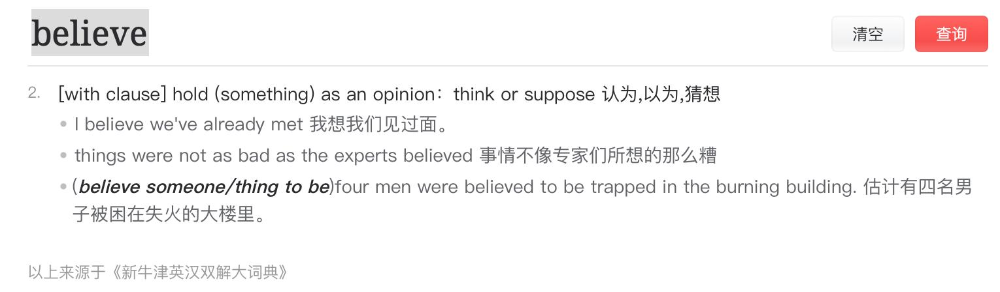
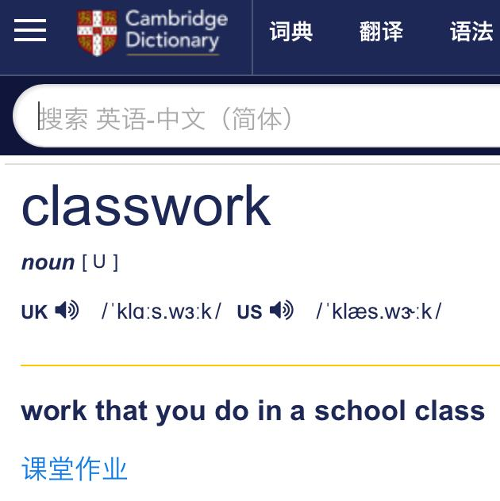
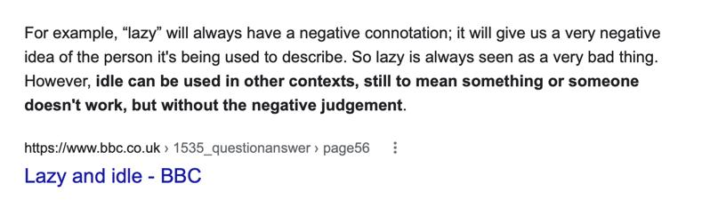
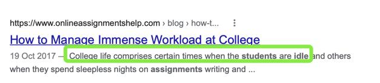
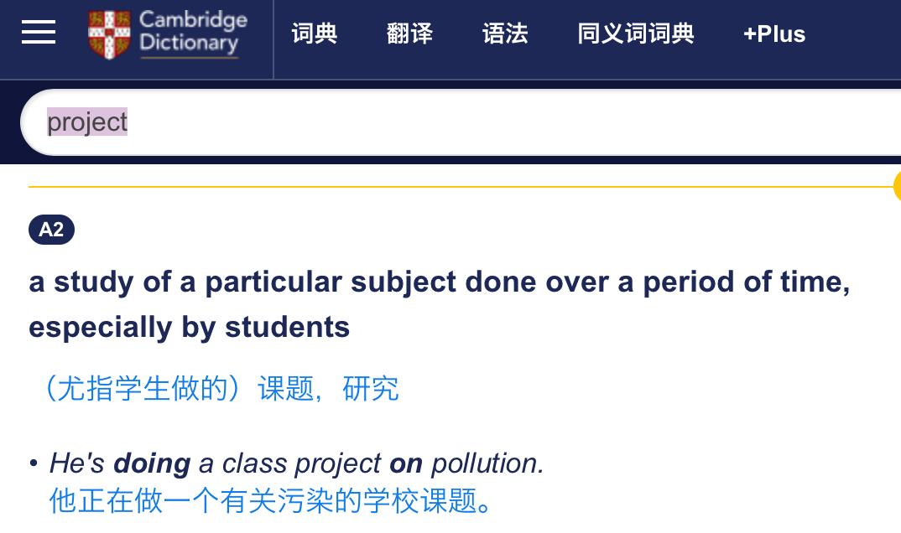
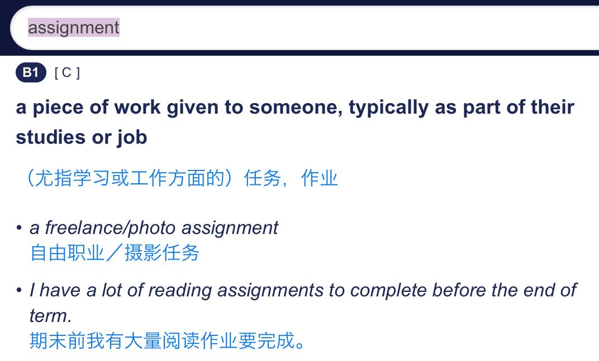

✨萤火之光·点亮远方✨
CCL 咨询请找小助手
401
401
13. It’s a pleasure that I can help. Have a lovely holiday.
(能帮到您我很高兴。祝您假期愉快。)
14. 我会的。这样我的屋子就更安全了。再次谢谢你。再见。
(I will. In this way, my house will be safer. Thank you again. See you.)
— End of Dialogue —
\n

\n✨萤火之光·点亮远方✨
CCL 咨询请找小助手
402
402
#70126. Request a refund of a school holiday session-
Education
Briefing：This is a conversation between a Mandarin-speaking mother and Laura, an
English-speaking staff of a school holiday program. The dialogue starts now.
1. Hello, there. I believe you would like a refund on a session of our school holiday
program.
(您好。我想您是想要我们的一次学校假期活动的退款。)
【萤火虫老师Tips】

Program：an organized order of performances or events 演出或活动
例：an exciting musical program 一场激动人心的音乐演出
例：a week-long program of lectures 持续一周的讲座安排
例：What's the program for (= what are we going to do) tomorrow? 明天安排什么
活动？

Session：a period of time that is spent doing a particular activity 一场；一节；一段
时间
例：a photo/recording/training session: 一次摄影，一场录音，一堂训练课;
例：The course is made up of 12 two-hour sessions. 这门课总共上12 次，每次两
小时。
2.
是的，没错。我想要学校假期活动最后一个项目的退款。因为我儿子并没有参加那
场活动。
(Yes, that’s correct. I want a refund of the last session of the school holiday program
because my son didn’t attend it.)
【萤火虫老师Tips】

Refund 作为名词时是可数名词。

固定搭配：a refund of something
\n

\n✨萤火之光·点亮远方✨
CCL 咨询请找小助手
403
403
3.
I understand. Unfortunately, we have a very strict cancellation policy. Parents must
give us notice of non-attendance 24 hours earlier in order to get a refund.
(我理解。很遗憾，我们的取消政策非常严格。想要退款的话，家长必须提前24
小时通知我们不能来参加。)
【萤火虫老师Tips】

“notice”在表示“事先通知”时通常不可数(uncountable noun).
例：The insured must be given at least 10 days’ notice of cancellation. 取消保险必
须给被保险人至少十天的事先通知。
4.
是的，我知道，如果我事先知道场地改变了，我是肯定会及时告诉您的。
(Yes, I know. If I had known the change of venue, I definitely would have let you know
in time. )
【萤火虫老师Tips】

虚拟语气中，与过去事实相反的固定搭配：从句If someone had done something,
主语someone would/should/could/might have done something.
5.
We had to find a new venue very quickly as the normal sports ground was double
booked, but all the parents should have received a notification on their phone.
(因为通常使用的运动场被重复预定了，我们只能赶快找个新场地。但是，所有的
家长应该手机上有收到通知。)
【萤火虫老师Tips】

“should have done” 除了表示“本该做而没做”，也可以用于表示“对过去的事情的
推测”。比如：It was an easy test and he should have passed, but I don’t know for sure.
这个考试挺简单的，他应该是通过了，不过我不确定。
6.
我确实收到了通知，但是在活动开始前两个小时才收到，我没有时间改变计划, 到
达新的场地。
\n

\n✨萤火之光·点亮远方✨
CCL 咨询请找小助手
404
404
(I did receive the notification, but I didn’t received it until two hours before the session. I
didn’t have time to change my plan or come to the new venue.)
7.
I'm very sorry about that. It sounds like there was an error with the notifications，
you should have been informed the night before.
(我很抱歉。听起来好像通知出了差错。您本应在活动前一天晚上就收到通知的。)
8.
另外，新的场地在城市的另一边，所以我无法及时赶到那里，我是依靠公共交通的，
因为我没有车。
(Also, the new venue is on the other side of the city, so I couldn’t be there in time. I rely
on public transport because I don’t have a car.)
9.
Oh, I see. It must have been very difficult to rearrange things on such short notice
without a car. I'm happy to give you a refund in these circumstances.
(哦，原来是这样。时间这么赶，还没有车，重新做安排一定很难吧。考虑到这些情
况，我很愿意给您退款。)
10. 那太好了，谢谢您的理解，如果我事先知道的话，我就会早点取消。
(That would be great. Thank you for your understanding. If I had known before, I would
have canceled earlier. )
11. No problem. I will organize your refund now. It shouldn't take too long. I'll look
forward to seeing you and your son next holiday.
(没问题的。我现在就给您安排退款。应该很快就好。期待下个假期见到您和您的儿
子。)
12. 谢谢您，劳拉。我儿子非常喜欢这个假期活动。错过了运动会，他感到非常失望。
他会期待参加下一届的。
(Thank you, Laura. My son really likes this holiday program. He was very disappointed
to miss the sports day. He’ll be looking forward to attending the next one.)
【萤火虫老师Tips】
\n

\n✨萤火之光·点亮远方✨
CCL 咨询请找小助手
405
405

Disappointed 的固定搭配：
1)
对某事失望：Be disappointed at/by/with something
2)
对某人失望：Be disappointed in/with someone
3)
Be disappointed to do something
4)
Be disappointed + that + 句子

运动会：Sports day(英式)或field day(美式)，一般指学校为学生，或公司为员工
主办的运动会。类似国内的校运会。
— End of Dialogue —
\n

\n✨萤火之光·点亮远方✨
CCL 咨询请找小助手
406
406
#70127. Not enough homework- Education
Briefing ：This dialogue is a phone conversation between a parent and an English
speaking teacher, Ms. Johnson. The parent is asking for his child to have a special
project because she is completing her classwork so quickly. The dialogue begins now.
1. Hi. This is Ms. Johnson. I am returning your call. I believe you wanted to speak to
me about your daughter.
(你好。我是约翰逊老师。我给您回电话。我想你是想要跟我聊聊你的女儿。)
【萤火虫老师Tips】

2. 您好。是的，我想和您谈谈我的女儿。谢谢您这么快就回电话给我了。
(Hi. Yes, I’d like to talk to you about my daughter. Thank you for returning my call
quickly. )
3. Of course. I hope nothing is wrong. I'm very pleased with the work your daughter is
doing in class.
(这是自然的。我希望没出什么问题。我对你女儿的课业很满意。)
4. 这真让我很开心。没什么问题。我只是希望和你谈谈，因为目前她似乎对学校的功
课感到厌倦了。
(This really makes me very happy. Nothing is wrong. I just want to have a talk with you
because now she seems tired of her schoolwork. )
【萤火虫老师Tips】
\n

\n✨萤火之光·点亮远方✨
CCL 咨询请找小助手
407
407

5. I have wondered about that. She does get her schoolwork done very quickly but I
haven't been able to talk to her about it yet.
(我有想过这个。她确实很快就做完学校功课了。但是我还没能跟她聊过这件事。)
6. 好像她家庭作业也很少。我问过此事，但她说大部分功课在上课的时候就做完了。
(It seems she has a little homework as well. I asked about it but she said most of the
homework was done during class.)
【萤火虫老师Tips】

Homework 不可数。
7. Yes, I noticed that this week the other students were completing classwork and she
has started the homework I've just given out.
(对。这周我有注意到其他学生在做课堂作业，她已经开始做我刚布置的家庭作业
了。)
\n

\n✨萤火之光·点亮远方✨
CCL 咨询请找小助手
408
408
【萤火虫老师Tips】

8. 我在想，是否可以给她多布置一些家庭作业。我真不希望她在功课方面变得懒散。
(I wonder if she could be given more homework. I really don’t want her to be idle with
her work.)
【萤火虫老师Tips】


\n

\n✨萤火之光·点亮远方✨
CCL 咨询请找小助手
409
409
9. There are two other students in her class who are also completing their work quickly.
An extra project they can do together might be good for them.
(她班上有另外两个学生也是很快就能完成功课。让他们一起做个额外的课题可能对
他们比较好。)
【萤火虫老师Tips】

10. 这听起来是个好主意啊。您考虑的是什么方案呢？
(This sounds like a good idea. What project are you thinking about?)
11. I can give them an extra book to read and create a project related to that. I will think
about it and give them the assignment on Friday.
(我可以额外给他们一本书去阅读，并且布置一个相关的课题。我要想一下，周五的
时候把作业/任务布置给他们。)
\n

\n✨萤火之光·点亮远方✨
CCL 咨询请找小助手
410
410
【萤火虫老师Tips】

12. 太好了。对方案的内容我翘首以待。我喜欢阅读的书籍和她一样，所以我们会一起
讨论。
(That’s great. I’m looking forward to the project. We like reading the same books so we
would discuss together.)
13. That's great. Students who have parents interested in their work often do better in
class.
(太好了。那些家长很关心功课的学生通常在课堂上表现得更好。)
14. 我也很高兴。非常感谢您，约翰逊老师。与您交谈是件开心事。
(I’m very happy too. Thank you, Ms. Johnson. It’s a pleasure to talk with you.)
— End of Dialogue —
\n

