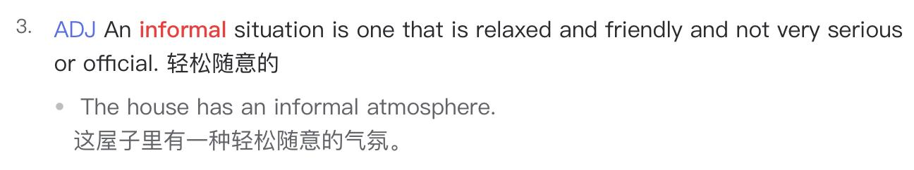

✨萤火之光·点亮远方✨
CCL 咨询请找小助手
411
411
#70128. Group meeting with refreshments - Social
Briefing: The following dialogue takes place between a newly arrived migrant and Mark,
a community centre officer. The dialogue starts now.
1.
Good morning. Welcome to our community centre. My name is Mark. How can I
help you today?
(早上好。欢迎来到我们社区中心。我是马克。我今天能如何帮到您呢？)
2. 你好，我看到一个移民小组会议的广告。我想了解一下这个会议的情况，以及是如
何运作的。
(Hi. I saw an ad for a migrants group meeting. I’d like to know about this meeting and
how it works.)
【萤火虫老师Tips】

固定介词搭配：a(n) ad / advertisement / commercial / promotion FOR sth
3. Yes, of course. Our group meeting is held twice a week: Wednesday and Saturday
morning. Our group is very friendly.
(当然可以。我们的小组会议每周有两次：周三和周六早上。我们的小组是很友好的。)
4. 这正是我在找的。几个月前，我刚来到澳大利亚。我想认识一些人和交一些朋友。
(This is exactly what I’m looking for. I just came to Australia several months ago. I’d like
to meet some people and make some friends.)
5. This is the aim of our meeting. In the meeting, you can meet other new migrants and
local people as well. Our local volunteers will answer any of your questions if you
come to our community.
(这就是我们这个会议的目的呀。您可以在会议里遇到其他的新移民，也能遇到本地
人。如果您来我们社区，我们本地的志愿者可以回答您的任何问题。)
\n

\n✨萤火之光·点亮远方✨
CCL 咨询请找小助手
412
412
6. 我也想见一些当地的人。我很想和他们交流在澳大利亚的生活问题。如果我决定了
的话，是否需要预约呢？
(I also want to meet some local people. I want to communicate with them about my
problems in life in Australia. If I have decided, do I need to book?)
【萤火虫老师Tips】

7. There is no need to book. Our meeting is very informal. We offer refreshments.
People can talk and practice English.
(不需要预约的。我们这个会议很轻松随意的。我们有茶点提供。大家可以聊天，练
习英文。)
【萤火虫老师Tips】

8. 我的英语还行。但是，如果他们说的太快的话，我有时候会听不懂他们在说什么。
我想这个会议会很有帮助的。
\n

\n✨萤火之光·点亮远方✨
CCL 咨询请找小助手
413
413
(My English is okay. But if they talk too fast, sometimes I couldn’t understand what they
say. I think this meeting would be very helpful.)
9. Our meeting is held in a meeting room in the community centre. It’s held 10am on
Wednesdays and 11am on Saturdays.
(我们是在社区中心的会议室开会。每周三是早上十点钟，每周六是早上十一点钟。)
10. 感谢你的帮助，马克。我这周六会来参加这个会议。这样的话，我就可以了解是关
于什么了。
(Thank you for your help, Mark. I’ll attend this meeting this Saturday. In this way, I
could understand what it is about.)
11. I’m sure you’ll enjoy our meeting. You’ll meet new friends. Please take this brochure
which includes the directions to the meeting room and the meeting time.
(我相信您会喜欢我们的会议的。您会认识到新朋友。您拿好这本小册子，里面有会
议室和会议时间的说明。)
【萤火虫老师Tips】

12. 谢谢你的帮助。我很期待见到其他的新移民，和他们交流在澳大利亚的生活。能够
认识新朋友真是太好了。
(Thank you for your help. I look forward to meeting other new migrants and
communicating with them about the life in Australia. It’s so great to get to meet new
friends.)
#70129. A spreadsheet course - Education
\n

\n✨萤火之光·点亮远方✨
CCL 咨询请找小助手
414
414
Briefing: The following dialogue takes place between Sally, an English-speaking
employee of a local community centre and a Mandarin-speaking mother who wants to
make an enquiry about one of the computer course in the centre. The dialogue starts
now.
1.
Good morning. My name is Sally. How can I help you?
(早上好。我是莎莉。我能如何帮到您呢？)
2.
你好莎莉。我想报读你们其中一个电脑课程。
(Hello, Sally. I’d like to sign up for one of your computer courses.)
3.
Ok, I can help you with it. What course are you interested in? We have many
computer courses. It depends on what courses you like.
(好的。这个我可以帮您。您对哪种课程感兴趣呢？我们有很多电脑课程，要看您喜
欢哪一种。)
4.
我儿子希望我在生意上帮助他，帮他管理收入和支出。所以我想报名电子表格的课
程。
(My son wants me to help him with his business and help him manage the income and
expenses. So, I’d like to sign up for a spreadsheet course.)
5.
We have basic business skill courses, which may be suitable for you. You’ll learn
how to use spreadsheet to manage money.
(我们有基础商业技能课，可能适合您。您可以学到怎么用电子表格来管钱。)
6.
听上去不错。但是我需要适合新手的课程。我孙子孙女电脑技术都比我好。所以我
才想报名电脑课程。
(It sounds good, but I need a course for beginners. My grandson and granddaughter have
better computer skills than I do, so I’d like to sign up for a computer course.)
【萤火虫老师Tips】
\n

\n✨萤火之光·点亮远方✨
CCL 咨询请找小助手
415
415

这里“孙子孙女”那句回忆不确定，只记得跟孙子孙女有关。
7.
That’s fine. Our course is designed for those who have little or no experience in
computer. You won’t fall behind.
(没关系的。我们的课程是针对电脑接触很少或者没接触过电脑的人的。您不会跟不
上的。)
8.
这样我就放心了。上次我尝试学过电脑课程，但是这非常复杂。老师也不是很耐心。
(That’s a relief. I tried learning a computer course last time, but it was very complicated,
and the teacher wasn’t very patient either.)
9.
I’m sorry to hear that. Our teachers are all very nice. You can learn at your own
pace. You don’t need to worry about it at all.
(听到这些我很遗憾。我们的老师都很好。您可以按照自己的节奏来学习。您一点也
不需要担心的。)
【萤火虫老师Tips】

10. 很棒啊，我感觉好些了。我希望尽快上课。你们下次课程有空位置吗？
(That’s great. I feel better. I hope I could attend the class as soon as possible. Do you
have spaces available for the next class?)
11. Yes, we have plenty of spaces available. Our new class will start in 3 weeks. We have
2 types of class. One is on Wednesdays and the other is on Saturdays.
(有的。我们空位很充足的。我们新课三周以后开班。我们有两种班，一种是每周三
上课，一种是每周六上课。)
\n

\n✨萤火之光·点亮远方✨
CCL 咨询请找小助手
416
416
12. 我想参加周六的课程。因为我周三要照顾孙子和孙女。
(I want to attend the Saturday class because I need to take care of my grandson and
granddaughter on Wednesdays.)
13. I’ll put you in the Saturday morning class at 10am. It would be a good idea to bring
your pen and pad to take some notes.
(我把您放到周六早上的班，时间是上午十点。您带上笔和便签本记一些笔记会比较
好。)
【萤火虫老师Tips】

14. 我一定会的。我会记笔记的。谢谢你莎莉，我迫不及待去上课了。
(Will do. I’ll take some notes. Thank you, Sally. I can’t wait to attend the class.)
【萤火虫老师Tips】

这里“takes notes”那句回忆不确定，只记得跟takes notes 有关。
— End of Dialogue —
#70130. Keep medicines on file – Medical
\n

\n✨萤火之光·点亮远方✨
CCL 咨询请找小助手
417
417
Briefing: The following dialogue takes place between a patient and a pharmacist. They
are discussing how to save medicines on file. The dialogue starts now.
1.
Hi. Welcome to the pharmacy. How can I help you today?
(你好，欢迎来到药房。我今天能如何帮到你呢？)
2.
你好，我想买药。我的药不够了。
(Hi. I want to buy some medicines. I’m running out of them.)
3.
I can do this for you. I can keep your routine medicines on file.
(这个我可以帮您。我可以把您经常吃的药存档。)
【萤火虫老师Tips】

固定搭配Keep /have something on file: 存档
4.
没有人问到过我这个。我不知道这是什么意思。我通常都是自己在家保管药方。
(No one ever asked me about this. I don’t know what it means. I usually save my
prescriptions by myself at home.)
5.
You take a lot of regular medicines. If you keep them on file, they can be ordered
automatically. So, you won’t run out of them.
(您吃很多常用药。如果您把这些药存档，就可以自动订药。您就不会药不够了。)
6.
哦，我知道了。有的时候我确实会忘了买药, 除非药用完了。有时候我去药房，然
后我想买的药卖完了。
(Oh, I see. Sometimes I do forget to buy medicines unless I run out of them. I sometimes
go to the chemist and the medicines I want to buy are sold out.)
\n

\n✨萤火之光·点亮远方✨
CCL 咨询请找小助手
418
418
7.
This could happen sometimes. If you keep them on file, this won’t happen again.
Your medicines should be managed more conveniently.
(有时候这种事确实会发生。如果您把这些药存档，这种事就不会再有了。您应该能
更方便地管理您的药物。)
8.
如果医生给我开新药会怎么样？如果我没有把药方留在家里，我会弄混我药方上的
药有没有吃完。
(What if the doctor prescribes me some new medicine? If I don’t leave the prescription at
home, I’ll be confused about whether I have run out of the prescription medicine.)
9.
We’ll always tell you the last repeat of your prescription. Then you can make an
appointment with your doctor and get new medicines.
(到了您最后一次处方药的时候，我们都会告诉您的。这样您就可以预约医生拿新药
了。)
【萤火虫老师Tips】

这段的英文是大概回忆，不全是原文。
10. 现在我知道了。这肯定会比我自己保管药方要更好。那么请把我的药方存到你们的
系统里。
(Now I understand. It would definitely be better than keeping the prescription myself.
Then please save my prescription to your system.)
11. Of course, we’ll do this for you. When your prescription is kept on file, your
medicines can be ordered in advance. You can directly pick up your medicines.
(当然可以了。我们会帮您的。您的药方存档了以后，您的药就能提前订了。您可以
直接来取药。)
【萤火虫老师Tips】

这段”your medicine can be ordered in advance” 这半句回忆不确定，只确定有“in
advance”.
\n

\n✨萤火之光·点亮远方✨
CCL 咨询请找小助手
419
419
12. 如果我可以直接取药，这样会节省很多的等待时间。这个服务真好。谢谢您今天的
帮助。
(If I could pick up medicines directly, it will save a lot of wait time. This service is really
good. Thank you for your help today.)
【萤火虫老师Tips】

— End of Dialogue —
\n

\n✨萤火之光·点亮远方✨
CCL 咨询请找小助手
420
420
#70131. Community food pantry - Social
Briefing: The following dialogue takes place in a community centre between a
Mandarin-speaking unemployed people and an English-speaking social worker. They
are discussing food pantry, which is used to provide food for the poor. The dialogue
starts now.
1.
Hi. It’s good to see you. You haven’t been to the community centre for quite a long
time.
(您好。很高兴见到你。有很长时间没看您来社区中心啦。)
2.
你好，是的。我知道。我最近有经济危机，所以我几乎不出门。
(Hi. Yes, I know. I’ve been in financial trouble, so I barely leave home.)
【萤火虫老师Tips】

某人陷入经济危机/困难：in financial crisis/trouble/hardship/difficulty

3.
I’m sorry to hear that. I have some time now and we can talk about it. Maybe
there’s something I can do to help you.
(听到这个我很遗憾。我现在有些时间，我们可以聊聊。可能我可以为您做些什么，
来帮到您。)
4.
谢谢你，我失业了。我想知道我有没有资格加入社区菜园。这样我就可以自己种菜，
不用买菜了。
\n

