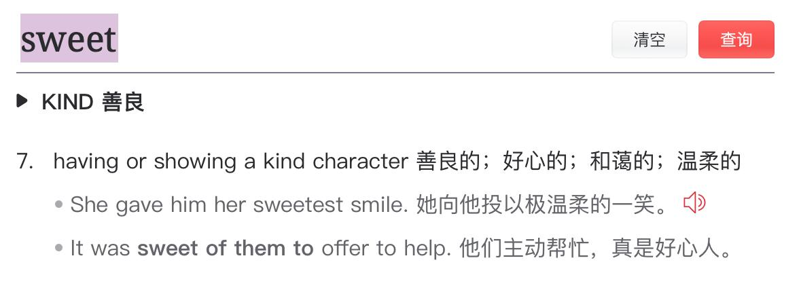

✨萤火之光·点亮远方✨
CCL 咨询请找小助手
421
421
(Thank you. I’m unemployed. I want to know if I’m eligible for the community garden so
that I could grow vegetables myself instead of buying them.)
5.
I’ll check if there are any spaces for you. But as you know, it takes time to grow
vegetables, so it may not help you now.
(我看一下还有没有空位可以给您。但是，就像您知道的，菜需要长一段时间，所以
可能目前帮不到您。)
6.
我知道。但是我没办法了。我想我最近的情况不会很快好转，所以在接下来的几个
月，任何能帮到我的事情都会让我很开心的。
(I know. But there’s no other way. I don’t think things will quickly get better for me
recently, so in the next couple of months, I’ll be happy with anything helpful.)
7.
Okay. I’ll check if you can join our garden. Meanwhile, if you don’t have a job, you
may be eligible for our community pantry.
(好的。我看一下您能否加入我们的菜园。同时，如果您没有工作的话，您或许有资
格来我们的社区食品室。)
8.
社区食品室？我不知道这个。
(Community pantry? I don’t know this.)
9.
It’s a stock of food donation for people who need them. You can take anything you
need from the food pantry free of charge.
(食品室是捐赠的食品库存，是提供给有需要的人的。您可以从食品室里随便拿您需
要的东西，不用付钱。)
10. 这太好了。人们捐赠食物来帮助其他人。这太有爱了。人们真大方。我们住在一个
可爱的社区里。食品室是如何运作的呢？
(This is great. People donate food to help others. This is so sweet. People are so generous.
We are living in a lovely community. How does the food pantry work?)
\n

\n✨萤火之光·点亮远方✨
CCL 咨询请找小助手
422
422
【萤火虫老师Tips】

11. Our food pantry is a room in the community centre. It opens twice a week. You can
just get in and pack your bag with the items you need.
(我们食品室在社区中心的一个房间里。它每周开放两次。您可以直接去，有您需要
的东西，就装到您的包里。)
12. 这对我帮助非常大。如果我找到了新工作，我以后也会捐赠食物来帮助其他人。我
希望是如此。
(That’s very helpful to me. If I find a new job, I’ll also donate food to help others. I hope
so.)
— End of Dialogue —
\n

\n✨萤火之光·点亮远方✨
CCL 咨询请找小助手
423
423
#70132. Job Support Centre - Social
Briefing: The following dialogue takes place between a Mandarin-speaking job seeker
and Kate, an English-speaking employee at a Job Support Centre. The job seeker wants
to apply for a job in a real estate agency. The dialogue starts now.
1.
Good morning. Welcome to our Job Support Centre. I’m Kate.
(早上好。欢迎来到我们求职帮助中心。我是凯特。)
【萤火虫老师Tips】

2.
凯特，早上好。我需要有人帮我看简历。我想要申请房产中介的一份工作。
(Good morning, Kate. I need someone to review my resume. I want to apply for a job in a
real estate agency.)
3.
That’s good to hear. I’m sure I can help you. I need to see the job advertisement
before we start.
(那很好。我相信我能帮到您。在我们开始之前，我需要看一下招聘广告。)
4.
这里是招聘广告。他们在找一个全职的办公室助理来接听电话，还需要为客户提供
服务。还需要处理信件和打印房产报告。
(This is the job advertisement. They are looking for a full-time office assistant to take
phone calls, provide service to the customers, deal with letters, and print property
reports.)
\n

\n✨萤火之光·点亮远方✨
CCL 咨询请找小助手
424
424
5.
That sounds like a good job, especially if you like to talk to customers. Do you have
any experience working in a real estate agency?
(这份工作听起来挺好的，尤其是如果您喜欢跟顾客交谈。您有在房产中介工作的经
验吗？)
6.
不，我从来没在房产中介工作过。但是我在大学的课程有上办公室行政。我之前在
社区中心的办公室工作。
(No. I’ve never worked in a real estate agency before. But I learned office administration
in my university course. I used to work in the office of a community centre.)
【萤火虫老师Tips】

7.
Okay. Why not start with the skills you have during your previous job? You can tell
me about your role in the community centre and the sort of tasks you did.
(好的。我们不如从您之前工作的技能开始？您可以跟我说一下您在社区中心都负责
什么，做了哪些工作。)
8.
我会接听电话和安排预约，还为顾客提供社区服务。如果有投诉，我会试着解决。
我还打电话处理银行的事情。
\n

\n✨萤火之光·点亮远方✨
CCL 咨询请找小助手
425
425
(I would take phone calls, make appointments, and provide community service to
customers. If there were complaints, I would also try solving them. I also make phone
calls to deal with bank issues.)
9.
So you have the experience and skills the real estate agency is looking for. I’ll
definitely make it clear in your résumé.
(所以您是有房产中介需要的经验和技能的。我肯定会在您的简历里清楚写明的。)
10. 太好了。我只有在社区中心工作的经验。我不确定我的简历是不是符合雇主的要求。
(That’s great. I only have the experience working in the community centre. I’m not sure if
my resume can meet the requirements of the employer.)
【萤火虫老师Tips】

这一段回忆缺失一句。
11. Don’t worry. I’ll help you go through the job requirements step by step. We’ll
demonstrate your skills for each requirement.
(别担心。我会一步一步带着您过一下工作要求。每一项要求，我们都会相应地说明
您的技能的。)
12. 谢谢您，凯特。我之前还担心我的简历不够好，不能让我得到面试。但是我现在更
有信心了。
(Thank you, Kate. I was worried before about whether my resume is not good enough to
get me the interview. But now I’m more confident.)
— End of Dialogue —
\n

\n✨萤火之光·点亮远方✨
CCL 咨询请找小助手
426
426
#70133. Hire a boat - Social
Briefing: The following dialogue takes place between a Mandarin-speaking female
tourist who wants to hire a boat for a family trip at the lake and Bill, an
English-speaking business owner. The dialogue starts now.
1.
Hi. My name is Bill. How can I help you today?
(您好。我是比尔。我今天能如何帮到您呢？)
2.
比尔，你好。我今天想租一艘船。可以吗？
(Hi, Bill. I want to hire a boat today. Is it okay?)
3.
It is! All the boats are booked out in the morning, but I see there are several boats
free in the afternoon.
(当然可以！所有的船早上都订出去了。不过我看下午有几艘船空着。)
4.
下午可以的。我和我的家人来这。这是我第一次来这个湖。我非常期待到处看看。
(Afternoon is okay. I came here with my family. It’s my first time coming to this lake.
I’m keen to take a look around.)
5.
Sounds great. May I know how many people there are in your group? I will arrange
the right boat for you.
(听上去很棒啊。我能问下你们一行多少人吗？我给你们安排合适的船。)
6.
一共六个人，包括三位年幼的孩子，和一位朋友。我们想去钓鱼和野餐。
(There are six people altogether, including three young kids and a friend. We want to go
fishing and have a picnic.)
7.
I picked the perfect boat for 6 people for you. Have you driven before?
(我给您找到适合六个人的船了。您之前开过船吗？)
\n

\n✨萤火之光·点亮远方✨
CCL 咨询请找小助手
427
427
8.
不，我对开船一窍不通。我的朋友是澳大利亚人。他有开船的执照。他来开船。
(No, I know nothing about how to drive a boat. My friend is an Australian and he has a
boat license. He will be driving.)
9.
Good. Boats are easy to operate, but it does help to have someone with some
experience in boats.
(很好。船不难开，不过有些开船经验的人来开，确实更好。)
10. 我很高兴和他一起来。有什么规矩要遵守吗？
(I’m glad to come with him together. Are there any rules that we should follow?)
11. If your children are under 16, they must wear life jackets. It is better if adults could
wear life jackets too, especially for those who can’t swim.
(如果您的孩子未满16 岁，他们一定要穿救生衣。如果大人也穿救生衣会更好，尤
其是对不会游泳的人来说。)
12. 我们都会穿的。我也想知道租一艘船一个下午，需要多少钱？
(We’ll all wear life jackets. I also want to know how much it costs to hire a boat for one
afternoon.)
13. 4 hours cost $200. It should be enough time for fishing, lunch, and seeing the lake.
(四个小时是200 澳币。时间应该足够去钓鱼，吃午饭和看湖了。)
14. 谢谢！下午见。我真期待能钓鱼。我的孩子们很喜欢这项活动。
(Thank you. See you in the afternoon. I’m keen to go fishing. My kids really like this
activity.)
15. Don’t forget about the bait. You could buy some at the store next door. You could
also hire fishing equipment if you need it.
(别忘了鱼饵。你可以在隔壁商店买到鱼饵。需要的话也可以租渔具。)
\n

\n✨萤火之光·点亮远方✨
CCL 咨询请找小助手
428
428
16. 我现在就去买。今晚有鱼吃了。
(I’ll buy some now. We have fish to eat tonight.)
— End of Dialogue —
\n

\n✨萤火之光·点亮远方✨
CCL 咨询请找小助手
429
429
#70134. Advertise a new restaurant - Business
Briefing: This dialogue happens between a Mandarin-speaking restaurant owner who is
making an inquiry about how to advertise her newly opened restaurant and Simon, an
English-speaking advertisement expert who starts a business open day. The dialogue
starts now.
1.
Hi, my name is Simon. Welcome to the business open day.
(您好。我的名字是西蒙。欢迎你来生意开放日。)
2.
你好，西蒙。我很高兴来这里。我想问问有什么办法能宣传我的新餐厅？
(Hi, Simon. I’m glad to be here. I want to ask if there are ways to advertise my new
restaurant.)
3.
There are many options to advertise your restaurant. Which option you choose
depends on how much you want to spend.
(有很多方法可以宣传你的餐厅。你选哪种方法，取决于你想花多少钱。)
4.
我没多少预算。我希望简单点儿。
(My budget is tight. I hope to make it simple.)
5.
Ok. This rules out TV advertisement, which is the most expensive type of
advertisement.
(好。这就排除了电视广告了。电视广告是最贵的广告类型。)
6.
我的确没有电视广告的预算。我也不想在电视上看到自己。
(I indeed don’t have the budget for TV advertisement. I don’t want to see myself on TV
either.)
\n

\n✨萤火之光·点亮远方✨
CCL 咨询请找小助手
430
430
7.
I understand. You can place advertisements in newspapers or on local radio. Also,
social media is cost-effective.
(我理解。您可以在报纸上或者当地广播里投放广告。在社交媒体投放广告的性价比
也很高。)
8.
我听说当地饭店用广播电台做广告。但是，我不想讲话。有时候，我的口音很难听
懂。
(I heard that some local restaurants use radio stations to place advertisements. But I don’t
want to speak. Sometimes my accent is hard to understand.)
9.
You do not need to speak. Radio stations will record your voice for you. If you place
advertisements on radio, they will help you write the advertisements.
(你不需要讲话的。广播电台会帮你录下你的声音。如果你在广播电台投放广告，他
们会帮你编写广告。)
10. 听起来不错。明天我会打电话给电台和报纸，问他们广告的价格。
(That sounds good. I’ll call some radio stations and newspapers tomorrow and ask about
the price.)
11. You need to run advertisements many times. The cost will increase, but it increases
the chance of reaching more people.
(你需要放很多次广告。费用会增加，但是让更多人知道的机会也增加了。)
12. 我明白。我知道做广告对宣传我的餐厅很重要。希望这值得。
(I understand. I know that placing advertisements can be important to advertise my
restaurant. I hope it will be worth it.)
【萤火虫老师Tips】

希望这值得：I hope it “will be” worth it, 更呼应紧接着第13 段的it“will be”.
\n

