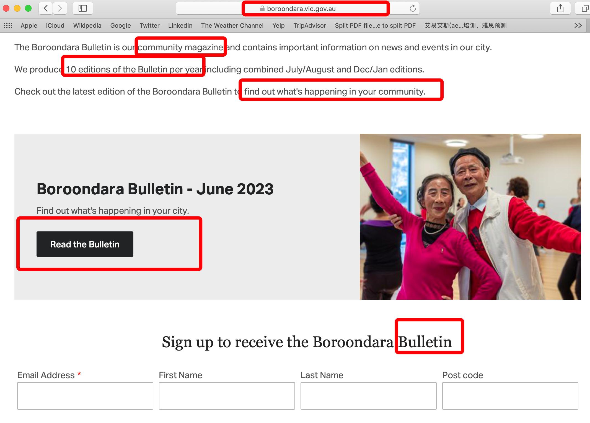

✨萤火之光·点亮远方✨
CCL 咨询请找小助手
431
431
13. I am sure it will be. The more people know, the more customers you are likely to
have.
(我相信是值得的。越多的人知道你的餐厅，你就可能有越多的顾客。)
14.谢谢你，西蒙。能有一个让商贩得到建议和信息的开放日，真是太棒了。(Thank you,
Simon. It’s so great to have this open day where retailers could get advice and
information.)
— End of Dialogue —
\n

\n✨萤火之光·点亮远方✨
CCL 咨询请找小助手
432
432
#70135. Bicycle safety introduction- Education
Briefing: The following dialogue takes place between an English-speaking city council
officer and a Mandarin-speaking staff from a community center. The dialogue starts
now.
1.
Good morning. How can I help you?
(早上好，我可以如何帮到您呢？)
2.
早上好。我今天早上在市政厅的新闻简报上看到了一篇广告，宣传自行车安全介绍
会。
(Good morning. I saw this morning on the City Council news bulletin that there was an
ad promoting a bike safety introduction.)
【萤火虫老师Tips】

Bulletin: a printed report that gives news about an organization or a group (机构或组
织的)简报
3.
Yes, the council officer will do it every two weeks. I am happy to answer any
questions.
\n

\n✨萤火之光·点亮远方✨
CCL 咨询请找小助手
433
433
(对。市政厅的工作人员每两周会举办一次。我很乐意回答任何问题。)
4.
我在社区中心工作，我给孩子们安排假期活动。你们能派人来在学校假期的时候给
孩子们做下自行车安全介绍会吗？
(I work in the community center and I arrange holiday activities for kids. Could you send
someone to do the bike safety introduction for kids during school holidays?)
5.
Of course. We have done such activities for lots of organizations, such as sports
clubs and schools.
(当然可以了。我们帮很多组织都做过类似的活动，比如体育俱乐部和学校。)
6.
那太好了。最好还能有些活动，帮助孩子们定期给自行车做保养。
(That’s great. It would be great if there are some activities to help these kids (to) maintain
their bikes regularly.)
【萤火虫老师Tips】

根据考生反馈，本段“完全记不得了”。所以编了一句可以承接下一段“these
activities”的句子。
7.
I suggest we should hold these activities several days before the event to check if
there is anything wrong with the bikes in case they need to be repaired.
(我建议我们在活动前几天举办这些活动，检查自行车有没有问题，以便自行车万一
需要维修。)
8.
这很棒。我们之前没有检查过孩子们的自行车，所以有些自行车可能需要检查一下，
看下会不会有什么问题。
(This is great. We haven’t checked the kids’ bikes before, so some bikes may need to be
checked to see if there are any problems.)
9.
Our council officer will check the tires, brakes, and chains, and adjust the seats to
proper positions and check if there are any other issues.
\n

\n✨萤火之光·点亮远方✨
CCL 咨询请找小助手
434
434
(我们市政厅的工作人员会检查轮胎，刹车和车链，还会把座椅调整到合适的位置，
再看看还有什么其他问题。)
10. 太好了，我们有些孩子还很小，我担心他们不知要修理什么。
(That’s great. Some of our kids are still young and I worry that they may not know what
to fix.)
11. There will be a bicycle safety checklist identifying the problems to be fixed and I’ll
send the checklist to their parents.
(会有一张自行车安全检查表来帮助找出需要修理的问题。我会把检查表发给家长们
的。)
12. 太好了，我想孩子们一定会喜欢自行车安全介绍会的，请问我们什么时候举办这个
自行车安全介绍会呢？
(That’s great. I think the kids will definitely like the bike safety introduction. May I ask
when we’ll hold this bike safety introduction?)
13.
Well, you could give me a call after you confirm the date, if you want.
(如果你想的话, 你可以确定日期以后给我打电话。)
14. 我需要确定下日子，另外我需要和家长们说一下，然后给你打电话，谢谢.
(I need to confirm the date. Besides, I will need to talk with the parents, and then I’ll give
you a call. Thanks.)
— End of Dialogue —
\n

\n✨萤火之光·点亮远方✨
CCL 咨询请找小助手
435
435
#70136. Car theft- Legal
Briefing: The following dialogue takes place between a Mandarin-speaking driver and
an English-speaking staff. The dialogue starts now.
1.
Hi. I didn’t expect to see you again today. I hope everything is fine.
(你好。我没想到今天还能再见到你。希望你一切都还好。)
2.
一点也不好，我车被偷了，我没想到会发生这种事情。
(It’s not fine at all. My car was/got stolen. I didn’t expect this to happen.)
3.
Now the best thing you can do is to report to the police, and then give the report
number to the insurance company. I hope you purchased insurance.
(现在最好的办法就是报警。然后把报警的编号给保险公司。我希望你有买保险。)
4.
是的我买保险了，昨天我才交的月费。我一定得去警察局吗?
(Yes, I purchased insurance. I just paid the monthly fee yesterday. Do I have to go to the
police station?)
5.
Not necessarily. You could give them a call. You can find the number online. (不用
非得去的。你可以打电话给他们。网上可以找到号码)。
6.
好的，我没想到还能发生这种事。等我从商场出来，准备找车，来到我停车的地方，
我的车不见了。
(Okay. I didn’t expect this to happen. After I came out of the shopping mall, I was going
to find my car. I came to where I parked the car and it was missing.)
7.
Are you sure your car is stolen instead of being parked on another floor of the
carpark?
(你确定你的车是被偷了，不是停在停车场的其他楼层了吗？)
\n

\n✨萤火之光·点亮远方✨
CCL 咨询请找小助手
436
436
8.
我也本来觉得是我停在别的楼层了，但是我坐电梯把每一层都看了，我的车确实不
见了。
(I initially thought I might have parked it on another floor. But I took the elevator and
checked every floor. My car was really missing.)
9.
In that case, you could only report to the police. You could give them a call first and
then contact your insurance company.
(既然是这样的话，你只能报警了。你可以先给警察打电话，然后跟你的保险公司联
系。)
10. 谢谢你的帮忙。我先在网上找下警察局的电话号码，然后给他们打电话，之后我再
联系保险公司。
(Thank you for your help. I’ll first look up the number of the police station online and
then give them a call. After that, I’ll contact the insurance company. )
— End of Dialogue —
\n

\n✨萤火之光·点亮远方✨
CCL 咨询请找小助手
437
437
#70137. A Coffee Morning – Education
Briefing: The following dialogue takes place between a parent whose child has just been
enrolled in a new school and Matt, the child’s teacher. Matt is going to talk to this
parent about the next coffee morning for new parents. The dialogue starts now.
1.
Hi there! I am Matt, you child’s new teacher. I’m happy to see you.
(你好，我是马特，你孩子的新老师。很高兴见到你。)
2.
你好马特，很高兴见到你。对不起，我迟到了。因为我还不熟悉学校的道路。
(Hello, Matt. I’m happy to see you. I’m sorry for being late, because I’m still not familiar
with the school road.)
3.
Yes. This is a big school, and we have different buildings and rooms. Everything is
new to you. But I’m sure it will be easier as the week goes on.
(是啊。这学校很大。我们的楼和房间都不一样。一切对您来说都是新的。不过我相
信，随着一周一周过去，会容易一些的。)
4.
我觉得我儿子比我更容易适应。
(I think my son is more adaptable than me.)
5.
Children do adjust things quickly. Your son seems to settle in well and enjoy his new
class.
(孩子确实适应东西快。你的儿子看上去适应得很好，很喜欢他的新班级。)
【萤火虫老师Tips】

If you settle in, you become used to living in a new place, doing a new job, or going
to a new school. 适应下来
例句：I enjoyed school enormously once I'd settled in. 一旦适应了，我就非常喜欢
上学了。
\n

\n✨萤火之光·点亮远方✨
CCL 咨询请找小助手
438
438
6.
听您这么说我感到很开心。他曾经觉得来上学，他会很紧张。现在他交了很多朋友。
但是我发现我很难见到其他家长。
(I’m happy to hear that. He used to think he would be very nervous to go to school. Now
he has made many friends. But I find it hard to meet other parents.)
7.
I understand. This is actually what I am going to talk with you today. We will hold a
coffee morning next Tuesday for parents of children who were newly enrolled in
school.
(我理解。这其实也是我今天要跟你聊的内容。我们下周二要给孩子刚入学的家长们
开一个咖啡早茶会。)
8.
我确实看到那个通知了。但是我当时很忙，把这件事忘了。也许我应该参加，您认
为这是认识其他家长的好机会吗？
(I did see the notice. But I was very busy, and I forgot it. I should probably attend it. Do
you think it’s a good chance to meet other parents? )
9.
Yes, I do. All new parents will come. We hold the coffee morning every school year
and the parents seem to enjoy it very much.
(是的。我是这么想的。所有新来的家长都会来的。我们每个学年都开咖啡早茶会，
家长们看上去都非常喜欢这个活动。)
10. 那太好了。那我就把我的名字写下来了。我那天上晚班，有足够的时间出席。
(That’s great. Then I’ll write my name down. I have an evening shift that day and I would
have enough time to be there.)
11. Oh good! You will feel very welcomed. We will serve tea, coffee and delicious cakes
which are homemade by school committee members.
(噢，太好了！你会感觉到很受欢迎的。我们会提供茶，咖啡和校委会成员们自制的
美味蛋糕。)
12. 我很期待。我也喜欢在家烘焙食物，所以我可能可以在今后的活动中提供帮助。谢
\n

\n✨萤火之光·点亮远方✨
CCL 咨询请找小助手
439
439
谢您告诉我这个咖啡早茶会，马特。
(I’m looking forward to it. I also like to bake at home, so I probably could provide help in
the future events. Thank you for letting me know about this coffee morning, Matt.)
— End of Dialogue —
\n

\n✨萤火之光·点亮远方✨
CCL 咨询请找小助手
440
440
#70138. Dying Eucalyptus Trees - Social
Briefing: The following dialogue takes place between an English-speaking council
worker and a Mandarin-speaking local resident who is going to report some trees dying
in the local area. The dialogue starts now.
1.
Hi. Thank you for calling the city council. How can I help you today?
(您好。欢迎致电市政厅。我今天能如何帮到您呢？)
2.
早上好，我打电话来是因为我看见我住的街区有一些树好像要死了。
(Good morning. I'm calling because I've seen some trees are probably dying in my
neighborhood.)
【萤火虫老师Tips】

Neighborhood: 街区；城区。
例：a poor/quiet/residential neighborhood 贫困的街区；安静的城区；居民区
3.
Oh no! That is not good. I am happy you report it. We rely on the help of residents if
they see something and feel concerned.
(哦不！这可不太好。我很高兴你能来报告。如果居民看到了什么并且感觉担心，我
们是很依赖居民的帮助的。)
4.
这两个月我一直在担心这些树，我不想让这些树死。它们是很健康的，也很美丽。
(I have been worrying about these trees for the recent two months. I don’t want them
dead. They are very healthy and beautiful.)
5.
I would like to have more details from you if it is OK. Please tell me where these
trees are located and how many trees.
(如果可以的话，我想问问您更多的详细信息。请跟我说说这些树在哪里，还有一共
有多少棵树。)
\n

