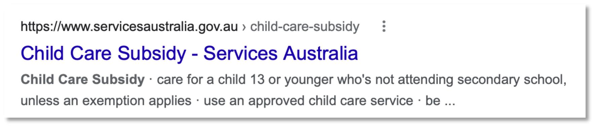
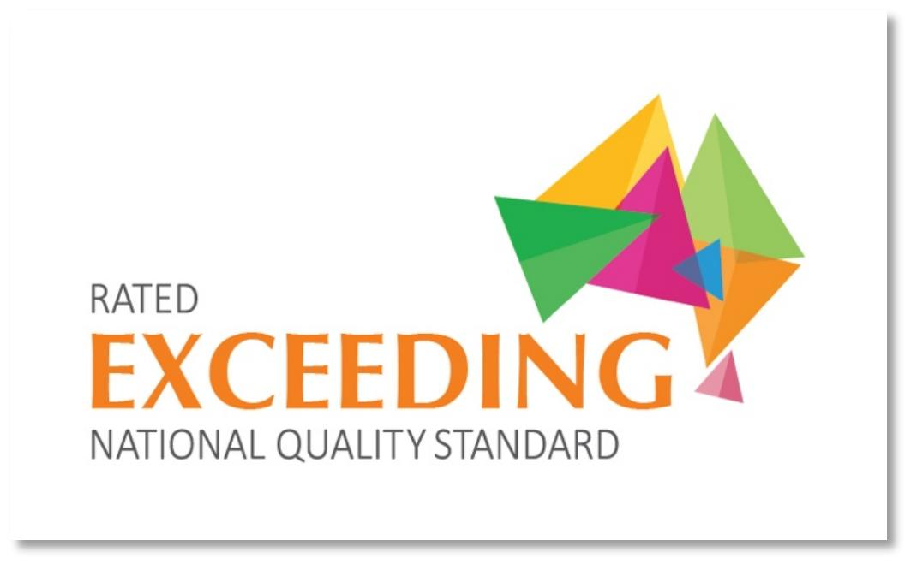
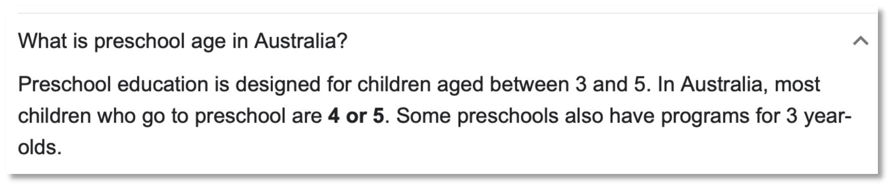
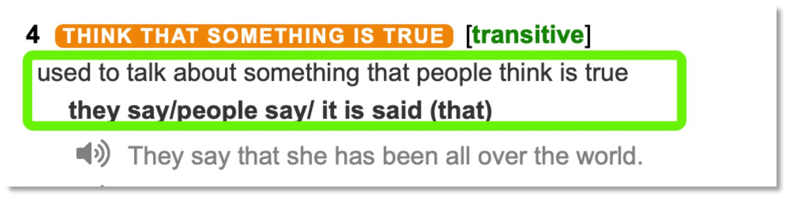

✨萤火之光·点亮远方✨
CCL 咨询请找小助手
41
41
5.
我联系过一些学前教育。但是如果我的女儿去他们那边，就拿不到政府的托儿补助
了。
(I have contacted some preschools. But we won’t get the government’s child care subsidy
if my daughter goes there.)
【萤火虫老师Tips】

6.
That’s correct. But they often charge half of our price, and we are both under the
National Quality Framework. So are family day care, occasional care and outside
school hours care services.
(没错。但是他们的价格通常是我们的一半，而且我们都是遵守国家质量标准的。家
庭日托，临时托管和校外时间托管服务也是一样。).
7.
尽管如此，我还是愿意在你们的中心排队等待。我的邻居们都对你们的服务赞不绝
口，说你们的早期儿童教育评级级别超过国家质量标准。收费也合理。
(Despite all these, I’m still willing to queue in your centre. All my neighbors can’t stop
telling how great your service is/ all my neighbors speak very highly of your service.
They said your early childhood education has the rating of “exceeding National Quality
Standard” and you have reasonable charges. )
\n

\n✨萤火之光·点亮远方✨
CCL 咨询请找小助手
42
42
【萤火虫老师Tips】

8.
Our intake usually takes place in late January when all the children start school. It’s
possible that some children ahead of you on the waitlist would cancel and then your
child will get a place.
(我们通常在一月末招生。那时候所有的孩子都上学了。也可能等候名单上排你们前
面的孩子取消了，那你的孩子就有空位了。)
9.
另外，我的小女儿上个月刚满一岁。是否她也要等两年呢？
(Besides, my younger daughter just turned one year old last month. Does she also have to
wait for two years?)
10. No. Our sibling priority policy can fast track your younger daughter’s enrollment
once your elder daughter is in our care.
(不用的。您大女儿一入园，我们的兄弟姐妹优先政策就能快速跟进您小女儿入园。)
11. 那太好了。那么，我们现在需要做什么准备吗？
(That’s great. Then... is there anything we could do now to prepare? )
12. If you fill out the enrolment form and pay a 50-dollar fee, I can put you on the
waiting list.
(如果您填好注册登记表并支付50 澳币的费用，我可以把您加到等候名单上。)
\n

\n✨萤火之光·点亮远方✨
CCL 咨询请找小助手
43
43
13. 好的。太谢谢您了。希望能很快等到空位。
(Okay. Thank you so much. I hope there’s a vacancy soon. )
— End of Dialogue —
\n

\n✨萤火之光·点亮远方✨
CCL 咨询请找小助手
44
44
#70010. Contributory Parent Visa - Immigration
Briefing：The following dialogue takes place between a mandarin speaking person and
an officer from the Department of Home Affairs regarding the Contributory Parent visa.
The dialogue starts now.
1.
Officer：Good afternoon, I’m John from the Department of Home Affairs. How can
I help you today?
(下午好，我是内政事务部的约翰。我今天能怎么帮助您呢？)
【萤火虫老师Tips】

Department of Home Affairs，简称DHA，之前的移民局又改名了，现在叫内政
事务部。(CCL 必考词汇)
2.
Men：你好, 我想咨询⼀下我父母移民澳洲签证的事情。请问他们需要满足什么资
格呢？
(Hello. I’d like to make an inquiry about my parents’ Australian immigration visa. What
are the eligibility requirements, if I may ask?)
【萤火虫老师Tips】

Be eligible to do sth; be eligible for sth:，有资格做某事，非常非常重要的表达，
比如be eligible for age pension 有资格领取养老金

Eligible 的名词：eligibility 同等重要。

要注意这两个词的发音
3.
Officer：No problem. Your parents need to take a health examination before lodging
the application. And they have to past the character test.
(没问题。您父母需要在提交申请之前先做体检。他们还需要通过品格测试。)
4.
Men：我父母在国内每年都做体检，都没有什么问题。我父亲以前是个工程师, 我
母亲是教师，都退休了。提供品格证明也不会有问题的。
\n

\n✨萤火之光·点亮远方✨
CCL 咨询请找小助手
45
45
(My parents have a physical examination every year in their home country and
everything’s okay. My father used to be an engineer and my mother used to be a teacher.
They have all retired. It won’t be a problem with the character test.)
【萤火虫老师Tips】

A problem with something 一般固定搭配的介词用with 哈problem with sth 在某
方面有问题
5.
Officer：That’s great. They may be eligible for a temporary contributory parent visa,
under the premise that they have an eligible Australian citizen, permanent resident
or eligible New Zealand citizen to sponsor them.
(那很好。他们可能有资格申请临时付费类父母移民签证，前提是他们有符合资格的
澳大利亚公民，永久居民或者是符合资格的新西兰公民来担保他们。)
【萤火虫老师Tips】


6.
Men：这没问题，我是澳大利亚永久居民，我会担保我爸妈的。我来澳大利亚已经
五年啦。还没想好要不要转成公民。
(That won’t be a problem. I’m a permanent resident of Australia and I’ll sponsor my
parents. I have been in Australia for 5 years and I haven’t decided whether to become a
citizen or not.)
\n

\n✨萤火之光·点亮远方✨
CCL 咨询请找小助手
46
46
7.
Officer ：That’s good to hear. And your parents also need to meet the
balance-of-family test, which means at least half of their children need to live
permanently in Australia than in any other countrys.
(那听起来挺好的。你的父母还需要满足家庭成员均衡测试，也就是说他们需要至少
有一半的子女永久居住在澳大利亚，而不是其他国家。)
【萤火虫老师Tips】


8.
Men：这一条应该也没问题。我有一个弟弟在加拿大，我和两个单身的妹妹都住在
澳大利亚。所以我父母想来澳大利亚，跟他们大部分的孩子和孙子团聚。
(That won’t be a problem either. I have a younger brother in Canada. My two single
sisters and I are living in Australia. So, my parents want to come to Australia to get
together with most of their children and grandchildren.)
\n

\n✨萤火之光·点亮远方✨
CCL 咨询请找小助手
47
47
9.
Officer：That’s great. Apart from that, they must obtain an assurance of support,
which can assure us that they will not have to rely on government assistance after
they enter Australia on this visa. We will let you know when you need to provide it.
(那很棒。除此之外，他们必须获得一个经济担保，这个可以向我们确保在他们持付
费类父母移民签证入境澳大利亚以后，他们不需要依赖政府帮助。当你需要提供经
济担保时我们会告诉你的。)
【萤火虫老师Tips】

10. Men：没问题。我父母有50 万存款，我也愿意给他们提供经济担保。他们也不想依
赖澳大利亚社会福利和政府公共医疗。
(No problem. My parents have a saving of 500,000 dollars in savings and I’m willing to
provide them with an assurance of support. They don’t want to rely on Australian social
welfare system or the government’s public medical service either.)
11. Officer：They should be eligible to apply for this visa, though they may need to wait.
Because there is an annual limit of quota in this category.
(他们应该是有资格申请这个签证的，虽然说他们可能要等待一下，因为这个类别的
签证每年都有配额限制。)
12. Men：没问题，我回去跟我父母说一下。非常感谢您今天的帮助。
\n

\n✨萤火之光·点亮远方✨
CCL 咨询请找小助手
48
48
(No problem. I’ll let my parents know when I’m home. Thank you very much for your
help today.)
— End of Dialogue —
\n

\n✨萤火之光·点亮远方✨
CCL 咨询请找小助手
49
49
#70011. Seafood Export - Business
Briefing: The following dialogue takes place between Mr. Smith, an Australian seafood
exporter, and Mr. Chen, a Chinese seafood importer. Mr. Chen wants to order seafood
from Australia. The dialogue starts now.
1.
Mr. Smith：Hello, Mr. Chen. I heard that you are here to talk about the policies
regarding our seafood export.
(您好，陈先生。我听说您是来就我们的海鲜出口政策进行洽谈的。)
2.
Mr. Chen：你好，史密斯先生。你们公司是全澳洲最大的海鲜产品供应商，尤其是
贝类产品。我听说你们质量最好的产品是龙虾和生蚝。
(Hello, Mr. Smith. Your company is the largest seafood provider in Australia, especially
for shellfish. I heard your best products are lobster and oyster.)
3.
Mr. Smith：Mr Chen, you are spot on. We have the highest quality lobsters that are
from Southeast Australia, and our oysters are from Tasmania.
(您说的太对了。我们的龙虾源自澳大利亚东南区，质量最高；我们的生蚝源自塔斯
马尼亚。)
【萤火虫老师Tips】

If you say that someone is spot-on, 说对了，说到点子上.
4.
Mr. Chen：我们公司准备进口一些龙虾和生蚝。我们公司以前的海鲜都是从日本和
南韩进口的，所以成本比较低。如果我们要从澳洲进口的话，运输成本会上升。
(Our company wants to import some lobsters and oysters. We used to import from Japan
and South Korea, so the cost was low. The cost of transportation will rise if we import
from Australia.)
\n

\n✨萤火之光·点亮远方✨
CCL 咨询请找小助手
50
50
5.
Mr. Smith：It is true, but we can adjust our prices to be competitive.
(是这样的。但是我们可以把我们的价格调整得非常有竞争力。)
6.
Mr. Chen：好的，那你们龙虾的价格是多少呢？
(Okay. What’s the price of your lobster?)
7.
Mr. Smith：During off-peak season, the lobsters are $65 per kilogram. During peak
season, the amount of production is as twice as the amount in the off-peak season. So
the price is $45 per kilogram.
(在淡季的时候，龙虾的价格是每千克65 澳币。在旺季的时候产量是淡季的两倍，
所以价格会是每千克45 澳币。)
【萤火虫老师Tips】

Peak season 旺季

Off-peak season 淡季

Shoulder season 平季(不旺不淡，平平无奇)
8.
Mr. Chen：这个价位我们是可以接受的。我们想要3.5 吨的龙虾和1.7 吨的生蚝。
你们可以稳定供货吗？
(We’re okay with that price. We want 3.5 tons of lobsters and 1.7 tons of oysters. Could
you stabilize your supply?)
9.
Mr. Smith：Yes, we can, provided that there is notice in advance and there are no
unexpected situations. Once the contract of sale is signed, the price will not fluctuate.
Do you want to sign the contract today?
(如果能提前通知我们，并且没有意外发生，我们是可以稳定供货的。一旦签了销售
合同，价格就不会浮动了。您想今天签合同吗？)
\n

