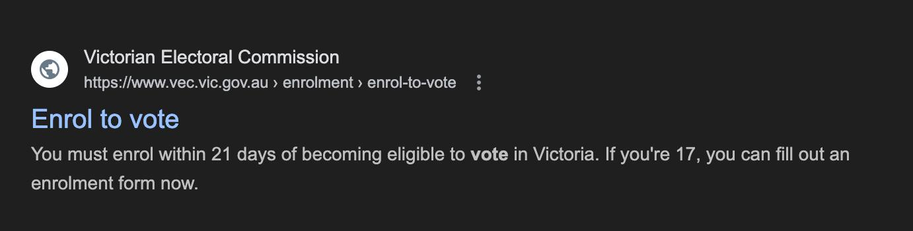

✨萤火之光·点亮远方✨
CCL 咨询请找小助手
531
531
#70169. Bedroom Furniture Payment Plan – Business
Briefing ：The following dialogue takes place between a customer and Ian, an
English-speaking sales agent at a furniture store. They are discussing how to plan for
the customer’s bedroom furniture. The dialogue starts now.
1.
Good afternoon, I’m Ian. Let me know if I can help you with anything in the store.
（下午好，我是伊恩。您在店里需要任何帮助，随时跟我说。）
2.
你好，伊恩，请帮帮我，我想买一个双人床，一个衣柜，还有两个床头柜。
(Hello, Ian, I need your help. I want to buy a double bed, a wardrobe, and two bedside
tables.)
3.
Yes, we have a lot of different bedroom furniture. I’m sure you’ll find the size that
suits you.
（好的，我们有很多不同的卧室家具。我相信您会找到适合您尺寸的。）
4.
我很喜欢这个深色木质家具，但它要2000 澳元，而我银行账户上没有那么多钱。
(I really like this dark wood furniture, but it costs $2000, and I don’t have that much in
my bank account.)
5.
You can pay by credit card. We also have a payment plan. To qualify, you need to
earn more than 5,000 dollars a year and work full-time.
（您可以使用信用卡付款。我们也有分期付款方案。要符合条件，您的年收入需超
过5000 澳元，且需全职工作。）
6.
我没有信用卡，但是我确实是全职工作。我想更多地了解一下付款计划的信息。
(I don’t have a credit card, but I am working full-time. I’d like to learn more about the
payment plan.)
\n

\n✨萤火之光·点亮远方✨
CCL 咨询请找小助手
532
532
7.
You need to pay 84 dollars each month. You have two years to pay back the 2,000
dollars.
（您每月需要支付84 澳元，您有两年的时间来偿还这2000 澳元。）
8.
这个付款方式有额外的费用或者利息吗？如果我用这个付款计划的话，会不会付得
更多？
(Are there any extra fees or interest with this payment method? Would I end up paying
more if I use this payment plan?)
9.
You need to pay a 90-dollar application fee for this plan. There won’t be any
additional charges if you repay the loan within two years.
（您需要支付90 澳元的申请费用。如果您在两年内还清贷款，则不会有额外的费用。）
10. 那我应该可以在两年之内还完。不过，如果我确实需要额外的时间来还款的话，会
怎么样呢？
(Then I should be able to repay it within two years. But what if I do need extra time to
pay it off?)
11. After two years, we will charge you 10 present interest if you need more time to
repay. If you’d like to apply for the plan, I can help you now.
（两年之后，如果您需要更多时间来还款，我们将收取10%的利息。如果您想申请
这个方案，我现在可以帮您。）
12. 没问题，我想现在申请。我觉得这个付款计划很适合我，我真的很期待能买这套卧
室家具。
(No problem, I’d like to apply now. I think this payment plan is perfect for me, and I’m
really looking forward to getting this bedroom furniture set.)
— End of Dialogue —
\n

\n✨萤火之光·点亮远方✨
CCL 咨询请找小助手
533
533
#70170. Home-based Bakery Business – Business
Briefing：This is a phone conversation between Christine, an English-speaking council
worker, and a Chinese speaker who wants to start a food business from home and is
looking for information regarding the council regulations for it. The dialogue starts now.
1.
Good afternoon, this is Christine. How can I help you today?
（下午好，我是克莉丝汀。今天有什么我可以帮您的吗？）
2.
你好，克莉丝汀。我想在家里开一个食品生意，我想要了解，市政厅在这方面有什
么规定。
(Hi, Christine. I want to start a food business from home, and I'd like to understand the
council regulations for it.)
【萤火虫老师Tips】

"Start a food business at home" 和"start a food business from home" 都可以，但
"from home" 更能强调地点是“从家里”（即以家为经营场所）, 而非仅仅指在家
开业，所以在这里更合适。
3.
Sounds exciting! I can give you some general information. Can you tell me what type
of food you’re planning to sell?
（听起来很棒！我可以给您一些基本信息。您打算卖哪类食品呢？）
4.
我想做一些蛋糕和饼干，并通过网上商店和实体店来卖它们。
(I want to make cakes and cookies and sell them through an online store and a local
shop.)
5.
Ok. Firstly, the council requires you to have a permit to sell food.
（好的。首先，市政要求您持有销售食品的许可。）
\n

\n✨萤火之光·点亮远方✨
CCL 咨询请找小助手
534
534
6.
我不确定需要提供什么信息给市政厅，您能给我解释一下吗？
(I’m not sure what information I need to provide to the council. Could you explain?)
7.
You need to include details of your products and the ingredients you’re going to use.
You’ll also need a permit to prepare them.
（您需要提供您产品的详细信息以及所用的原料。此外，您需要一个许可证来制作
它们。）
8.
我会的，我会在家里的厨房里备料和烘焙。我还知道会有检查。
(I will. I’ll be doing the preparation and baking in my home kitchen. I also understand
there will be an inspection.)
9.
Yes, that's right. A council officer will come to inspect your kitchen to ensure it
meets food business standards.
（是的，您说得对。市政工作人员会到您家里检查厨房，以确保符合食品经营的标
准。）
10. 好的，厨房里有足够的空间来备料，我也会保持厨房的整洁，希望我能够达到许可
的标准。
(Alright, my kitchen has enough space for preparation, and I’ll keep it clean. I hope I can
meet the permit requirements.)
11. You’ll also need proper storage. I’ll send you an information pack that explains
exactly what you need to do to get a permit.
（您还需要有适当的储存空间。我会寄给您一份信息包，里面会详细说明如何获得
许可证。）
12. 谢谢，我确实需要详细的信息。我以前从来没有开过食品生意。
(Thank you. I do need detailed information. I’ve never run a food business before.)
\n

\n✨萤火之光·点亮远方✨
CCL 咨询请找小助手
535
535
13. Info packs are designed to help newcomers. They’re easy to follow and simple to
read.
（信息包是为新手准备的，很容易理解和阅读。）
14. 太好了，我收到以后一定会好好阅读的。如果我有其他问题的话，再给您打电话。
(Great, I’ll go over it carefully once I receive it. I’ll call you if I have more questions.)
— End of Dialogue —
\n

\n✨萤火之光·点亮远方✨
CCL 咨询请找小助手
536
536
#70171. Enrol to Vote – Legal
Briefing：This is a conversation between an English speaker working at a community
center and a resident who wants to enroll to vote in Australia. They are having this
conversation at the community center. The dialogue starts now.
1.
Good morning, welcome. I believe you’re here for some information about voting in
Australia.
（早上好，欢迎。我想您是来了解澳大利亚的投票信息的吧。）
2.
可不是嘛。我知道全国大选没多久了，我想知道我能不能投票。
(Exactly. I know the national election is coming up soon, and I’d like to know if I’m
eligible to vote.)
3.
You can enroll to vote if you’re a citizen and over 18 years old.
（如果您是公民，并且年满18 岁，就可以登记投票。）
【萤火虫老师Tips】

在关于选民登记的对话中，"enrol" 和"register" 这两个词在澳大利亚的语境下
在用法上有些区别：
"Enrol" 主要指:将个人信息添加到选民登记册中，通常在澳大利亚的选举过程
中使用。
"Register" 一般用于指登记过程本身，或更广泛用于各种类型的注册（例如，注
\n

\n✨萤火之光·点亮远方✨
CCL 咨询请找小助手
537
537
册参加选举、注册为某个服务、注册公司等）。
在澳大利亚的选民登记中，"enrol" 更常见，尤其在政府和官方选举文件中。
"Register" 通常出现在国际或较为正式的场合，或者在某些国家的选举系统中。

翻译：
"Enrol" 可以翻译为"登记" 或"注册"（更常见于澳大利亚选民登记）。
"Register" 也可以翻译为"注册"，但更常用于一般的注册。
4.
我当然不止18 岁了，我去年6 月份成为了澳大利亚公民，我还有护照。
(I’m definitely over 18! I became an Australian citizen last June, and I have my passport.)
5.
Great. You must also have lived at your current address for more than one month in
order to vote.
（很好。您还需要在现住址居住超过一个月，才可以投票。）
6.
当然，我在这里住了3 年了。我还不太明白怎么注册，你能解释一下吗？
(Of course, I’ve lived here for three years. I’m still not clear on how to enroll—could you
explain?)
7.
Before you can vote, you have to include your name on the roll. You can enroll
online using your passport as proof of identity.
（在投票之前，您需要把名字加入选民名单。您可以通过护照在网上登记/注册，作
为身份证明。）
8.
听起来这是最容易的办法。我还想了解其他注册方法，有时候因为我住的地方的网
络问题，我没办法上网。
(That sounds like the easiest way. I’d like to know about other methods to enrol/ other
enrolment methods. Sometimes, the internet where I live has issues, so I can’t get online.)
\n

\n✨萤火之光·点亮远方✨
CCL 咨询请找小助手
538
538
9.
You can print the enrollment form from the election website, and then mail or email
it to the election office. Or you can visit the election office and enrol in person.
（您可以从选举网站打印注册表，然后邮寄或电邮给选举办公室。您也可以亲自到
选举办公室注册。）
10. 谢谢，现在我有更多选择了。我会尽早注册，我不想错过投票，离大选已经没几个
月了。
(Thank you, I have more options now. I’ll enrol as soon as possible. I don’t want to miss
voting, and the election is only a few months away.)
11. By law, Australian citizens must vote, or you’ll be fined if you don’t. You’re doing
the right thing by enrolling early.
（根据法律，澳大利亚公民必须投票，否则会被罚款。您现在注册是个正确的选择。）
12. 我之前不知道，投票让我很兴奋。我会去查看网站并且注册，谢谢你的帮助，和你
交谈很高兴。
(I didn’t know that before. I’m excited to vote! I’ll check the website and enroll. Thanks
for your help; it’s been nice talking with you.)
— End of Dialogue —
\n

\n✨萤火之光·点亮远方✨
CCL 咨询请找小助手
539
539
#70172. Looking for a Foster Pet – Social
Briefing ：This dialogue takes place between a Mandarin-speaking visitor and an
English-speaking staff member at an animal shelter. The visitor is interested in
temporarily fostering a pet. The dialogue starts now. The dialogue starts now.
1.
Good morning! Welcome to the animal shelter. Let me know how I can help you
today.
（早上好！欢迎来到动物收容所。我今天能怎么帮助你呢？）
2.
你好，我经常从这里路过。我看到你们门上贴了关于小猫和小狗的领养海报。
(Hi! I walk past here quite often. I saw some adoption posters for kittens and puppies on
your door.)
3.
I can introduce you to our adoption options, whether you're interested in a dog, a
cat, or even a bird. We also have some rabbits at the moment.
（我可以给你介绍我们的领养选项，你可以选择狗、猫，甚至是鸟。我们现在还有
一些兔子哦。）
4.
我现在还不能正式领养宠物，但是我可以暂时照看动物。
(I can't officially adopt a pet right now, but I can foster animals temporarily.)
【萤火虫老师Tips】

这里的foster 指的是“暂时照看、寄养”动物，非常地道，尤其适用于救助站或寄
养家庭的语境。Temporarily 强调“暂时”性质，但如果语境已经明确，可以省略。

foster 更专业，通常指救助站或寄养家庭照顾无家可归的动物，可能涉及更长时
间的临时寄养。

look after / take care of 偏向日常照顾，比如帮朋友照顾宠物几天，不强调“寄养”
概念。
\n

\n✨萤火之光·点亮远方✨
CCL 咨询请找小助手
540
540
5.
That’s also great! Temporary fostering helps us a lot. It’s also beneficial to the
animals, but we expect you to commit to it for at least one month.
（那也太棒了！临时寄养对我们帮助很大，对动物们也很有好处。但我们希望你至
少能照顾一个月。）
6.
我很乐意照顾动物一个月。但是我不知道猫还是狗更适合我。
(I’d love to foster for a month. But I’m not sure whether a cat or a dog would be a better
fit for me.)
7.
Dogs and cats have different needs. It depends on your living situation and personal
preference.
（猫狗的需求不太一样，这主要取决于你的生活环境和个人喜好。）
8.
我和我的老父亲住在一起，我们都喜欢狗。不过，我的父亲拄着拐杖，我们不能照
顾太活泼的狗。
(I live with my elderly father, and we both love dogs. But my father uses a cane, so we
can’t handle a dog that’s too energetic.)
9.
Even though some well-behaved big dogs are great companions, they may not be
ideal for the elderly or those with mobility issues. A small dog might be a better
choice.
（尽管一些性格温顺的大狗很适合作伴，但它们可能不太适合老人或者行动不便的
人。一只小狗可能会更合适。）
10. 小狗更容易遛。我在你们的海报上看到了一只毛茸茸的小狗。
(Small dogs are easier to walk. I saw a fluffy little dog on your poster.)
11. Yes, I know which dog you're talking about. It's well-behaved and would be a good
fit for you and your father.
（对，我知道你说的是哪只狗。它很乖，应该很适合你和你父亲。）
\n

