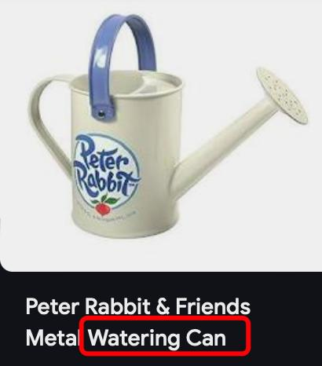
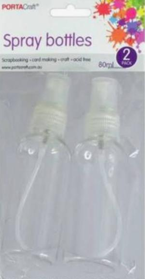

✨萤火之光·点亮远方✨
CCL 咨询请找小助手
541
541
12. 太棒了！我想领养它。我需要办理什么手续？虽然我不太了解具体流程，但我很开
心能做这件事。
(This is amazing! I want to adopt it. What paperwork do I need to complete? I’m not too
familiar with the process, but I’m really happy to do this.)
13. You need to fill out an application form first. Once that’s done, we will conduct a
home visit to ensure your living environment is suitable for a dog.
（你需要先填写一份申请表。填好后，我们会进行一次家访，来确保你的居住环境
是适合养狗的。）
14. 我明白了，没问题。我可以现在就填表格！我很期待和父亲一起照顾这个小家伙。
(Got it, no problem! I can fill out the form right now. I’m really looking forward to taking
care of this little one with my father.)
— End of Dialogue —
\n

\n✨萤火之光·点亮远方✨
CCL 咨询请找小助手
542
542
#70173. Water Restrictions in Australia– Social+Legal
Briefing：This dialogue takes place between a newly arrived resident in Australia and a
representative from a local water authority. The resident is unfamiliar with local water
restrictions and wants to clarify the rules. The dialogue starts now.
1.
Good morning, thank you for your call. How can I help you today?
（早上好，感谢您的来电。我能帮您什么忙吗？）
2.
我刚搬到这里，我有些关于用水限制的问题。
(I just moved here, and I have some questions about water restrictions.)
3.
I’d be happy to help. Right now, we’re at Level Two water restrictions.
（我很乐意帮忙。目前我们处于二级水限制。）
【萤火虫老师Tips】
在澳大利亚，用水限制（water restrictions）通常分为多个等级，以应对不同程度的
干旱和水资源短缺。这些等级的数量和具体规定可能因地区而异。例如，在新南威
尔士州，曾实施过四级限水令，其中：

一级、二级、三级限制：主要限制某些用水方式和时间。

四级限制：更为严格，例如禁止任何形式的草坪浇水。
此外，悉尼曾在2019 年提高至二级限水令，这意味着人们只能用桶（考过！叫bucket）
或喷壶（watering can）给花园浇水，不能使用自动洒水器(sprinkler)。
4.
我刚来到澳大利亚，不熟悉用水限制。我邻居说这跟降雨量不足有关。
(I just came to Australia, and I’m not familiar with the water restrictions. My neighbor
said it has something to do with low rainfall.)
\n

\n✨萤火之光·点亮远方✨
CCL 咨询请找小助手
543
543
5.
Yes, that’s right. Because of low rainfall, we need to conserve water. That means
there are certain rules about how and when you can use it at home.
（没错，因为降雨量不足，我们需要节约用水。这意味着家里用水会有一些规则，
关于怎么用水和什么时候用水。）
6.
我明白了。那很有道理。在我的国家，我们有季风，干旱，洪水。这些甚至比降水
量少更严重，我知道在澳大利亚的情况不一样。
(I see. That makes a lot of sense. In my country, we have monsoons, droughts, and floods.
Those are even worse than low rainfall. I know the situation is different in Australia.)
【萤火虫老师Tips】

"Seasonal wind" 确实可以用来描述季风，但相比"monsoon"，它更偏向书面或学
术表达，在日常口语中不太常用。

在天气和气候的讨论中，"monsoon" /ˌmɑːnˈsuːn/ 是更自然、更准确的说法，尤
其是指典型的亚洲或澳大利亚的雨季和风向变化。
7.
Exactly. When we don’t get enough rain, the water levels in the reservoirs behind
dams drop, which affects our drinking water supply. This is a problem.
（没错。如果降雨不足，大坝后的水库水位就会下降，这会影响我们的饮用水供应。
这是个问题。）
【萤火虫老师Tips】

Dam（水坝）/dæm/ 是一种人工建筑，主要是拦截水流，控制水位或发电。它
本身不是存水的地方，而是阻挡水的结构。

Reservoir（水库）/ˈrezəvwɑː(r)/ 是被大坝拦截后形成的蓄水区域，用于储存饮
用水、灌溉或发电。
8.
但是，在天气很热很干的时候，我的草坪和花园都会被影响到。我可以给它们浇水
吗？
(But when it’s really hot and dry, my lawn and garden get affected. Am I allowed to
water them?)
\n

\n✨萤火之光·点亮远方✨
CCL 咨询请找小助手
544
544
9.
Yes, you can, but only with a watering can. And you should do it before 10 AM or
after 4 PM—just not in the middle of the day.
（是的，您可以，但只能用浇水壶。而且您应该在早上10 点之前或下午4 点之后浇
水，不要在中午时分。）
10. 好的，我会照你说的做的。我会去园艺中心买个喷壶。我想我们只能希望早点下雨。
(Got it! I’ll follow the rules. I’ll go to a gardening center to buy a watering can. I guess
we can only hope for some rain soon.)
【萤火虫老师Tips】

"a watering can" 指的是“喷壶/浇水壶/洒水壶”，通常带长嘴，用来给植物浇
水的。它和"a spray bottle"(喷瓶)不一样，watering can 倾倒水流，而spray bottle
喷出细雾状的水。
11. If you need more information about water restrictions, you can check the council's
website. There’s a page with all the details.
\n

\n✨萤火之光·点亮远方✨
CCL 咨询请找小助手
545
545
（如果您需要更多关于用水限制的信息，可以查阅市政网站。网站上有一页详细介
绍所有内容。）
12. 听起来很不错。我会去网站上看看的。我不想因为不熟悉规定而做错事情。
(That sounds great. I’ll check out the website. I don’t want to make any mistakes because
I’m not familiar with the rules.)
13. Restrictions will change as well. You can sign up for notifications on the website, so
you’ll always be updated. This would help you.
（限制也会发生变化。您可以在网站上注册接收通知，这样您就能随时获得更新。
这会帮助您。）
14. 这是个好主意。谢谢你今天的帮助。我现在就去网站上看看。
(That’s a good idea. Thanks for your help today. I’ll go check out the website now.)
— End of Dialogue —
\n

\n✨萤火之光·点亮远方✨
CCL 咨询请找小助手
546
546
#70174. Getting a Quote for Boat Insurance – Business
Briefing ：This dialogue takes place between a Mandarin-speaking customer and an
English-speaking insurance company clerk. They are discussing additional insurance
options, particularly for a boat. The dialogue starts now.
1. Good morning! Thank you for calling SafeShield Insurance. This is the customer
support line. How can I assist you today?
（早上好！感谢致电安盾保险。这里是客户帮助热线。我今天能如何帮您？）
2. 你好，我是你们的老顾客了。我想了解一下购买额外险的信息。
(Hi, I’ve been a long-time customer of yours/I’ve been with your insurance company for a
long time. I’d like to learn about taking out/getting additional/extra/add-on insurance.)
3. Of course! We really appreciate our loyal customers. Could you tell me what you
need, so I can help you in the best way possible?
（当然！我们非常感谢我们的老顾客/我们的忠实客户/一直支持我们的客户。您可以
告诉我您的需求吗？这样我可以为您提供最合适的帮助。）
4. 我正在考虑买船，但是我觉得在买之前，我应该了解一下为船投保需要花多少钱。
(I’m thinking about buying a boat, but before I do, I’d like to get an idea of how much
boat insurance would cost.)
5. That sounds exciting! It’s definitely a smart move to check insurance costs before
making such a big purchase.
（听起来很棒！在这样一笔大开销之前，先了解保险费用绝对是个聪明的决定。）
6. 是的，我还想给我的车买一个拖车，我想确保我能承担得起所有的开销。
(Yes, I’m also planning to get a trailer for my car. I just want to make sure I can afford all
the expenses.)
\n

\n✨萤火之光·点亮远方✨
CCL 咨询请找小助手
547
547
7. That makes sense! It’s important to have everything properly insured in case of an
accident. What type of boat are you considering?
（很有道理！确保所有东西都投保好，以防发生意外是很重要的。您打算买哪种船
呢？）
【萤火虫老师Tips】

省流版总结：口语：boat（最自然），yacht（豪华游艇）
书面或正式场合：vessel（如保险合同、法律文件）

字多版：vessel 是一个更广义的术语，指任何可在水上航行的交通工具，包括
小船、游艇、轮船、货船甚至潜水艇。这个词在正式或法律语境中更常见，比
如保险条款、航运法规、海关申报等。

boat 指的是较小的船只，通常是私人使用的，如小艇、渔船、摩托艇等。口语
中，人们更常说boat 来指个人拥有的船。
在本机经中，客户想买的是私人游艇，所以boat 或yacht（游艇）更自然。如果是
正式保险文件，通常用vessel。
8. 我正考虑买一个带船舱的游艇。我的孩子们都很喜欢水上运动，一直要我买船。
(I’m thinking about getting a yacht with a cabin. My kids love water sports and have been
asking me to get a boat.)
9. That sounds like a fantastic way to enjoy quality time with your family. Motoring on
water is really popular, and a yacht would be great for that!
（这听起来是个和家人共享美好时光的很棒的方式。水上驾驶很受欢迎，游艇确实
是个不错的选择！）
10. 是的，我想和孩子们一起出去野餐，享受在夏天游泳的乐趣。
(Yes! I’d love to take them out for picnics and enjoy swimming in summer.)
\n

\n✨萤火之光·点亮远方✨
CCL 咨询请找小助手
548
548
11. We offer a range of insurance policies for different types and sizes of boats. Plus, we
have discounts for customers who already have policies with us.
（我们提供针对不同类型和尺寸船只的各种保险保单。此外，对于已经在我们公司
投保的客户，还有折扣优惠。）
12. 是的，我也有买你们的其他保险。我的汽车和房屋保险都是在你们公司买的，所以
我才给你打电话问报价。
(Yes, I also have other policies/insurance with you. My car and home insurance are both
with your company/ My car and home are both covered by you. This is why I called you
to ask for a quote.)
13. That’s great! If you can provide me with more details about your boat, I can connect
you with an agent to get a quote.
（太好了！如果您能提供更多关于船的详细信息，我可以帮您联系代理，问问/看看
报价。）
14. 是的，我准备了详细的信息，而且我现在有时间。太好了，非常感谢你。
(Yes, I’ve got all the details ready, and I have time now. That’s perfect—thank you so
much!)
— End of Dialogue —
\n

\n✨萤火之光·点亮远方✨
CCL 咨询请找小助手
549
549
#70175. Drainage Concerns – Business
Briefing：This dialogue takes place between a Mandarin-speaking homeowner and an
English-speaking drainage specialist. They are discussing a drainage issue at the
homeowner’s house. The dialogue starts now.
1. Good afternoon. Thank you for calling Streamline Drainage Services. This is Marion,
one of the drainage specialists here. How can I help you today?

（下午好，感谢致电顺流排水服务。我是马里恩，这边的一位排水专家。今天我能
帮您些什么？）
【萤火虫老师Tips】

Drainage Specialist (排水专家/顾问)主要负责：房屋【外】部的排水系统。

Plumber（水管工）主要负责：房屋【内】部管道。
2. 下午好，我家的排水有问题，我朋友推荐我给您打电话求助。
(Good afternoon. I’m having some drainage issues at my place/ my drainage is acting up,
and a friend recommended that I call you for help.)
3. Well, we always appreciate referrals from happy customers! Could you tell me more
about the drainage problem you're experiencing?
（嗯，我们一直都很感激满意客户的推荐。您能再说说遇到了什么排水问题吗？）
4. 我住在这个房子里两年了，之前一直都没问题。但是最近遇到了积水问题，而且情
况越来越糟了。
(I’ve been living in this house for two years, and it had always been fine/ I had never had
any issues before. But recently, I’ve been having a water pooling problem, and it’s getting
worse.)
\n

\n✨萤火之光·点亮远方✨
CCL 咨询请找小助手
550
550
5. That doesn’t sound good. There are a lot of possible causes. Can you give me more
details?
（听起来不太妙。有可能导致积水的原因有很多，能跟我具体描述一下吗？）
6. 我家后花园的地势是向房子这边倾斜的。下大雨的时候，雨水会顺着坡流下来，积
攒在房屋周围。
(My back garden slopes toward the house. When it rains heavily, the water runs down the
slope and pools around the house.)
【萤火虫老师Tips】

"Lean" 一般指的是A 倾斜靠在B 上，比如：
He leaned against the wall. （他靠在墙上。）
The ladder is leaning against the tree. （梯子靠在树上。）

但地势的自然倾斜不属于“靠在”某个东西上，而是一个地形特征，因此用
"slope" 更准确。

"Gather" 主要表示人或物的集合，通常是有意的或有组织的，比如：
The crowd gathered around the performer. （人群围在表演者周围。）
She gathered all the papers from the table. （她收集了桌上的所有文件。）
但水是自然而然汇集在某个地方，通常不用"gather"，而是用"pool" 来形容水
滞留的情况。

"Collect" 也可用，但不如"pool" 自然，更多用于“逐渐聚集”的语境。
7. I see. If the flooding only started recently, there must have been some changes
around your property.

（明白了。如果积水是最近才出现的，那周围环境一定发生了什么变化。）
\n

