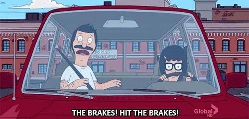

✨萤火之光·点亮远方✨
CCL 咨询请找小助手
51
51
10. Mr. Chen：今天做这个决定太仓促了。我还需要给我的合伙人打个电话。你介意带
我参观一下你们的仓库吗？
(It’s so hasty to make the decision today. I still need to call my partner. Could you show
me around your warehouse?)
11. Mr. Smith：Sure. Before we do that, do you mind if I give you some samples of our
seafood?
(当然可以。在我们去参观之前，您介意我给您一些我们海鲜产品的样品吗？)
12. Mr. Chen：当然。检验海鲜质量的最好办法就是品尝了。
(Of course not. The best way to test seafood is to taste it.)
【萤火虫老师Tips】

上文问do you mind, 你是否介意，所以回答是不介意，就是of course not.
— End of Dialogue —
\n

\n✨萤火之光·点亮远方✨
CCL 咨询请找小助手
52
52
#70012. Pregnancy Check-up - Medical
Briefing: Mrs. Wen, a mandarin speaking woman, is talking with her general
practitioner regarding her pregnancy.
The dialogue starts now.
1.
Doctor：Hello, Mrs. Wen. I haven’t seen you for a while. Do you feel unwell?
(温太太你好。我有阵子没见到你啦。你不舒服吗？)
2.
Mrs. Wen：你好，医生。我今天来是因为我怀孕了。我想问一些关于怀孕的注意事
项。
(Hello, doctor. I’m here today because I’m pregnant. I’d like to know the do’s and
don’ts.)
【萤火虫老师Tips】

想不到do’s and don’ts 也可以说，I’d like to know the things that I should pay
attention to.
3.
Doctor：Congratulations! Well, there are some things you need to take note of. First,
do you smoke or drink?
(恭喜你！确实有些事是你需要注意的。首先，你抽烟或者喝酒吗？)
4.
Mrs. Wen：我从来不抽烟。我一般也不喝酒。不过我和朋友出去的时候，会喝一些
红酒。
(I never smoke. I usually don’t drink either, but I’ll have some red wine when I hang out
with friends.)
5.
Doctor：Considering the link between alcohol and some serious diseases in babies, I
advise you not to drink alcohol at all during your pregnancy.
(考虑到酒精和宝宝得的一些严重疾病的关连，我建议你在怀孕期间完全不要喝酒
啦。)
\n

\n✨萤火之光·点亮远方✨
CCL 咨询请找小助手
53
53
6.
Mrs. Wen：好的，这我能做到。我听说怀孕的时候要尽量少吃海鲜，这是为什么呢？
(Okay. I can do that. I heard that pregnant women should eat less sea food. Why?)
7.
Doctor ：Seafood can contain a lot of heavy metals that can harm your baby’s
development. You should also eat a lot of healthy foods, including fresh vegetables,
fruits, meat, grains, and dairy products.
(海鲜会包含很多重金属，这会伤害到宝宝的发育。你应该多吃健康食物，包括新鲜
蔬菜，水果，肉，谷类和乳制品。)
8.
Mrs. Wen：好的。我有一个朋友说，在她怀孕的时候，她每天都会吃很多维生素，
来补充钙和铁。
(Okay. A friend of mine said that she would have a lot of vitamins as supplements to
calcium and iron during her pregnancy, )
【萤火虫老师Tips】

Supplememt:，补充；保健品
9.
Doctor：Yes. And you should also do some exercises during your pregnancy. Do you
do physical activity?
(是的。怀孕期间，你还应该做些锻炼。你平常运动吗？)
10. Mrs. Wen：我平时会打羽毛球。但是因为我怀孕了，我准备暂时先不打。
(I usually play badminton, but I plan to put if off because of the pregnancy.)
【萤火虫老师Tips】

Put something off: 推迟做某事；暂时先不做某事。
11. Doctor：You can still play badminton at your first three to four months.
After that, I suggest you try to avoid activities that require significant
balance and coordination.
(在你怀孕的前3 到4 个月，你还是可以打羽毛球的。在那之后，我建议你尽量避免
\n

\n✨萤火之光·点亮远方✨
CCL 咨询请找小助手
54
54
做需要很大平衡和协调能力的运动。)
12. Mrs. Wen：好的。那我就做一些游泳或者散步这样的轻微运动吧。非常感谢您！
(Okay. Then I’ll do some mild/light exercise like swimming or strolling. Thank you very
much.)
【萤火虫老师Tips】

Exercise 表示锻炼时不可数(联想一下，生命不息，锻炼无休止)，表示练习题
时可数(题/机经总是能做完的嘛)
— End of Dialogue —
\n

\n✨萤火之光·点亮远方✨
CCL 咨询请找小助手
55
55
#70013. Car Insurance Claim - Business
Briefing: The following dialogue takes place between a mandarin speaking man and
Amy, the claims officer at RACV insurance company. The dialogue starts now.
1.
Amy：Hello, thank you for calling RACV insurance company. This is Amy from the
claims team. How can I help you?
(你好，感谢致电维多利亚州皇家汽车俱乐部保险公司。我是艾米，来自索赔组/团
队。我有什么可以帮您的吗？)
【萤火虫老师Tips】

RACV 全称：Royal Automobile Club of Victoria 维州皇家汽车俱乐部

Loyal 忠实的；忠诚的

Roadside Assistance 紧急救援(CCL 必考词汇)
2.
Mr. Wang：您好，我是王伟，我的保单号是T193，我想要申请理赔，因为我昨天
出了车祸。
(Hello, this is Wei Wang. My policy number is T193.I’d like to make a claim because I
had a car accident yesterday.)
【萤火虫老师Tips】

电话里一般说“我是”记得用this is;

Policy，保单/保险单(CCL 必考词汇)

Premium，保险金(CCL 必考词汇)
3.
Amy：Thanks for providing your policy number. Let me get your policy from the
system. Okay, please tell me exactly what happened.
(感谢您提供的保单号码。让我从系统里把您的保单调/找出来。好啦，请告诉我当
时究竟发生了什么呢？)
【萤火虫老师Tips】
\n

\n✨萤火之光·点亮远方✨
CCL 咨询请找小助手
56
56

听听力的时候，问“what happened next”一般都是“之后发生了什么”，是要求对方
回忆当时之后发生了什么

如果是“之后会发生什么呢”，对还没发生的事情进行推测，一般会问“what will
happen next/what’s gonna happen next”; 所以翻译要注意区分
4.
Mr. Wang：昨晚回家的路上，我们前面的车突然一个急刹车，我们来不及刹车，就
追尾了。我的前车灯和保险杠全撞坏了。好在没人受伤。
(Last night, on the way home, the car in front of us suddenly braked. We rear-ended the
car before we had time to stop/brake. My headlights and bumper were all crashed.
Luckily no one was injured.)
【萤火虫老师Tips】

“rear-end 为动词；但另有常见搭配rear-end collision 追尾事故，在该词组中
rear-end 可以被看作形容词"

Brake 刹车可以做动词，也可以作为名词比如hit the brakes 踩刹车

'Hit the brakes' refers to the actual brakes or the braking system as a whole.
5.
Amy：Do you know the Registration number, make or model of the other car? Did
you exchange your contact details and driving license with the other driver?
(您知道另一辆车的车牌号，牌子或者型号吗？您和另一位司机交换了电话和驾照信
息吗？)
\n

\n✨萤火之光·点亮远方✨
CCL 咨询请找小助手
57
57
6.
Mr. Wang：都有的。他在玩手机，没有看路。我买的是全险。索赔应该没有问题
吧？
(Yes. He was playing on his mobile phone and didn’t keep his eyes on the road/wasn’t
paying attention to the road. I’m a comprehensive car insurance policy holder. I guess it
shouldn’t be a problem for me to make a claim, right?)
【萤火虫老师Tips】

Play on the computer，玩电脑，注意介词要用on

He was on the phone，他在打电话。

Play computer: to pretend to use a computer (like playing office or playing house)
Play the computer: doesn't really make sense
Play with the computer: to do funny things with a computer; not correct English
Play on the computer: to use the computer for games or idle surfing without a real
purpose

Compulsory third-party insurance 强制性第三险/第三方保险
7.
Amy：Well, we still need to contact the other driver’s insurer to get the other side of
the story before making a decision about the claim.
(这个嘛，在决定理赔之前，我们还需要联系另一位驾驶员的保险公司，了解一下那
边的说法。)
8.
Mr. Wang：哦，他说追尾是因为我们没有注意我们前面的车的状况。可惜当时没有
证人。我们也没装行车记录仪。
(Well, he said that the rear-end collision occured because we weren’t paying attention to
the car in front of us. Unfortunately, there was no witness and we don’t have a
dashcam/dash camera.)
9.
Amy：Don’t worry, we’ll carefully consider both sides of the story and make a fair
decision. Were you driving the vehicle?
(别担心。我们会仔细考虑两头的说法，作出公正的决断的。是您开的车吗？)
\n

\n✨萤火之光·点亮远方✨
CCL 咨询请找小助手
58
58
10. Mr. Wang：并不是。是我儿子开的车。他刚刚拿到全驾照，我让他开车，想让他增
加一下开高速的经验。
(Not really. It was my son. He just got his full license. I asked him to drive so that he
could gain more experience of driving on the freeway.)
11. Amy：According to what I can see from here, your son’s name is not listed on your
policy. If your son is under 25, you will need to pay a $600 excess fee if he is at fault.
(根据我这边可以看到的信息，您儿子的名字不在您的保险单名单上。如果您儿子
小于25 岁并且是过错方的话，您需要交600 元的保险自付费/保险启动费/保险垫底
费。)
12. Mr. Wang：真倒霉，他刚刚23 岁。算了，您帮我赶快处理了吧，我不想再惹麻烦。
(That’s bad luck. He’s only 23. Never mind, please help me settle this. I don’t want any
more trouble.)
13. Amy：We will solve this issue as soon as possible and contact you immediately.
(我们会尽快解决这件事，然后迅速联系您的。)
— End of Dialogue —
\n

\n✨萤火之光·点亮远方✨
CCL 咨询请找小助手
59
59
#70014. School Camp Medical Examination - Education
Briefing: The following dialogue takes place between an English-speaking General
Practitioner and a mandarin speaking father Mr. Jin, who is asking the doctor to fill in
the medical form for his son Simon to attend the school camp. The dialogue starts now.
1.
Doctor：Good morning, Mr. Jin. You want to talk about your son’s medical form,
right?
(金先生早啊。您想谈谈你儿子的体检表是吗？)
2.
Mr. Jin：早上好，医生。我儿子西蒙要参加学校的野营活动。他把这个健康表格拿
回家了，说学校老师说，按照惯例，要找医生填写才能去野营。
(Good morning doctor. Simon, my son, is going to his school camp. He took this medical
form home and said the teacher told him that, as usual, the form should be filled in by a
doctor before he could go to the camp.)
3.
Doctor：Yes, the form does look familiar. Before filling out the form, I need to know
your son's medical history, including allergies if there’s any.
(是的。这个表格看上去确实很眼熟。在填表之前，我需要了解下你儿子的病史，如
果有过敏史的话也请提供吧。)
4.
Mr. Jin：这张表格看上去真复杂啊，看得我头疼。您能跟我说说这上面都问了什么
问题吗？我儿子需要体检吗？
(This form looks so complicated. It gives me headaches. Could you tell me what it says?
Does my son need a body check?)
【萤火虫老师Tips】

衍生表达：fill someone in: to tell someone the details about something/someone 提
供详情，例句：Please fill me in on what happened last night.
\n

\n✨萤火之光·点亮远方✨
CCL 咨询请找小助手
60
60
5.
Doctor：Let’s first look at the first section of the form. It is about his allergy and
immunization record such as measles, mumps, rubella, tetanus and polio.
(我们先看下表格的第一部分。这个是关于你儿子的过敏史和接种免疫记录的，比如
说麻疹，腮腺炎，风疹，破伤风和小儿麻痹。)
6.
Mr. Jin：我儿子接种疫苗的全部记录我们都保留着呢。您说的这些他都接种过。他
小时候对青霉素过敏。这一点需要告诉学校吗？
(We still have all my son’s immunization records. He has been immunized against all
these diseases that you have mentioned. He was allergic to penicillin when he was little.
Do I need to let the school know about this?)
7.
Doctor：If it isn’t mentioned in the medical form, then it’s not necessary for you to
notify the school. As long as the school is aware of this allergy, it won’t affect your
son’s going to the camp.
(如果体检表格上没说，你就没必要通知学校了。只要学校对他的过敏情况知情，你
儿子去野营就不会受影响。)
8.
Mr. Jin：那就好，我儿子可盼望去野营了。对了，他前几天吃了海鲜胃不舒服，还
拉肚子了。不过我感觉这个像食物中毒而不是过敏吧。
(That’s great. My son is keen to go camping. It just occurred to me that he got an upset
stomach after having seafood several days ago and he also got diarrhea/got loose
bowels/got loose stools. However, I feel that’s more like food poisoning instead of
allergy.)
9.
Doctor ：That sounds right. The next section is about whether he has taken
cholesterol, heartbeat and blood tests. Has he taken these tests before?
(听起来是这样的。表格的下一部分是关于他有没有测过胆固醇，心率和验血。这些
之前他验过吗？)
\n

