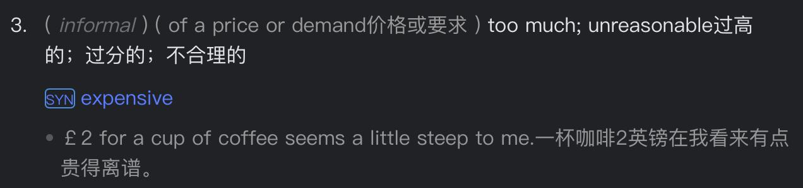

✨萤火之光·点亮远方✨
CCL 咨询请找小助手
621
621
#70198. Flight Change Request After New Job Start –
Tourism+Business
Briefing：The following dialogue takes place between a Mandarin-speaking customer
and an English-speaking airline customer service representative. They are discussing
how to change or cancel a flight reservation. The dialogue starts now.
1. Good afternoon, thank you for calling our Airline Customer Service. How may I
assist you today?
（下午好，感谢您致电我们航司客服部，今天有什么可以帮您的吗？）
2. 下午好，我想咨询一下我下个月航班的事情，我有一些疑问。
(Good afternoon, I’d like to make an enquiry about my flight next month. I have a few
questions.)
3. Absolutely! Thank you for flying with us. I’d be glad to answer any questions you
have about your reservation.
（当然！感谢您乘坐我们的航班。我很乐意为您解答有关预订的任何问题。）
4. 大概三个月前,我在你们官网订了票,并且已经付款了。现在我想更改预定，但是我不
太清楚流程。
(I booked and paid for my ticket on your website about three months ago. I’d like to
change my reservation now, but I’m not sure how to proceed.)
5. Sure thing. I’m happy to help! Could you give me your flight details so I can check
what options are available?
（当然可以。我很乐意帮忙！能告诉我您的航班信息吗？我来看看有哪些可行的方
案。）
\n

\n✨萤火之光·点亮远方✨
CCL 咨询请找小助手
622
622
6. 本来我是打算去度假的，可我刚入职一个新工作，现在请不了假。
(I planned to go on vacation, but I just started a new job and can’t take time off now.)
7. Congrats on your new position! I’m sorry you won’t make the trip—that’s really
unfortunate.
（恭喜您找到新工作！很遗憾您度假度不成了，太不巧了。）
8. 是的，我也没想好该怎么办。我正在考虑要么改期，要么退票取消预定。
(Yes, I haven’t decided what to do yet. I’m thinking either to push the flight to a later date
or cancel and get a refund.)
9. Alright. When do you think you might get leave? Some tickets can be rescheduled or
canceled, but fees may apply.
（好的。您估计您什么时候能休假？有些票可以改期或者取消，但可能会收取一些
费用。）
10. 我知道会有些额外费用，希望不要太贵。我还不确定能休假的确切时间，需要跟我
的新雇主商量一下。他说过年底应该可以请假。
(I know there will be extra fees—hopefully not too expensive. I don’t have a firm leave
date yet; I need to discuss it with my new employer, who said I could take time off by
year’s end.)
11. It depends on your fare class, but fees are usually modest. You’ll get refunded the
balance after cancellation. You probably need to act soon and read the terms of your
ticket carefully. Some discounted tickets aren’t changeable.
（这要看您的票种/舱位等级，不过一般手续费不高。取消后差额会退还。您可能得
尽快操作，并仔细阅读机票的条款。有些特价票不能更改。）
【萤火虫老师Tips】

机票的Fare class 项中，不同的字母代表不同的舱位等级。

比如：国内客票的舱位等级主要分为头等舱（舱位代码为F）、公务舱（舱位
\n

\n✨萤火之光·点亮远方✨
CCL 咨询请找小助手
623
623
代码为C）、经济舱（舱位代码为Y）；经济舱里面又分不同的座位等级（舱
位代码为B、K、H、L、M、Q、X、E 不等，这种代码每个航空公司的标识都
不相同，价格也不一样）。

折扣舱依次往下排列，这些价格虽然都属于经济舱，但是低舱位的价格享受的
服务和高舱位的不大一样，最明显的就是提前预订机上座位与餐食服务，以及
特别低的舱位不能退票。
12. 好的，我回去看看我机票的种类，再给你回电。你们网站上能查到这些信息吗？
(Okay, I’ll check my fare type and call you back. Is that info available on your website?)
13. Yes. You can find all terms and fees on our site. If anything’s unclear, feel free to call
back.
（没问题，您可以在我们网站上查看所有条款和费用。如有疑问，您尽管给我们打
电话。）
14. 好的，我会上网查一下怎么处理，权衡权衡这些选择。谢谢你的帮助！
(Alright, I’ll go online to see how to handle this and weigh my options. Thanks for your
help!)
— End of Dialogue —
\n

\n✨萤火之光·点亮远方✨
CCL 咨询请找小助手
624
624
#70199. Parent's Call for Disability Holiday Program
Details– Social
Briefing：The following dialogue takes place between a Mandarin-speaking parent and
an English-speaking representative of a Disability Support Program. They are
discussing details about a free holiday program for children with disabilities. The
dialogue starts now.
1. Hi. You have reached the Disability Support Program hotline. How may I assist you
today?
（下午好，您已拨通残疾人帮助/支持项目热线，请问今天有什么我可以帮忙的吗？）
2. 你好，我是孩子的家长，最近听说了你们的一个为残疾儿童设计的假期项目，我想
了解更多详细情况。
(Hello, I am the parent of a child, and I recently heard about your holiday program
designed for children with disabilities. I would like to learn more details.)
3. I’d be happy to help. I'm one of the coordinators for this program. Could you tell me
how you found out about it?
（我很乐意帮忙，我是这个项目的协调员之一。请问您是怎么得知这个项目的呢？）
4. 我儿子在一家医院参加体育训练。就在这个礼拜，我在医院的公告板上注意到了一
张你们介绍这个假期项目的海报。
(My son is currently taking part in sports training at a hospital, and just this week, I
noticed a poster on the hospital notice board about your holiday program.)
【萤火虫老师Tips】

在土澳，医院并不仅是治疗的地方，还会开展专门针对残疾儿童的体育康复项
目。这些项目通常与澳大利亚残疾运动组织（Disability Sports Australia）等机构
\n

\n✨萤火之光·点亮远方✨
CCL 咨询请找小助手
625
625
合作，在医院的运动馆或康复中心定期举办运动训练，让孩子们在专业医师的
监督下参与体育活动，更好地结合康复治疗与体育锻炼。

In a hospital 通常指住院或在医院内部逗留，强调“作为病人/住院者”或强调
在建筑【内】部。例如：He’s in the hospital recovering from surgery.这里强调他
被接纳为病人，并在医院的病房里。

At a hospital 则更宽泛，指在医院场所，不论是工作、探视、看门诊或参加活动：
I have physiotherapy at the hospital every Wednesday.这里并不意味着“被住院”，
只是说“在医院里”进行治疗。
5. I'm glad that you noticed the poster. We don’t promote it broadly since our support
is limited to a few families annually.
（我很高兴您看到了那个海报。我们不大范围宣传，因为每年我们只能帮助少数几
个家庭。）
6. 我懂的。现在我想清楚点了解一下这个残疾儿童假期计划是怎么运作的。因为海报
上明确写着，这个假期完全免费的。
(I understand. Now, I would like to clearly know how this holiday program for children
with disabilities operates, as the poster clearly states that this holiday is completely free of
charge.)
7. There's indeed no charge. We provide a spacious house by the beach free of cost. It
can accommodate two families simultaneously.
（确实不需要支付任何费用。我们会免费提供一栋很大的靠近海滩的房子，可以同
时容纳两个家庭。）
8. 那真是太好了！我儿子特别喜欢海滩。但是我们家有四口人，如果能安排两间房间，
就再合适不过了。
(That's really great! My son especially loves beaches. But there are four of us in the
family, having two bedrooms would be just perfect.)
\n

\n✨萤火之光·点亮远方✨
CCL 咨询请找小助手
626
626
9. Every family is assigned two bedrooms along with its own private bathroom. We also
supply food for shared cooking and dining, which gives you the chance to connect
with new people.
（每个家庭都会配备两间卧室和独立的浴室。我们还会提供食材，让大家可以一起
做饭和就餐，这样你们有机会认识新朋友。）
10. 太好了。这样的话，我们就有机会认识其他的家庭了！我儿子也能认识一些能理解
他的情况和一起分享相似经历的朋友。
(That’s great. That way, we will have the opportunity to connect with other families, and
my son can make friends with those who understand his situation and share similar
experiences.)
11. He can make new friends so sure, and you'll also get support from fellow parents.
Would you like to proceed with the application now?
（他一定会交到新朋友，您也能从其他家长那里获得支持。您现在要办理申请吗？）
12. 要的，非常感谢。我已经好久没有和家人一起度假了，希望这个申请过程不要太繁
琐，让我们可以轻松享受这次假期。
(Yes, thank you very much. I haven't taken a family vacation for a long time, and I hope
this application process won't be too complicated so that we can easily enjoy the holiday.)
13. It won’t be at all. It’s very simple, with just a single form to fill out. Once you
complete it, we'll contact you to schedule your holiday date.
（一点也不复杂的。非常简单。只需要填写一张表格。您一填完表，我们就联系您
确定度假日期。）
14. 非常感谢您的帮助。我真的很期待这次假期，我儿子也肯定会非常兴奋的。也感谢
您组织了这么棒的项目。
(Thank you so much for your help. I'm really looking forward to this holiday; my son is
definitely going to be very excited. And thank you for organizing such a wonderful
program.)
\n

\n✨萤火之光·点亮远方✨
CCL 咨询请找小助手
627
627
— End of Dialogue —
\n

\n✨萤火之光·点亮远方✨
CCL 咨询请找小助手
628
628
#70200. Social
Media
Strategies
for
Selling
Art
–
Business
Briefing: The following dialogue takes place between a Mandarin-speaking artist and an
English-speaking marketing advisor. They are discussing strategies for expanding the
artist’s sales channels. The dialogue starts now.
1. Hi! Welcome to our Business Support Open Day. How can I assist you today?
（你好！欢迎参加我们的生意支持开放日，我今天有什么可以帮你的吗？）
【萤火虫老师Tips】

这里“Business”的翻译为啥选择"生意"而不是"企业"呢：
"企业" 在中文中容易联想到规模较大的公司（如大型企业），而Business Open Day
活动通常更关注个体户或者中小企业（SMEs - Small and Medium Enterprises），用"
生意"更贴近个体经营者、创业者或中小型商业主体。
2. 你好。我是一名画家。我今天过来是想获得一些怎么拓宽销售渠道的建议。
(Hi. I’m an artist and I’ve come here today looking for advice on how to broaden my sales
channels.)
3. That’s wonderful! Do you already have any of your pieces on the market?
（太好了！您已经在市面上出售作品了吗？）
4. 是的，我一般会在本地集市摆摊卖画，不过销售情况时好时坏。
(Yes. I usually set up a stall at the local market to sell my work, but my sales are quite
inconsistent/the sales have their ups and downs.)
【萤火虫老师Tips】

用"work"会比"paintings"更自然些，很多艺术家通常称自己的作品为“work”。
\n

\n✨萤火之光·点亮远方✨
CCL 咨询请找小助手
629
629
5. Got it. Have you tried selling your work through galleries? It’s an approach many
artists take.
（明白了。您尝试过在画廊销售吗？许多艺术家都会这样做。）
6. 这一点我其实也想到过。我有联系过几家画廊的。但是，他们抽的佣金实在太高了，
就会导致我的利润很少。
(I've actually thought about that before. I've reached out to a few galleries, but the
commission they take is ridiculously high/ but their commission rates are so high and it
leaves me with almost no profit/leaves me with barely any profit.)
【萤火虫老师Tips】

这里profit 不可数，因为强调【整体】利润少，而不是具体某次利润。

Profit 啥时候可数：指「具体多次的利润」或强调不同来源的利润时，可以
用复数。例：Small profits add up over time.
7. I totally get that. Gallery commissions are no joke. They can be really steep. Have
you ever thought about selling your work online? Online sales are booming right
now.
（我完全能理解。画廊抽成可不是闹着玩的，能贵到离谱。您有没有想过把销售转
到网上呢？现在网上销售也很火。）
【萤火虫老师Tips】

Steep：
\n

\n✨萤火之光·点亮远方✨
CCL 咨询请找小助手
630
630
8. 网上销售？我听说过，但是我没什么这方面的经验。您是指通过专门的平台或者网
站吗？
(Online sales? I’ve heard of/about it. But I don’t have much experience with that. Do you
mean specific platforms or websites?)
9. Well, you might want to begin by using social media platforms to connect with a
broader audience. Plus, your buyers can get full transparency on what they’re
purchasing.
（嗯，您或许可以先从社交媒体平台入手，来接触更广泛的受众。另外，你的买家
也能非常透明地看到他们买的是什么。）
【萤火虫老师Tips】

“full transparency”怎么深度理解：
视觉透明度：通过高清图片、360°视频、细节放大等功能实现比肉眼更细致的观察；
信息透明度：每幅作品可附带创作故事、技法说明、材质证明等数字档案；
过程透明度：可展示工作室环境、创作过程视频，建立信任感。
10. 这个建议太棒了。在线上，客户能全方位看到我的作品，肯定更吸引人。我家里的
油画和素描现在都堆成山了，根本没地方放了。
(This advice is amazing! When clients can get the full perspective of my work online, that
would be more appealing. My oil paintings and sketches are just piling up at home now
with nowhere to go.)
11. You can also engage directly with potential buyers with the help of social media. Also,
you can post updates whenever you want and showcase new work on a regular basis.
（社交媒体还能让您直接跟潜在买家互动。而且，您可以随时发布更新和经常展示
新作品。）
12. 听上去很棒。在社交媒体上发帖，对我来说其实并不是那么复杂。但是我估计需要
花点时间积累粉丝和互动。
(That sounds amazing. Posting on social media isn’t actually that tricky/complicated for
\n

