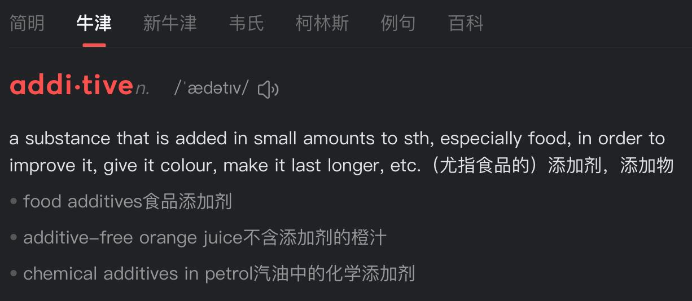

✨萤火之光·点亮远方✨
CCL 咨询请找小助手
631
631
me, but I guess/suppose it’ll take some time to build up followers/build a following and
get engagement.)
13. I believe you’ll nail it! Also, if you want to plan an exhibition or special event down
the line, you can promote it via social channels too.
（我相信你能做到的！而且，以后如果您想办个展览或特别活动，你也能用社媒渠
道来宣传。）
14. 谢谢你的夸奖！今天你给了我很多可行的思路和信心，真的是帮了我大忙！
(Thank you for your kind words. You’ve given me a lot of practical/feasible ideas and
confidence today. This has really helped me a lot.)
— End of Dialogue —
\n

\n✨萤火之光·点亮远方✨
CCL 咨询请找小助手
632
632
#70201. Truck Driver Job Interview – Business
Briefing: The following dialogue takes place between a Mandarin-speaking job
candidate and an English-speaking company manager. They are discussing the legal and
license requirements for a truck driver position at the manager’s office. The dialogue
starts now.
1. Come in. Have a seat. Thank you for coming to the interview. Are you interested in
joining us?
（请进。坐吧。谢谢你来面试。你有兴趣加入我们吗？）
2. 谢谢。我很想在这里工作。贵公司有很好的声誉。
(Thanks. I really want to work here. Your company has a very good reputation.)
3. That’s good to hear. We are a top company in the industry. Making sure our clients
and employees are happy is very important to us.
（听到这个我很高兴。我们是行业顶尖的公司。确保我们的客户和员工都满意对我
们非常重要。）
4. 如果我能得到这份工作就太好了。我想我一定会在这里工作得很开心。但是我知道
你们对这份工作有一些法律要求。
(It would be wonderful if I could get this job. I think I would be very happy working here.
But I know you have some legal requirements for this position.)
5. Yes. We currently have license requirements. We need you to have the correct
license before offering you this job.
（是的。目前我们对驾照有要求。在聘用您之前，我们需要您持有合适的驾照。）
\n

\n✨萤火之光·点亮远方✨
CCL 咨询请找小助手
633
633
6. 我明白了。我知道你们要检查驾照和驾驶记录。我开车很多年了，记录很好，从来
没有任何罚单和事故。
(I understand. I know you’ll check my license and driving record. I’ve been driving for
many years, with a clean record and no tickets or accidents.)
7. Excellent. That's good. We prefer our drivers to have some driving experience, and
we only hire drivers with clean records.
（太好了。这很好。我们偏好有驾驶经验的司机，而且只雇用记录良好的司机。）
8. 我不清楚你们想让我开什么类型的车。我有普通汽车的驾照，也有卡车驾照。
(I’m not clear on what type of vehicle you want me to drive. I have a regular/standard car
license, and I also have a truck license.)
9. We need a driver who can drive a truck. We just signed a contract with another
company, so we urgently need to find the right driver.
（我们需要一名能开卡车的司机。我们刚与另一家公司签了合同，所以急需合适的
司机。）
10. 我猜你们需要我开卡车。我有开卡车的经验。我之前和另一位候选人聊过，他没有
卡车驾照。
(I guess you need me to drive a truck. I do have truck-driving experience. I spoke with
another candidate earlier—he doesn’t have a truck license.)
11. That’s great. I think you have a great chance for this job. You have this type of
experience that we are looking for.
（太好了。我觉得您很有机会得到这份工作。您正好有我们需要的那种经验。）
12. 如果我需要考新驾照来增加获得这份工作的机会，我愿意去学习，去考驾照的。
(If I need to get a new license to improve/boost my chances of getting this job, I’m willing
to go for it and take the test.)
\n

\n✨萤火之光·点亮远方✨
CCL 咨询请找小助手
634
634
13. No, you have the right license now. I’ll let you know the result in a few days.
（不用的，您现在的驾照就合适/符合要求。我会在几天后告知您结果。）
14. 好的，谢谢。我期待很快收到您的回复。
(Okay, thanks. I look forward to hearing from you soon.)
— End of Dialogue —
\n

\n✨萤火之光·点亮远方✨
CCL 咨询请找小助手
635
635
#70202. Soap Business Marketing Discussion – Business
Briefing: The following dialogue takes place between a Mandarin-speaking client and an
English-speaking market agency owner. They are discussing how to develop a marketing
plan for the client’s new soap business. The dialogue starts now.
1. Hi. Nice to see you. You must be excited to start your new business.
（嗨，很高兴见到你。你一定很激动要开始你的新生意吧。）
2. 嗯，我打算开一个新生意。我已经有了一些初步的想法，但是还有一些细节需要想
想。
(Well, I’m planning to start a new business. I already have some initial ideas, but there are
still some details to think about.)
3. Of course. I think there are still a lot of things to consider before going ahead. Tell
me about your business ideas.
（当然，我觉得在继续之前还有很多事情要考虑。告诉我你的商业想法吧。）
4. 我打算开一个肥皂生意。我做肥皂好多年了，它们作为礼物很受欢迎。我现在打算
出售肥皂。
(I plan to start a soap business. I’ve been making soaps for many years—they’re popular
as gifts. Now I intend to sell soaps.)
5. All right. You have your product; you also have experience making them. You just
need to organize the business aspects properly.
（好的，你已经有产品了，也有制作经验。你只需把商业方面的事安排好就行了。）
6. 没错，这就是我为什么来这儿。我想得到专业的帮助，找到最好的方法来卖肥皂。
(Exactly. That’s why I came here. I want professional help to find the best way to sell
soap.)
\n

\n✨萤火之光·点亮远方✨
CCL 咨询请找小助手
636
636
7. I’m happy to help. Tell me more about your soap. What’s special about it compared
with other products on the market?
（我很乐意帮助。跟我说说你的肥皂吧。它跟市面上的其他产品相比有什么特别之
处？）
8. 嗯，这是一种不同的肥皂。它是专门针对狗狗的。市场上有很多狗狗香波，但肥皂
不多。
(Well, this is a different soap. It’s specially made for dogs. There are many dog shampoos
on the market, but not many soaps.)
9. That’s a surprise. I didn’t expect dogs would be your top market. Do you know why
dog owners would choose your products?
（真让我惊讶。我没想到狗狗会是你的主要市场。你知道为什么狗主人会选你的产
品吗？）
10. 这个肥皂是用天然材质制作的，没有化学物质、没有添加剂。里面还加入了精油成
分，让狗狗闻起来更清新。
(This soap is made with natural materials, with no chemicals or additives. It also contains
essential oils to make dogs smell fresher.)
【萤火虫老师Tips】

made from →原材料发生化学变化（看不出原料）
例：Paper is made from wood.（木头变纸，形态改变）; Wine is made from grapes. (葡
萄发酵成酒，形态消失);

made of →原材料保持物理形态（直接可见原料）
例：The table is made of wood.（木头还是木头）; The ring is made of gold.
( 金子
仍是金子，未改变本质);

made with →强调成分之一或制作方式（常见于产品说明）
\n

\n✨萤火之光·点亮远方✨
CCL 咨询请找小助手
637
637
例：This soap is made with natural oils.（含天然油成分）; This cake is made with love.
(强调制作中添加的元素);

注意Additives 的发音，重音在前面；可数名词。
11. OK. I will create a marketing plan and add a few points based on what we discussed
before. I just need to do some research first.
（好的。我会制定一个营销计划，并根据我们之前讨论的内容补充几点。我只不过
需要先做些调研。）
12. 太好了。我接下来一两周需要这个计划。我已经有了售卖计划，希望你有足够的时
间。
(Great. I’ll need this plan in the next week or two. I already have a selling plan—hope
you’ll have enough time.)
13. Yes, that timeline works for me. You’ll also need a website. If you don’t have one yet,
I can include some options in the plan.
（好的，这个时间表对我来说没问题。你还需要一个网站。如果还没有，我可以在
方案里加一些选项。）
\n

\n✨萤火之光·点亮远方✨
CCL 咨询请找小助手
638
638
14. 一定要，请你一定要加上。这会很有帮助。我还有很多事要做。
(Definitely. Please make sure to include it. That’d be really helpful. I still have a lot to
do.)
— End of Dialogue —
\n

\n✨萤火之光·点亮远方✨
CCL 咨询请找小助手
639
639
#70203. Government Legal Helpline for Fence Dispute –
Legal
Briefing：The following dialogue takes place between a Mandarin-speaking caller and an
English-speaking employee at a government law information helpline. They are
discussing a neighbor fence dispute. The dialogue starts now.
1. Good afternoon, you’ve reached the Law Information Helpline. What legal issue can
I help you with today?
（下午好，您已拨通法律信息热线，请问今天有什么法律问题我可以帮您解答？）
2. 下午好，我这边有件事想请教，但不知道该怎么开口说起。
(Good afternoon. I’ve got an issue I need help with, but I’m not sure how to get started.)
3. That’s fine. I can explain your options and refer you to a lawyer who can take your
case if you need one.
（没问题——我可以给您提供一些信息，如果需要，我也能帮您推荐一位律师。）
4. 能告诉我推荐的律师是谁吗？这样可能也不错。不过我想先了解一下推荐费是多少。
(Could you tell me the lawyer’s name? That sounds not bad—but first, I’d like to know
how much a referral costs.)
5. Actually, we’re a government service. Our legal information and referrals are free.
You won’t owe us a cent unless you engage a lawyer.
（事实上，我们是政府部门，提供免费法律信息和推荐服务。只有您真的聘请律师，
才会产生费用。）
6. 哦，明白了。我现在也不确定需不需要律师，希望能免去这步，我实在不想上法庭。
(Oh, got it. I’m not sure I need a lawyer—I really hope I can avoid this. I really don’t want
to go to court.)
\n

\n✨萤火之光·点亮远方✨
CCL 咨询请找小助手
640
640
7. It’s a wise idea to avoid going to court if possible. Why don’t you tell me about the
details of your problem, and let’s start from there?
(避免上法庭确实是个明智的想法。您不如先跟我说说您的具体问题，我们从那儿开
始？)
8. 我和邻居在围栏问题上有分歧。他坚持让我出新围栏一半的费用，但我不同意。
(I have a dispute with my neighbour over our fence. He insists I pay half the cost of a new
fence, but I refuse.)
9. Could you explain why? It seems you have solid grounds for not wanting to split that
cost.
（能说说原因吗？听起来您有充足的理由不想分摊这笔费用。）
10. 邻居家孩子整整几个小时对着围栏踢球，把围栏踢到严重损坏。我让他们停下，可
他们根本不理。
(Their kids have been kicking a ball against the fence for hours, leaving it badly damaged.
I told them to stop, but they ignored me.)
11. There’s a standard process for these disputes. If they damaged the shared fence,
they’re on the hook for the full cost of the new fence.
(通常解决这类纠纷有固定流程：如果是他们造成的共有围栏损坏，就得由他们承担
新栅栏的全部费用。)
12. 噢！我没意识到这一点！这听起来很有希望啊。不过如果他们不配合，该怎么办呢？
(Oh—I didn’t realize that! That sounds promising. But what if they refuse to cooperate?)
13. The simplest route is to have a friendly chat with your neighbour and try to reach an
agreement.
（最简单的做法是先跟邻居好好沟通，看看能不能尽量达成一致。）
\n

