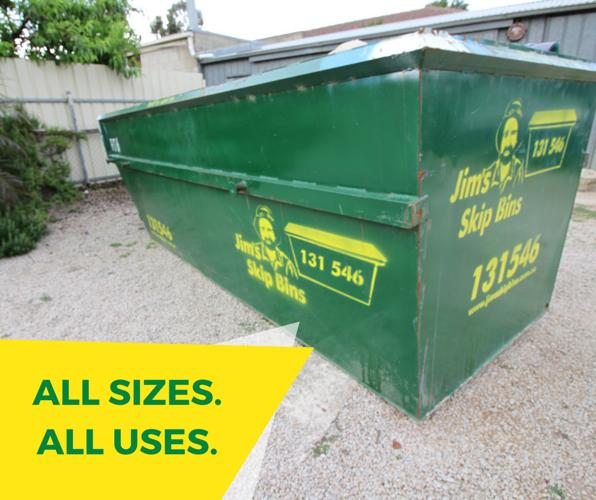
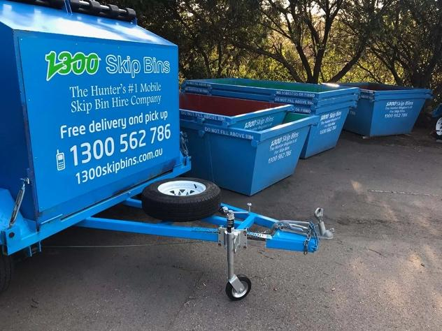
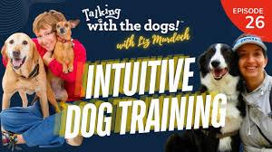
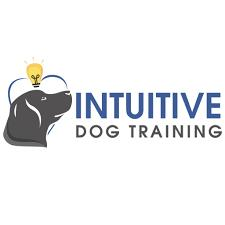
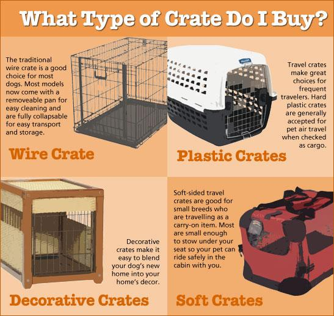
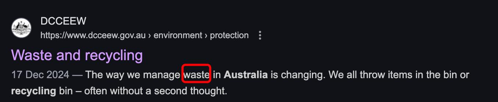
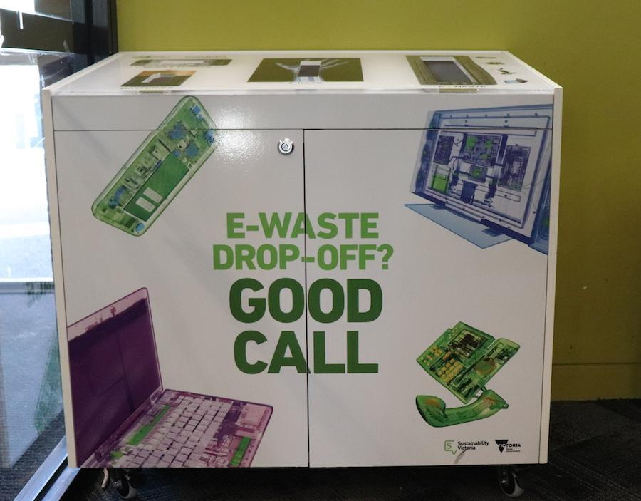
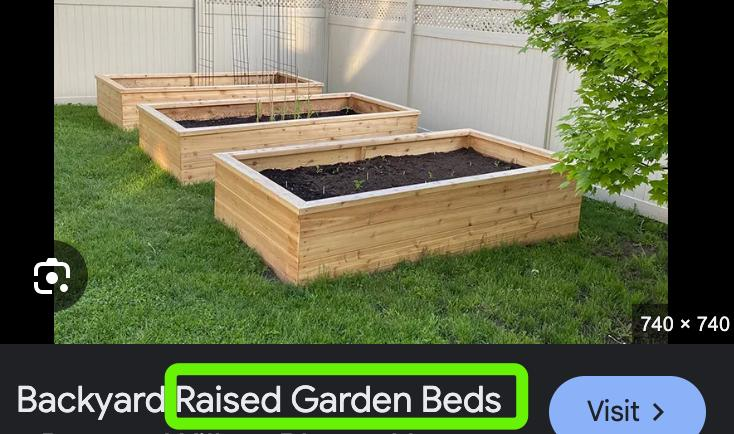

✨萤火之光·点亮远方✨
CCL 咨询请找小助手
661
661
组成固定说法，类似“大号垃圾筐”的概念。
6. 那么大的垃圾箱，我当然看到啦！你是打算用它清理仓库垃圾吗？你的垃圾肯定不
少啊！
(Of course I saw that huge skip bin! You’re using it to clean out the warehouse, right?
You must have a ton/lot of junk!)
7. Funny enough, I don’t. It turned out much bigger than I thought. It’s only half full
at the moment. Do you need to use it for your trash?
（搞笑的是，我其实没多少垃圾。这箱子比我想象的大多了，现在才装了半箱。你
要用这箱子扔你的垃圾吗？）
8. 求之不得！谢谢你！我怀疑前一个业主压根没处理过垃圾，我能轻松就能把垃圾箱
装满。
(Perfect! Thank you! I doubt/bet the previous owner never cleared the junk/cleaned up. I
could easily fill this skip bin!)
9. Perfect！Make use of it! It’d be a shame to let it sit empty. Hiring it costs a lot!
（太好了！赶紧用起来！空着不用太浪费了。租这东西可不便宜啊！）
10. 我知道租大垃圾箱有多贵，特别是租一周的话。你要我帮你分担一下费用吗？或者
我可以给你的车提供一次保养，来感谢你给我用垃圾箱，这帮我省掉了大麻烦。
(I know how expensive/pricey it is to hire a skip bin, especially for a whole week. Want
\n

\n✨萤火之光·点亮远方✨
CCL 咨询请找小助手
662
662
me to chip in? Or I could return the favor by giving your car a service/ I could give your
car a service as a thank you! — you just saved me a ton of hassle/a lot of trouble!)
11. I’d really appreciate your generous offer! Fantastic! My car’s due for a service
anyway, so that’s perfect.
（感谢你这么大方！太好了！我车本来也该保养了，这下正好。）
12. 非常乐意效劳！哪天你方便了，把钥匙给我就行。不会花太久时间的。
(Happy to help! Whenever it’s convenient for you, just give me the car key. It won’t take
long.)
13. Thanks. Just say the word if you need a hand hauling the junk. I’ll leave the skip bin
here till the weekend.
（谢谢。如果需要帮忙搬垃圾，跟我说一声。我会把垃圾箱留到周末。）
14. 真是太感谢你能帮忙了。如果你方便的话，我现在就可以开始清理。
(I really appreciate your help. If you’ve got time now, I can start clearing out right away.)
— End of Dialogue —
\n

\n✨萤火之光·点亮远方✨
CCL 咨询请找小助手
663
663
#70211. Puppy
Course:
Commands
&
Grooming
-
Business
Briefing：The following dialogue takes place between a Mandarin-speaking puppy owner
and an English-speaking dog-training centre manager. They are discussing a puppy
training course in the centre. The dialogue starts now.
1. Hey! I’m the lead trainer at the Dog Training Center. My coworker mentioned you
just adopted an adorable male puppy. What can I help you with?
（你好！我是狗狗训练中心的首席训犬师。我同事说你刚领养了一只可爱的小公狗。
我能帮你些什么？）
2. 你好。是的，我刚领养了一只小狗。听说你们的小狗训练课程口碑很好，我想多了
解一下。
(Hi! Yeah, I just adopted a puppy. I heard your puppy training course has a great
reputation/ I heard amazing things about your puppy training classes. I’d love to learn
more.)
3. Absolutely! We offer a six-week course here that covers basic commands and
hands-on handling techniques.
（当然。我们这儿有个为期六周的课程，包括基本指令和实操/上手训狗技巧/方法。）
4. 听起来很棒呀！我们家领养的小狗特别可爱的，很通人性，但也挺淘气。我想尽快
让它开始上课。
(That sounds great! The puppy we adopted is super cute. He is smart with people/he is
intuitive/he can pick up on emotions/ he understands people, but he is also quite
naughty/mischievous/he is also a little troublemaker. I'd love to get him started with the
course/enrol him as soon as possible.)
【萤火虫老师Tips】

"通人性"指动物能理解人类的情感/意图，并做出符合人类社交习惯的反应。
\n

\n✨萤火之光·点亮远方✨
CCL 咨询请找小助手
664
664

英语中常用"intuitive" /ɪnˈtjuː ɪtɪv/ 形容能敏锐感知人类情绪/需求的动物（尤其
是狗、猫、马）。比如：My dog is so intuitive—he brings me his toy when I'm sad.
（我家狗超通人性，我难过时它会主动叼玩具给我）
再比如：She's an intuitive therapist—she always knows when I'm hiding something.
（她是个直觉超准的心理咨询师，总能看出我在隐瞒什么。）
5. That’s a smart move! Puppies are adorable, and it’s simpler to nip unwanted habits
in the bud. Our next session starts in just a few days.
（这个想法非常明智！小狗都很可爱，早点纠正坏习惯也会更容易。我们下期课几
天后就开始了。）
6. 那时间正好合适。我的孩子们经常跟小狗一起玩，所以我还想让孩子们一起参加，
让他们也学学。
(That’s perfect timing! My kids play with the puppy all the time, so I’d love for them to
join too—that way they can learn together.)
7. Absolutely! The class will teach your kids how to handle the puppy, especially how to
keep him under control during walks.
（当然可以。课程会教你的孩子们控犬技巧，特别是遛狗时怎么控制小狗。）
8. 太好啦！我的孩子们一个十岁，一个八岁，希望他们可以学习怎么照顾小狗，比如，
怎么遛狗，怎么给小狗护理毛发，怎么科学喂养。
(That’s amazing! My kids are ten and eight, and I hope they could learn how to take care
\n

\n✨萤火之光·点亮远方✨
CCL 咨询请找小助手
665
665
of the puppy, you know, stuff like walking him, grooming him, and feeding him the right
way/properly.)
【萤火虫老师Tips】

"Groom " 涵盖全面护理：不仅指梳毛，还包括洗澡、剪指甲、清洁耳朵等（类
似中文的「美容」）。
例：We'll teach your kids how to groom him—brushing, bathing, and nail trimming.
（我们会教孩子给狗狗做护理：梳毛、洗澡、剪指甲。）
9. Well, our course is a perfect fit then! The course also includes socialization training.
We'll teach your pup how to interact with people and other animals.
（嗯，那我们的课程就正合适啦。我们的课程还包社交训练，会教你家小狗怎么跟
人和其他动物相处。）
10. 太好啦。课程的价格是多少？课程会包含小狗笼养训练和上厕所训练吗？
(That’s great! How much does the course cost? And does it include crate training and
potty training for the puppy? / Does it include teaching the pup to use the crate and pee in
the right spot?)
【萤火虫老师Tips】

Crate 是带安全感的宠物专用笼（通常可折叠/透气），Crate 也指航空箱/外出包
（比如坐飞机用的硬壳airline crate）。训练常说‘crate training’，不用cage。
毕竟crate 是很多狗狗的安全窝。

Cage 慎用：多指金属丝固定笼（易联想到「囚禁」，宠物店/医院才用）。
\n

\n✨萤火之光·点亮远方✨
CCL 咨询请找小助手
666
666
11. Rest assured, the course covers everything! You’re in good hands! It's 200 dollars for
six weeks. By the way, is your pup up to date on all his shots?
（放心吧，课程内容全包的。交给我们绝对靠谱的/没问题的。课程价格是六周200
澳币。对了，你的小狗疫苗打全了吗？）
12. 课程价格挺合理的。下一期课我们能参加吗？小狗的疫苗都打过了。兽医给我疫苗
证明了。
(The price sounds very reasonable/That’s a fair price. Can we join the next session? The
puppy’s got all his shots/the puppy is fully vaccinated. The vet gave me his vaccination
certificate.)
\n

\n✨萤火之光·点亮远方✨
CCL 咨询请找小助手
667
667
13. Perfect! Let’s get the little guy signed up now. Don’t forget his shot records when
you attend the first lesson!
（太棒啦！咱们现在就给小家伙报名吧。第一堂课别忘了带好所有疫苗证明哟！）
14. 太好啦。放心，我会带着的。希望能培养出一只听话不捣蛋的小狗！
(Perfect! No worries, I’ll bring them. Hope we can turn him into/raise a well-behaved,
non-mischievous puppy/ fingers crossed for a puppy who listens and doesn’t get into
trouble!)
— End of Dialogue —
\n

\n✨萤火之光·点亮远方✨
CCL 咨询请找小助手
668
668
#70212. Newcomer
Navigates
Waste
Sorting
and
Gardening - Business
Briefing：The following dialogue takes place between a Mandarin-speaking new migrant
and an English-speaking neighbor. They are discussing the garbage recycling system in
Australia and where to buy gardening tools. The dialogue starts now.
1. Hi! We haven’t had a proper chat since you moved here! Found any good spots
around here?
（你好呀！自从你搬来，我们还没怎么好好聊过呢！发现附近有什么好地方了吗？）
2. 你好。我暂时只摸清了超市和学校。不过，昨天我发现，这里的垃圾分类很不同。
我正想找人问问呢。
(Hi！So far, I’ve just figured out the supermarket and the school. But yesterday I noticed
the waste sorting system here is quite different. I was just wanting to ask someone about
it.)
【萤火虫老师Tips】
“垃圾”，土澳日常口语和官方用语最常用的词是“waste”。

trash / garbage 更偏美式用法，garbage 比“trash”更常见一点，在土澳用得没
有“waste”多。

这仨词都不可数。不用加复数s。
\n

\n✨萤火之光·点亮远方✨
CCL 咨询请找小助手
669
669
3. Ah! The Aussie bin system! That confuses everyone at first. Tell me what’s puzzling
you?
（啊！澳洲的垃圾桶系统啊！刚开始确实让人糊涂。跟我说说你哪里不明白呀？）
4. 比如，为什么有三个不同颜色的垃圾桶？还有哪些垃圾要单独处理吗？
(Like/For example, why are there three different colored bins? And what waste needs
separate/special handling? / Do I need to deal with any waste separately?)
5. Well, the red lid is for general waste, the yellow one is for recycling, and the green
one is for organics. Some items, like batteries, need special drop-off. Most
supermarkets take them.
（嗯，红色盖子装普通垃圾，黄色回收，绿色有机垃圾。像电池这种特殊物品要单
独处理。多数超市都有回收点。）
【萤火虫老师Tips】
"drop-off"在垃圾处理场景的非常高频：

在英语国家市政指南和日常对话中，"drop-off"是垃圾处理的标准术语（如
battery drop-off point），几乎完全替代了更正式的"disposal site"。

场景：专指需特殊处理的物品（电子垃圾/化学品等），比如超市常见标识：
"Household battery drop-off here"
\n

\n✨萤火之光·点亮远方✨
CCL 咨询请找小助手
670
670
6. 哦，所以，电池要单独处理呀。那么，旧的电子设备，我该扔到哪里呀？
(Oh, so batteries need separate/special handling. Where should I dispose of/drop off old
electronic devices then/ Where do we take old electronic devices then/ Where is the
drop-off point for old electronics?)
【萤火虫老师Tips】

这里的“扔”不建议说throw，易被误解（可能指随意丢弃）
7. The City Council holds an e-waste collection day quarterly. The next one will be in
October, at the community centre.
（市政厅会每个季度办电子垃圾回收日，下次在十月，地点在社区中心。）
8. 了解了。我还想种菜，我需要买几个高架菜床、一根浇水软管，还有其他园艺工具。
你知道在哪里买吗？
(Got it/Understood. I also want to grow some vegetables/veggies. I need to get a few
raised garden beds, a watering hose, and some other gardening tools. Do you know where
to buy them?)
【萤火虫老师Tips】
\n

