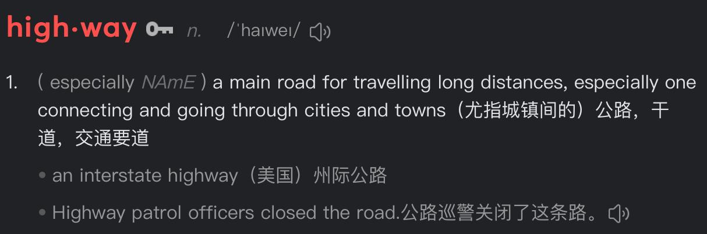

✨萤火之光·点亮远方✨
CCL 咨询请找小助手
671
671
9. I’d say, the gardening centre along the highway is your best bet. It’s quite big, and
usually has a wider range of stuff.
（我觉得公路/主干道那边的园艺中心是你最好的选择。那地方挺大的，通常种类也
更多。）
【萤火虫老师Tips】

在英语国家的日常语境中，"highway" 不指“高速公路”，它更常指的是城市连
接各区域或通往郊区的大路、主干道、公路，不一定是限速很高、封闭管理的
那种高速公路（freeway / expressway）
10. 太好了。我搬家的时候啥园艺工具都没带过来。运费实在太贵了。所以现在我得重
新添置一批。
(Great. I didn’t bring any gardening tools with me when I moved here. The shipping costs
are too high/ It is too expensive to ship them. So now I’ve got to buy everything again.)
11. I see. Picking out new tools can actually be pretty fun. Plus, that place isn’t too
pricey, which is a bonus.
（我明白。其实挑新的工具也挺有意思的。而且那家店的价格不太贵，这算是个额
外的好处。）
12. 太好了。我已经迫不及待想种点东西了，就是这边的环境跟我的祖国那边差很多。
(Great. I really can’t wait to plant/grow something, it’s just that the environment here is so
different from back home/from back in my home country.)
\n

\n✨萤火之光·点亮远方✨
CCL 咨询请找小助手
672
672
13. How about I come with you to the gardening centre now? We can pick plants that
grow well in our soil.
（要不我现在陪你去园艺中心？我们可以选些适合本地土壤的植物。）
14. 那太好了！我正担心选错植物呢。我们走吧，我开车，你可以坐副驾，给我指指路
呀！
(That’d be wonderful! I was just worried about choosing the wrong plants/I was just
worried I’d pick the wrong plants. Let’s go. I’ll drive, and you can sit in the front/you can
sit up front and guide me / help me with directions/ be my navigator/point me the way.)
【萤火虫老师Tips】

“坐副驾”还有个非常地道的美式/澳式口语是“You can ride shotgun”。

该说法源于美国西部拓荒时代，当时运送贵重物品的马车上，副驾驶位的人会
手持霰弹枪以防土匪抢劫，所以“riding shotgun”指的是坐在旁边保护司机的
位置。

它是非正式、亲密语气，类似好朋友间说“赶快坐副驾当导航员啦”，适合熟
人之间说。对新邻居来说，可能会觉得这句话交浅言深。所以不是最适合这个
语境的。
— End of Dialogue —
\n

\n✨萤火之光·点亮远方✨
CCL 咨询请找小助手
673
673
#70213. Strategies for School Band Fundraising - Business
Briefing：The following dialogue takes place between two school staff members. They are
discussing fundraising strategies for their school band through organizing a concert
event. The dialogue starts now.
1. Hey, come on in and grab a chair! My bad for being swamped yesterday! Now I’ve
got all the time to chat about this.
（嗨，快进来坐吧。昨天我太忙了实在不好意思，现在我时间很充裕，咱们慢慢聊。）
2. 我之前是想跟你讨论，怎么给我们的学校乐队筹集资金，让孩子们有更多资金参加
音乐巡演。你有什么想法吗？
(I wanted to talk with you about how to raise some money for our school band, so the kids
can have more money/funds/financial support to go on music tours. Do you have any
ideas?)
3. Well, I feel like we could totally put together a fundraiser. We just need to pick the
right kind of event, like the kind of event people would jump at attending.
（嗯，我感觉咱们完全可以搞个筹款活动。我们只需要选对活动类型，需要大家迫
不及待抢着来参加的那种活动。）
4. 要不，我们弄一本附近商家的优惠券手册，卖给家长和社区居民？或者搞些附近商
家的东西卖钱，怎么样？
(How about this: we put together a coupon book with deals from the local businesses, and
sell it to parents and people in the community? Or maybe we could sell some products
from the local shops to raise money?)
5. These are all great ideas. But hey, how about putting on a concert for the school
band? We could use the school’s venue and equipment, which would help keep the
costs down.
\n

\n✨萤火之光·点亮远方✨
CCL 咨询请找小助手
674
674
（这些都很棒。不过哎，你觉得给学校乐队办场音乐会怎么样？我们可以用学校的
场地和设施，这样可以节约开支。）
【萤火虫老师Tips】
关于“学校里用来办音乐会的设施”：

如果指乐器、音响、灯光这些“器材类” →用equipment（不可数）

如果指场地、舞台、教室、礼堂这些“空间或硬件设施” →用facilities（可
数复数）
6. 这主意靠谱！可以展现孩子们的才艺！家长们肯定乐意出钱支持的。我们多宣传，
绝对人气爆棚！
(That’s a solid idea! It’d be a great way to show off the kids’ talents. I’m sure the parents
would be more than happy to chip in and support. If we really get the word out, people
will definitely come!/ it could totally turn into a packed-out event!)
7. I think it’s a solid idea too! Hosting the event at school would save us a lot on venue
costs. We could also invite a few local bands to come and perform.
（我也觉得很好！在学校办活动，能省下大笔的场地费。我们还可以再请些本地乐
队来表演助阵。）
8. 我喜欢这个点子！还能让音乐会更专业，更热闹！乐队成员的亲友团绝对会来撑场
子的！
(I love that idea! It would make the concert more professional and way more exciting. The
band members’ friends and families are definitely gonna show up to support!)
9. Yeah, seeing these local bands could really motivate the kids to rehearse harder. Plus,
the local bands might promote the concert on their social media too！
（是的，孩子们看到这些本地乐队，会更有动力排练。本地乐队也可能会在社交媒
体宣传这次音乐会！）
\n

\n✨萤火之光·点亮远方✨
CCL 咨询请找小助手
675
675
10. 太棒了，那就等于免费宣传了！我们可以再发动家长们制作蛋糕，甜点和饮料来义
卖。
(Awesome, that basically means free promotion! We could also get the parents to make
some cakes, desserts, and drinks to sell for fundraising.)
11. Genius! That way, the vibe will be way more enjoyable! It would make the whole
thing more fun for everyone!
（妙啊！这样现场气氛更愉快，每个人都能待得更开心！）
12. 可以！细节方面，咱们得再敲定一下，还要联系附近商家，拉拉赞助。
(Sounds good! We’ll just need to finalize/work out the details and reach out to some local
businesses for sponsors/sponsorship.)
13. Absolutely! Shall we chat again the day after tomorrow? We”ll also need to apply
early for permission to use the school venue.
（必须的！后天我们再碰一次怎么样？我们也需要早点跟学校申请场地使用的许可。）
14. 好的，咱们到时候可以谈谈怎么分头联系家长和商家。我这几天先列个待办清单。
(Alright. We can then talk about how to split up and contact the parents and the local
businesses/ we can then figure out how to divide things up — like who’ll talk to the
parents and who’ll reach out to the local businesses/how to separately reach out to the
parents and the local businesses. I’ll put together/jot down/draft a to-do list over/in the
next few days.)
— End of Dialogue —
\n

\n✨萤火之光·点亮远方✨
CCL 咨询请找小助手
676
676
#70214. Customer Calls About Faulty Washer - Business
Briefing:
The
following
dialogue
takes
place
over
the
phone
between
a
Mandarin-speaking customer and an English-speaking appliance shop clerk. They are
discussing a faulty washing machine the customer purchased. The dialogue starts now.
1. Hi there, this is the appliance shop speaking. My name is Adrian. How can I assist
you today?
（你好，这里是电器商店。我是艾德利安。今天我能为您做点什么？）
2. 你好！我前段时间在你们这里买了一台洗衣机，但最近坏掉了，总是发出尖锐的噪
音，吓得我已经一周没用它了。
(Hey there! I bought a washing machine from you guys a while back, but it’s been
faulty/acting up/it’s broken down lately. It always makes a piercing / high-pitched noise,
and I’ve been too scared to use it for a week.)
【萤火虫老师Tips】

地道口语里很少用“a sharp noise” 来形容刺耳的声音，因为“sharp” 更多
描述刀口、痛觉、味觉、视觉边缘等“尖锐”感觉，比如: a sharp knife（锋利的
刀), a sharp pain（剧痛), a sharp taste（刺激的味道）但是，很少跟“noise” 直
接搭配，听起来不自然。
3. Oh no, sorry to hear that. Do you remember exactly when you bought it? If it's still
under warranty, we might be able to fix it at no cost.
（哎呀，听到这些我很抱歉。你还记得具体什么时候买吗？如果还在保修期内，我
们可能可以免费维修。）
4. 我是五个月前买的，之前一直运转得挺不错的，我原本还挺满意的。结果现在噪音
又刺耳，又漏水。
(I bought it five months ago, and it was working great. I was actually pretty happy with it.
\n

\n✨萤火之光·点亮远方✨
CCL 咨询请找小助手
677
677
But now it’s getting so noisy/it’s shrieking/it’s squealing and it’s even leaking (water)/it’s
dripping (water).)
5. That should still be covered. Would you prefer getting it repaired, or would you
rather we replace it for you?
（这应该还在保修范围内。你希望我们修理它，还是换一台新的给你？）
6. 是说我不用出钱修吗？我有点搞不清保修是什么意思。维修费用是不是都很高啊？
(Does that mean I don’t have to pay? I’m not too sure what warranty really means. Is
repair usually expensive?)
7. Exactly. Warranty means we’ll cover the repair or even replace it for free, as long as
the issue wasn’t caused by misuse.
（没错。保修就是在一定时间内，只要不是人为损坏，维修或更换都是免费的。）
8. 太好了。我之前还担心得自己掏钱修。那我就放心了。我还是想把原机修好。
(Great. I was worried I’d have to pay out of pocket. Then I’m relieved. I’d prefer to get
the original machine fixed.)
9. Got it. I’ll make sure a technician gets out to you soon. Can you tell me when
someone can come by?
（明白了。我会安排技术员尽快过去。您什么时候方便让人上门看看？）
10. 这个嘛，我做零售促销兼职，周一和周五不上班，这两天安排都可以。
(Sure, I work part-time in retail promotions/ I’m a part-time retail promoter/I’ve got a
part-time job doing retail promos, and I’m off on Mondays and Fridays. Either of those
days works for me.)
11. That works. One of our technicians will reach out to set up an appointment. The
technician may need to run a diagnostic cycle to identify the fault.
\n

\n✨萤火之光·点亮远方✨
CCL 咨询请找小助手
678
678
（好的。我们的技师会联系你预约具体时间。技师可能需要运行诊断程序来找出故
障。）
12. 这一套操作下来大概要多久？希望能快点修好。我在家等着的时候，要准备些什么
吗？比如螺丝刀？
(How long does the whole process usually take? I really hope the washer gets fixed soon.
When I’m waiting at home, should I have anything ready—like a screwdriver?)
13. The basic check usually takes about half an hour, and if we need to open it up for a
motor inspection, it will be around sixty minutes. You don’t have to get any tools
ready.
（整套流程大概半小时，如果需要拆机检查电机，会大概60 分钟。你不需要准备任
何工具。）
14. 好。那我在家等他们过来检查吧，希望不要是电机的问题。谢谢你的耐心服务。
(Alright, I’ll wait at home for them to come check it. Hopefully, it’s not a problem with
the motor/it isn’t a motor issue. Thanks for your patience/Thanks for sticking with me.)
— End of Dialogue —
\n

\n✨萤火之光·点亮远方✨
CCL 咨询请找小助手
679
679
#70215. Inspecting An Off-Market Property - Business
Briefing：The following dialogue takes place between a Mandarin-speaking homebuyer
and her English-speaking friend. They are discussing the process of finding and buying a
suitable house. The dialogue starts now.
1. Hi there! Long time no see! I had no clue you are house hunting!
（嘿！好久不见！我不知道你在看房呢。）
2. 是呀。我们租房子住好多年了，我觉得，是时候买下一套属于自己的房子啦。
(Exactly, We’ve been renting for years and I feel it’s time to have a place of my own.)
3. I totally get it. This area’s super convenient, with the mall and the park nearby. If
you moved elsewhere, you’d have to re-learn everything all over again.
（我完全明白。这地段多方便啊，商场公园都在旁边。要是搬到别的地方，你就得
重新熟悉一遍周边环境。）
4. 可不是嘛，能不动地方最好了。我们不想让孩子们又要换学校，又要重新适应一遍
周围的一切。
(Absolutely, hopefully, we’d like to avoid moving/moving is last resort/staying put would
be ideal. We don’t want the kids to have to switch schools and adjust to everything all
over again/ We really don’t want the kids to go through switching schools and adjusting to
a whole new environment again.)
5. Exactly. The market is flooded with listings now, but it might take a bit to find the
right one. Any luck so far?
（确实，市面上现在房源很多，但找到合适的可能需要点时间。目前你有看中的吗？）
6. 我们看了不少房子了，有一套房子我们特别中意，但是, 价格超标了。我们不想让手
头太紧。
(We’ve seen quite a few properties. There’s one we really like, but it’s over our budget.
\n

\n✨萤火之光·点亮远方✨
CCL 咨询请找小助手
680
680
We don’t want to stretch our finances/be financially strained/ be tight on cash/be stretched
financially/stretch our budget/overextend ourselves. )
7. That’s a shame. But it’s smart to stick to your budget. Don’t worry, it doesn’t mean
you won’t find something you love. There's plenty of fish in the sea.
（真可惜/遗憾，不过，量入为出/遵守预算是对的。别急，这不代表你们找不到喜欢
的房子。好房子多的是。）
8. 我们希望能买一套空房子，这样一切都简单。我不喜欢到处堆满家具和杂物的房子。
我觉得我们没办法搬进那样的房子。
(We’d like an empty property — that keeps things simple. I don’t like houses
cluttered/packed with furniture and stuff/junk/random items; I don’t think we could move
into one like that.)
【萤火虫老师Tips】
Clutter 意思：乱七八糟堆放的杂物（名词），或把东西乱堆放的动作（动词）
例句：The desk was covered in clutter.（桌上堆满杂物）
9. You may want to focus on the floor plan, rather than getting distracted by the
furnishings. Decorations can always be changed later.
（或许,你们可以关注房子的户型图，而不是被家具干扰。房子的装饰到后面都能改
的。）
10. 有些户型我们就是接受不了。我们不想要复式，只想要平层。
(Some layouts just won’t work for us; we don’t want a two-story home— we prefer a
single-level place.)
11. It might be worth checking out some of the older homes in the area. They often
match what you’re looking for. I can help you find them.
（或许可以看看这个区一些年代久一些的房子——它们往往更符合你们的需求。我
可以帮你找找。）
\n

