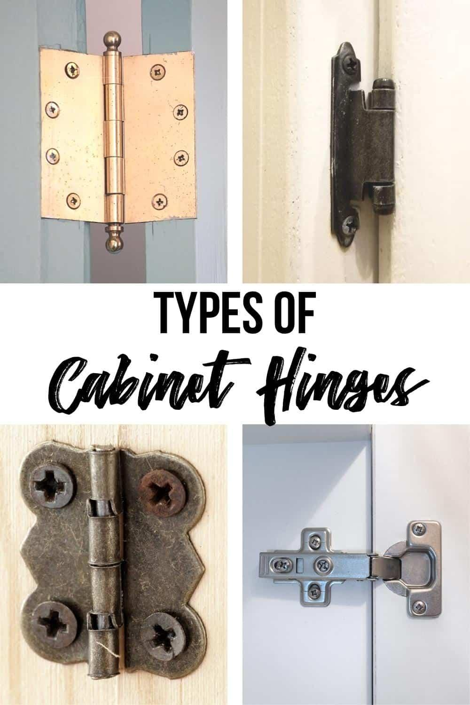
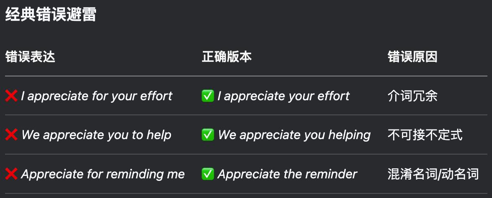

✨萤火之光·点亮远方✨
CCL 咨询请找小助手
701
701
#70222. Bystander Assistance to Paramedic – Medical
Briefing ：This dialogue takes place between an English-speaking paramedic and a
Mandarin-speaking concerned bystander. They’re talking about what to do after
someone collapsed. The dialogue starts now.
1. Hi there, I’m one of the paramedics. You said you made the call earlier. Can you
walk me through what happened?
（你好，我是其中一位急救人员。你说刚才是你打的电话。你能给我详细说说发生
了什么吗？）
2. 你好，这位男士刚才就在我面前突然倒下了，我看到他晕倒在地上了。
(Hi. Just now, this man suddenly collapsed right in front of me. I saw him faint on the
ground.)
3. Do you know how long he’s been unconscious? Did you see any warning signs before
he went down?
（你知道他昏迷多久了吗？他倒下前, 有没有表现出任何预兆？）
4. 有两分钟左右了。倒下之前，他有点站不稳，脸色也很苍白。
(About two minutes. Before he collapsed, he was a bit unsteady/ he was about to lose
balance/ he was wobbling/he was a bit shaky/he could barely stand straight and looked
very pale.)
【萤火虫老师Tips】
Unstable 更强调"危险的不稳定"（如：结构/情绪/病况），
而unsteady 特指"身体摇晃"（如：老人走路/醉酒状态）。
例：The old man was unsteady on his feet.（老人脚步不稳）
例：The patient's condition is unstable.（患者病情不稳定）
\n

\n✨萤火之光·点亮远方✨
CCL 咨询请找小助手
702
702
5. Got it, thanks for the heads-up. I’m going to check his pulse and breathing right
away.
（明白，多谢告知。我现在马上检查他的脉搏和呼吸情况。）
6. 这像是心脏病发作了？我还能帮上什么忙吗？比如找药什么的？
(Is this a heart attack? What else can I do to help, like look for medication?)
7. I’m not certain yet. Please stay calm and move back a bit so I have room to work.
（现在还不确定。请保持冷静，后退一点儿，好让我有空间操作。）
8. 没问题。我往后退一点。我刚给打电话叫了救护车。救护车还有多久到？
(No problem, I’ll step back. I just called an ambulance. How long does it take for the
ambulance to get here/ to arrive?)
9. The ambulance is minutes away. Right now, I’m looking for any injuries from the
fall, especially around his head and spine.
（救护车几分钟就到。我现在在检查他的摔伤情况，特别是头部和脊椎附近。）
10. 我刚才好像看到他头部撞到地了。需要在他脑袋下面，垫点软的东西吗？
(I think I saw his head hit the ground just now. Should we put something soft under his
head?)
11. It’s better to leave him as he is for now, until we assess him properly. Moving him
may cause further injury.
（在我们好好检查他之前, 最好先让他保持现状。动他可能会让他伤得更严重。）
12. 明白，我不碰他。真希望他能快些恢复。大家也别慌啊！
(Understood. I won’t touch him. I really hope he recovers soon. Everyone stays calm!)
\n

\n✨萤火之光·点亮远方✨
CCL 咨询请找小助手
703
703
13. You did well by calling for help. The ambulance is almost here, and they will take
over.
（你打电话求助, 做得很好。救护队快到了，他们会接手处理的。）
14. 好的，我会保持镇定的。咱们确保，这块地方在救护车来的时候，是畅通的。
(Okay, I’ll stay calm. Let’s make sure the area is clear for the ambulance when it arrives.)
— End of Dialogue —
\n

\n✨萤火之光·点亮远方✨
CCL 咨询请找小助手
704
704
#70223. Discovering the Neighbourhood Post Office
–
Business
Briefing：The following dialogue takes place between a Mandarin-speaking new resident
and her English-speaking neighbour. They are discussing settling into a new home. The
dialogue starts now.
1. Hi there, I’m Robin. I just saw a moving van parked around here earlier, and I
thought I’d come and say hi.
（你好，我是罗宾。我刚看到这附近停着一辆搬家货车，就想过来打个招呼。）
2. 你好呀！我是刚搬来的，现在屋里还乱着呢，箱子还有一半没拆完，家具也堆得乱
七八糟。
(Hi there! I just moved in. The place is still a mess: boxes half-unpacked and furniture
everywhere.)
3. Moving is always hectic, especially when you want to get every little thing in order.
But I’m sure you'll settle in quickly!
（搬家确实很忙活，尤其是把每件小东西都摆整齐。不过我相信你肯定很快就能适
应啦！）
4. 谢谢你！这里生活起来很舒服。我很喜欢周围的环境。我迫不及待想在周边转转了
(Thank you! This place feels really livable. I love the surroundings. I can’t wait to explore
around.)
5. When you’re all set, maybe we can grab some coffee at the business center? They’ve
got some great little shops too.
（等你都安顿好了，咱俩可以去商业中心喝咖啡？那儿还有不少不错的小店。）
\n

\n✨萤火之光·点亮远方✨
CCL 咨询请找小助手
705
705
6. 好呀！太棒了！对了，商业中心里头有邮局吗？要是有的话，对我来说就太方便啦。
(Sure! That’d be great! By the way, is there a post office in the business center? If so,
that’d be super handy for me.)
7. Yep! It’s on the first floor, all the way in the back. The people working there are
really helpful.
（有的！就在一楼最里头。那儿的工作人员也非常热心。）
8. 我前阵子在电视上还看到，商业中心的邮局还卖各种东西，甚至有文具。
(I saw on TV recently that the post office in the business center sells all sorts of items,
even stationery.)
9. That’s right! They sell all kinds of things, even gifts like souvenirs and greeting cards.
（没错！他们啥都卖, 连礼物都有，比如纪念品啊, 贺卡什么的。）
10. 他们有没有那种给小孩子用的毛毯？我想给女儿买一条，让她更快习惯新房间。
(Do they sell blankets for kids? I’d like to get one for my daughter so she can feel more at
home in her new room.)
11. That sounds perfect! Go have a look！They usually have super cute ones with cartoon
prints.
（听上去很棒！你去看看就知道啦。他们那儿经常有印着卡通图案的可爱毯子。）
12. 那我可要经常去转转了，期待体验一下那里的服务和商品。
(Then I should go check it out often. I’m looking forward to trying their services and
seeing what they sell.)
13. Mornings tend to be less busy. The lines are shorter and it’s less crowded before the
lunch rush.
（通常早上人比较少，排队短，中午饭点儿/午餐高峰期之前的那阵子，人会更少。）
\n

\n✨萤火之光·点亮远方✨
CCL 咨询请找小助手
706
706
14. 这些信息太有帮助了。罗宾，认识你真好。我一安顿好，就请你去喝咖啡！
(The information is so helpful. Robin, it’s really nice meeting you. Coffee's on me once
I'm all settled!)
— End of Dialogue —
\n

\n✨萤火之光·点亮远方✨
CCL 咨询请找小助手
707
707
#70224. Kitchen Cabinet Hinge Repair– Business
Briefing：The following dialogue takes place between a Mandarin-speaking homeowner
and an English-speaking tradesman. They are discussing how to repair a kitchen cabinet.
The dialogue starts now.
1. Morning! I received your appointment info for today. I’m the technician checking
your cabinets. What’s going on with them?
（早上好！我已经收到了您今天的预约信息。我是来检查橱柜的师傅/技工。哪里出
问题了？）
2. 您好，快请进！我厨房橱柜的门，出了点问题。铰链有些松动了，所以，门关不上
了。
(Hello, come on in! There’s something wrong with my kitchen cabinet door. The hinge is
a bit loose, so the door won’t close.)
【萤火虫老师Tips】
柜子里的铰链长啥样：
\n

\n✨萤火之光·点亮远方✨
CCL 咨询请找小助手
708
708
3. Got it. Older cabinets often have this issue. Let me check those hinges properly. Oh!
They’re completely rusted.
（明白了。老橱柜常有这毛病。我好好检查下铰链。哦！它们已经完全生锈了。）
4.
对的，这套橱柜已经用了很多年了，材料可能开始老化了。
(Right, this set of cabinets has been in use for years and the material probably starts to
wear out.)
【萤火虫老师Tips】

“老化”不建议说“get old”：虽然字面意思对，但在维修场景显得太普通。就像
中文不会说“橱柜变老了”，而会说“老化”。专业场景需要更技术的词汇。

Worn 和Worn out 区别：
Worn = 表面磨损（仍可用）而Worn out = 完全报废（需更换）
\n

\n✨萤火之光·点亮远方✨
CCL 咨询请找小助手
709
709
5. These hinges are worn, and the wood around them is chipped. I need to replace the
hinges and patch up the wood.
（这些铰链已经磨损了，周围的木头也缺角/掉渣了。得换铰链了，还得把木头补好。）
6. 好的，我没问题。如果要换新的铰链，费用是多少？还有，大概需要多长时间？
(Alright, I’m fine with that. If we’re replacing the hinges, how much would it cost? Also,
roughly how long does it take?)
7. Replacing the hinges and reinforcing the wood frame will run you about two
hundred dollars, labour and materials included.
（更换铰链，还有加固木头框架，大概需要200 澳币，包括材料和人工费。）
8. 明白了。那您估计需要多长时间修好呢？如果能尽快完成就太好了。我今天还要准
备一顿大餐。
(Got it. How long do you estimate the repair will take? It’d be great if it could be done
quickly. I have a feast/a fancy meal/a big meal to prepare today.)
9. It’ll only take around two hours. If you’re happy with the quote, I can get started
immediately. Won’t mess with your bid dinner plans!
（大概两小时就能完成。如果您对报价满意，我现在就可以开始。不会影响你的大
餐计划的！）
10. 那可以。我就怕厨房用不了，所以能尽快修好就最好了。柜子坏了很不方便。
(That’s okay. I’m just worried about losing the kitchen/not having a functional kitchen, so
I’d appreciate a quick fix. It’s so inconvenient when the cabinets don’t work/Broken
cabinets are such a hassle!)
11. No worries. You’ll have your kitchen back by this afternoon. I’ll just grab my tools
from the van, you know, drill and stuff.
（别担心，你的厨房今天下午就能恢复使用啦。我这就去面包车上拿一下工具，就
那些，电钻什么的。）
\n

\n✨萤火之光·点亮远方✨
CCL 咨询请找小助手
710
710
12. 谢谢您。您修理的时候，我需要清空柜子吗？我可以在厨房做点简单的事吗？
(Thank you. While you’re working, do I need to clear out/empty the cabinets? Can I still
do some light stuff in the kitchen?)
13. It would be great if you could empty these cabinets, so I have room to work safely.
Don’t use the stove for safety, but feel free to use the sink.
（最好把这些橱柜清空，这样我有空间安全工作。出于安全原因，请不要用炉灶，
不过水槽随便用。）
14. 谢谢您的提醒，我会把橱柜里的东西都挪到一边去的。非常感谢您的专业和效率！
(Thanks for the heads-up! I’ll move everything in the cabinets aside. I really appreciate
how professional and efficient you are/ Really appreciate you being so professional and
efficient!)
【萤火虫老师Tips】
Appreciate 的固定搭配：
— End of Dialogue —
\n

