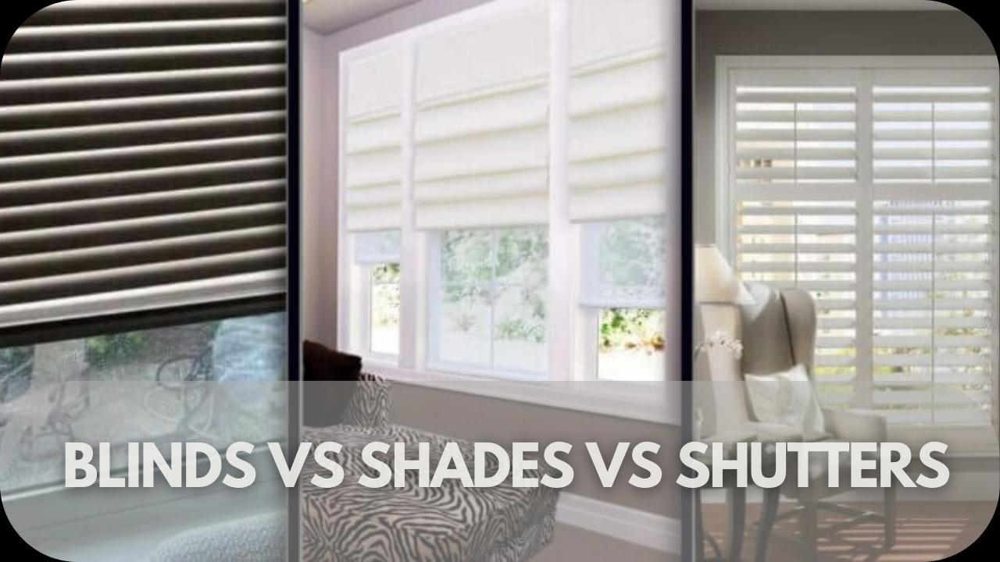

✨萤火之光·点亮远方✨
CCL 咨询请找小助手
761
761
【萤火虫老师Tips】
Blinds 百叶窗/百叶帘(可升降)；shades 卷帘；shutters 木质百叶窗
11. Good call! Making sure you are happy with it for years is important! You don’t want
to redecorate again too soon.
（明智的选择！确保这个装修能让你喜欢很多年是很重要的，谁都不想太快重新折
腾/装修一遍。）
12. 我同意你说的。所以，我们会用简单素净的设计，然后用小地毯这种容易换的小东
西来增加一些鲜艳的色彩。
(I agree. That’s why we’ll go for simple and neutral designs and add some bright colors
with easy-to-swap items like rugs.)
13. Love that idea! Seriously can’t wait to see it finished. You must send me photos! I bet
it’s going to look fantastic!
(这主意好！真是都等不及想看成果了！你一定得发照片给我！我觉得肯定会超级好
看！)
\n

\n✨萤火之光·点亮远方✨
CCL 咨询请找小助手
762
762
14. 我也等不及请你来参观了！不过，还得等一阵子，收尾工作比预想耗时。我也不想
太赶了。
(Can’t wait to show you either/ I’m looking forward to having you over too! Still need
some time though – the finishing touches take/are taking longer than expected. Don't
want to rush things either/ I don’t want to rush it either.)
— End of Dialogue —
\n

\n✨萤火之光·点亮远方✨
CCL 咨询请找小助手
763
763
#70240. A New Creamy Leather Lounge Chair –Business
Briefing：The following dialogue takes place in a café between two friends. They are
discussing buying a new lounge chair and how to pay for it. The dialogue starts now.
1. Hey, great to see you! We’ve finally got a chance to catch up.
（嘿，好高兴见到你！我们终于有机会聚一聚了。）
2. 对啊，咱们好久没坐下来慢慢喝咖啡聊聊天了。
(/Yeah, it’s been ages since we last sat down to enjoy coffee and chat. /Right, we haven’t
had a chance to relax over coffee and talk in so long.)
3. How’s your day going? You mentioned you were browsing the mall before coming
here to meet me.
（你今天过得怎么样？你说你来这跟我见面之前还在逛商场呢。）
4. 对，我就是想买把新休闲椅，所以一直在商场里逛，想挑个质感好的。
(Yeah, I just want to buy a new lounge chair, so I’ve been looking around/browsing the
mall for one that feels really nice/for a good-quality one.)
5. That’s awesome. Big stores have loads of options. But furniture can be expensive,
depending on what you want.
（那太好了。大商场的选择多得很。不过家具可不便宜啊，这要看你想要什么样的
了。）
6. 我看上了一款奶油色皮质沙发，很对我胃口，可价格不算低。我不太确定最划算的
付款方式是怎样的。
(I spotted a cream-colored leather sofa that I really like, but it isn’t cheap. I’m not sure
which payment method makes the most sense.)
\n

\n✨萤火之光·点亮远方✨
CCL 咨询请找小助手
764
764
7. You could go with one of those ‘Buy Now, Pay Later’ services. Nowadays almost
every store offers them.
（你可以选择那种‘先买后付’服务，现在几乎所有店都有这种选项。）
8. 要是可以分次付款，就太棒了。这样的话，我就能立刻把皮沙发搬回家了。
(It’d be great to split the payment/pay in installments, then I could take the leather sofa
home right away.)
9. True, but watch out for extra fees, and skipping an installment payment could affect
your credit score.
（没错，不过要留意额外费用，漏交一笔分期付款还可能影响你的信用记录/分哦。）
10. 我知道对于这种‘先买后付’要谨慎点，可是感觉挺适合我的。毕竟，我只买这一
件东西。
(I get that ‘Buy Now, Pay Later’ needs caution, but I feel it might work well for me.
After all, I’m only buying this one thing.)
11. It’s smart to think about your best payment options for big purchases. You could
save money or make it easier to pay.
（考虑一下大额消费的最佳付款方式是明智的。你可能可以省钱，或者让付款更轻
松。）
12. 我也这么觉得。我今晚好好比对一下，再明天去店里决定。我觉得这沙发放客厅肯
定很棒。
(I agree. I’ll carefully compare them tonight and decide at the store tomorrow. I bet/think
that sofa would look fantastic in the living room.)
13. Creamy leather sounds a perfect choice. How about we grab a slice of cake with our
coffee to celebrate?
（奶油色的皮革，这选择听着太完美了。要不咱俩喝咖啡时再加块蛋糕，庆祝一下？）
\n

\n✨萤火之光·点亮远方✨
CCL 咨询请找小助手
765
765
14. 听起来很完美。我逛完这一圈，肚子都饿扁了。希望一切都顺利。
(Sounds perfect. I’m starving after all that shopping. Hope it all works out.)
— End of Dialogue —
\n

\n✨萤火之光·点亮远方✨
CCL 咨询请找小助手
766
766
#70241. Suite Bathroom Design Clarification–Business
Briefing：This dialogue takes place between a Mandarin-speaking house owner and an
English-speaking builder. The conversation takes place at the construction site. The
dialogue starts now.
1. Hey, the office mentioned you’d drop by to visit the site again today. I bet you'll be
pleased with the progress.
（嗨，办公室那边说你今天要再来工地一趟。我相信你会对进度满意的。）
2. 对啊，我就在附近上班，顺路过来看看挺方便的。看着新房子一点点盖起来，我超
激动的。
(Yeah, I work nearby so it’s easy to swing by. I'm thrilled watching my new house take
shape. / I’m so excited watching the new house being built little by little!)
3. The crew has now finished the walls, floors, and doors. The supplier has finally
delivered the materials early last week.
（施工队/工人们现在已经做完墙壁、地板和门了。上周早些时候，供应商总算把材
料送到了。）
4. 速度真快！因为材料送过来的时间延期了，我本来还以为需要更长的时间呢。现在
材料好像都很难买，运输也很慢。
(That was quick! Since the material delivery was delayed, I thought it would take longer.
Nowadays it seems really hard to get materials, and shipping is so slow too.)
5. True, and material prices have gone up too. Since you’re here, I’d like to go over the
plans with you.
（没错，材料现在也涨价了。既然你来了，我想和你一起过一下图纸。）
\n

\n✨萤火之光·点亮远方✨
CCL 咨询请找小助手
767
767
6. 没问题。我感觉我每天晚上回家都会看施工图纸。所以每个房间具体会是什么样子
的，我都清清楚楚。
(No problem. I feel like I check the construction plans/blueprints every night when I get
home. So, I know exactly what each room will look like.)
7. The plumber’s working on the suite bathroom now. I just want to double-check you
haven’t changed the plan for it.
（现在水管工在弄套房的浴室。我只是想再次确认一下你没有改那一块的图纸。）
8. 我没改。我希望没有什么问题。我那个套间的浴室是围绕着一个精美的老式浴缸而
设计的。
(No changes. I hope there won’t be any issues. The bathroom in my suite is designed
around a beautiful vintage bathtub.)
9. I’ll need to speak with him. He was going to include a shower in the bathroom. But
he hasn’t started yet. There shouldn’t be any problems.
（我得跟他聊聊。他打算在浴室加个淋浴。不过他还没开始弄呢。应该没问题。）
10. 我很喜欢泡澡，所以我绝对不想在套间的浴室装淋浴。我们的主浴室已有一个淋浴
间了。
(I really enjoy soaking in the bath, so I absolutely don’t want a shower in my suite(’s)
bathroom. Our master bathroom already has a shower (stall).)
11. It struck me as a bit strange this morning. That’s why I inspect the site every day.
（我今早上看着就突然觉得有点怪/不对劲，这也是为什么我每天都要到工地检查的
原因。）
12. 太感谢了，让我放心多了。你这么快就能发现和解决问题，真的太棒了。
(Thanks so much. That really puts my mind at ease. It’s so great you can catch/spot and
fix issues promptly.)
\n

\n✨萤火之光·点亮远方✨
CCL 咨询请找小助手
768
768
13. Of course. I believe in looking after my customers, and I know how important it is to
keep track of everything.
（当然。我是客户至上的/我坚信得把客户服务好，而且我也知道每件事都把控好/
跟进好/盯紧了有多重要。）
14. 设计这个房子有这么多的事情要做呀！我不知道盖一个房子需要这么复杂。
(There are so many things to do when/in designing this house! / Designing a house
involves so many things to do! I had no idea building a house could be this complicated.)
【萤火虫老师Tips】

第一句如果翻译成"There are so many things to do to design this house." 语法正确，
但听起来显得重复（连续两个"to"），容易扣分。
— End of Dialogue —
\n

