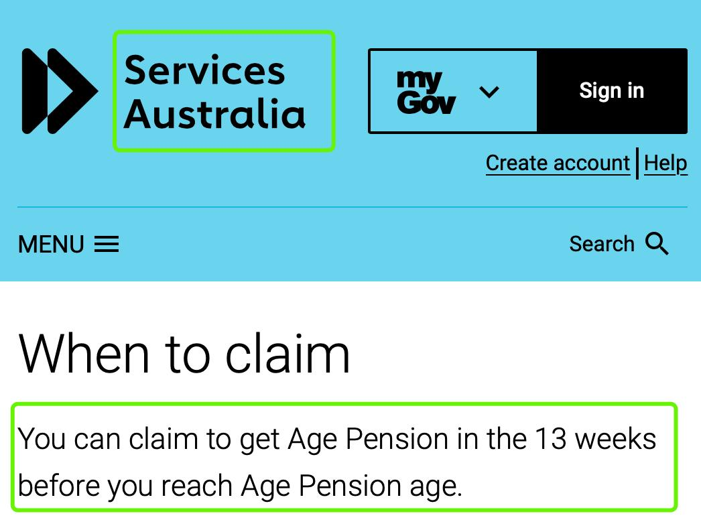

✨萤火之光·点亮远方✨
CCL 咨询请找小助手
81
81
Briefing: This dialogue takes place between a police officer from Sunshine Coast police
station and Ms Zhu.
1.
Mr. Brown: Hello, my name is Henry. I’m a senior police officer from Sunshine
Coast police station. How can I help you today?
(你好。我是亨利。我是阳光海岸警察局的高级警官。我今天能如何为你效劳呢？)
2.
Ms. Zhu: 你好，我昨天接到一个自称是移民局的电话，说我涉嫌诈骗，已经成了全
球通缉犯，并且不可以出境了。
(Hello. I received a phone call yesterday saying that he’s calling from the Department of
Home Affairs. He said that I was suspected of fraud and I was now globally wanted, and I
was not allowed to leave the country.)
3.
Mr. Brown: That’s not true. It is a scam. We have received many cases like this
recently. This is a phone scam. They ask people to add them in WeChat, and
transfer money to them as a fine.
(这是假的。这是诈骗。我们最近接到了很多这样的案子。这是一个电话诈骗。他们
还让人们在微信上加他们，然后转钱给他们，作为罚款。)
【萤火虫老师Tips】

Scam 诈骗

补充引申重点词：fraud，动词欺诈，名词表示骗子
4.
Ms. Zhu: 是啊，他们还问我银行账户信息。他们让我每天登陆微信，汇报每天的行
程。还让我在手机上下载一个软件。
(Yes. They asked me about my bank account information. They asked me to log on my
WeChat everyday and report my whereabouts every day. They also asked me to
download an application on my phone.)
\n

\n✨萤火之光·点亮远方✨
CCL 咨询请找小助手
82
82
5.
Mr. Brown: May I have a look at your phone? Then I can check the communication
history between you and the scammer, but I don’t know what program he asked you
to install.
(我可以看一眼你的电话吗？这样我可以看一下你和诈骗犯之间的聊天记录。不过我
不太清楚他让你安装什么程序呢？)
【萤火虫老师Tips】

这里的communication history ，后面考到的同学补充，改为conversation
history( 聊天记录)
6.
Ms. Zhu: 好的，就是这个软件。你看吧。那我银行资料和里面的钱怎么办？我需要
通知银行这件事吗？我需要卸载这个软件吗？
(Okay. It’s just this one. Take your time. What about my bank account information and
the money in it? Do I need to notify the bank about this? Do I need to uninstall this
application?)
7.
Mr. Brown: No, they will ask you to transfer money to them by Western Union. And
because you haven’t done this, your money in your bank should be safe. As for the
app, I suggest you go to the phone store to do a restore and then delete it
professionally.
(不。他们会让你通过西联汇款转钱给他们转钱。而且因为你还没转，你银行里的钱
应该是安全的。至于那个程序，我建议你去手机店复原一下手机，用专业手段把那
个程序删掉。)
【萤火虫老师Tips】

补充引申词：Westpac：西太平洋银行
8.
Ms. Zhu: 如果是这样，那我就放心多了。我一会儿就去手机店把这个软件卸载了。
(I feel much relieved if that's the case. I’ll go to a phone store to uninstall that
application.)
\n

\n✨萤火之光·点亮远方✨
CCL 咨询请找小助手
83
83
9.
Mr. Brown: Ok. I will send the screenshot of the chat history via email for detection.
Then the investigation can be conducted according to the information obtained from
the chat history.
(好的。我会把聊天记录的截图用邮件发过来检查一下的。然后就可以根据聊天记录
里面获取的信息进行调查。)
10. Ms. Zhu: 这些人真的是太贼了！我需不需要跟中国的警察报案？这样的话，中国警
察可以追踪他们的电话号码，然后尽快抓到他们。
(They are so sneaky! Do I need to report to the police in China? In that case, their phone
number can be traced, and they can be caught as soon as possible.)
【萤火虫老师Tips】

Report to the police 向警察报案，不要翻报告哈，注意词汇在具体语境当中的翻
译变化
11. Mr. Brown: That is definitely a good idea and your report will help them with the
investigation.
(这绝对是个好主意。你去报案也可以帮助他们调查。)
12. Ms. Zhu: 谢谢你今天的帮助。我也要告诉我的朋友，以防他们遭受同样的情况。
(Thank you for your help today. I’ll tell my friends in case they have the same
experience.)
— End of Dialogue —
\n

\n✨萤火之光·点亮远方✨
CCL 咨询请找小助手
84
84
#70022. Age Pension - Social Welfare
Briefing: The following dialogue takes place between a mandarin speaking resident and
an officer from a local branch of Centrelink. The dialogue starts now.
1.
Officer：Come in and take a seat please. I’m Ben from Centrelink. It’s good to see
you in person. What can I do for you today?
(请进来坐吧。我是社会福利联络中心的本。很高兴见到您本人。今天能为您做些什
么呢？)
2.
Resident：您好。朋友跟我说，我可以申请明年八月的养老金，因为那时候我就66
岁了，作为水管工退休。
(Hello. My friend told me that I can claim to get age pension in August next year,
because I’ll be 66 years old then and will retire as a plumber.)
【萤火虫老师Tips】

Age pension 养老金(CCL 必考词汇)

Superannuation 退休公积金(CCL 必考词汇)
\n

\n✨萤火之光·点亮远方✨
CCL 咨询请找小助手
85
85

Plumber 水管工，注意发音，“b” 不发言
3.
Officer：There are some eligibility criteria that you need to meet, such as your age
and residency. I mean, this pension is for Australian permanent residents and
citizens only.
(有一些资格条件是您需要满足的，比如您的年龄和居民身份。我的意思是，这个养
老金是仅为澳大利亚永久居民和公民设置的。)
4.
Resident：我已经成为澳大利亚公民20 年了。当时我拿的配偶签证来的澳大利亚。
(I have been an Australian citizen for 20 years. I came to Australia on a partner visa at
that time.)
5.
Officer：That’s great. The reason I asked is that to get the Age Pension you need to
meet a 10-year-residency requirement. Moreover, for at least 5 of these years, there
must be no break in your residence.
(那很好。我这样问的原因是，你需要满足十年居民身份要求，才能拿到养老金。除
此之外，其中至少五年，你需要连续居住在澳大利亚。)
【萤火虫老师Tips】

Residency：表示居住权/居民身份比如：permanent residency 永久居民身份/永
久居住权

Residence 一般表示居住，住宅。比如填表的时候经常会有一项primary residence,
这一栏是需要填你的主要住址的地址
6.
Resident：好的。对了，我还想起来一点，我退休以后就没有工作了，也没有收入
了。我老伴也是最近十年都没有工作。
(Okay. It just occurred to me that I won't have work or income after my retirement. My
spouse also hasn’t worked for the recent 10 years.)
\n

\n✨萤火之光·点亮远方✨
CCL 咨询请找小助手
86
86
7.
Officer：Thanks for the information. You need to go through an income and assets
test to determine your payment. The income will consist of all sources of funds. Do
you have any property, assets or overseas income? What about investment property,
superannuation or shares?
(感谢您提供的信息。你需要通过一个收入资产评估来确定您能拿到的金额。你的收
入会包括所有的资金来源。您有任何房产，资产或者海外收入吗？或者有什么投资
房，退休金或者股票吗？)
8.
Resident：哦，说到资产，我的理财师告诉我，我们有一栋共同房产，价值60 万(这
个数字比较确定)澳币。我们还有股票和其他投资，价值大概在五万四千元(这个数
字不确定)左右。这些资产都是在我和我老伴联名的。
(Speaking of assets, according to my financial planner, we have a property which is
worth 600,000 Australian dollars. We also have shares and other investments, which are
worth around 54,000 Australian dollars. We are the joint owners of these assets/These are
all under the names of my wife and mine.)
9.
Officer：Well, we will look at the type and value of any assets you own in and outside
of Australia. The value of your assets is what you’d get if you sold them at market
value. Your income seems to be over a certain threshold of 36,000 and you may only
get part of the pension.
(这样啊。你们在澳大利亚境内和境外拥有的任何财产及其价值我们都会看的。你的
财产的价值是指你出售它们的市场价值。你的收入似乎超过了一个36，000 澳币的
门槛，这样你可能只能拿到一部分的养老金了。)
10. Resident：那我只能拿到一部分养老金了啊？好吧，我还听说我能拿到两种不同的
福利补贴。您能具体给我说一说吗？
(Then I can only get a part of age pension, right? I heard that I could get two different
kinds of benefits. Could you explain it to me in detail?)
11. Officer：Sure. You can get a Pensioner Concession Card for cheaper prescription
and other health services. You can also get a Commonwealth Seniors Health Card
\n

\n✨萤火之光·点亮远方✨
CCL 咨询请找小助手
87
87
so that you could receive life services provided by the state government and your
local council.
(你可以拿到一张福利金领取者优惠卡，这样可以以更低的价格购买处方药和享受其
他医疗服务。你也可以拿到一张联邦老年健康卡，这样你就可以享受州政府和当地
市政厅提供的生活服务了。)
12. Resident：那我就放心一些了。至少我还是能从政府领到一部分福利的。谢谢您的
帮助。
(Then I'm relieved to some extent. At least I can get part of goverment benefits. Thank
you for your help.)
— End of Dialogue —
\n

\n✨萤火之光·点亮远方✨
CCL 咨询请找小助手
88
88
#70023. Parent Immigration - Immigration
Briefing: The following dialogue takes place between an English-speaking officer and a
mandarin speaking woman who would like to make an inquiry regarding her mother’s
immigration to Australia. The dialogue starts now.
1.
Officer：Good morning, Mrs Ma. I’m glad that I can finally meet you.
(早上好，马太太。很高兴总算能见到你了。)
2.
Miss Ma：早上好，不好意思我迟到了，因为我找不到你的办公室。都是我的错，
我在全球定位系统里输入的地址是错的。
(Good morning. I’m sorry that I’m late because I couldn’t find your office. It’s all my
fault. I put a wrong address in the GPS.)
3.
Officer：It’s not good. Let’s quickly get into the things you feel concerned about. Is it
about your mother’s visa application?
(这可不太好。我们快点来看看你担心的事吧。是关于你母亲签证申请的问题吧？)
4.
Miss Ma：好的。我和我先生想了很久，打算让我中国的母亲移民过来，但是前段
时间遇到一些问题耽搁了。
(Okay. After thinking for a long time, my husband and I decided to ask my mother in
China to migrate here. However, there were some problems and things got delayed.)
5.
Officer：What kind of delay do you mean?
(你说的耽误是指什么呢？)
6.
Miss Ma：我母亲想把国内的房子卖了，但是出了点问题。现在总算成功卖掉了，
所以想尽快办移民手续。
(My mother wanted to sell her property in China, but something happened. Now it was
finally sold, therefore, we would like her to migrate here as soon as possible.)
\n

\n✨萤火之光·点亮远方✨
CCL 咨询请找小助手
89
89
【萤火虫老师Tips】

Property 可以多指房产，在不确定是house 还是apartment 的时候，property 是一
个保险的选择
7.
Officer：Ok, when does your mother plan to come and how long will she stay? I’m
asking this to find out the most suitable visa for her.
(好的，您母亲计划什么时候来，以及呆多久呢？我之所以这样问，是为了找到最适
合她的签证。)
8.
Miss Ma：我们希望她能尽快来。我们有5 个孩子，特别需要帮忙。
(We hope she could be here as soon as possible. We have five children and we are in
desperate need of help.)
9.
Officer：As a father of four，I totally understand. We couldn’t have managed it
without the help of my mother-in-law. Have you heard of the new visa reform?
(作为四个孩子的父亲，我完全能够理解你。如果不是我丈母娘的帮忙，我们也忙不
过来。你听说过新签证改革吗？)
10. Miss Ma：是的，我听说现在的父母签证将会被临时父母签证取代。我很担心这个。
(Yes. I heard the current parent visa will be replaced by a temporary parent visa. I’m very
concerned about it.)
【萤火虫老师Tips】

Be concerned about something 担心/担忧某事

Some of the students concerned have to take the exam again 这里面concerned 是
“涉事的，与某事有关的”

As far as someone is concerned: 在某人看来

Concerning something 的时候是“关于”某事。
\n

\n✨萤火之光·点亮远方✨
CCL 咨询请找小助手
90
90
11. Officer：Yes, the proposed temporary sponsored parent visa will only allow her to
join you in Australia. However, she will not be eligible for Medicare and she needs
to pay for her private health insurance.
(是的。临时类担保父母签证提案只能让她来澳跟你团聚。然而，她没有资格享受国
民医保，并且她需要购买私人医保。)
【萤火虫老师Tips】

团聚如果想用reunion, 记得这是个名词，动词是reunite, 但是这个词略微有点
书面，常见是家庭团聚签证，叫family reunion visa
12. Miss Ma：医疗保险的费用也太贵了，一个月要2000 块，她根本负担不了。有别的
办法吗？
(That’s too expensive. It’s 2000 dollars per month. It’s impossible for her to afford it. Are
there any other options?)
13. Officer ：Yes, but if I were you, I won’t be worried about this now because the
proposed parent visa has not been finally approved yet.
(是啊。不过如果我是你的话，我不会担心这个的，因为提议的父母签证还没最终
获批呢。)
— End of Dialogue —
\n

