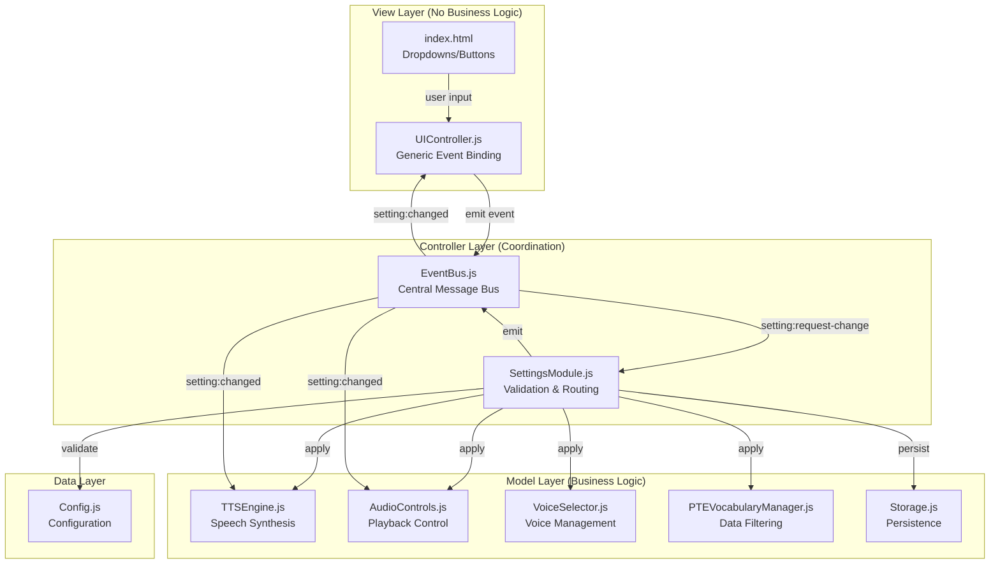

# Architecture Analysis: Design Logic & Module Interactions

**Date**: 2025-10-08  
**Status**: 🔍 Critical Analysis

## Executive Summary

The BEST-PRACTICES-REFACTORING.md document **successfully eliminated hardcoded values** but **failed to address fundamental architectural issues**:

1. ❌ **Settings are NOT properly centralized** - Logic scattered across UIController, SettingsManager, and engine calls
2. ❌ **Tight coupling** - UIController directly calls engine methods
3. ❌ **Inconsistent module interactions** - Mix of direct calls and EventBus
4. ❌ **No clear separation of concerns** - UI layer knows about business logic
5. ❌ **Limited scalability** - Adding new settings requires editing 3+ files

---

## Current Architecture Problems

### Problem 1: Dual Responsibility Anti-Pattern

**Current Flow (BROKEN):**
```
User changes dropdown
    ↓
UIController.addEventListener()
    ↓
├─→ window.ttsEngine.setSpeechRate()      ❌ Direct engine call
└─→ window.settingsManager.updateSetting() ❌ Separate persistence
```

**Issues:**
- Two separate actions for one user intent
- UIController has engine knowledge (violation of SoC)
- Settings persistence is an afterthought, not core
- Order matters (what if engine fails but setting saves?)

### Problem 2: Scattered Settings Logic

**Where settings are handled:**
```
src/js/ui/UIController.js         → 8 event listeners (80 lines)
src/js/core/SettingsManager.js    → Storage & retrieval
src/js/audio/TTSEngine.js         → Applies speed setting
src/js/audio/AudioControls.js     → Applies delay/repeat settings
src/js/audio/VoiceSelector.js     → Applies voice setting
src/js/core/PTEVocabularyManager.js → Applies difficulty setting
```

**Result**: No single place to understand how settings work!

### Problem 3: Inconsistent Communication Patterns

**EventBus is underutilized:**
```javascript
// SOME modules use EventBus (good)
window.eventBus.emit('word:display', { word, index });

// But settings use DIRECT CALLS (bad)
window.ttsEngine.setSpeechRate(value);
window.audioControls.setDelay(value);
```

**Why this matters:**
- Can't intercept settings changes
- Can't log/debug easily
- Can't implement undo/redo
- Can't validate before applying
- Hard to test

### Problem 4: No Validation Layer

**Current:**
```javascript
// UIController.js
document.getElementById('speedSelect').addEventListener('change', (e) => {
    window.ttsEngine.setSpeechRate(parseFloat(e.target.value)); // ❌ No validation!
    window.settingsManager.updateSetting('speed', e.target.value);
});
```

**What if:**
- User manipulates DOM to set speed to `999`?
- Voice name is invalid?
- Delay is negative?
- Setting is incompatible with current mode?

**Answer**: Application breaks! 💥

### Problem 5: Poor Scalability

**To add a new setting, you must edit:**
1. `Config.js` - Add default value
2. `SettingsManager.js` - Add `getAvailableOptions()` case
3. `UIController.js` - Add event listener (10 lines of boilerplate)
4. `UIController.js` - Add `populateDropdown()` call
5. `index.html` - Add `<select>` element
6. Target engine/manager - Add method to apply setting

**Result**: 6 files changed for 1 setting! 😱

---

## Ideal Architecture: Event-Driven Settings Module

### Proposed Module Interaction Flow



### Key Principles

1. **Single Responsibility**
   - UIController: Only emit events
   - SettingsModule: Only validate & route
   - Engines: Only apply settings

2. **Event-Driven Communication**
   - All settings flow through EventBus
   - No direct module-to-module calls
   - Loose coupling

3. **Centralized Validation**
   - One place to validate all settings
   - Consistent error handling
   - Easy to add validation rules

4. **Separation of Concerns**
   - View layer doesn't know about engines
   - Controller layer doesn't know about DOM
   - Model layer doesn't know about UI

5. **Testability**
   - Mock EventBus for unit tests
   - Test each module independently
   - No global state dependencies

---

## Detailed Design: SettingsModule

### Core Responsibilities

1. **Validation** - Ensure settings are valid before applying
2. **Routing** - Apply settings to correct engines
3. **Persistence** - Save settings to storage
4. **Events** - Emit success/failure events
5. **Defaults** - Provide default values

### Handler Registry Pattern

```javascript
class SettingsModule {
    initializeHandlers() {
        return {
            // Each setting has a handler with:
            // - validate: Check if value is valid
            // - apply: Apply to engine/manager
            // - default: Get default value
            // - dependencies: Settings that affect this one
            
            speed: {
                validate: (value) => {
                    const speeds = Object.values(this.config.get('tts.speeds'));
                    return speeds.includes(parseFloat(value));
                },
                apply: (value) => {
                    return window.ttsEngine?.setSpeechRate(parseFloat(value));
                },
                default: () => String(this.config.get('tts.speeds.slow')),
                dependencies: []
            },
            
            delay: {
                validate: (value) => {
                    const delays = { short: 1000, normal: 2000, long: 3000 };
                    return Object.values(delays).includes(parseInt(value));
                },
                apply: (value) => {
                    return window.audioControls?.setDelay(parseInt(value));
                },
                default: () => String(this.config.get('tts.delays.long')),
                dependencies: []
            },
            
            learningMode: {
                validate: (value) => {
                    const modes = this.config.get('data.learningModes');
                    return modes.some(m => m.id === value);
                },
                apply: async (value) => {
                    await window.pteVocabularyManager?.setLearningMode(value);
                },
                default: () => 'pte-fib-listening',
                dependencies: ['difficulty'] // Changing mode affects difficulty
            },
            
            difficulty: {
                validate: (value) => {
                    return this.config.get('data.difficulties').includes(value);
                },
                apply: (value) => {
                    return window.pteVocabularyManager?.setDifficulty(value);
                },
                default: () => 'all',
                dependencies: []
            }
            
            // ... more handlers
        };
    }
}
```

### Benefits of Handler Registry

1. **Declarative Configuration** - Each setting defined once
2. **Easy to Extend** - Add new handler, done
3. **Consistent Validation** - All settings validated same way
4. **Self-Documenting** - Handler shows all setting behavior
5. **Type Safety** - Can add TypeScript types to handlers

---

## Module Interaction Scenarios

### Scenario 1: User Changes Speed Setting

**Current (Broken) Flow:**
```
1. User selects "Fast" in dropdown
2. UIController event listener fires
3. UIController calls window.ttsEngine.setSpeechRate(1.3)
4. UIController calls window.settingsManager.updateSetting('speed', '1.3')
5. SettingsManager saves to storage
```

**Problems:**
- ❌ UIController knows about TTSEngine
- ❌ No validation (what if 1.3 is invalid?)
- ❌ Two separate actions
- ❌ Hard to test
- ❌ Can't intercept/log

**Proposed (Event-Driven) Flow:**
```
1. User selects "Fast" in dropdown
2. UIController emits 'setting:request-change' event
3. SettingsModule receives event
4. SettingsModule validates value (1.3) against config
5. SettingsModule calls handler.apply(1.3)
6. TTSEngine receives setSpeechRate(1.3)
7. SettingsModule saves to storage
8. SettingsModule emits 'setting:changed' event
9. UI updates (if needed)
```

**Benefits:**
- ✅ UIController doesn't know about TTSEngine
- ✅ Validation before applying
- ✅ Single action
- ✅ Easy to test (mock EventBus)
- ✅ Can log all changes

### Scenario 2: User Switches Learning Mode

**Current Flow:**
```
1. User selects new mode
2. UIController calls pteVocabularyManager.setLearningMode()
3. UIController calls settingsManager.updateSetting()
4. UIController calls updateCategoryDisplay()
```

**Problems:**
- ❌ UIController has too many responsibilities
- ❌ Business logic in UI layer
- ❌ Hard to add side effects (e.g., clear progress)

**Proposed Flow:**
```
1. User selects new mode
2. UIController emits 'setting:request-change'
3. SettingsModule validates mode
4. SettingsModule applies to VocabularyManager
5. SettingsModule checks dependencies (difficulty might change)
6. SettingsModule emits 'learningMode:changed'
7. Multiple modules listen and react:
   - UIController: Update category display
   - ProgressTracker: Clear progress for new mode
   - DatasetManager: Load new dataset
8. SettingsModule persists to storage
```

**Benefits:**
- ✅ Dependency handling automatic
- ✅ Multiple reactions to one change
- ✅ Easy to add new reactions
- ✅ UIController stays simple

### Scenario 3: Programmatic Setting Change (API)

**Current Problem:**
```javascript
// From code (e.g., preset, import settings)
// Must manually update both engine and storage
window.ttsEngine.setSpeechRate(0.7);
window.settingsManager.updateSetting('speed', '0.7');
```

**Proposed Solution:**
```javascript
// Single API call
window.eventBus.emit('setting:request-change', {
    key: 'speed',
    value: '0.7'
});

// Or use SettingsModule directly
await window.settingsModule.changeSetting('speed', '0.7');
```

**Benefits:**
- ✅ Consistent behavior (UI vs programmatic)
- ✅ Validation works same way
- ✅ Events fire same way
- ✅ One API to learn

---

## Scalability Analysis

### Current Architecture Scalability: ⭐⭐ (2/5)

**Why low:**
- Adding setting requires 6 file edits
- Code duplication for each setting
- No abstraction for common patterns
- Hard to maintain consistency

### Proposed Architecture Scalability: ⭐⭐⭐⭐⭐ (5/5)

**Why high:**
1. **Add Setting in 3 Steps:**
   ```
   1. Add to Config.js (default value, options)
   2. Add handler to SettingsModule (validate, apply, default)
   3. Add HTML dropdown (UIController auto-binds)
   ```

2. **Generic Binding:**
   ```javascript
   // UIController - ONE loop for ALL settings
   const settingControls = [
       { elementId: 'speedSelect', settingKey: 'speed' },
       { elementId: 'newSettingSelect', settingKey: 'newSetting' } // Just add this!
   ];
   ```

3. **Automatic Features:**
   - Validation: Defined in handler
   - Persistence: Automatic
   - Events: Automatic
   - Logging: Automatic
   - Undo/Redo: Easy to add

4. **Easy Extensions:**
   ```javascript
   // Want to add setting presets?
   settingsModule.loadPreset('beginner'); // Loads multiple settings at once
   
   // Want to export settings?
   const mySettings = settingsModule.exportSettings(); // Returns JSON
   
   // Want to listen to all changes?
   eventBus.on('setting:changed', logSettingChange);
   ```

---

## Migration Strategy

### Phase 1: Create SettingsModule (Non-Breaking)
**Goal**: Add new module without breaking existing code

**Steps:**
1. Create `src/js/core/SettingsModule.js`
2. Implement handler registry
3. Implement event listeners
4. Add unit tests
5. Deploy alongside existing code

**Duration**: 1-2 days

### Phase 2: Dual Mode (Compatibility)
**Goal**: Run old and new systems in parallel

**Steps:**
1. Make engines listen to both direct calls AND events
2. Keep UIController dual-calling (old + new)
3. Verify both paths work
4. Add feature flag to switch between modes

**Duration**: 1 day

### Phase 3: Cutover (Breaking Changes)
**Goal**: Remove old system

**Steps:**
1. Update UIController to ONLY emit events
2. Remove dual-call logic
3. Remove old SettingsManager methods
4. Clean up direct calls from engines
5. Update documentation

**Duration**: 1 day

### Phase 4: Enhancements
**Goal**: Add features only possible with new architecture

**Steps:**
1. Add setting presets (Beginner, Intermediate, Advanced)
2. Add settings export/import
3. Add undo/redo
4. Add validation messages
5. Add settings change log

**Duration**: 2-3 days

**Total Migration**: ~1 week

---

## Code Quality Metrics

### Current Implementation

| Metric | Score | Notes |
|--------|-------|-------|
| **Maintainability** | ⭐⭐ | Edit 6 files per setting |
| **Testability** | ⭐⭐ | Need to mock 5+ globals |
| **Scalability** | ⭐⭐ | Code duplication grows linearly |
| **Coupling** | ⭐ | Tight coupling everywhere |
| **Cohesion** | ⭐⭐ | Mixed responsibilities |
| **DRY** | ⭐ | 8 identical event listeners |
| **SOLID** | ⭐ | Violates SRP, DIP, OCP |

**Average**: ⭐⭐ (2/5)

### Proposed Implementation

| Metric | Score | Notes |
|--------|-------|-------|
| **Maintainability** | ⭐⭐⭐⭐⭐ | Edit 1-2 files per setting |
| **Testability** | ⭐⭐⭐⭐⭐ | Mock EventBus only |
| **Scalability** | ⭐⭐⭐⭐⭐ | O(1) complexity to add setting |
| **Coupling** | ⭐⭐⭐⭐⭐ | Loose coupling via events |
| **Cohesion** | ⭐⭐⭐⭐⭐ | Single responsibility modules |
| **DRY** | ⭐⭐⭐⭐⭐ | One generic loop |
| **SOLID** | ⭐⭐⭐⭐⭐ | Follows all principles |

**Average**: ⭐⭐⭐⭐⭐ (5/5)

---

## Critical Architectural Decisions

### Decision 1: EventBus vs Direct Calls

**Current**: Mix of both (inconsistent)
**Recommendation**: **EventBus for ALL cross-module communication**

**Rationale:**
- Decouples modules
- Easy to add observers
- Testable
- Debuggable (can log all events)

### Decision 2: Where to Put Validation

**Current**: No validation
**Recommendation**: **Centralized in SettingsModule**

**Rationale:**
- One place to maintain
- Consistent across UI and API
- Can add complex rules
- Can show user-friendly errors

### Decision 3: Settings State Management

**Current**: Scattered (SettingsManager, engines, Storage)
**Recommendation**: **Single source of truth in SettingsModule**

**Rationale:**
- Always know current state
- Can implement undo/redo
- Can compare before/after
- Can batch updates

### Decision 4: Backward Compatibility

**Current**: N/A
**Recommendation**: **Dual mode during migration, then clean break**

**Rationale:**
- Less risky
- Can test thoroughly
- Can roll back if issues
- Clean codebase after migration

---

## Comparison: BEST-PRACTICES-REFACTORING.md vs This Analysis

### What BEST-PRACTICES-REFACTORING.md Did Well ✅

1. Eliminated hardcoded HTML options
2. Centralized configuration in Config.js
3. Made dropdowns dynamically populated
4. Documented changes clearly

### What It Missed ❌

1. **Module interactions** - Didn't improve how modules communicate
2. **Coupling** - UIController still tightly coupled to engines
3. **Validation** - No validation layer added
4. **Scalability** - Still requires 6 file edits per setting
5. **Event architecture** - Didn't leverage EventBus properly
6. **Testing** - Didn't improve testability

### This Analysis Addresses

1. ✅ **Complete architecture review** - Analyzed whole system
2. ✅ **Module interaction design** - Event-driven communication
3. ✅ **Scalability strategy** - Handler registry pattern
4. ✅ **Migration path** - Phased approach
5. ✅ **Quality metrics** - Measurable improvements
6. ✅ **Design patterns** - Proper application of patterns

---

## Recommendations

### Immediate Actions (High Priority)

1. **Implement SettingsModule** - Core architecture improvement
2. **Refactor UIController** - Remove engine dependencies
3. **Add validation layer** - Prevent invalid settings
4. **Write unit tests** - Verify module interactions

### Medium Term (Next Sprint)

1. **Add setting presets** - Beginner/Intermediate/Advanced
2. **Implement undo/redo** - Better UX
3. **Add settings export/import** - Share configurations
4. **Add change logging** - Debug issues

### Long Term (Future Releases)

1. **TypeScript migration** - Type safety for handlers
2. **Settings versioning** - Handle breaking changes
3. **Remote settings sync** - Cross-device settings
4. **A/B testing framework** - Test setting impacts

---

## Conclusion

**BEST-PRACTICES-REFACTORING.md was a good first step** but addressed only the surface issue (hardcoded values). 

**This analysis reveals the deeper architectural problems:**
- Settings are not truly centralized
- Modules are tightly coupled
- No event-driven architecture
- Poor scalability
- Hard to test and maintain

**The proposed SettingsModule architecture:**
- ✅ Truly centralizes settings logic
- ✅ Decouples modules via EventBus
- ✅ Highly scalable (handler registry)
- ✅ Easy to test (event mocking)
- ✅ Follows SOLID principles
- ✅ Enables future features

**Recommendation**: **Implement SettingsModule refactoring** as described in SETTINGS-REFACTORING-PROPOSAL.md

---

**Next Step**: Get your approval to implement the SettingsModule architecture. This will be a **game-changer** for the project's maintainability and scalability! 🚀
