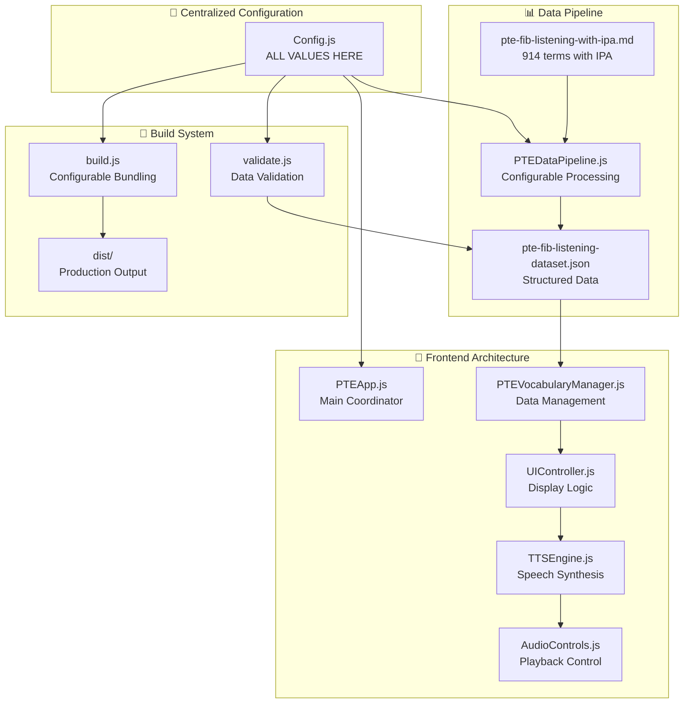
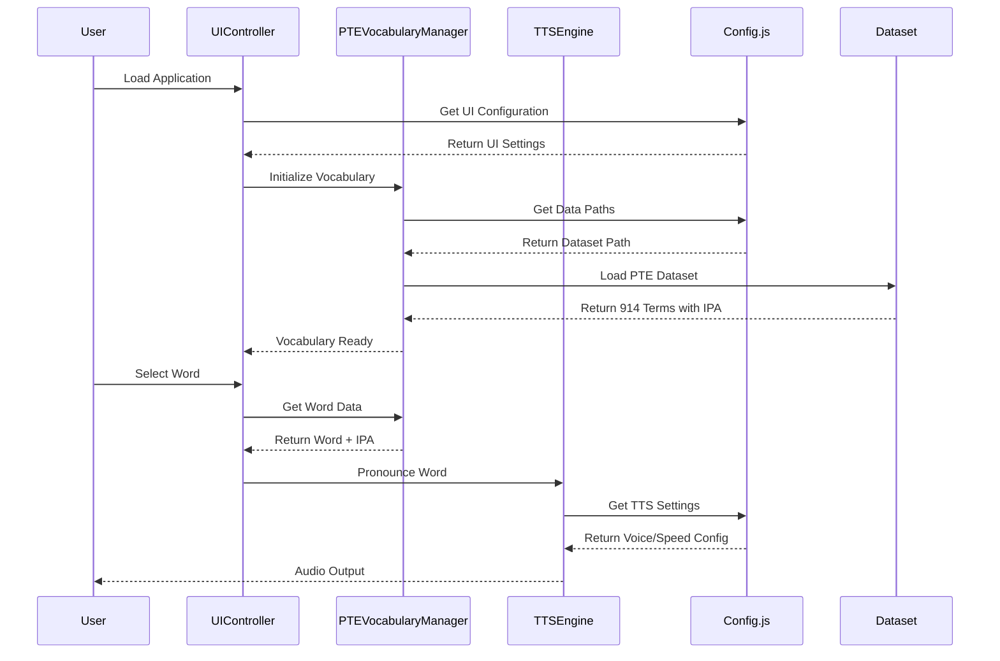
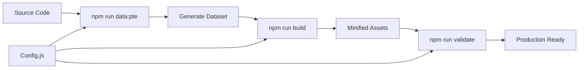

# PTE Pronunciation Trainer - Architecture & Workflow

## 🏗️ System Architecture Overview

This document provides a comprehensive overview of the PTE Pronunciation Trainer's architecture, design patterns, and data flow.

## 📊 High-Level Architecture Diagram



## 🔄 Data Flow Diagram



## 🎯 Core Classes & Functions

### **1. Configuration Management**

#### `AppConfig` (src/js/shared/Config.js)
```javascript
class AppConfig {
    constructor() {
        this.config = {
            pipeline: { /* Data pipeline settings */ },
            data: { /* Data source configuration */ },
            tts: { /* Text-to-speech settings */ },
            ui: { /* User interface settings */ },
            build: { /* Build system configuration */ }
        };
    }

    get(path) { /* Get config value by dot notation */ }
    set(path, value) { /* Set config value */ }
    merge(newConfig) { /* Merge configuration */ }
}
```

**Key Functions:**
- `get('pipeline.inputDir')` - Get data pipeline input directory
- `get('tts.voices.default')` - Get default TTS voice
- `get('build.jsFiles')` - Get list of JS files to bundle

### **2. Data Pipeline**

#### `PTEDataPipeline` (scripts/pte-data-pipeline.js)
```javascript
class PTEDataPipeline {
    constructor(config = {}) {
        // Load centralized configuration
        const appConfig = new AppConfig();
        this.config = {
            inputDir: config.inputDir || appConfig.get('pipeline.inputDir'),
            dataSources: config.dataSources || appConfig.get('pipeline.dataSources')
        };
    }

    async run() { /* Main pipeline execution */ }
    async extractPTEVocabulary() { /* Extract terms from markdown */ }
    async generatePTEDatasets() { /* Create JSON datasets */ }
    validateData() { /* Validate extracted data */ }
}
```

**Key Functions:**
- `run()` - Execute complete data processing pipeline
- `extractPTEVocabulary()` - Parse markdown files for terms
- `generatePTEDatasets()` - Create structured JSON output

### **3. Vocabulary Management**

#### `PTEVocabularyManager` (src/js/core/PTEVocabularyManager.js)
```javascript
class PTEVocabularyManager {
    constructor() {
        this.currentCategory = 'all-categories';
        this.currentDifficulty = 'all';
        this.currentWords = [];
        this.allWords = [];
    }

    async initialize() { /* Load PTE dataset */ }
    async loadPTEData() { /* Fetch vocabulary data */ }
    setLearningMode(mode) { /* Set learning mode */ }
    loadCategory(category) { /* Filter by category */ }
    setDifficulty(difficulty) { /* Filter by difficulty */ }
    getCurrentWord(index) { /* Get word at index */ }
}
```

**Key Functions:**
- `initialize()` - Load and initialize vocabulary data
- `loadPTEData()` - Fetch dataset from configured path
- `getCurrentWord(index)` - Get word with IPA pronunciation data

### **4. User Interface Controller**

#### `UIController` (src/js/ui/UIController.js)
```javascript
class UIController {
    constructor() {
        this.pronunciationPreference = 'british';
        this.currentWordPronunciations = null;
    }

    displayWord(word, index) { /* Display word with IPA */ }
    togglePronunciation() { /* Switch British/American */ }
    updateCategoryDisplay() { /* Update category info */ }
    updateButtons() { /* Update navigation buttons */ }
}
```

**Key Functions:**
- `displayWord(word, index)` - Show word with IPA pronunciation
- `togglePronunciation()` - Switch between British/American
- `updateCategoryDisplay()` - Update category and progress info

### **5. Text-to-Speech Engine**

#### `TTSEngine` (src/js/audio/TTSEngine.js)
```javascript
class TTSEngine {
    constructor() {
        this.config = window.appConfig || new AppConfig();
        this.speechRate = this.config.get('tts.speeds.slow');
        this.currentRepeatCount = 0;
    }

    async pronounceWord(word, repeatCount) { /* Pronounce word */ }
    async speak(text, lang, customRate) { /* Core speech synthesis */ }
    setSpeechRate(rate) { /* Set pronunciation speed */ }
    enableBackgroundAudio() { /* iOS compatibility */ }
}
```

**Key Functions:**
- `pronounceWord(word, repeatCount)` - Pronounce word with progressive speeds
- `speak(text, lang, customRate)` - Core TTS functionality
- `setSpeechRate(rate)` - Configure pronunciation speed

## 🔄 Interaction Patterns

### **1. Configuration-Driven Architecture**
```javascript
// All components get configuration from centralized source
const appConfig = new AppConfig();
const ttsConfig = appConfig.get('tts');
const dataConfig = appConfig.get('data');
```

### **2. Event-Driven Communication**
```javascript
// Components communicate via EventBus
window.eventBus.emit('vocabulary:loaded', data);
window.eventBus.on('word:display', (data) => {
    this.displayWord(data.word, data.index);
});
```

### **3. Data Flow Pattern**
```
Markdown File → Pipeline → JSON Dataset → VocabularyManager → UI → TTS → Audio
```

### **4. Configuration Override Pattern**
```javascript
// Scripts can override default configuration
const pipeline = new PTEDataPipeline({
    inputDir: 'custom/path',
    dataSources: { primary: 'custom-file.md' }
});
```

## 🎯 Key Design Principles

### **1. Single Source of Truth**
- ALL configuration in `Config.js`
- NO hardcoded values anywhere
- Centralized data paths and settings

### **2. Configurable Everything**
- Data sources configurable
- File paths configurable
- Build process configurable
- UI settings configurable

### **3. Scalable Architecture**
- Easy to add new data sources
- Easy to change file structures
- Easy to modify build process
- Easy to extend functionality

### **4. Clean Separation of Concerns**
- **Data Layer**: Pipeline, Extractors, Validation
- **Business Logic**: Vocabulary Management, Progress Tracking
- **Presentation Layer**: UI Controller, Settings Panel
- **Audio Layer**: TTS Engine, Voice Selection, Audio Controls

## 🚀 Deployment Workflow



## 📋 Configuration Categories

| Category | Purpose | Key Settings |
|----------|---------|--------------|
| **Pipeline** | Data processing | Input/output paths, file names |
| **Data** | Data sources | Dataset paths, categories, learning modes |
| **TTS** | Speech synthesis | Voices, speeds, delays, repeat modes |
| **UI** | User interface | Themes, shortcuts, animations |
| **Build** | Production build | File lists, output paths, minification |
| **Validation** | Data integrity | Required files, error messages |

## 🔧 Extension Points

### **Adding New Data Sources**
1. Add to `Config.js` → `pipeline.dataSources`
2. Create new extractor in `src/js/data/extractors/`
3. Update pipeline to use new extractor
4. No other code changes needed

### **Adding New Learning Modes**
1. Add to `Config.js` → `data.learningModes`
2. Update vocabulary manager to handle new mode
3. UI automatically adapts to new modes

### **Customizing Build Process**
1. Modify `Config.js` → `build.jsFiles`
2. Update `Config.js` → `build.output`
3. Build script automatically uses new configuration

## 🎯 Target Architecture Benefits

- **🔧 Zero Hardcoding**: All values configurable
- **📈 Highly Scalable**: Easy to extend and modify
- **🎯 PTE-Focused**: Optimized for PTE vocabulary training
- **🚀 Production-Ready**: Clean, maintainable codebase
- **📱 Modern UX**: Responsive design with advanced TTS
- **🔍 Quality Assured**: Built-in validation and error handling

---

**Architecture Status**: ✅ **COMPLETE & PRODUCTION-READY**
**Configuration**: ✅ **100% CENTRALIZED**
**Scalability**: ✅ **FULLY CONFIGURABLE**
**PTE Focus**: ✅ **OPTIMIZED FOR PTE EXAM PREPARATION**
