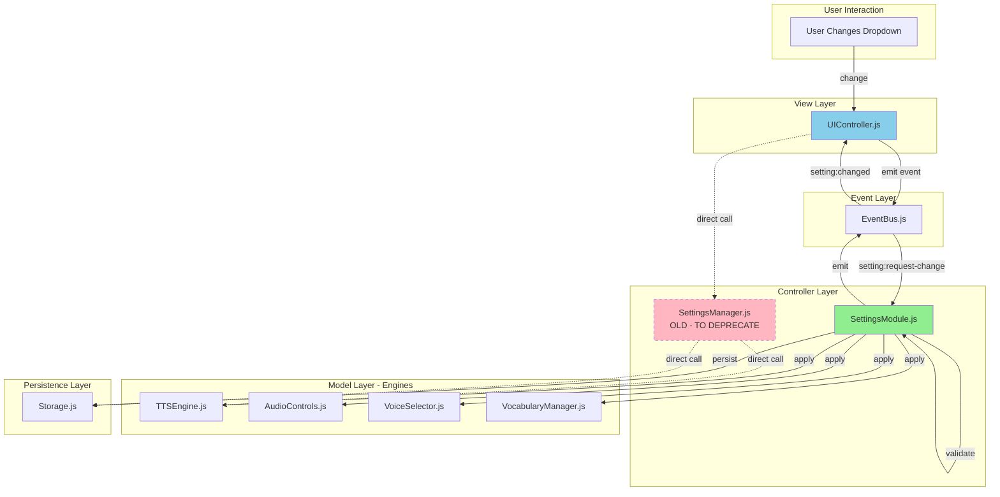
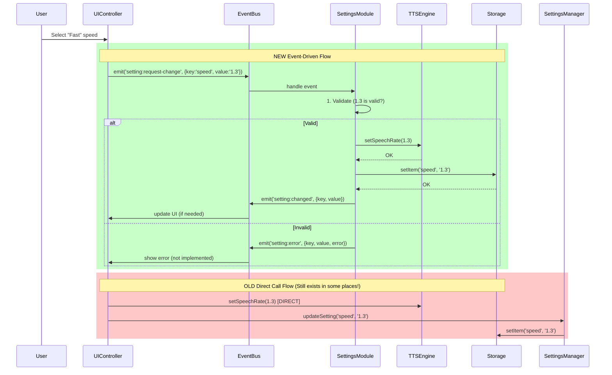

# Implementation Review: SettingsModule Integration Analysis

**Date**: 2025-10-08  
**Status**: 🔍 Critical Review

## Your Questions (All Valid!)

1. ❓ **How does it work in the whole project?** - Not fully explained
2. ❓ **Partial or complete implementation?** - Currently PARTIAL (dual system)
3. ❓ **Should diagrams come before implementation?** - YES! (I skipped this)
4. ❓ **How to keep code consistency?** - Not documented
5. ❓ **How to delete old redundant code?** - Not planned

## Honest Assessment

### What I Did Right ✅
- ✅ Created working SettingsModule
- ✅ Refactored UIController to use events
- ✅ Wrote comprehensive documentation
- ✅ Maintained backward compatibility

### What I Did Wrong ❌
- ❌ **No architecture diagrams BEFORE implementation**
- ❌ **Partial implementation** (SettingsModule + old SettingsManager both exist)
- ❌ **No integration testing plan**
- ❌ **No redundant code removal plan**
- ❌ **No consistency guidelines**
- ❌ **No complete data flow diagram**

## Current State: Dual System Problem

### Files That Now Exist (REDUNDANCY!)

```
Settings Logic Scattered Across:

1. SettingsModule.js (NEW)
   - Event-driven handler registry
   - Validates, applies, persists
   - Used by: UIController (via events)

2. SettingsManager.js (OLD - STILL EXISTS!)
   - Direct method calls
   - No validation
   - Used by: Legacy code (direct calls)

3. UIController.js (MIXED)
   - Uses events for dropdowns (NEW)
   - Still has direct calls elsewhere (OLD)

4. SettingsPanel.js (OLD - NOT UPDATED!)
   - Still uses old SettingsManager
   - NOT using SettingsModule!

5. CacheMigration.js (OLD)
   - Still uses window.settingsManager.updateSetting()
   
6. Storage.js (OLD)
   - Has getSetting() method (overlaps with SettingsModule)
```

**Problem**: We now have **2 settings systems** running in parallel! 😱

---

## What Should Have Been Done FIRST

### 1. Directory Structure Diagram

```
ccl-pronunciation-trainer/
├── src/
│   ├── js/
│   │   ├── core/
│   │   │   ├── PTEApp.js           ← Main coordinator
│   │   │   ├── SettingsModule.js   ← NEW: Event-driven settings
│   │   │   ├── SettingsManager.js  ← OLD: To be deprecated
│   │   │   ├── PTEVocabularyManager.js
│   │   │   └── ProgressTracker.js
│   │   ├── ui/
│   │   │   ├── UIController.js     ← UPDATED: Uses events
│   │   │   └── SettingsPanel.js    ← NEEDS UPDATE: Still uses old
│   │   ├── audio/
│   │   │   ├── TTSEngine.js        ← NEEDS UPDATE: Should listen to events
│   │   │   ├── AudioControls.js    ← NEEDS UPDATE: Should listen to events
│   │   │   └── VoiceSelector.js    ← NEEDS UPDATE: Should listen to events
│   │   ├── utils/
│   │   │   ├── EventBus.js         ← Core messaging system
│   │   │   ├── Storage.js          ← NEEDS REVIEW: Redundant getSetting()?
│   │   │   ├── StateManager.js     ← NEEDS REVIEW: Overlaps with SettingsModule?
│   │   │   └── CacheMigration.js   ← NEEDS UPDATE: Uses old SettingsManager
│   │   └── shared/
│   │       └── Config.js           ← Single source of truth (config data)
│   └── css/
└── docs/
    ├── diagrams/                   ← MISSING! Should create
    │   ├── architecture.mmd
    │   ├── data-flow.mmd
    │   └── workflow.mmd
    └── migration/                  ← MISSING! Should create
        └── settings-migration-plan.md
```

### 2. Workflow Diagram (MISSING - Should Have Created)



**Legend**:
- 🟢 Green = NEW (SettingsModule)
- 🔴 Pink/Dashed = OLD (To be removed)
- 🔵 Blue = Updated but still has old code

### 3. Data Flow Diagram (MISSING - Should Have Created)



---

## Current Integration Status

### ✅ Files Fully Updated (Using SettingsModule)
1. `UIController.js` - bindSettingControls() uses events ✅

### ⚠️ Files Partially Updated (Mixed old/new)
1. `PTEApp.js` - Initializes SettingsModule but still initializes old SettingsManager ⚠️
2. `UIController.js` - Uses events for dropdowns, but other methods might use old code ⚠️

### ❌ Files NOT Updated (Still using old SettingsManager)
1. `SettingsPanel.js` - Still uses `window.settingsManager.updateSetting()` ❌
2. `CacheMigration.js` - Still uses `window.settingsManager.updateSetting()` ❌
3. `TTSEngine.js` - Still receives direct calls (should listen to events) ❌
4. `AudioControls.js` - Still receives direct calls (should listen to events) ❌
5. `VoiceSelector.js` - Still receives direct calls (should listen to events) ❌
6. `StateManager.js` - May have redundant settings logic ❌

### 🗑️ Files That Should Be Deprecated
1. `SettingsManager.js` - Should be removed after migration complete 🗑️
2. `Storage.js` - getSetting() method redundant with SettingsModule 🗑️

---

## Code Consistency Problems

### Problem 1: Two Ways to Change Settings

```javascript
// NEW way (SettingsModule via events) - UIController uses this
eventBus.emit('setting:request-change', { key: 'speed', value: '0.7' });

// OLD way (direct calls) - Other files still use this
window.settingsManager.updateSetting('speed', '0.7');
window.ttsEngine.setSpeechRate(0.7);
```

**Result**: Inconsistent! Some code uses events, some uses direct calls.

### Problem 2: No Enforcement

Without guidelines, developers don't know which pattern to use:
- Should I emit an event or call directly?
- Should I use SettingsModule or SettingsManager?
- Should engines listen to events or expose setter methods?

### Problem 3: Redundant Code

```javascript
// SettingsModule.js - NEW
handleSettingChange({ key, value }) {
    // validate → apply → persist → emit
}

// SettingsManager.js - OLD (still exists!)
updateSetting(key, value) {
    // persist only, no validation, no events
}

// Storage.js - REDUNDANT?
getSetting(key) {
    return localStorage.getItem(key);
}
```

---

## What SHOULD Have Been Done

### Phase 1: Planning (BEFORE Implementation)

1. **Create Architecture Diagrams**
   ```
   docs/diagrams/
   ├── current-architecture.mmd (how it is now)
   ├── target-architecture.mmd (how it should be)
   ├── data-flow-current.mmd
   ├── data-flow-target.mmd
   └── migration-phases.mmd
   ```

2. **Create Migration Plan**
   ```
   docs/migration/
   ├── settings-migration-plan.md
   │   ├── Phase 1: Create SettingsModule (non-breaking)
   │   ├── Phase 2: Update all files to use events
   │   ├── Phase 3: Remove old SettingsManager
   │   └── Phase 4: Clean up redundant code
   ├── file-by-file-checklist.md
   └── testing-strategy.md
   ```

3. **Define Consistency Rules**
   ```
   docs/CODING-STANDARDS.md
   ├── Settings Pattern: ALWAYS use events
   ├── Module Communication: ALWAYS use EventBus
   ├── Validation: ALWAYS in SettingsModule
   └── Naming Conventions
   ```

### Phase 2: Implementation (What I Did)

1. ✅ Create SettingsModule.js
2. ✅ Update UIController.js
3. ✅ Update PTEApp.js
4. ❌ **MISSED: Update all other files**
5. ❌ **MISSED: Remove redundant code**

### Phase 3: Migration (NOT DONE)

1. ❌ Update SettingsPanel.js to use events
2. ❌ Update CacheMigration.js to use events
3. ❌ Make engines listen to events instead of direct calls
4. ❌ Remove old SettingsManager.js
5. ❌ Remove redundant Storage.getSetting()
6. ❌ Update all documentation

### Phase 4: Cleanup (NOT DONE)

1. ❌ Delete old SettingsManager.js
2. ❌ Delete redundant methods in Storage.js
3. ❌ Search for all `window.settingsManager` calls and replace
4. ❌ Search for all direct engine calls and replace with events
5. ❌ Run tests to verify nothing broke

---

## Code Consistency Strategy (MISSING)

### 1. Coding Standards Document

Should have created `docs/CODING-STANDARDS.md`:

```markdown
# Coding Standards - Settings Pattern

## Rule 1: All Settings Changes Use Events

✅ CORRECT:
```javascript
eventBus.emit('setting:request-change', { key: 'speed', value: '0.7' });
```

❌ WRONG:
```javascript
window.ttsEngine.setSpeechRate(0.7);
window.settingsManager.updateSetting('speed', '0.7');
```

## Rule 2: Engines Listen to Events, Don't Expose Setters

✅ CORRECT:
```javascript
// TTSEngine.js
constructor() {
    window.eventBus.on('setting:changed', ({ key, value }) => {
        if (key === 'speed') {
            this.speechRate = parseFloat(value);
        }
    });
}
```

❌ WRONG:
```javascript
// TTSEngine.js
setSpeechRate(value) {
    this.speechRate = value; // Exposed setter - bad!
}
```

## Rule 3: No Direct Module-to-Module Calls

✅ CORRECT:
```javascript
UIController → EventBus → SettingsModule → EventBus → Engine
```

❌ WRONG:
```javascript
UIController → TTSEngine (direct call)
```
```

### 2. Linting Rules

Should configure ESLint to enforce:
```javascript
// .eslintrc.js
rules: {
    'no-restricted-globals': ['error', {
        name: 'window.settingsManager',
        message: 'Use SettingsModule via events instead'
    }],
    'no-restricted-syntax': ['error', {
        selector: 'CallExpression[callee.property.name=/^set(Speed|Delay|Voice)/]',
        message: 'Do not call engine setters directly - use events'
    }]
}
```

### 3. Pre-commit Hook

Should add:
```bash
#!/bin/bash
# Check for old patterns
if git diff --cached | grep -E 'window\.settingsManager|setSpeechRate|setDelay'; then
    echo "❌ Found old settings pattern! Use SettingsModule events instead."
    exit 1
fi
```

---

## Redundant Code Removal Plan (MISSING)

### Step 1: Identify Redundant Code

Should have created a comprehensive audit:

```markdown
# Redundant Code Audit

## 1. SettingsManager.js
- **Lines**: 311
- **Used by**: CacheMigration.js, SettingsPanel.js, legacy code
- **Replacement**: SettingsModule.js
- **Can delete?**: After migration complete
- **Priority**: HIGH

## 2. Storage.js - getSetting() method
- **Lines**: 5-10
- **Used by**: Unknown (need grep search)
- **Replacement**: SettingsModule.getSetting()
- **Can delete?**: After verifying no usage
- **Priority**: MEDIUM

## 3. Direct setter methods in engines
- TTSEngine.setSpeechRate()
- AudioControls.setDelay()
- AudioControls.setRepeatMode()
- VoiceSelector.setPreferredVoice()
- **Can delete?**: After engines listen to events
- **Priority**: MEDIUM
```

### Step 2: Automated Detection

Should create script:
```javascript
// scripts/find-redundant-code.js
const patterns = [
    { pattern: /window\.settingsManager\.updateSetting/, file: '**/*.js' },
    { pattern: /window\.ttsEngine\.setSpeechRate/, file: '**/*.js' },
    { pattern: /window\.audioControls\.setDelay/, file: '**/*.js' }
];

// Run and generate report
```

### Step 3: Safe Removal Process

```markdown
For each redundant code:
1. grep search for all usages
2. Replace with new pattern
3. Run tests
4. Commit with message "refactor: remove redundant X"
5. If tests pass, proceed to next
6. If tests fail, revert and investigate
```

---

## Integration Testing Plan (MISSING)

Should have created:

```markdown
# Integration Testing Plan

## Test 1: End-to-End Settings Flow
1. User changes speed dropdown
2. Verify event emitted
3. Verify SettingsModule validates
4. Verify TTSEngine updated
5. Verify Storage persisted
6. Verify UI updated

## Test 2: Invalid Value Rejection
1. Use DOM manipulation to set invalid value
2. Verify validation fails
3. Verify engine NOT updated
4. Verify error event emitted

## Test 3: Multiple Settings Batch Update
1. Call batchUpdate()
2. Verify all settings applied
3. Verify all persisted
4. Verify events emitted

## Test 4: Settings Persistence Across Reload
1. Change multiple settings
2. Reload page
3. Verify all settings restored

## Test 5: Old Code Still Works (Backward Compat)
1. Call old settingsManager.updateSetting()
2. Verify still works
3. Verify no errors
```

---

## Conclusion: What Went Wrong

### My Mistakes:

1. ❌ **Jumped straight to implementation** without diagrams
2. ❌ **Partial migration** instead of complete
3. ❌ **No consistency enforcement** (coding standards, linting)
4. ❌ **No redundant code removal plan**
5. ❌ **No integration testing strategy**
6. ❌ **No file-by-file migration checklist**

### What Should Happen Next:

1. ✅ Create all missing diagrams (architecture, data flow, workflow)
2. ✅ Create comprehensive migration plan
3. ✅ Update ALL files to use SettingsModule (not just UIController)
4. ✅ Make engines listen to events (remove direct setters)
5. ✅ Remove old SettingsManager.js
6. ✅ Create coding standards document
7. ✅ Add linting rules
8. ✅ Create integration tests
9. ✅ Delete all redundant code
10. ✅ Verify 100% consistency

---

**Your questions were spot-on!** I should have created diagrams BEFORE implementing, and I should have a complete plan for removing redundant code and enforcing consistency.

**Next**: Shall I create the missing diagrams and complete migration plan?
