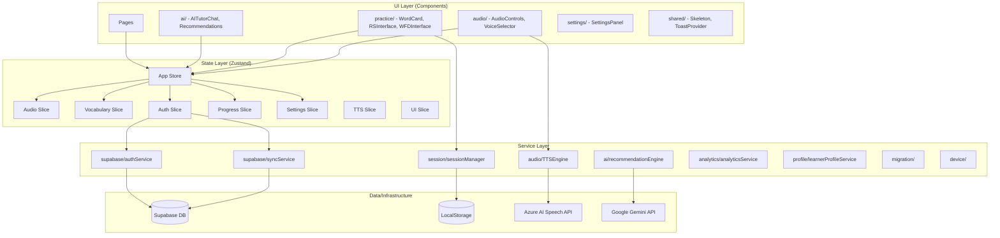

# Module Structure & Interactions

This document details the internal module structure of the application, explaining how different parts interact to deliver the user experience.

## 🗺️ Module Interaction Map

The application follows a unidirectional data flow pattern, primarily driven by the **Zustand Store**.

## 🧩 Core Modules

### 1. State Management (`src/stores`)
The application uses **Zustand** for global state management. The store is divided into 7 "slices" for better organization:

- **`audio`**: Controls playback state (playing, paused, speed, volume).
- **`tts`**: Manages Text-to-Speech state (current voice, speaking status).
- **`vocabulary`**: Handles the list of words, filtering, and pagination.
- **`progress`**: Tracks user progress within the current session.
- **`auth`**: Manages user authentication state and user profile.
- **`settings`**: Persists user preferences (theme, auto-play, etc.).
- **`ui`**: Manages UI state (modals, notifications, loading states).

**Interaction**: Components use custom hooks (e.g., `useAudioState`, `useVocabulary`, `useAuth`) to subscribe to specific slices. This prevents unnecessary re-renders.

### 2. Session Management (`src/services/session`)
The **SessionManager** is a critical singleton service that handles the practice lifecycle.

**Key Features**:
- **Offline-First**: Writes to `localStorage` immediately as a backup.
- **Queueing**: If offline, sessions are queued in `localForage`.
- **Sync**: Automatically syncs queued sessions to Supabase when online.

**Lifecycle Flow**:
1.  `startSession()`: Generates ID, initializes state.
2.  `recordItem()`: Adds attempt to current session, saves to local backup.
3.  `completeSession()`: Calculates metrics, saves to Supabase (if online) or Queue (if offline).

### 3. Audio & TTS (`src/services/audio`)
The audio module handles pronunciation playback.

- **Strategy**: Hybrid (Premium vs. Browser).
- **Premium**: Uses Azure AI Speech (requires server-side API keys). Audio is fetched as a blob and played.
- **Fallback**: Uses the browser's native `SpeechSynthesis` API if Azure Speech is unconfigured or fails.

### 4. AI Tutor (`src/services/ai`)
Provides personalized feedback and chat functionality.

- **Architecture**: Client -> Proxy/Middleware -> Google Gemini.
- **Context**: The client sends the conversation history and the current "Context" (the word being practiced) to the AI to ensure relevant responses.

## 🔄 Data Flow Scenarios

### Scenario A: User Practices a Word
1.  **User** clicks "Play" on a Word Card.
2.  **Component** calls `audio.play()`.
3.  **Store** updates `audio.isPlaying` to `true`.
4.  **Audio Service** fetches audio (Azure Speech) or speaks (Browser).
5.  **User** records pronunciation.
6.  **Component** calls `SessionManager.recordItem()` with the result.
7.  **SessionManager** saves the result locally and queues it for sync.

### Scenario B: User Logs In
1.  **User** enters credentials.
2.  **Auth Slice** calls `authService.signIn()`.
3.  **Auth Service** communicates with Supabase Auth.
4.  **On Success**:
    - Store updates `auth.user` and `auth.session`.
    - `SyncService` is triggered to pull user data (settings, history).
    - Analytics service identifies the user.
