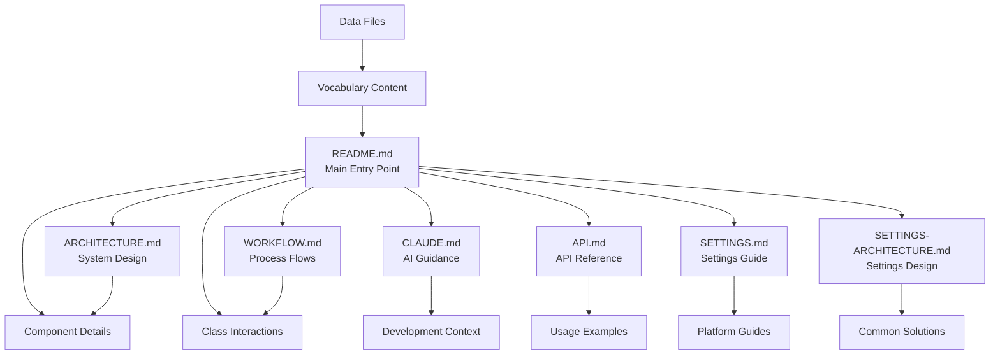

# 📚 PTE Pronunciation Trainer - Documentation

## 📋 Documentation Overview

This directory contains comprehensive documentation for the PTE Pronunciation Trainer project.

## 📖 Documentation Structure

### **🏠 Main Documentation**
- **[README.md](../README.md)** - Main project documentation, quick start, and overview
- **[CLAUDE.md](../CLAUDE.md)** - AI assistant guidance and development context

### **🏗️ Technical Documentation**
- **[ARCHITECTURE.md](ARCHITECTURE.md)** - System architecture, design patterns, and component interactions
- **[WORKFLOW.md](WORKFLOW.md)** - Complete workflow diagrams, data flow, and class interactions
- **[API.md](API.md)** - Complete API reference for all classes and methods
- **[DEPLOYMENT.md](DEPLOYMENT.md)** - Deployment guide for various platforms
- **[TROUBLESHOOTING.md](TROUBLESHOOTING.md)** - Common issues and solutions
 - **[DATA-INGESTION.md](DATA-INGESTION.md)** - How to add new datasets (sources, config, pipeline)

### **📊 Data Documentation**
- **[pte-fib-listening-with-ipa.md](../data/source/pte/vocabs/pte-fib-listening-with-ipa.md)** - Primary data source (914 terms with IPA)
- **[fib-listening-vocabulary.md](../data/source/pte/vocabs/fib-listening-vocabulary.md)** - Fallback data source (original terms)

## 🎯 Documentation Purposes

| Document | Purpose | Audience | Content |
|----------|---------|----------|---------|
| **README.md** | Project overview & quick start | Users, developers | Features, setup, commands |
| **CLAUDE.md** | AI development guidance | AI assistants | Architecture context, commands |
| **ARCHITECTURE.md** | System design | Developers, architects | Design patterns, components |
| **WORKFLOW.md** | Process flows | Developers, DevOps | Data flow, class interactions |
| **API.md** | API reference | Developers | Class methods, usage examples |
| **SETTINGS.md** | Settings panel guide | Users, developers | Configuration options, features |
| **SETTINGS-ARCHITECTURE.md** | Settings system design | Developers, architects | Architecture, dependencies, API |
| **DEPLOYMENT.md** | Deployment guide | DevOps, developers | Platform deployment, CI/CD |
| **TROUBLESHOOTING.md** | Issue resolution | Users, developers | Common problems, solutions |
| **Data files** | Vocabulary content | Content creators | IPA pronunciations, terms |

## 🔄 Documentation Relationships

## 📋 Documentation Standards

### **Consistency Rules**
- ✅ All documents reference PTE-focused architecture
- ✅ All commands use `npm run data:pte` (not old resume commands)
- ✅ All data references point to 914 PTE terms
- ✅ All architecture references centralized configuration

### **Cross-References**
- Each document links to related documentation
- README.md serves as the main entry point
- Technical docs reference each other appropriately
- Data files are referenced from main documentation

## 🎯 Key Documentation Principles

1. **Single Source of Truth**: Each topic documented in one primary location
2. **Clear Hierarchy**: README → Technical Docs → Data Files
3. **Consistent Terminology**: PTE-focused throughout
4. **Cross-Referenced**: Documents link to related content
5. **Up-to-Date**: All documentation reflects current architecture

## 🚀 Quick Navigation

### **For Users**
- Start with [README.md](../README.md) for project overview
- Use [Quick Start](../README.md#-quick-start) for setup

### **For Developers**
- Read [ARCHITECTURE.md](ARCHITECTURE.md) for system design
- Check [WORKFLOW.md](WORKFLOW.md) for process flows
- Reference [CLAUDE.md](../CLAUDE.md) for development context

### **For Content Creators**
- Review [pte-fib-listening-with-ipa.md](../data/source/pte/vocabs/pte-fib-listening-with-ipa.md) for data format
- Check [ARCHITECTURE.md](ARCHITECTURE.md) for data pipeline

---

**Documentation Status**: ✅ **COMPLETE & CONSISTENT**
**PTE Focus**: ✅ **ALL DOCUMENTS ALIGNED**
**Cross-References**: ✅ **PROPERLY LINKED**
