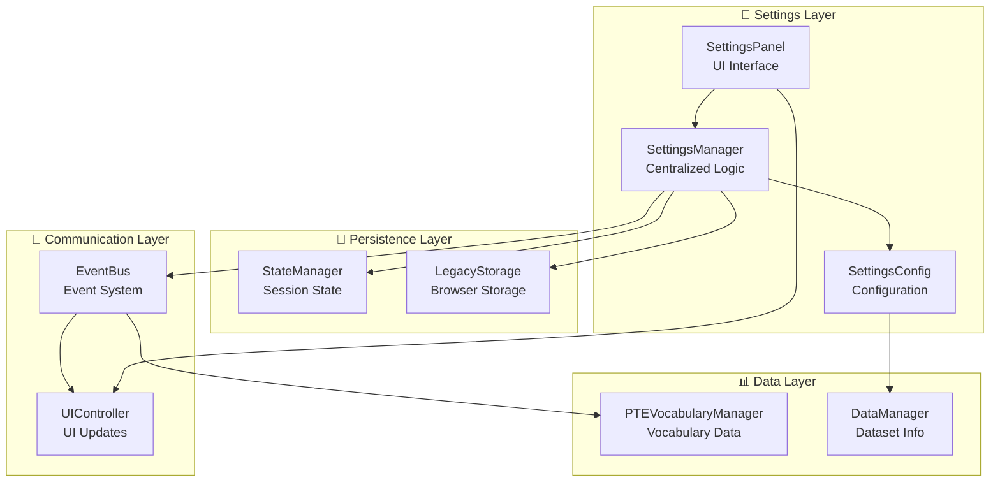
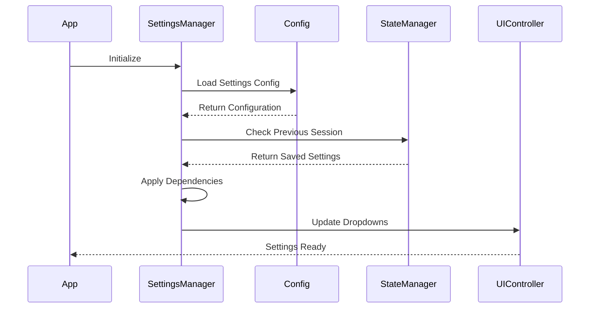
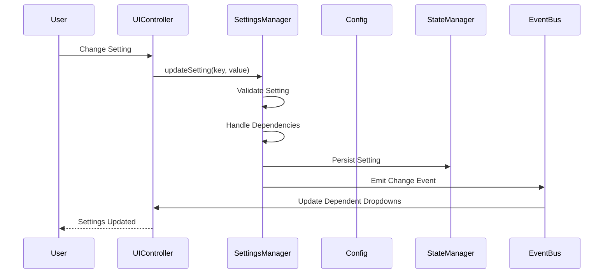

# Settings Architecture Documentation

## 🎯 Overview

The Settings System is designed as a **centralized, dependency-aware configuration management system** that automatically handles complex setting interactions and ensures consistency with our PTE vocabulary data structure.

## 🏗️ Architecture Design

### **Core Components**



## 🎯 Settings Dependencies

### **Dependency Chain**
```
Learning Mode → Category → Difficulty
     ↓              ↓
   Dataset      Available
   Selection    Difficulties
```

### **Independent Settings**
- **Audio Settings**: Speed, Delay, Repeat, Voice
- **UI Settings**: Theme, Shortcuts, Animations

## 📊 Settings Categories

### **1. Content Settings (Dependent)**

#### **Learning Mode** (`learningMode`)
- **Purpose**: Determines vocabulary dataset
- **Options**: `pte-fib-listening`
- **Dependencies**: Affects Category and Difficulty options
- **Data Source**: `Config.data.learningModes`

#### **Category** (`category`)
- **Purpose**: Filters vocabulary by content type
- **Options**: `all-categories`, `pte-fib-listening`
- **Dependencies**: Affects Difficulty options
- **Data Source**: `Config.data.categories`

#### **Difficulty** (`difficulty`)
- **Purpose**: Filters vocabulary by complexity
- **Options**: `normal` (All PTE terms are normal difficulty)
- **Dependencies**: None (terminal setting)
- **Data Source**: `Config.data.difficulties`

### **2. Audio Settings (Independent)**

#### **Speed** (`speed`)
- **Purpose**: Controls speech synthesis rate
- **Options**: `0.7` (Slow), `1.0` (Normal), `1.3` (Fast)
- **Dependencies**: None
- **Data Source**: `Config.tts.speeds`

#### **Delay** (`delay`)
- **Purpose**: Controls pause between pronunciations
- **Options**: `1000` (1s), `2000` (2s), `3000` (3s), `4000` (4s)
- **Dependencies**: None
- **Data Source**: `Config.tts.delays`

#### **Repeat** (`repeat`)
- **Purpose**: Controls repetition pattern
- **Options**: `once`, `individual`, `intensive`, `loop`
- **Dependencies**: None
- **Data Source**: `Config.tts.repeatModes`

#### **Voice** (`voice`)
- **Purpose**: Controls text-to-speech voice
- **Options**: `auto` (Best Match)
- **Dependencies**: None
- **Data Source**: `Config.tts.voices`

## 🔄 Settings Flow

### **Initialization Flow**


### **Setting Change Flow**


## 🎯 SettingsManager API

### **Core Methods**
```javascript
// Update a setting (handles dependencies automatically)
settingsManager.updateSetting('learningMode', 'pte-fib-listening');

// Get current setting value
const currentSpeed = settingsManager.getSetting('speed');

// Get all current settings
const allSettings = settingsManager.getAllSettings();

// Get available options for a setting
const speedOptions = settingsManager.getAvailableOptions('speed');

// Reset all settings to defaults
settingsManager.resetSettings();
```

### **Dependency Handling**
```javascript
// When learning mode changes:
settingsManager.updateSetting('learningMode', 'pte-fib-listening');
// Automatically updates:
// - category: 'all-categories'
// - difficulty: 'normal'

// When category changes:
settingsManager.updateSetting('category', 'pte-fib-listening');
// Automatically updates:
// - difficulty: 'normal'
```

## 📊 Configuration Structure

### **Settings Configuration**
```javascript
settings: {
    storageKeys: {
        category: 'category',
        difficulty: 'difficulty',
        speed: 'speechRate',
        delay: 'delay',
        repeat: 'repeatMode',
        voice: 'preferredVoice',
        learningMode: 'learningMode'
    },
    defaults: {
        category: 'all-categories',
        difficulty: 'normal',
        speed: 'tts.speeds.slow',
        delay: 'tts.delays.normal',
        repeat: 'once',
        voice: 'auto',
        learningMode: 'pte-fib-listening'
    },
    events: {
        changed: 'settings:changed',
        loaded: 'settings:loaded',
        reset: 'settings:reset'
    }
}
```

## 🔧 Integration Patterns

### **1. SettingsPanel Integration**
```javascript
// SettingsPanel uses SettingsManager
class SettingsPanel {
    constructor() {
        this.settingsManager = window.settingsManager;
        this.setupEventListeners();
    }

    handleSettingChange(key, value) {
        this.settingsManager.updateSetting(key, value);
    }
}
```

### **2. UIController Integration**
```javascript
// UIController listens for settings changes
window.eventBus.on('settings:changed', (data) => {
    this.handleSettingsChange(data.key, data.value);
});
```

### **3. Module Integration**
```javascript
// All modules can access settings
const currentSpeed = window.settingsManager.getSetting('speed');
const availableVoices = window.settingsManager.getAvailableOptions('voice');
```

## 🎯 Benefits of New Architecture

### **1. Centralized Logic**
- ✅ All settings logic in one place
- ✅ Consistent validation and persistence
- ✅ Easy to maintain and extend

### **2. Dependency Management**
- ✅ Automatic handling of setting dependencies
- ✅ Cascading updates when parent settings change
- ✅ Validation of dependent values

### **3. Data-Driven**
- ✅ All options loaded from configuration
- ✅ Matches actual PTE data structure
- ✅ Easy to add new settings or options

### **4. Event-Driven**
- ✅ Loose coupling between components
- ✅ Real-time updates across modules
- ✅ Consistent communication patterns

### **5. Scalable**
- ✅ Easy to add new settings
- ✅ Easy to add new dependencies
- ✅ Easy to modify validation rules

## 🚀 Usage Examples

### **Adding a New Setting**
```javascript
// 1. Add to Config.js
settings: {
    defaults: {
        newSetting: 'defaultValue'
    }
}

// 2. Add to SettingsManager dependencies
dependencies: {
    newSetting: {
        affects: [],
        validator: (value) => isValidValue(value)
    }
}

// 3. Add to UI
const newSettingSelect = document.getElementById('newSettingSelect');
newSettingSelect.addEventListener('change', (e) => {
    window.settingsManager.updateSetting('newSetting', e.target.value);
});
```

### **Adding a New Dependency**
```javascript
// In SettingsManager dependencies
learningMode: {
    affects: ['category', 'difficulty', 'newSetting'], // Add new dependency
    validator: (mode) => this.config.get('data.learningModes').find(m => m.id === mode)
}
```

This architecture provides a **clean, scalable, and maintainable** settings system that perfectly matches our PTE vocabulary data structure and follows our existing design patterns.
