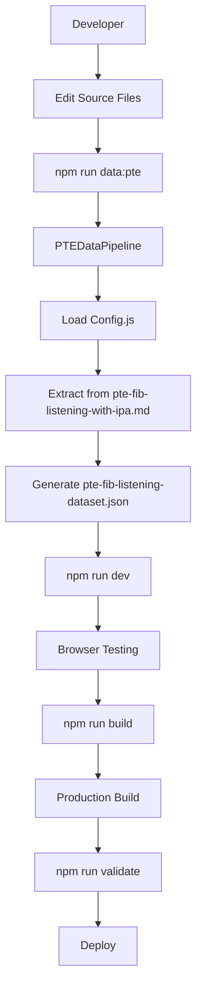
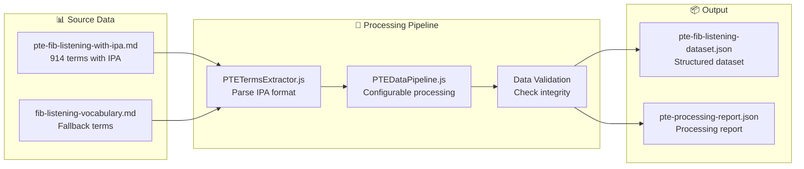
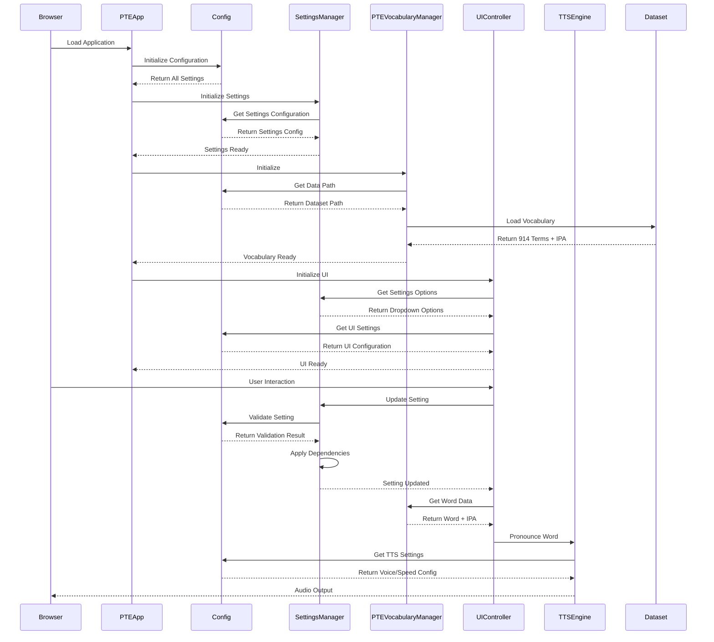
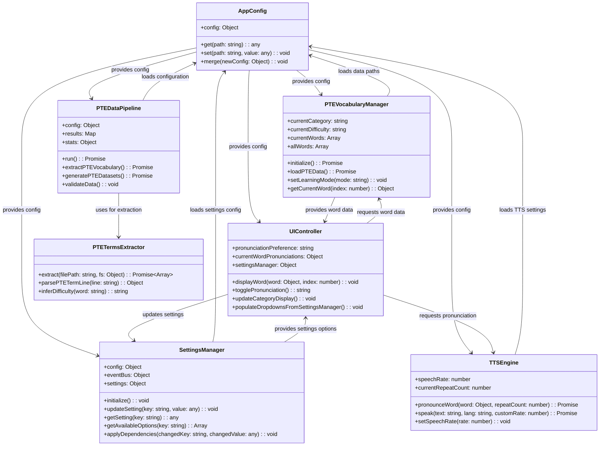
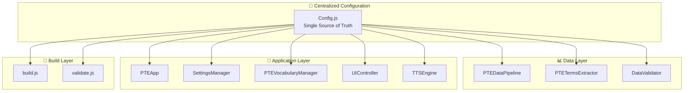
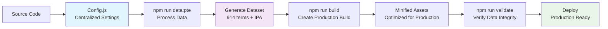
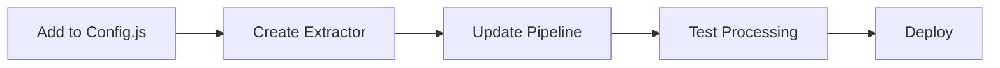
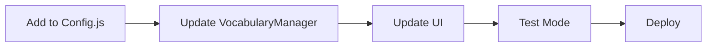

# PTE Pronunciation Trainer - Complete Workflow

## 🔄 End-to-End System Workflow

### **1. Development Workflow**



### **2. Data Processing Workflow**



### **3. Application Runtime Workflow**



## 🎯 Class Interaction Diagram



## 🔧 Configuration Flow



## 🎯 Key Design Patterns

### **1. Configuration-Driven Pattern**
```javascript
// All components load configuration from centralized source
const appConfig = new AppConfig();
const config = appConfig.get('category.setting');
```

### **2. Event-Driven Communication**
```javascript
// Loose coupling via EventBus
window.eventBus.emit('event:name', data);
window.eventBus.on('event:name', handler);
```

### **3. Dependency Injection Pattern**
```javascript
// Configuration injected into constructors
const pipeline = new PTEDataPipeline(customConfig);
```

### **4. Factory Pattern**
```javascript
// Configurable object creation
const extractor = PTETermsExtractor.extract(filePath, fs);
```

## 🚀 Deployment Pipeline



## 📋 Component Responsibilities

| Component | Primary Responsibility | Key Functions |
|-----------|----------------------|---------------|
| **AppConfig** | Configuration Management | `get()`, `set()`, `merge()` |
| **PTEDataPipeline** | Data Processing | `run()`, `extractPTEVocabulary()` |
| **PTETermsExtractor** | Markdown Parsing | `extract()`, `parsePTETermLine()` |
| **PTEVocabularyManager** | Vocabulary Management | `initialize()`, `loadPTEData()` |
| **SettingsManager** | Settings Management | `updateSetting()`, `getAvailableOptions()` |
| **UIController** | User Interface | `displayWord()`, `togglePronunciation()` |
| **TTSEngine** | Speech Synthesis | `pronounceWord()`, `speak()` |
| **PTEApp** | Application Coordination | `init()`, `initializeModules()` |

## 🎯 Data Flow Summary

1. **Configuration Loading**: All components load settings from `Config.js`
2. **Data Processing**: Pipeline processes markdown → JSON dataset
3. **Application Initialization**: App loads vocabulary and initializes UI
4. **User Interaction**: UI displays words with IPA pronunciation
5. **Audio Output**: TTS engine pronounces words with configurable settings
6. **Progress Tracking**: System tracks user progress and preferences

## 🔧 Extension Workflow

### **Adding New Data Source**


### **Adding New Learning Mode**


---

**Workflow Status**: ✅ **COMPLETE & DOCUMENTED**
**Architecture**: ✅ **CLEAR & MAINTAINABLE**
**Extensibility**: ✅ **WELL-DEFINED PATTERNS**
