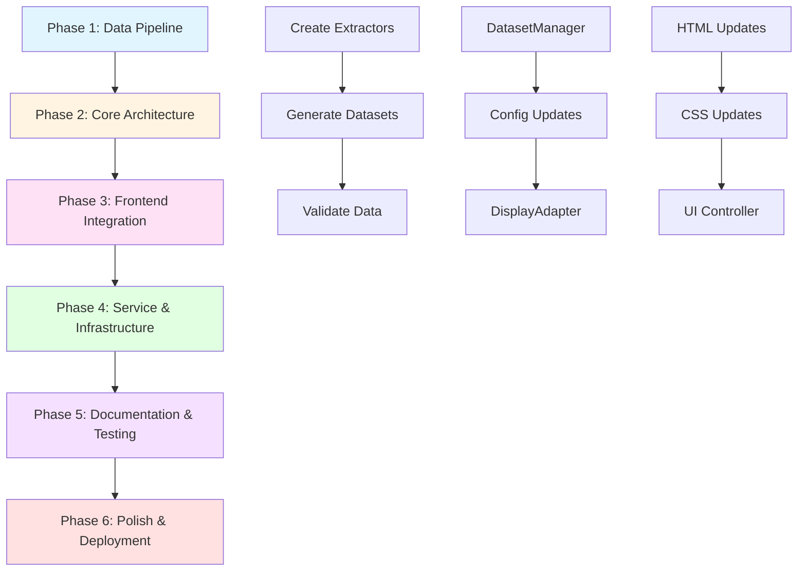

# Dataset Design Strategy

**Date**: 7 October 2025  
**Status**: ✅ **PHASE 1 COMPLETE - DATA PIPELINE IMPLEMENTED**  
**Purpose**: Design scalable architecture for multiple PTE dataset types

---

## 🎉 Phase 1 Implementation Status

✅ **COMPLETE** (7 October 2025)
- Created PTESentenceExtractor.js (RS & WFD)
- Created PTEQuestionExtractor.js (ASQ)
- Updated pipeline with dynamic extractor loading
- Generated all 6 datasets (4,687 total learning items)
- All validations passing (0 errors, 0 warnings)

**Next**: Phase 2 - Frontend Integration (DatasetManager.js, UI updates, TTS)

---

## 📊 Current Dataset Inventory

### **IPA & Data Format Decisions (2025-10-07)** ✅ IMPLEMENTED
- **Vocabulary:** Has IPA (British/American) ✅
- **Repeat Sentence (RS):** No IPA; use TTS for pronunciation ✅
- **Answer Short Question (ASQ):** No IPA; use TTS for pronunciation; "Question - Answer" format with 692 verified answers ✅
- **Write From Dictation (WFD):** No IPA; use TTS for pronunciation ✅

### **Vocabulary Datasets** ✅ SUPPORTED
- ✅ `pte-beginner-vocabulary.json` - 383 terms with IPA
- ✅ `pte-intermediate-vocabulary.json` - 1,912 terms with IPA
- ✅ `pte-fib-listening-dataset.json` - 885 terms with IPA

### **New PTE Question Type Datasets** ✅ IMPLEMENTED
- ✅ **Repeat Sentence (RS)** - 620 sentences
  - Source: `data/source/pte/rs/pte-repeat-sentence.md`
  - Dataset: `data/processed/pte-repeat-sentence-dataset.json` (197 KB)
  - Purpose: Listen and repeat complete sentences
  - Extractor: PTESentenceExtractor.js
  
- ✅ **Answer Short Question (ASQ)** - 692 questions with verified answers
  - Source: `data/source/pte/asq/pte-answer-short-question.md`
  - Dataset: `data/processed/pte-answer-short-question-dataset.json` (262 KB)
  - Purpose: Quick comprehension and short answers
  - Extractor: PTEQuestionExtractor.js
  
- ✅ **Write From Dictation (WFD)** - 1,195 sentences
  - Source: `data/source/pte/wfd/pte-write-from-dictation.md`
  - Dataset: `data/processed/pte-write-from-dictation-dataset.json` (377 KB)
  - Purpose: Listen and write complete sentences
  - Extractor: PTESentenceExtractor.js

**Total Learning Items**: 4,687 (3,180 vocabulary + 2,507 PTE practice)

### **Data Structure Differences** ✅ FINALIZED

| Dataset Type | Key Fields | Use Case | Status |
|-------------|------------|----------|--------|
| **Vocabulary** | `word`, `ipa.british`, `ipa.american`, `category`, `difficulty` | Pronunciation training | ✅ Working |
| **Repeat Sentence** | `sentence`, `ipa: null`, `difficulty`, `category` | Listening & speaking | ✅ Implemented |
| **Answer Short Question** | `question`, `answer`, `ipa: null`, `category`, `difficulty` | Comprehension | ✅ Implemented |
| **Write From Dictation** | `sentence`, `ipa: null`, `difficulty`, `category` | Listening & writing | ✅ Implemented |

---

## ~~🏗️ Proposed Architecture Design~~ ✅ DATA PIPELINE COMPLETE

### ~~**Option 1: Unified Dataset Manager (Recommended)**~~ → **Phase 2 Task**

**Concept**: Create a flexible dataset management system that handles multiple data types

```javascript
// Unified Data Schema
{
  "meta": {
    "type": "rs|asq|wfd|vocabulary",
    "version": "1.0",
    "count": 620,
    "updated": "2025-10-07"
  },
  "items": [
    {
      "id": 1,
      "type": "rs",
      "content": {
        "sentence": "The archeologist's new discoveries...",
        "ipa": {
          "british": "/ðiː ˌɑːkɪˈɒlədʒɪsts...",
          "american": "/ðiː ˌɑːrkiˈɑːlədʒɪsts..."
        }
      },
      "metadata": {
        "category": "academic",
        "difficulty": "intermediate",
        "tags": ["archaeology", "discovery"]
      }
    }
  ]
}
```

**Architecture Changes Needed**:

1. **New Manager Class**: `DatasetManager.js`
   ```javascript
   class DatasetManager {
     constructor() {
       this.datasets = new Map();
       this.currentDatasetType = 'vocabulary';
       this.currentDataset = null;
     }
     
     async loadDataset(type, mode) {
       // type: 'vocabulary', 'rs', 'asq', 'wfd'
       // mode: 'beginner', 'intermediate', 'advanced'
     }
     
     getItem(index) {
       // Returns item based on current dataset type
     }
     
     filterByCategory(category) { }
     filterByDifficulty(difficulty) { }
   }
   ```

2. **Update Config.js**:
   ```javascript
   data: {
     datasetTypes: {
       vocabulary: {
         label: '📚 Vocabulary',
         modes: ['beginner', 'intermediate', 'fib-listening'],
         icon: '📚'
       },
       rs: {
         label: '🔁 Repeat Sentence',
         modes: ['all'],
         icon: '🔁'
       },
       asq: {
         label: '❓ Answer Short Question',
         modes: ['all'],
         icon: '❓'
       },
       wfd: {
         label: '✍️ Write From Dictation',
         modes: ['all'],
         icon: '✍️'
       }
     },
     paths: {
       byType: {
         vocabulary: {
           beginner: '/data/processed/pte-beginner-vocabulary.json',
           intermediate: '/data/processed/pte-intermediate-vocabulary.json',
           'fib-listening': '/data/processed/pte-fib-listening-dataset.json'
         },
         rs: {
           all: '/data/processed/pte-repeat-sentence-dataset.json'
         },
         asq: {
           all: '/data/processed/pte-answer-short-question-dataset.json'
         },
         wfd: {
           all: '/data/processed/pte-write-from-dictation-dataset.json'
         }
       }
     }
   }
   ```

3. **Update UI for Dataset Type Selection**:
   ```html
   <!-- Settings Panel -->
   <div class="setting-group">
     <label for="dataset-type">Dataset Type:</label>
     <select id="dataset-type">
       <option value="vocabulary">📚 Vocabulary</option>
       <option value="rs">🔁 Repeat Sentence</option>
       <option value="asq">❓ Answer Short Question</option>
       <option value="wfd">✍️ Write From Dictation</option>
     </select>
   </div>
   
   <div class="setting-group" id="dataset-mode-group">
     <label for="dataset-mode">Mode:</label>
     <select id="dataset-mode">
       <!-- Populated dynamically based on dataset type -->
     </select>
   </div>
   ```

4. **Display Adapter Pattern**:
   ```javascript
   class DisplayAdapter {
     static renderItem(item, type) {
       switch(type) {
         case 'vocabulary':
           return this.renderVocabulary(item);
         case 'rs':
           return this.renderRepeatSentence(item);
         case 'asq':
           return this.renderShortQuestion(item);
         case 'wfd':
           return this.renderWriteFromDictation(item);
       }
     }
     
     static renderVocabulary(item) {
       return `
         <div class="word-display">
           <h2>${item.content.word}</h2>
           <div class="ipa">${item.content.ipa.british}</div>
         </div>
       `;
     }
     
     static renderRepeatSentence(item) {
       return `
         <div class="sentence-display">
           <p class="sentence">${item.content.sentence}</p>
           <button class="play-audio">🔊 Listen</button>
           <button class="record">🎤 Record</button>
         </div>
       `;
     }
   }
   ```

---

### **Option 2: Separate Managers (Simpler but Less Scalable)**

**Concept**: Create dedicated managers for each dataset type

```javascript
// Keep existing PTEVocabularyManager
// Add new managers:
- RepeatSentenceManager.js
- ShortQuestionManager.js
- WriteFromDictationManager.js
```

**Pros**:
- ✅ Simple to implement
- ✅ No changes to existing vocabulary system
- ✅ Each manager can have specialized methods

**Cons**:
- ❌ Code duplication
- ❌ Harder to maintain consistency
- ❌ More complex switching between dataset types

---

## 🔄 Data Pipeline Updates

### **New Extractors Needed**

1. **`PTESentenceExtractor.js`** - For RS & WFD
   ```javascript
   class PTESentenceExtractor {
     extractFromMarkdown(filePath, type) {
       // Parse numbered sentences
       // Extract: sentence, difficulty, category
       // Generate IPA if needed
       return {
         type: type, // 'rs' or 'wfd'
         items: [...]
       };
     }
   }
   ```

2. **`PTEQuestionExtractor.js`** - For ASQ
   ```javascript
   class PTEQuestionExtractor {
     extractFromMarkdown(filePath) {
       // Parse questions and answers
       // Extract: question, answer, category, difficulty
       return {
         type: 'asq',
         items: [...]
       };
     }
   }
   ```

### **Update Pipeline Registry**

```javascript
// Add to Config.js → pipeline.registry
{
  id: 'pte-repeat-sentence',
  input: 'pte-repeat-sentence.md',
  output: 'pte-repeat-sentence-dataset.json',
  type: 'rs',
  description: 'PTE Repeat Sentence practice sentences',
  sourceType: 'numbered-sentences',
  extractor: 'PTESentenceExtractor'
},
{
  id: 'pte-answer-short-question',
  input: 'pte-answer-short-question.md',
  output: 'pte-answer-short-question-dataset.json',
  type: 'asq',
  description: 'PTE Answer Short Question dataset',
  sourceType: 'question-answer',
  extractor: 'PTEQuestionExtractor'
},
{
  id: 'pte-write-from-dictation',
  input: 'pte-write-from-dictation.md',
  output: 'pte-write-from-dictation-dataset.json',
  type: 'wfd',
  description: 'PTE Write From Dictation sentences',
  sourceType: 'numbered-sentences',
  extractor: 'PTESentenceExtractor'
}
```

---

## 🎯 Recommended Implementation Plan

### **Phase 1: Data Processing (Week 1)**
1. ✅ Clean source datasets (DONE)
2. Create `PTESentenceExtractor.js`
3. Create `PTEQuestionExtractor.js`
4. Update `pte-data-pipeline.js` to handle multiple extractors
5. Generate JSON datasets for RS, ASQ, WFD
6. Validate generated datasets

### **Phase 2: Backend Architecture (Week 2)**
1. Create `DatasetManager.js` (unified manager)
2. Update `Config.js` with new dataset types
3. Add dataset type registry
4. Create `DisplayAdapter.js` for rendering different types
5. Update `StateManager.js` to handle dataset type preference

### **Phase 3: Frontend Integration (Week 3)**
1. Update `SettingsPanel.js` with dataset type selector
2. Update `UIController.js` to use DisplayAdapter
3. Add specialized displays for each dataset type
4. Update TTS integration for sentences
5. Add recording functionality for RS/WFD

### **Phase 4: Features & Polish (Week 4)**
1. Add practice modes for each dataset type
2. Implement scoring/evaluation for ASQ
3. Add voice recording comparison for RS
4. Add dictation input for WFD
5. Update documentation
6. Testing & validation

---

## 🎨 UI/UX Considerations

### **Dataset Type Selector**
```
┌─────────────────────────────────┐
│ Settings                        │
├─────────────────────────────────┤
│ Dataset Type:                   │
│ ┌─────────────────────────────┐ │
│ │ 📚 Vocabulary           ▼   │ │
│ └─────────────────────────────┘ │
│                                 │
│ Mode:                           │
│ ┌─────────────────────────────┐ │
│ │ Beginner                ▼   │ │
│ └─────────────────────────────┘ │
└─────────────────────────────────┘
```

### **Different Display Modes**

**Vocabulary Mode** (Current):
```
┌─────────────────────────────────┐
│  pronunciation                  │
│  /prəˌnʌnsiˈeɪʃən/             │
│  [Toggle: British/American]     │
│  🔊 Listen                      │
└─────────────────────────────────┘
```

**Repeat Sentence Mode**:
```
┌─────────────────────────────────┐
│  The archeologist's new         │
│  discoveries stand out in the   │
│  previously overlooked          │
│  foundations.                   │
│  ────────────────────────       │
│  🔊 Listen  🎤 Record  🔁 Loop │
└─────────────────────────────────┘
```

**Answer Short Question Mode**:
```
┌─────────────────────────────────┐
│  Q: What do you call a person   │
│     who studies ancient ruins?  │
│  ────────────────────────       │
│  🔊 Listen                      │
│  💭 Show Answer                 │
│  A: Archaeologist               │
└─────────────────────────────────┘
```

**Write From Dictation Mode**:
```
┌─────────────────────────────────┐
│  🔊 Listen to the sentence      │
│  ────────────────────────       │
│  Type what you hear:            │
│  ┌─────────────────────────┐   │
│  │                         │   │
│  └─────────────────────────┘   │
│  ✓ Check Answer                │
└─────────────────────────────────┘
```

---

## 📁 Proposed File Structure

```
ccl-pronunciation-trainer/
├── data/
│   ├── source/
│   │   └── pte/
│   │       ├── vocabs/          # Existing vocabulary
│   │       ├── rs/               # Repeat Sentence
│   │       ├── asq/              # Answer Short Question
│   │       └── wfd/              # Write From Dictation
│   ├── processed/
│   │   ├── pte-beginner-vocabulary.json
│   │   ├── pte-intermediate-vocabulary.json
│   │   ├── pte-fib-listening-dataset.json
│   │   ├── pte-repeat-sentence-dataset.json          # NEW
│   │   ├── pte-answer-short-question-dataset.json    # NEW
│   │   └── pte-write-from-dictation-dataset.json     # NEW
│   └── reports/
│       └── dataset-validation-report.json
├── src/
│   └── js/
│       ├── core/
│       │   ├── PTEApp.js
│       │   ├── DatasetManager.js                     # NEW
│       │   ├── PTEVocabularyManager.js               # Keep existing
│       │   └── SettingsManager.js
│       ├── data/
│       │   └── extractors/
│       │       ├── PTETermsExtractor.js              # Existing
│       │       ├── PTESentenceExtractor.js           # NEW
│       │       └── PTEQuestionExtractor.js           # NEW
│       ├── ui/
│       │   ├── UIController.js
│       │   ├── DisplayAdapter.js                     # NEW
│       │   └── SettingsPanel.js
│       └── shared/
│           └── Config.js
└── scripts/
    └── pte-data-pipeline.js
```

---

## 🔧 Config.js Changes Summary

```javascript
export class AppConfig {
  constructor() {
    this.config = {
      // ... existing config ...
      
      data: {
        // NEW: Dataset Types Registry
        datasetTypes: {
          vocabulary: { label: '📚 Vocabulary', modes: [...], features: ['ipa', 'tts'] },
          rs: { label: '🔁 Repeat Sentence', modes: ['all'], features: ['audio', 'record', 'compare'] },
          asq: { label: '❓ Answer Short Question', modes: ['all'], features: ['audio', 'answer'] },
          wfd: { label: '✍️ Write From Dictation', modes: ['all'], features: ['audio', 'typing', 'check'] }
        },
        
        // NEW: Dataset Paths by Type
        paths: {
          byType: {
            vocabulary: { ... },
            rs: { all: '/data/processed/pte-repeat-sentence-dataset.json' },
            asq: { all: '/data/processed/pte-answer-short-question-dataset.json' },
            wfd: { all: '/data/processed/pte-write-from-dictation-dataset.json' }
          }
        },
        
        // NEW: Features per dataset type
        features: {
          vocabulary: ['pronunciation', 'ipa', 'tts', 'categories', 'difficulty'],
          rs: ['audio-playback', 'recording', 'comparison', 'difficulty'],
          asq: ['audio-playback', 'answer-reveal', 'difficulty'],
          wfd: ['audio-playback', 'typing-input', 'answer-check', 'difficulty']
        }
      },
      
      // NEW: Pipeline registry for new datasets
      pipeline: {
        registry: [
          // ... existing vocabulary datasets ...
          {
            id: 'pte-repeat-sentence',
            input: 'pte-repeat-sentence.md',
            output: 'pte-repeat-sentence-dataset.json',
            type: 'rs',
            extractor: 'PTESentenceExtractor'
          },
          // ... etc
        ]
      }
    };
  }
}
```

---

## 📊 Success Metrics

- ✅ **Zero Hardcoding**: All dataset types configurable
- ✅ **Backward Compatible**: Existing vocabulary mode unchanged
- ✅ **Scalable**: Easy to add new dataset types
- ✅ **Consistent**: Same UX patterns across dataset types
- ✅ **Validated**: All datasets pass validation
- ✅ **Documented**: Complete documentation for each dataset type

---

## 🎯 Next Steps

1. **Decision**: Choose Option 1 (Unified Manager) or Option 2 (Separate Managers)
   - **Recommendation**: Option 1 for better scalability
   
2. **Priority**: Which dataset type to implement first?
   - **Recommendation**: Start with Repeat Sentence (RS) - simpler than ASQ, good for proof of concept
   
3. **Timeline**: Phased rollout over 4 weeks or all at once?
   - **Recommendation**: Phased - complete one dataset type end-to-end first

---

## 🔍 **Additional System-Wide Considerations**

### **1. Service Worker (sw.js) Updates**

**Current Issue**: Service worker only caches vocabulary JSON files
**Required Changes**:
```javascript
// Add to urlsToCache array in sw.js
const urlsToCache = isDevelopment ? [
  // ... existing files ...
  '/data/processed/pte-repeat-sentence-dataset.json',          // NEW
  '/data/processed/pte-answer-short-question-dataset.json',    // NEW
  '/data/processed/pte-write-from-dictation-dataset.json',     // NEW
] : [
  // ... same for production ...
];

// Update cache version
const CACHE_NAME = 'pte-trainer-v22'; // Increment version
```

**Why**: Offline functionality requires caching new dataset files

---

### **2. State Management Updates**

**Current Issue**: StateManager only tracks vocabulary-specific state
**Required Changes** in `StateManager.js`:
```javascript
// Add new state keys for dataset types
const STATE_KEYS = {
  // ... existing ...
  datasetType: 'datasetType',        // NEW: 'vocabulary', 'rs', 'asq', 'wfd'
  datasetMode: 'datasetMode',        // NEW: mode within dataset type
  currentIndex: 'currentIndex',      // Already exists, but needs type-awareness
  sessionStats: 'sessionStats'       // NEW: track stats per dataset type
};

// Add dataset-type-aware index tracking
saveState(key, value) {
  const datasetType = this.getState('datasetType') || 'vocabulary';
  const prefixedKey = `${datasetType}_${key}`;
  localStorage.setItem(prefixedKey, JSON.stringify(value));
}
```

**Why**: Need separate state tracking for each dataset type

---

### **3. Progress Tracking Updates**

**Current Issue**: `ProgressTracker.js` assumes vocabulary word structure
**Required Changes**:
```javascript
class ProgressTracker {
  updateProgress(currentIndex, total, currentItem, datasetType) {
    // Adapt display based on dataset type
    switch(datasetType) {
      case 'vocabulary':
        this.updateVocabularyProgress(currentIndex, total, currentItem);
        break;
      case 'rs':
      case 'wfd':
        this.updateSentenceProgress(currentIndex, total, currentItem);
        break;
      case 'asq':
        this.updateQuestionProgress(currentIndex, total, currentItem);
        break;
    }
  }
  
  updateVocabularyProgress(index, total, word) {
    // Existing vocabulary progress logic
    progressElement.textContent = `${index + 1} of ${total}`;
  }
  
  updateSentenceProgress(index, total, sentence) {
    // New sentence-based progress
    progressElement.textContent = `Sentence ${index + 1} of ${total}`;
  }
  
  updateQuestionProgress(index, total, question) {
    // New question-based progress
    progressElement.textContent = `Question ${index + 1} of ${total}`;
  }
}
```

**Why**: Different dataset types have different progress display needs

---

### **4. Validation Script Updates**

**Current Issue**: `validate.js` only validates vocabulary structure
**Required Changes**:
```javascript
class DataValidator {
  async validate() {
    // ... existing vocabulary validation ...
    
    // NEW: Validate sentence datasets (RS, WFD)
    const sentenceDatasets = [
      'data/processed/pte-repeat-sentence-dataset.json',
      'data/processed/pte-write-from-dictation-dataset.json'
    ];
    
    for (const path of sentenceDatasets) {
      if (fs.existsSync(path)) {
        await this.validateSentenceDataset(path);
      }
    }
    
    // NEW: Validate question dataset (ASQ)
    const questionDataset = 'data/processed/pte-answer-short-question-dataset.json';
    if (fs.existsSync(questionDataset)) {
      await this.validateQuestionDataset(questionDataset);
    }
  }
  
  async validateSentenceDataset(filePath) {
    // Validate sentence structure
    const data = JSON.parse(fs.readFileSync(filePath, 'utf-8'));
    
    // Check required fields: meta, items
    // Check item structure: id, type, content.sentence, metadata
    // Validate no duplicates
    // Validate difficulty/category values
  }
  
  async validateQuestionDataset(filePath) {
    // Validate question/answer structure
    // Check required fields: question, answer
  }
}
```

**Why**: Need validation for new data structures

---

### **5. Build Script Updates**

**Current Issue**: `build.js` bundles fixed file list
**Required Changes**:
```javascript
// Add new files to Config.js → build.jsFiles
build: {
  jsFiles: [
    // ... existing files ...
    'src/js/core/DatasetManager.js',              // NEW
    'src/js/data/extractors/PTESentenceExtractor.js',  // NEW
    'src/js/data/extractors/PTEQuestionExtractor.js',  // NEW
    'src/js/ui/DisplayAdapter.js',                // NEW
    // ... rest of files ...
  ]
}
```

**Why**: New modules need to be included in production bundle

---

### **6. HTML Structure Updates**

**Current Issue**: index.html is vocabulary-centric
**Required Changes**:
```html
<!-- Update settings panel -->
<div class="settings-panel collapsed" id="settingsPanel">
  <!-- NEW: Dataset Type Selector -->
  <div class="setting-item">
    <label for="datasetTypeSelect">Dataset Type:</label>
    <select id="datasetTypeSelect">
      <option value="vocabulary" selected>📚 Vocabulary</option>
      <option value="rs">🔁 Repeat Sentence</option>
      <option value="asq">❓ Answer Short Question</option>
      <option value="wfd">✍️ Write From Dictation</option>
    </select>
  </div>
  
  <!-- Rename "Vocabulary Book" to "Mode" for flexibility -->
  <div class="setting-item">
    <label for="learningModeSelect">Mode:</label>
    <select id="learningModeSelect">
      <!-- Populated dynamically based on dataset type -->
    </select>
  </div>
</div>

<!-- Update main display area to support different content types -->
<main class="learning-area">
  <div class="content-display" id="contentDisplay">
    <!-- Vocabulary display (default) -->
    <div class="vocabulary-display" id="vocabularyDisplay" style="display: block;">
      <div class="english-word" id="englishWord">...</div>
      <div class="ipa-notation" id="ipaNotation">...</div>
    </div>
    
    <!-- Sentence display (RS, WFD) -->
    <div class="sentence-display" id="sentenceDisplay" style="display: none;">
      <p class="sentence-text" id="sentenceText">...</p>
      <div class="sentence-controls">
        <button id="playSentenceBtn">🔊 Listen</button>
        <button id="recordBtn" style="display: none;">🎤 Record</button>
      </div>
    </div>
    
    <!-- Question display (ASQ) -->
    <div class="question-display" id="questionDisplay" style="display: none;">
      <div class="question-text" id="questionText">...</div>
      <div class="answer-section" id="answerSection" style="display: none;">
        <div class="answer-text" id="answerText">...</div>
      </div>
      <button id="showAnswerBtn">💭 Show Answer</button>
    </div>
    
    <!-- Input display (WFD typing mode) -->
    <div class="input-display" id="inputDisplay" style="display: none;">
      <textarea id="dictationInput" placeholder="Type what you hear..."></textarea>
      <button id="checkAnswerBtn">✓ Check Answer</button>
      <div id="feedbackArea"></div>
    </div>
  </div>
</main>
```

**Why**: UI needs to adapt to different content types

---

### **7. CSS Updates**

**Required New Styles**:
```css
/* Sentence display styles */
.sentence-display {
  padding: 2rem;
  text-align: center;
}

.sentence-text {
  font-size: 1.5rem;
  line-height: 1.8;
  margin-bottom: 2rem;
}

.sentence-controls {
  display: flex;
  gap: 1rem;
  justify-content: center;
}

/* Question display styles */
.question-display {
  padding: 2rem;
}

.question-text {
  font-size: 1.3rem;
  margin-bottom: 1.5rem;
  color: var(--text-primary);
}

.answer-section {
  background: var(--bg-secondary);
  padding: 1rem;
  border-radius: 8px;
  margin-top: 1rem;
}

/* Input display styles */
.input-display {
  padding: 2rem;
}

#dictationInput {
  width: 100%;
  min-height: 150px;
  padding: 1rem;
  font-size: 1.1rem;
  border: 2px solid var(--border-color);
  border-radius: 8px;
  resize: vertical;
}

#feedbackArea {
  margin-top: 1rem;
  padding: 1rem;
  border-radius: 8px;
}

.feedback-correct {
  background: #d4edda;
  color: #155724;
}

.feedback-incorrect {
  background: #f8d7da;
  color: #721c24;
}
```

**Why**: Different dataset types need appropriate visual styling

---

### **8. TTS Engine Updates**

**Current Issue**: TTSEngine optimized for single words
**Required Enhancements**:
```javascript
class TTSEngine {
  // Add sentence-aware speech
  speakSentence(sentence, options = {}) {
    // Split long sentences into phrases for better pacing
    // Add natural pauses at punctuation
    // Support emphasis on key words
  }
  
  // Add comparative playback for RS
  speakWithComparison(originalSentence, userRecording) {
    // Play original
    // Pause
    // Play user recording
    // Provide feedback
  }
  
  // Add word-by-word mode for dictation
  speakWordByWord(sentence, options = {}) {
    // Speak each word with configurable pauses
    // Useful for WFD practice
  }
}
```

**Why**: Sentences require different TTS handling than single words

---

### **9. Event System Extensions**

**New Events Needed**:
```javascript
// Dataset type events
'dataset:typeChanged'    // When switching between vocabulary/RS/ASQ/WFD
'dataset:modeChanged'    // When changing mode within a dataset type
'dataset:loaded'         // When a new dataset is loaded

// Content-specific events
'sentence:played'        // When a sentence audio is played
'question:revealed'      // When ASQ answer is shown
'dictation:checked'      // When WFD answer is verified
'recording:completed'    // When RS recording is done

// Practice mode events
'practice:started'       // Practice session started
'practice:completed'     // Practice session completed
'score:updated'          // Score changed (for ASQ, WFD accuracy)
```

**Why**: New features need coordinated event-driven communication

---

### **10. Manifest.json Updates**

**Add New Features**:
```json
{
  "name": "PTE Comprehensive Trainer",
  "short_name": "PTE Trainer",
  "description": "Complete PTE exam preparation: Vocabulary, Repeat Sentence, Short Questions, Write From Dictation",
  "icons": [
    // ... existing icons ...
  ],
  "categories": ["education", "productivity"],
  "features": [
    "vocabulary-pronunciation",
    "repeat-sentence",
    "answer-questions",
    "write-dictation",
    "offline-mode",
    "speech-synthesis",
    "voice-recording"
  ]
}
```

**Why**: Update app description to reflect expanded capabilities

---

### **11. Documentation Updates Required**

**Files to Update**:
1. **README.md**: Add dataset type descriptions
2. **API.md**: Document new DatasetManager API
3. **WORKFLOW.md**: Add workflows for each dataset type
4. **DATA-INGESTION.md**: Extend for sentence/question extraction

**New Documentation Needed**:
1. **DATASET-TYPES.md**: Comprehensive guide to each dataset type
2. **PRACTICE-MODES.md**: How to use each practice mode
3. **RECORDING-GUIDE.md**: Voice recording setup for RS

---

### **12. Testing Strategy**

**Unit Tests Needed**:
```javascript
// DatasetManager tests
test('DatasetManager loads vocabulary dataset')
test('DatasetManager switches between dataset types')
test('DatasetManager filters by difficulty')

// Extractor tests
test('PTESentenceExtractor parses numbered sentences')
test('PTEQuestionExtractor parses Q&A format')

// Display tests
test('DisplayAdapter renders vocabulary correctly')
test('DisplayAdapter renders sentences correctly')
test('DisplayAdapter renders questions correctly')
```

**Integration Tests**:
```javascript
test('Switch from vocabulary to RS maintains state')
test('TTS works with sentences')
test('Progress tracking updates correctly for all types')
```

**Why**: Ensure reliability across all dataset types

---

### **13. Performance Considerations**

**Lazy Loading Strategy**:
```javascript
// Don't load all datasets at startup
// Load on-demand when user switches dataset type

class DatasetManager {
  async loadDataset(type, mode) {
    // Check if already loaded
    if (this.datasets.has(`${type}:${mode}`)) {
      return this.datasets.get(`${type}:${mode}`);
    }
    
    // Lazy load only when needed
    const dataset = await this.fetchDataset(type, mode);
    this.datasets.set(`${type}:${mode}`, dataset);
    return dataset;
  }
}
```

**Memory Management**:
```javascript
// Clear unused datasets from memory
// Keep only current and previous dataset type cached
class DatasetManager {
  clearUnusedDatasets() {
    // Keep only current dataset and one previous
    // Free up memory for large datasets (1,195 WFD sentences)
  }
}
```

**Why**: Mobile devices have limited memory; optimize loading

---

### **14. Accessibility Enhancements**

**ARIA Labels for New Controls**:
```html
<button 
  id="showAnswerBtn" 
  aria-label="Show answer to current question"
  aria-pressed="false">
  💭 Show Answer
</button>

<textarea 
  id="dictationInput" 
  aria-label="Type the dictated sentence here"
  aria-required="true">
</textarea>
```

**Keyboard Shortcuts**:
```javascript
// Extend shortcuts in Config.js
ui: {
  shortcuts: {
    // ... existing ...
    showAnswer: 'a',           // NEW: Show ASQ answer
    checkDictation: 'Enter',   // NEW: Check WFD input
    record: 'r',               // NEW: Start/stop recording for RS
    switchDataset: 'd'         // NEW: Quick dataset type switcher
  }
}
```

**Why**: Maintain accessibility across all practice modes

---

### **15. Analytics & Progress Tracking**

**Enhanced Stats Tracking**:
```javascript
class ProgressTracker {
  trackDatasetUsage(datasetType, mode, sessionDuration) {
    // Track which datasets are most used
    // Track time spent per dataset type
    // Track completion rates
  }
  
  trackAccuracy(datasetType, correct, total) {
    // For ASQ: % correct answers
    // For WFD: typing accuracy
    // For RS: recording quality (future)
  }
  
  generateReport() {
    return {
      vocabulary: { wordsLearned: 500, accuracy: 85% },
      rs: { sentencesPracticed: 120, avgScore: 90% },
      asq: { questionsAnswered: 200, accuracy: 78% },
      wfd: { sentencesCompleted: 150, typingAccuracy: 92% }
    };
  }
}
```

**Why**: Help users track progress across all practice modes

---

## 📋 **Complete Implementation Checklist**

### **Phase 0: Preparation & Planning** ✅
- [x] Clean source datasets (DONE)
- [x] Design architecture (DONE)
- [x] Document system-wide impacts (DONE)

### **Phase 1: Data Pipeline (Week 1)**
- [ ] 1.1: Create `PTESentenceExtractor.js`
- [ ] 1.2: Create `PTEQuestionExtractor.js`
- [ ] 1.3: Update `pte-data-pipeline.js` registry
- [ ] 1.4: Generate JSON datasets (RS, ASQ, WFD)
- [ ] 1.5: Update `validate.js` for new structures
- [ ] 1.6: Run validation on all datasets
- [ ] 1.7: Update Config.js pipeline registry

### **Phase 2: Core Architecture (Week 2)**
- [ ] 2.1: Create `DatasetManager.js`
- [ ] 2.2: Update `Config.js` with dataset types
- [ ] 2.3: Create `DisplayAdapter.js`
- [ ] 2.4: Update `StateManager.js` for type-aware state
- [ ] 2.5: Update `ProgressTracker.js` for all types
- [ ] 2.6: Extend `TTSEngine.js` for sentences
- [ ] 2.7: Update `EventBus` event definitions

### **Phase 3: Frontend Integration (Week 3)**
- [ ] 3.1: Update `index.html` structure
- [ ] 3.2: Add CSS for new display types
- [ ] 3.3: Update `SettingsPanel.js` with dataset selector
- [ ] 3.4: Update `UIController.js` to use DisplayAdapter
- [ ] 3.5: Implement sentence display (RS/WFD)
- [ ] 3.6: Implement question display (ASQ)
- [ ] 3.7: Implement input/feedback (WFD typing)

### **Phase 4: Service & Infrastructure (Week 4)**
- [ ] 4.1: Update `sw.js` with new dataset paths
- [ ] 4.2: Update `build.js` file list
- [ ] 4.3: Update `manifest.json`
- [ ] 4.4: Add keyboard shortcuts
- [ ] 4.5: Add accessibility labels
- [ ] 4.6: Implement lazy loading
- [ ] 4.7: Add error boundaries

### **Phase 5: Documentation & Testing (Week 5)**
- [ ] 5.1: Update README.md
- [ ] 5.2: Update API.md
- [ ] 5.3: Create DATASET-TYPES.md
- [ ] 5.4: Create PRACTICE-MODES.md
- [ ] 5.5: Write unit tests
- [ ] 5.6: Write integration tests
- [ ] 5.7: User acceptance testing

### **Phase 6: Polish & Deployment (Week 6)**
- [ ] 6.1: Performance optimization
- [ ] 6.2: Mobile testing
- [ ] 6.3: Browser compatibility
- [ ] 6.4: Final validation
- [ ] 6.5: Deploy to production
- [ ] 6.6: Monitor & gather feedback

---

## 🎯 **Critical Path Dependencies**



---

## ⚠️ **Risk Mitigation**

| Risk | Impact | Mitigation Strategy |
|------|--------|-------------------|
| **Breaking existing vocabulary** | HIGH | Keep existing PTEVocabularyManager, add parallel DatasetManager |
| **Service worker cache issues** | MEDIUM | Increment cache version, add migration script |
| **Performance degradation** | MEDIUM | Implement lazy loading, limit cached datasets |
| **Mobile memory limits** | HIGH | Clear unused datasets, optimize JSON size |
| **TTS sentence limits** | LOW | Chunk long sentences, add fallback |
| **State conflicts** | MEDIUM | Namespace state keys by dataset type |
| **User confusion** | LOW | Clear UI labels, add onboarding guide |

---

**Status**: 📋 **COMPREHENSIVE DESIGN COMPLETE - READY FOR IMPLEMENTATION**  
**Recommendation**: Proceed with **Option 1 (Unified Dataset Manager)** + **Phased Rollout**  
**Start With**: Phase 1 (Data Pipeline) - Create extractors and generate datasets
