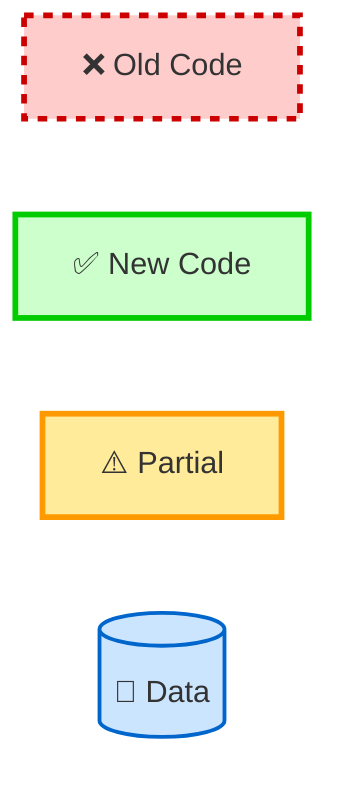

# Architecture Diagrams

Visual documentation of the SettingsModule migration from dual system to event-driven architecture.

---

## Quick Visual Overview

### Current State: Dual System ❌

```
┌─────────────┐
│ UIController│
└─────┬───┬───┘
      │   │
      │   └──────────────────┐
      │                      ▼
      │              ┌──────────────┐
      │              │ TTSEngine    │
      │              │ .setSpeechRate() │ (OLD: Direct call)
      │              └──────────────┘
      │
      ▼
┌──────────────┐
│ EventBus     │
└──────┬───────┘
       │
       ▼
┌──────────────┐
│SettingsModule│
└──────┬───────┘
       │
       ▼
┌──────────────┐
│ EventBus     │
└──────────────┘
       │
       X (NO LISTENERS!) ❌
```

**Problem**: Two paths (old direct calls + new events), engines don't listen!

---

### Target State: Event-Driven ✅

```
┌─────────────┐
│ UIController│
└─────┬───────┘
      │
      ▼
┌──────────────┐
│ EventBus     │
└──────┬───────┘
       │
       ▼
┌──────────────┐
│SettingsModule│
└──────┬───────┘
       │
       ▼
┌──────────────┐
│ EventBus     │ (setting:changed)
└─┬─┬─┬─┬──────┘
  │ │ │ │
  ▼ ▼ ▼ ▼
[TTSEngine] [AudioControls] [VoiceSelector] [VocabManager]
  (All listening!) ✅
```

**Solution**: Single path (events only), all engines listen!

---

## Diagram Files

### 1. current-architecture.md
**What**: Current problematic state (dual system)  
**Visual**: Mermaid diagrams showing old + new code coexisting  
**Key Insight**: Pink dashed lines = old code (to remove), Green = new code  
**Read Time**: 5 minutes  

**Key Diagrams**:
- System-wide architecture (dual system)
- Settings flow (two paths: old + new)

---

### 2. target-architecture.md
**What**: Clean target state (event-driven only)  
**Visual**: Mermaid diagrams showing desired end state  
**Key Insight**: All green = event-driven, no redundancy  
**Read Time**: 5 minutes  

**Key Diagrams**:
- Clean architecture (events only)
- Settings flow (single path)

---

### 3. data-flow-diagram.md
**What**: Complete data flow analysis  
**Visual**: Detailed sequence diagrams, layer diagrams  
**Key Insight**: Current dual path vs target single path  
**Read Time**: 15 minutes  

**Key Diagrams**:
- Current state flow (dual paths)
- Target state flow (single path)
- Speed setting example (before/after)
- Data transformation pipeline
- Error handling flow
- Performance characteristics

---

### 4. workflow-diagram.md
**What**: User, developer, and system workflows  
**Visual**: Sequence diagrams, flowcharts, state diagrams  
**Key Insight**: How settings flow through the system  
**Read Time**: 20 minutes  

**Key Diagrams**:
- User workflows (change speed, delay, batch update, reset)
- Developer workflows (add setting, debug, refactor)
- System workflows (startup, propagation, error handling)
- Integration workflows (TTS API, cross-module)
- State diagram (setting lifecycle)
- Timing diagram (performance)

---

### 5. directory-structure.md
**What**: File responsibilities and dependencies  
**Visual**: Directory tree, dependency graphs, tables  
**Key Insight**: Which files need updating, migration status  
**Read Time**: 15 minutes  

**Key Diagrams**:
- Complete directory tree (with emojis!)
- Current dependency graph (dual system)
- Target dependency graph (clean)
- Responsibility matrix (by file)
- Migration status (by directory)

---

## Visual Legend

### Status Colors

| Color | Meaning | Example |
|-------|---------|---------|
| 🟢 Green | Complete, working | SettingsModule.js |
| 🟡 Yellow | Partial, in-progress | UIController.js |
| 🔴 Red | Not started, broken | TTSEngine.js |
| ⚫ Gray | Deprecated, to delete | SettingsManager.js |

### File Status Icons

| Icon | Meaning | Action |
|------|---------|--------|
| ✅ | Complete | No action |
| ⚠️ | Partial | Review & complete |
| ❌ | Not updated | Add event listeners |
| 🗑️ | To delete | Delete after migration |

---

## Mermaid Diagram Conventions

### Node Styling



### Arrow Types

| Arrow | Meaning | Example |
|-------|---------|---------|
| `-->` | Solid line | Active dependency |
| `-.->` | Dashed line | Optional/deprecated |
| `==>` | Thick line | Critical path |
| `--X` | Line with X | Broken/missing |

---

## How to Read the Diagrams

### Step 1: Start with Current Architecture
1. Open `current-architecture.md`
2. Look for **pink dashed boxes** (old code)
3. Look for **green solid boxes** (new code)
4. Identify the problem: dual system

### Step 2: Understand Target Architecture
1. Open `target-architecture.md`
2. Note: **all green boxes** (event-driven)
3. Compare with current state
4. Understand the goal

### Step 3: Deep Dive into Data Flow
1. Open `data-flow-diagram.md`
2. Study sequence diagrams
3. See how data transforms (string → number → string)
4. Understand event flow

### Step 4: Follow Workflows
1. Open `workflow-diagram.md`
2. Follow user workflows (change setting)
3. Follow developer workflows (add setting)
4. Follow system workflows (startup)

### Step 5: Map to Files
1. Open `directory-structure.md`
2. Find files that need updating
3. Check migration status
4. Estimate work required

---

## Diagram Generation

All diagrams use Mermaid.js for consistency and maintainability.

### Rendering Options

**Option 1: VS Code** (recommended)
- Install "Markdown Preview Mermaid Support" extension
- Open `.md` file
- Click "Open Preview" (Ctrl+Shift+V)

**Option 2: GitHub**
- Push to GitHub
- View `.md` files online (auto-renders Mermaid)

**Option 3: Mermaid Live Editor**
- Copy diagram code
- Paste into https://mermaid.live/
- Export as PNG/SVG

**Option 4: CLI**
```bash
npm install -g @mermaid-js/mermaid-cli
mmdc -i diagram.md -o diagram.png
```

---

## Updating Diagrams

### When to Update

- 🔄 **Architecture changes**: Update `current-architecture.md` and `target-architecture.md`
- 🔄 **New events**: Update `data-flow-diagram.md` event catalog
- 🔄 **New workflows**: Update `workflow-diagram.md`
- 🔄 **File changes**: Update `directory-structure.md` dependency graph
- 🔄 **Migration progress**: Update status in all diagrams

### How to Update

1. Edit `.md` file with Mermaid code
2. Test rendering in VS Code preview
3. Update diagram legends/descriptions
4. Update this README if new diagrams added
5. Commit with message: `docs(diagrams): Update [diagram name]`

---

## Examples

### Example 1: Adding New Event

**File**: `data-flow-diagram.md`

```markdown
### Events Emitted by SettingsModule

| Event | Payload | When | Listeners |
|-------|---------|------|-----------|
| `setting:changed` | `{key, value}` | After change | All engines |
| `setting:theme-changed` | `{theme}` | Theme change | ThemeManager | <-- ADD
```

---

### Example 2: Adding New File

**File**: `directory-structure.md`

```markdown
### Core Layer (`src/js/core/`)

| File | Responsibility | Status | Depends On |
|------|---------------|--------|------------|
| `SettingsModule.js` | Settings management | ✅ Active | EventBus, Storage |
| `ThemeManager.js` | Theme switching | ✅ Active | EventBus | <-- ADD
```

---

### Example 3: Marking File Complete

**File**: `current-architecture.md`

Update node styling from:
```mermaid
TTSEngine[TTSEngine.js<br/>❌ Not Updated]
class TTSEngine notUpdated
```

To:
```mermaid
TTSEngine[TTSEngine.js<br/>✅ Complete]
class TTSEngine complete
```

---

## Quick Reference: File Migration Status

| File | Diagram Location | Status | Update Needed |
|------|-----------------|--------|---------------|
| SettingsModule.js | All diagrams | ✅ Complete | None |
| UIController.js | All diagrams | ⚠️ Partial | Review remaining calls |
| TTSEngine.js | data-flow-diagram.md | ❌ Not updated | Add event listeners |
| AudioControls.js | data-flow-diagram.md | ❌ Not updated | Add event listeners |
| VoiceSelector.js | data-flow-diagram.md | ❌ Not updated | Add event listeners |
| VocabularyManager.js | data-flow-diagram.md | ❌ Not updated | Add event listeners |
| SettingsPanel.js | workflow-diagram.md | ❌ Not updated | Replace old calls |
| SettingsManager.js | current-architecture.md | 🗑️ To delete | Delete after Phase 3 |

---

## Diagram Complexity

| Diagram | Complexity | Detail Level | Best For |
|---------|-----------|--------------|----------|
| current-architecture.md | Low | High-level | Quick overview |
| target-architecture.md | Low | High-level | Understanding goal |
| data-flow-diagram.md | High | Very detailed | Deep understanding |
| workflow-diagram.md | High | Very detailed | Process understanding |
| directory-structure.md | Medium | Medium | File mapping |

---

## Common Patterns in Diagrams

### Pattern 1: Event Flow

```
User → UI → EventBus → SettingsModule → EventBus → Engines
```

Always: **UI emits → SettingsModule validates → Engines listen**

---

### Pattern 2: Validation Flow

```
Event → Validate → Apply → Persist → Emit
```

Always: **Validate before apply, apply before persist, emit after all**

---

### Pattern 3: Error Handling

```
Validate → Invalid? → Emit error → UI shows message
```

Always: **Emit error event, don't throw exception**

---

## Tips for Understanding Diagrams

1. **Start simple**: Read high-level diagrams first (current/target architecture)
2. **Follow the flow**: Trace a single setting change from UI to Engine
3. **Compare states**: Look at "before" vs "after" side-by-side
4. **Check legends**: Understand colors and symbols before reading
5. **Focus on one layer**: UI layer, Core layer, or Data layer at a time

---

## Diagram Maintenance Checklist

When code changes:

- [ ] Update `current-architecture.md` if architecture changes
- [ ] Update `target-architecture.md` if design changes
- [ ] Update `data-flow-diagram.md` if events change
- [ ] Update `workflow-diagram.md` if workflows change
- [ ] Update `directory-structure.md` if files change
- [ ] Update this README if new diagrams added
- [ ] Test all Mermaid diagrams render correctly
- [ ] Commit with descriptive message

---

## Future Enhancements

Potential diagrams to add:

- [ ] **Testing diagram**: Unit, integration, e2e test coverage
- [ ] **Performance diagram**: Benchmark results, bottleneck analysis
- [ ] **Deployment diagram**: CI/CD pipeline, hosting architecture
- [ ] **User journey diagram**: Complete user interaction flows
- [ ] **Error recovery diagram**: Rollback strategies, error states

---

## Conclusion

These diagrams provide a **complete visual reference** for the SettingsModule migration.

**Key Insights**:
- 📊 **Current State**: Dual system (old + new coexist) ❌
- 📊 **Target State**: Event-driven only ✅
- 📊 **Gap**: Engines don't listen to events yet
- 📊 **Solution**: Add event listeners to all engines

**Next Step**: Follow the diagrams to complete migration! 🚀

---

**Created**: 2025-10-08  
**Last Updated**: 2025-10-08  
**Maintained By**: Development Team
