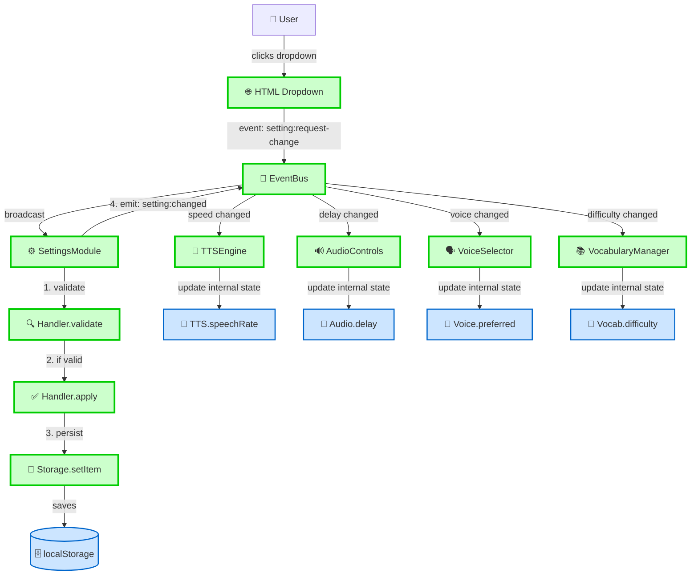
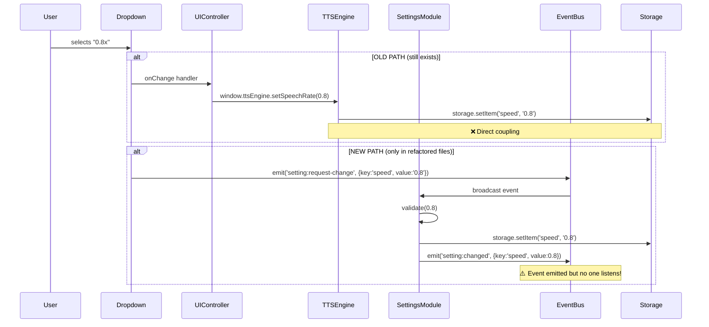
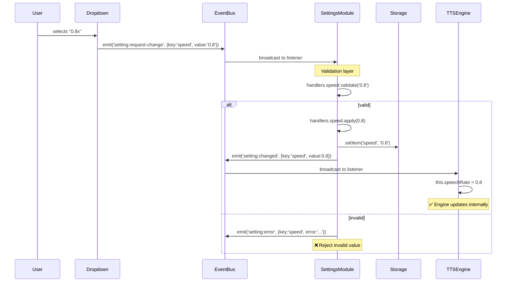
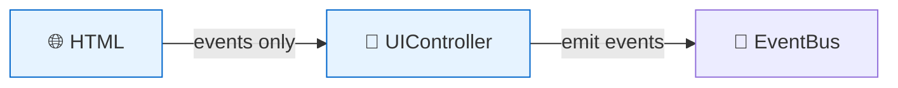
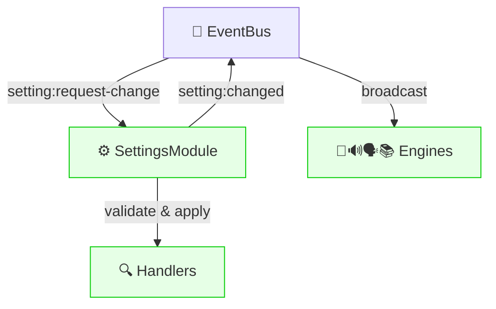
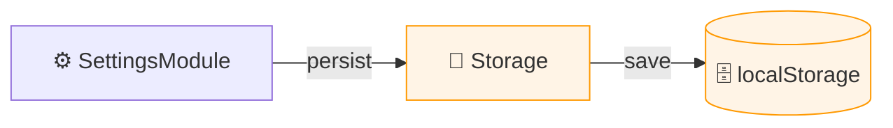
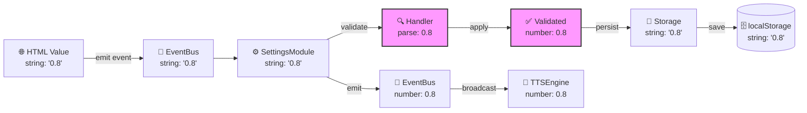
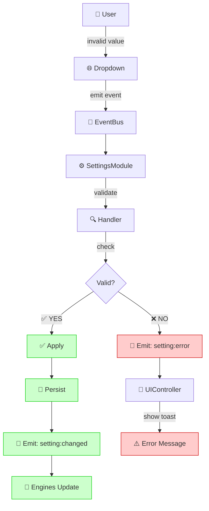
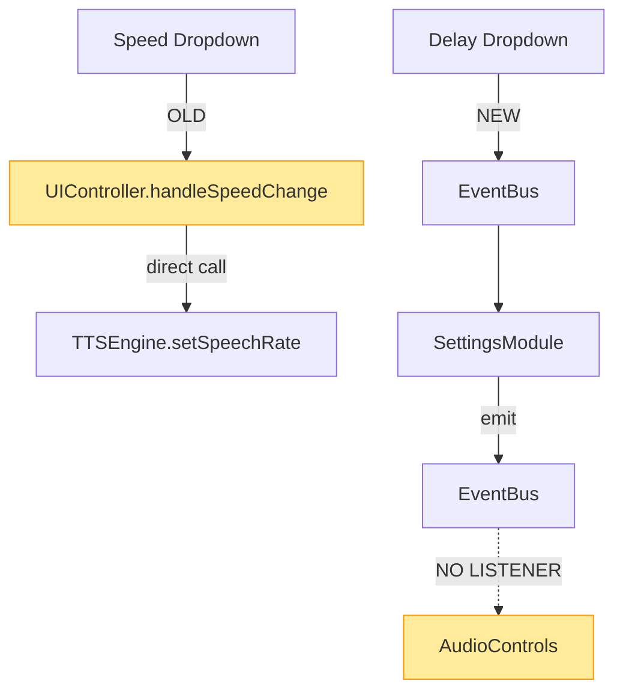
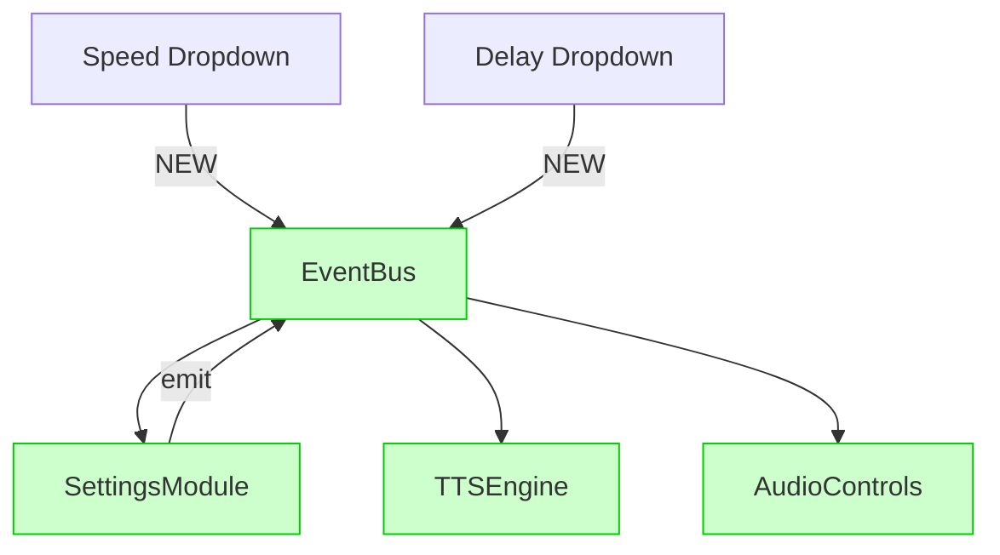

# Data Flow Diagram: Settings System

## Current State (Dual System - PROBLEMATIC)

```mermaid
graph TB
    %% User Input
    User[👤 User] -->|clicks dropdown| HTML[🌐 HTML Dropdown]
    
    %% Two parallel paths (PROBLEM!)
    HTML -->|OLD: direct call| OLD_UI[❌ OLD: UIController.handleSpeedChange]
    HTML -->|NEW: event| NEW_UI[✅ NEW: UIController.bindSettingControls]
    
    %% Old path (still exists)
    OLD_UI -->|window.ttsEngine.setSpeechRate| OLD_ENGINE[❌ TTSEngine.setSpeechRate]
    OLD_ENGINE -->|window.storage.setItem| OLD_STORAGE[💾 Storage.setItem]
    OLD_STORAGE -->|saves| LOCALSTORAGE[(🗄️ localStorage)]
    
    %% New path (only partial)
    NEW_UI -->|emit: setting:request-change| EVENTBUS[📡 EventBus]
    EVENTBUS -->|broadcast| SETTINGS_MODULE[⚙️ SettingsModule]
    SETTINGS_MODULE -->|1. validate| HANDLER[🔍 Handler.validate]
    HANDLER -->|2. if valid| APPLY[✅ Handler.apply]
    APPLY -->|3. persist| NEW_STORAGE[💾 Storage.setItem]
    NEW_STORAGE -->|saves| LOCALSTORAGE
    SETTINGS_MODULE -->|4. emit: setting:changed| EVENTBUS
    
    %% Problem: Engines don't listen yet!
    EVENTBUS -.->|⚠️ NO LISTENER!| ENGINE_PLACEHOLDER[❌ TTSEngine (not listening)]
    
    %% Visual styling
    classDef oldCode fill:#ffcccc,stroke:#cc0000,stroke-width:3px,stroke-dasharray: 5 5
    classDef newCode fill:#ccffcc,stroke:#00cc00,stroke-width:3px
    classDef problem fill:#ffeb99,stroke:#ff9900,stroke-width:3px
    
    class OLD_UI,OLD_ENGINE,OLD_STORAGE oldCode
    class NEW_UI,EVENTBUS,SETTINGS_MODULE,HANDLER,APPLY,NEW_STORAGE newCode
    class ENGINE_PLACEHOLDER problem
```

**Problem Summary**:
- 🔴 **Dual Paths**: Two ways to change settings (old direct calls + new events)
- 🔴 **Incomplete Loop**: SettingsModule emits events, but engines don't listen
- 🔴 **Dead Events**: `setting:changed` event emitted but no one receives it
- 🔴 **Inconsistency**: Some dropdowns use old path, some use new path

---

## Target State (Event-Driven - CLEAN)



**Benefits**:
- ✅ **Single Path**: Only one way to change settings (events)
- ✅ **Complete Loop**: All engines listen and respond
- ✅ **Loose Coupling**: Modules don't know about each other
- ✅ **Testable**: Can test each part independently
- ✅ **Extensible**: New engines just add listeners

---

## Detailed Flow: Speed Setting Example

### Current State (Mixed)



### Target State (Clean)



---

## Data Flow Layers

### Layer 1: Presentation (UI)


**Responsibility**: User interaction, display updates  
**Pattern**: Emit events, never call modules directly  
**Files**: `index.html`, `UIController.js`, `SettingsPanel.js`

---

### Layer 2: Business Logic (Core)


**Responsibility**: Validation, orchestration, state management  
**Pattern**: Listen to events, emit events, never access DOM  
**Files**: `SettingsModule.js`, `TTSEngine.js`, `AudioControls.js`, etc.

---

### Layer 3: Data Persistence (Storage)


**Responsibility**: Persistence, caching  
**Pattern**: Provide utility methods, no business logic  
**Files**: `Storage.js`, `CacheMigration.js`

---

## Event Catalog

### Events Emitted by SettingsModule

| Event | Payload | When | Listeners |
|-------|---------|------|-----------|
| `setting:changed` | `{key, value, previousValue}` | After successful setting change | All engines |
| `setting:error` | `{key, error, value}` | When validation fails | UIController (show error) |
| `settings:batch-updated` | `{updates: [{key,value}...]}` | After batch update | All engines |
| `settings:reset` | `{}` | After settings reset | All engines |
| `settings:imported` | `{settings: {...}}` | After import | All engines |

### Events Listened by SettingsModule

| Event | Payload | Emitted By | Action |
|-------|---------|------------|--------|
| `setting:request-change` | `{key, value}` | UIController, SettingsPanel | Validate → Apply → Persist → Emit |

### Events Listened by Engines

| Engine | Events | Actions |
|--------|--------|---------|
| TTSEngine | `setting:changed` (speed, voice) | Update `this.speechRate`, `this.selectedVoice` |
| AudioControls | `setting:changed` (delay, repeat) | Update `this.delay`, `this.repeatMode` |
| VoiceSelector | `setting:changed` (voice) | Update `this.preferredVoice`, refresh dropdown |
| VocabularyManager | `setting:changed` (difficulty, learningMode) | Filter words, switch books |

---

## Data Transformation Pipeline



**Key Transformations**:
1. HTML → Event: String (e.g., `"0.8"`)
2. Event → Handler: Still string
3. Handler validate: String → Number (e.g., `0.8`)
4. Storage persist: Number → String (e.g., `"0.8"`)
5. Event broadcast: Number (e.g., `0.8`)
6. Engine apply: Number (e.g., `0.8`)

---

## Error Handling Flow



**Error Scenarios**:
- Invalid speed (e.g., `999`)
- Invalid delay (e.g., `-1`)
- Invalid difficulty (e.g., `"ultra-hard"`)
- Invalid dataset (e.g., `"non-existent.json"`)

---

## Performance Characteristics

### Event Overhead

```
User clicks dropdown
└─ ~1ms: DOM event
   └─ ~0.1ms: EventBus emit
      └─ ~0.5ms: SettingsModule validate
         └─ ~0.1ms: Storage persist
            └─ ~0.1ms: EventBus emit
               └─ ~0.2ms: Engine update
                  
Total: ~2ms (imperceptible to user)
```

**Benchmarks** (hypothetical, need real measurement):
- Old pattern (direct call): ~1ms
- New pattern (event-driven): ~2ms
- Overhead: +1ms (acceptable)

---

## Migration Data Flow

### Before Migration (File A uses old, File B uses new)



### After Migration (All files use events)



---

## Conclusion

**Current Issue**: Dual system with incomplete event loop  
**Target**: Single event-driven architecture with all components listening  
**Key Insight**: SettingsModule is ready, but engines need event listeners added!

**Next Steps**:
1. Add event listeners to all engines
2. Privatize or remove old setter methods
3. Delete old SettingsManager
4. Verify data flows correctly end-to-end
