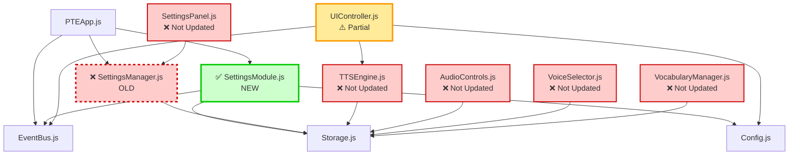
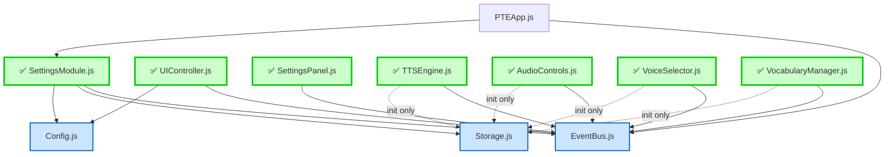
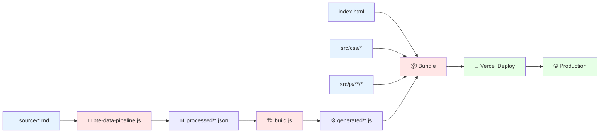

# Directory Structure & Responsibility Diagram

## Project Overview

```
ccl-pronunciation-trainer/
├── 📄 Configuration Files (Root)
├── 📚 Data Layer
├── 📖 Documentation
├── 🖼️ Assets
├── 🛠️ Build Scripts
└── 💻 Source Code (Core Application)
```

---

## Complete Directory Tree

```
ccl-pronunciation-trainer/
│
├── 📄 Root Configuration Files
│   ├── index.html                    # 🌐 Main HTML entry point
│   ├── manifest.json                 # 📱 PWA manifest
│   ├── sw.js                         # 🔄 Service worker (PWA caching)
│   ├── package.json                  # 📦 NPM dependencies & scripts
│   ├── vercel.json                   # 🚀 Vercel deployment config
│   ├── CHANGELOG.md                  # 📝 Version history
│   ├── CLAUDE.md                     # 🤖 AI assistant notes
│   └── README.md                     # 📖 Project overview
│
├── 📚 data/                          # Data layer (all datasets)
│   ├── generated/                    # ⚙️ Auto-generated from source
│   │   ├── aiml-terms.js            # 🤖 AI/ML vocabulary
│   │   ├── conversation-vocabulary-data.js  # 💬 Conversation vocab
│   │   ├── unfamiliar-words.js      # ❓ Uncommon words
│   │   ├── vocabulary-clean.js      # ✨ Cleaned vocabulary
│   │   └── words-dataset.js         # 📖 General words
│   │
│   ├── processed/                    # 🔧 Processed from source
│   │   ├── pte-answer-short-question-dataset.json   # ❓ ASQ questions
│   │   ├── pte-beginner-vocabulary.json             # 🟢 Beginner words
│   │   ├── pte-fib-listening-dataset.json           # 👂 FIB-L exercises
│   │   ├── pte-intermediate-vocabulary.json         # 🟡 Intermediate words
│   │   ├── pte-repeat-sentence-dataset.json         # 🔁 RS sentences
│   │   └── pte-write-from-dictation-dataset.json    # ✍️ WFD exercises
│   │
│   ├── reports/                      # 📊 Data quality reports
│   │   ├── pte-processing-report.json     # 🔍 Processing logs
│   │   └── validation-report.json          # ✅ Validation results
│   │
│   └── source/                       # 📝 Source markdown files
│       └── pte/                      # PTE-specific data
│           ├── asq/                  # Answer Short Question
│           │   └── pte-answer-short-question.md
│           ├── rs/                   # Repeat Sentence
│           │   └── pte-repeat-sentence.md
│           ├── vocabs/               # Vocabulary lists
│           │   ├── fib-listening-vocabulary.md
│           │   ├── pte-advanced-vocabulary-with-ipa.md
│           │   └── ...
│           └── wfd/                  # Write From Dictation
│               └── ...
│
├── 📖 docs/                          # Documentation
│   ├── API-REFERENCE.md             # 🔌 API documentation
│   ├── ARCHITECTURE-ANALYSIS.md     # 🏗️ Architecture deep-dive
│   ├── ARCHITECTURE.md              # 📐 High-level architecture
│   ├── BEST-PRACTICES-REFACTORING.md  # ✨ Coding best practices
│   ├── CONTRIBUTING.md              # 🤝 Contribution guidelines
│   ├── DEPLOYMENT.md                # 🚀 Deployment guide
│   ├── DESIGN-LOGIC-COMPLETE.md     # 🎨 Design decisions
│   ├── README.md                    # 📖 Docs index
│   ├── SETTINGS-MODULE-IMPLEMENTATION.md  # ⚙️ Settings module guide
│   ├── TROUBLESHOOTING.md           # 🔧 Common issues
│   │
│   ├── diagrams/                    # 📊 NEW: Architecture diagrams
│   │   ├── current-architecture.md  # 🏗️ Current state (dual system)
│   │   ├── target-architecture.md   # 🎯 Target state (clean)
│   │   ├── data-flow-diagram.md     # 🔄 Data flow visualization
│   │   ├── workflow-diagram.md      # 📋 User & system workflows
│   │   └── directory-structure.md   # 📂 This file!
│   │
│   ├── migration/                   # 🔄 NEW: Migration guides
│   │   └── complete-migration-plan.md  # 📝 Step-by-step migration
│   │
│   └── archive/                     # 🗄️ Historical documentation
│       └── phase2-wip/              # Phase 2 work-in-progress docs
│           ├── BROWSER-TEST-CHECKLIST.md
│           ├── BUG-FIX-SYNC-LOOP.md
│           ├── ...
│           ├── image/               # Screenshots
│           ├── implementation/      # Old implementation notes
│           └── planning/            # Old planning docs
│
├── 🖼️ images/                        # Static assets (images, icons)
│   └── ...
│
├── 🛠️ scripts/                       # Build & utility scripts
│   ├── build.js                     # 🏗️ Production build
│   ├── pte-data-pipeline.js         # 🔄 Process PTE data
│   └── validate.js                  # ✅ Data validation
│
└── 💻 src/                           # Source code (main application)
    ├── css/                          # Stylesheets
    │   ├── animations.css           # 🎬 Animation effects
    │   ├── components.css           # 🧩 Component styles
    │   ├── responsive.css           # 📱 Mobile responsiveness
    │   ├── style.css                # 🎨 Main styles
    │   └── variables.css            # 🎨 CSS variables (colors, spacing)
    │
    └── js/                           # JavaScript modules
        ├── audio/                    # 🔊 Audio & TTS modules
        │   ├── AudioControls.js     # 🎚️ Playback controls (delay, repeat)
        │   ├── TTSEngine.js         # 🎤 Text-to-speech engine
        │   └── VoiceSelector.js     # 🗣️ Voice selection & management
        │
        ├── core/                     # 🧠 Core application logic
        │   ├── ProgressTracker.js   # 📊 Track user progress
        │   ├── PTEApp.js            # 🚀 Main application coordinator
        │   ├── PTEVocabularyManager.js  # 📚 Vocabulary management
        │   ├── SettingsManager.js   # ⚠️ OLD: Legacy settings (to delete)
        │   └── SettingsModule.js    # ⚙️ NEW: Event-driven settings
        │
        ├── data/                     # 📊 Data management
        │   ├── DatasetManager.js    # 📁 Load & manage datasets
        │   └── extractors/          # 🔍 Data extraction utilities
        │
        ├── shared/                   # 🔧 Shared utilities & config
        │   ├── Config.js            # ⚙️ Application configuration
        │   └── DataSchema.js        # 📋 Data structure schemas
        │
        ├── ui/                       # 🎨 User interface modules
        │   ├── SettingsPanel.js     # ⚙️ Settings UI panel
        │   └── UIController.js      # 🎮 UI event handling
        │
        └── utils/                    # 🛠️ Utility modules
            ├── CacheMigration.js    # 🔄 Migrate old cache data
            ├── EventBus.js          # 📡 Event system (pub/sub)
            ├── StateManager.js      # 💾 Application state
            ├── StateTest.js         # 🧪 State testing utilities
            └── Storage.js           # 💾 localStorage wrapper
```

---

## Responsibility Matrix

### 📄 Root Files

| File | Responsibility | Dependencies | Consumers |
|------|---------------|--------------|-----------|
| `index.html` | HTML entry, load all scripts | All `src/js/**/*.js` | Browser |
| `manifest.json` | PWA configuration | None | Browser, Service Worker |
| `sw.js` | Offline caching | None | Browser |
| `package.json` | Dependencies, scripts | None | npm, Vercel |
| `vercel.json` | Deployment config | None | Vercel |

---

### 📚 Data Layer (`data/`)

| Directory | Responsibility | Input | Output | Updated By |
|-----------|---------------|-------|--------|------------|
| `source/` | Source of truth (markdown) | Manual editing | Markdown files | Developers |
| `processed/` | Cleaned JSON datasets | `source/` | JSON files | `pte-data-pipeline.js` |
| `generated/` | Auto-generated JS modules | `source/` | `.js` files | `build.js` |
| `reports/` | Data quality metrics | Processing logs | JSON reports | Scripts |

**Data Flow**:
```
source/*.md → [pte-data-pipeline.js] → processed/*.json → [build.js] → generated/*.js
```

---

### 💻 Source Code (`src/`)

#### 🎨 CSS Layer (`src/css/`)

| File | Responsibility | Scope | Used By |
|------|---------------|-------|---------|
| `variables.css` | CSS variables (colors, spacing) | Global | All CSS files |
| `style.css` | Main styles, layout | Global | `index.html` |
| `components.css` | Component-specific styles | Components | `index.html` |
| `responsive.css` | Mobile/tablet breakpoints | Global | `index.html` |
| `animations.css` | Keyframes, transitions | Global | `index.html` |

**CSS Architecture**: Variables → Base → Components → Responsive → Animations

---

#### 🔊 Audio Layer (`src/js/audio/`)

| File | Responsibility | Listens To | Emits | Depends On |
|------|---------------|-----------|-------|------------|
| `TTSEngine.js` | Text-to-speech, Web Speech API | `setting:changed` (speed, voice) | `tts:started`, `tts:ended` | EventBus |
| `AudioControls.js` | Playback controls (play, pause, repeat) | `setting:changed` (delay, repeat) | `audio:play`, `audio:pause` | EventBus, TTSEngine |
| `VoiceSelector.js` | Voice selection & filtering | `setting:changed` (voice) | `voice:changed` | EventBus, TTSEngine |

**Audio Flow**:
```
User → UIController → EventBus → SettingsModule → EventBus → TTSEngine/AudioControls/VoiceSelector
```

---

#### 🧠 Core Layer (`src/js/core/`)

| File | Responsibility | Status | Listens To | Emits | Depends On |
|------|---------------|--------|-----------|-------|------------|
| `PTEApp.js` | Application coordinator | ✅ Active | None (top-level) | App lifecycle events | All modules |
| `SettingsModule.js` | Settings management (NEW) | ✅ Active | `setting:request-change` | `setting:changed`, `setting:error` | EventBus, Storage, Config |
| `SettingsManager.js` | Legacy settings (OLD) | ⚠️ Deprecated | None | None | Storage |
| `PTEVocabularyManager.js` | Vocabulary filtering & books | ✅ Active | `setting:changed` (difficulty, learningMode) | `vocabulary:updated` | EventBus, DatasetManager |
| `ProgressTracker.js` | Track learning progress | ✅ Active | User interactions | `progress:updated` | Storage |

**Migration Status**:
- ✅ `SettingsModule.js`: NEW event-driven (keep)
- ⚠️ `SettingsManager.js`: OLD direct calls (delete after migration)

---

#### 📊 Data Layer (`src/js/data/`)

| File | Responsibility | Depends On | Used By |
|------|---------------|------------|---------|
| `DatasetManager.js` | Load & cache datasets | Config, Storage | VocabularyManager, UIController |
| `extractors/*.js` | Extract data from raw files | None | DatasetManager |

**Data Loading Flow**:
```
User selects dataset → UIController → DatasetManager.load() → extractors → Cache in Storage → Return to VocabularyManager
```

---

#### 🔧 Shared Layer (`src/js/shared/`)

| File | Responsibility | Type | Depends On | Used By |
|------|---------------|------|------------|---------|
| `Config.js` | Application configuration | Data | None | All modules |
| `DataSchema.js` | Data structure definitions | Data | None | DatasetManager, validators |

**Config Structure**:
```javascript
{
    settings: {
        speeds: [0.5, 0.7, 0.8, ...],
        delays: [1000, 2000, 3000],
        difficulties: ['beginner', 'intermediate', 'advanced'],
        ...
    },
    datasetFiles: { ... },
    voicePreferences: { ... }
}
```

---

#### 🎨 UI Layer (`src/js/ui/`)

| File | Responsibility | Status | Emits | Listens To | Depends On |
|------|---------------|--------|-------|-----------|------------|
| `UIController.js` | UI event handling, dropdown population | ⚠️ Partial refactor | `setting:request-change` | `setting:changed`, `vocabulary:updated` | EventBus, Config |
| `SettingsPanel.js` | Settings panel UI | ❌ Not refactored | ~~Direct calls~~ (needs events) | None | SettingsManager (old) |

**Migration Status**:
- ⚠️ `UIController.js`: Partially refactored (dropdowns use events, but may have other direct calls)
- ❌ `SettingsPanel.js`: Still uses old `SettingsManager.updateSetting()`

---

#### 🛠️ Utils Layer (`src/js/utils/`)

| File | Responsibility | Type | Depends On | Used By |
|------|---------------|------|------------|---------|
| `EventBus.js` | Publish-subscribe event system | Infrastructure | None | All modules |
| `Storage.js` | localStorage wrapper | Infrastructure | None | All modules |
| `StateManager.js` | Application state management | Infrastructure | Storage | PTEApp, modules |
| `CacheMigration.js` | Migrate old cached data | Utility | Storage, SettingsManager | PTEApp (on startup) |
| `StateTest.js` | State testing utilities | Testing | StateManager | Developers |

**EventBus Pattern**:
```javascript
// Publisher
eventBus.emit('setting:changed', {key: 'speed', value: 0.8});

// Subscriber
eventBus.on('setting:changed', ({key, value}) => { ... });
```

---

## Module Dependency Graph

### Current State (Dual System)



**Problems**:
- 🔴 Dual settings systems (OLD + NEW)
- 🔴 Mixed patterns (some event-driven, some direct)
- 🔴 Engines don't listen to events yet
- 🔴 SettingsPanel still uses old SettingsManager

---

### Target State (Clean)



**Benefits**:
- ✅ Single settings system (SettingsModule only)
- ✅ All modules event-driven
- ✅ Loose coupling (no direct dependencies)
- ✅ Storage only for initialization

---

## File Size & Complexity

| File | Lines | Complexity | Status | Priority |
|------|-------|-----------|--------|----------|
| `SettingsModule.js` | ~400 | High | ✅ Complete | - |
| `TTSEngine.js` | ~300 | High | ❌ Needs listeners | 🔴 HIGH |
| `AudioControls.js` | ~250 | Medium | ❌ Needs listeners | 🔴 HIGH |
| `UIController.js` | ~200 | Medium | ⚠️ Partial | 🟡 MEDIUM |
| `VoiceSelector.js` | ~200 | Medium | ❌ Needs listeners | 🔴 HIGH |
| `PTEVocabularyManager.js` | ~500 | High | ❌ Needs listeners | 🔴 HIGH |
| `SettingsPanel.js` | ~150 | Low | ❌ Needs refactor | 🔴 HIGH |
| `SettingsManager.js` | ~100 | Low | ⚠️ To delete | 🟢 LOW |
| `CacheMigration.js` | ~80 | Low | ⚠️ Needs update | 🟡 MEDIUM |

**Total Code to Update**: ~1,780 lines across 8 files

---

## Build & Deployment Flow



**Steps**:
1. Edit `source/*.md` (manual)
2. Run `npm run process-data` (pte-data-pipeline.js)
3. Run `npm run build` (build.js)
4. Push to Git
5. Vercel auto-deploys

---

## Testing Structure (Future)

```
tests/                              # 🧪 Test files (to be added)
├── unit/                           # Unit tests
│   ├── SettingsModule.test.js
│   ├── TTSEngine.test.js
│   └── ...
├── integration/                    # Integration tests
│   ├── settings-flow.test.js
│   └── ...
└── e2e/                            # End-to-end tests
    ├── user-workflows.test.js
    └── ...
```

---

## Coding Standards by Directory

### `src/js/core/`
- ✅ All settings go through SettingsModule
- ✅ Use EventBus for inter-module communication
- ✅ No direct DOM manipulation
- ✅ Business logic only

### `src/js/ui/`
- ✅ Emit events, don't call modules directly
- ✅ Handle DOM events
- ✅ No business logic

### `src/js/audio/`
- ✅ Listen to `setting:changed` events
- ✅ Encapsulate Web APIs (Speech Synthesis, Audio)
- ✅ No direct Storage access (use events)

### `src/js/utils/`
- ✅ Pure utility functions
- ✅ No dependencies on business logic
- ✅ Stateless where possible

### `src/js/data/`
- ✅ Data loading and caching only
- ✅ No business logic
- ✅ Return promises for async operations

---

## Migration Checklist by Directory

### ✅ Completed
- [x] `src/js/core/SettingsModule.js` - Created
- [x] `src/js/ui/UIController.js` - Partially refactored (dropdowns)
- [x] `docs/diagrams/` - Architecture diagrams
- [x] `docs/migration/` - Migration plan

### 🚧 In Progress
- [ ] `src/js/ui/UIController.js` - Find remaining direct calls
- [ ] `src/js/ui/SettingsPanel.js` - Replace all `updateSetting()` calls

### 🔜 Pending
- [ ] `src/js/audio/TTSEngine.js` - Add event listeners
- [ ] `src/js/audio/AudioControls.js` - Add event listeners
- [ ] `src/js/audio/VoiceSelector.js` - Add event listeners
- [ ] `src/js/core/PTEVocabularyManager.js` - Add event listeners
- [ ] `src/js/utils/CacheMigration.js` - Replace `updateSetting()` calls
- [ ] `src/js/core/SettingsManager.js` - DELETE after migration
- [ ] `src/js/core/PTEApp.js` - Remove old SettingsManager init

---

## Conclusion

**Current Structure**: Organized by responsibility (audio, core, ui, utils, data)  
**Issue**: Mixed patterns (old + new coexist)  
**Goal**: Clean event-driven architecture across all files  
**Strategy**: Migrate directory by directory, test thoroughly, delete old code

**Next Priority Directories**:
1. 🔴 `src/js/audio/` - Add event listeners (highest impact)
2. 🔴 `src/js/ui/` - Complete refactoring
3. 🟡 `src/js/utils/` - Update CacheMigration
4. 🟢 `src/js/core/` - Delete SettingsManager

**Estimated Total Migration Time**: 2-3 days
