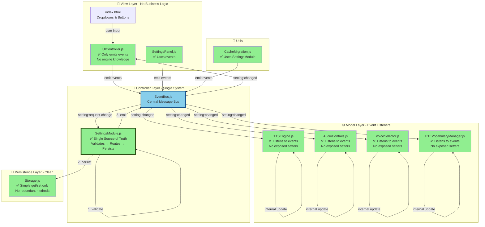

# Target Architecture (After Complete Migration)

## Legend
- 🟢 **All Green**: Clean, consistent, event-driven architecture
- **All Solid Lines**: Event-driven communication only
- **No Dashed Lines**: No direct calls (removed)

## Benefits of Target State

1. ✅ **Single System**: Only SettingsModule exists
2. ✅ **Consistent**: All code uses events
3. ✅ **Enforced**: Engines only listen to events (no setters)
4. ✅ **Clean**: No redundant code
5. ✅ **Clear Boundaries**: SettingsModule handles ALL settings logic
6. ✅ **Complete Migration**: All files updated
7. ✅ **Loose Coupling**: View → EventBus → Controller → EventBus → Model
8. ✅ **Easy Testing**: Mock EventBus only
9. ✅ **Scalable**: Add setting by adding handler + HTML
10. ✅ **Maintainable**: Single place for settings logic

## Comparison Table

| Aspect | Current (Partial) | Target (Complete) |
|--------|------------------|-------------------|
| **Settings Systems** | 2 (SM + Old) | 1 (SM only) |
| **Communication** | Mixed | Events only |
| **Engine Setters** | Exposed | Hidden (private) |
| **Code Patterns** | Inconsistent | Consistent |
| **Files to Edit (new setting)** | Unclear | 2 files |
| **Dependencies (UIController)** | 5+ modules | 1 (EventBus) |
| **Validation** | Partial | 100% |
| **Testability** | Hard | Easy |
| **Redundant Code** | Yes | None |
| **Maintainability** | Medium | High |
