# Workflow Diagram: Settings System

## User Workflows

### 1. Change Speed Setting

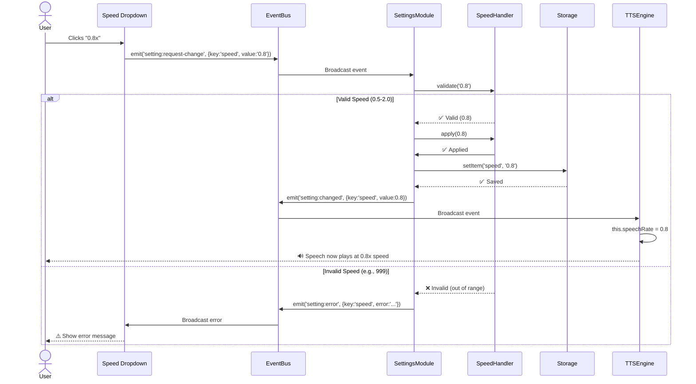

**Duration**: ~2ms  
**User Feedback**: Immediate (next speech plays at new speed)

---

### 2. Change Delay Setting

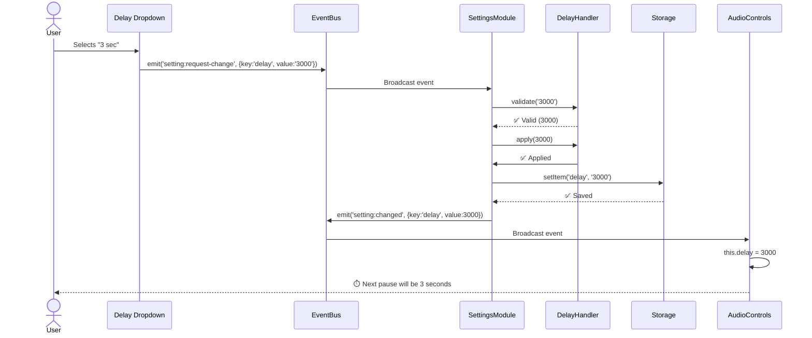

**Duration**: ~2ms  
**User Feedback**: Applied on next playback

---

### 3. Batch Update Settings (Import)

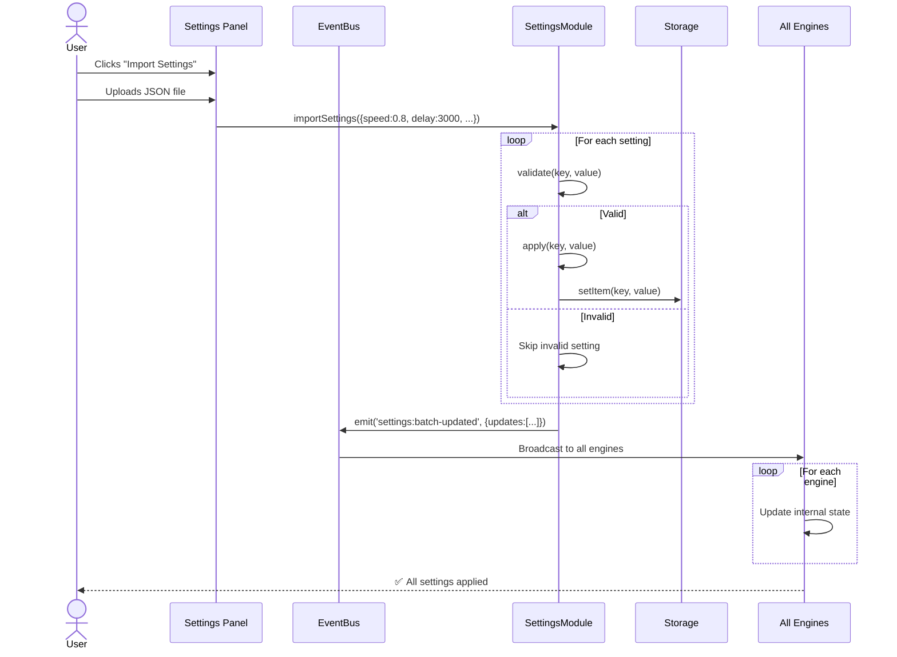

**Duration**: ~10-50ms (depends on # of settings)  
**User Feedback**: Toast notification "Settings imported"

---

### 4. Reset Settings to Default

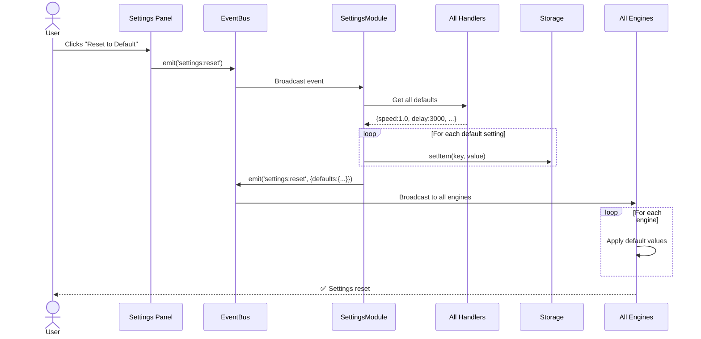

**Duration**: ~5-20ms  
**User Feedback**: All dropdowns reset, toast notification

---

## Developer Workflows

### 1. Add New Setting

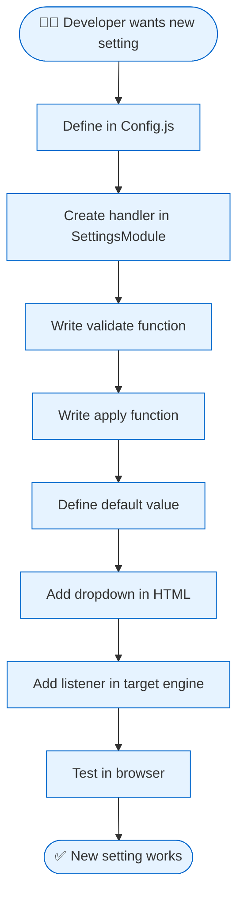

**Example**: Adding "Theme" setting

```javascript
// 1. Config.js
const CONFIG = {
    settings: {
        themes: ['light', 'dark', 'auto']
    }
};

// 2. SettingsModule.js
handlers: {
    theme: {
        validate: (value) => CONFIG.settings.themes.includes(value),
        apply: (value) => { /* no-op, UI handles */ },
        default: 'auto'
    }
}

// 3. index.html
<select id="theme-select">
    <option value="light">Light</option>
    <option value="dark">Dark</option>
    <option value="auto">Auto</option>
</select>

// 4. ThemeManager.js (new engine)
window.eventBus.on('setting:changed', ({key, value}) => {
    if (key === 'theme') {
        document.body.className = `theme-${value}`;
    }
});
```

**Time**: ~30 minutes

---

### 2. Debug Invalid Setting

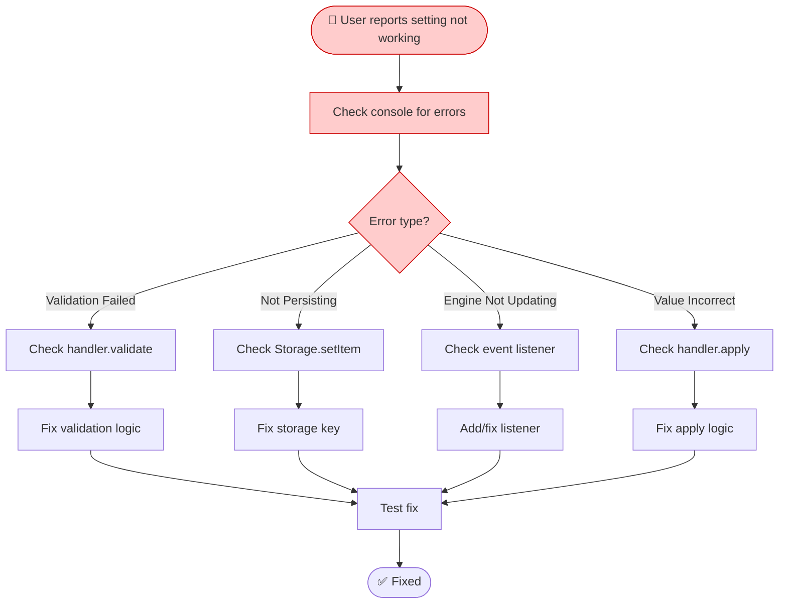

**Common Issues**:
- Missing event listener in engine
- Wrong validation range
- Typo in storage key
- Event not emitted

**Time**: 10-30 minutes

---

### 3. Refactor Old Code to New Pattern

```mermaid
flowchart TD
    Start([🔧 Migrate file to events]) --> Find[Find all direct calls]
    Find --> Replace[Replace with emit()]
    Replace --> Add[Add event listener in engine]
    Add --> Remove[Remove old setter method]
    Remove --> Test[Test thoroughly]
    Test --> Pass{All tests pass?}
    
    Pass -->|Yes| Commit[Commit changes]
    Pass -->|No| Debug[Debug issues]
    Debug --> Test
    
    Commit --> Done([✅ File migrated])
    
    classDef refactor fill:#ccffcc,stroke:#00cc00
    class Start,Find,Replace,Add,Remove,Test,Commit,Done refactor
```

**Example**: Migrating `SettingsPanel.js`

```javascript
// BEFORE
updateSetting(key, value) {
    window.settingsManager.updateSetting(key, value);
}

// AFTER
updateSetting(key, value) {
    window.eventBus.emit('setting:request-change', {key, value});
}
```

**Time**: 15-60 minutes per file

---

## System Workflows

### 1. Application Startup

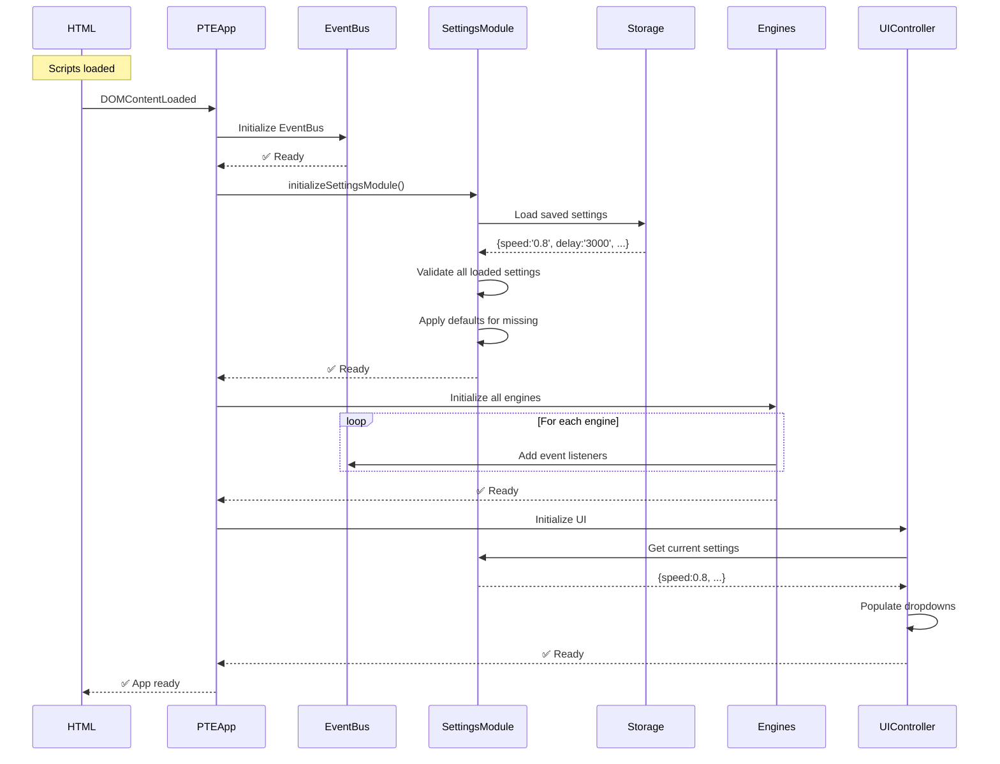

**Duration**: ~100-200ms  
**Critical Path**: EventBus → SettingsModule → Engines → UI

---

### 2. Setting Change Propagation

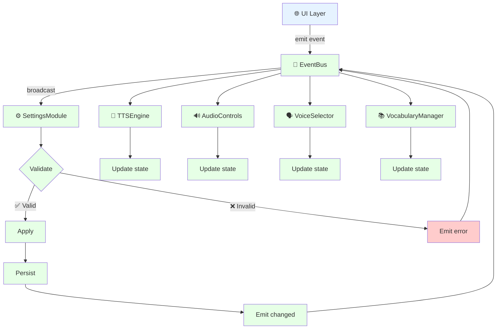

**Steps**:
1. UI emits `setting:request-change`
2. EventBus broadcasts to SettingsModule
3. SettingsModule validates
4. If valid: apply → persist → emit `setting:changed`
5. If invalid: emit `setting:error`
6. EventBus broadcasts `setting:changed` to all engines
7. Each engine updates its internal state

**Duration**: ~2ms end-to-end

---

### 3. Error Handling Flow

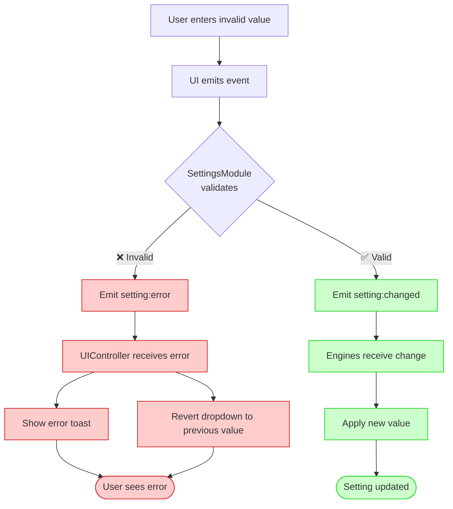

**Error Types**:
- **Validation Error**: Value out of range (e.g., speed = 999)
- **Type Error**: Wrong type (e.g., delay = "abc")
- **Missing Handler**: Unknown setting key
- **Storage Error**: localStorage full

---

## Integration Workflows

### 1. Third-Party API Call (TTS)

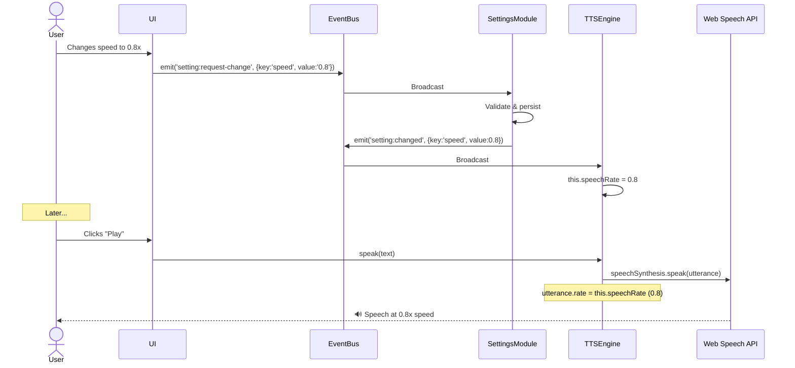

**Key Points**:
- Settings change is decoupled from API call
- Engine stores setting internally
- API call uses stored setting when needed

---

### 2. Cross-Module Communication

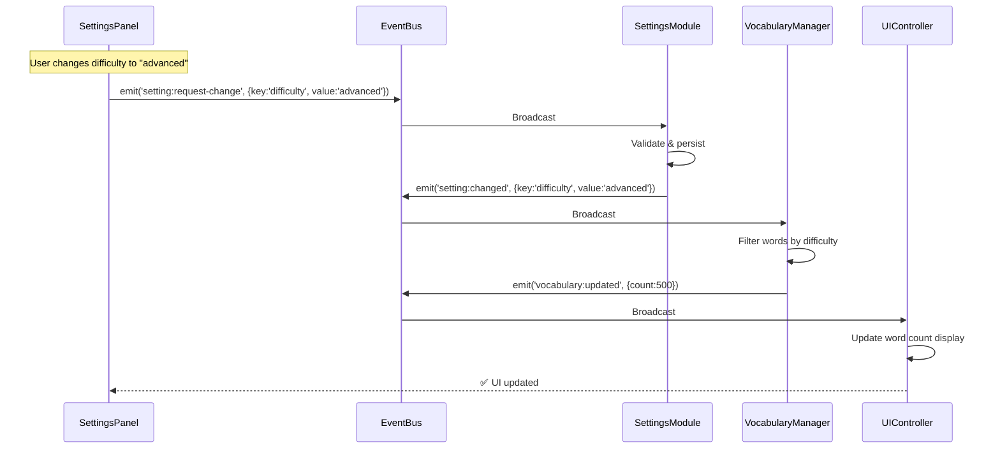

**Pattern**: Settings change triggers cascade of events across modules

---

## State Diagram

### Setting Lifecycle

```mermaid
stateDiagram-v2
    [*] --> Default: App starts
    Default --> Loaded: Load from storage
    Loaded --> Valid: Validate
    
    Valid --> Requested: User changes
    Requested --> Validating: SettingsModule validates
    
    Validating --> Applied: ✅ Valid
    Validating --> Rejected: ❌ Invalid
    
    Applied --> Persisted: Save to storage
    Persisted --> Emitted: Emit event
    Emitted --> Valid: Engines updated
    
    Rejected --> Valid: Keep previous value
    
    Valid --> [*]: App closes
```

**States**:
- **Default**: Built-in default value
- **Loaded**: Restored from localStorage
- **Valid**: Currently active valid value
- **Requested**: User wants to change
- **Validating**: Checking if valid
- **Applied**: Handler applied change
- **Persisted**: Saved to localStorage
- **Emitted**: Event broadcasted
- **Rejected**: Invalid, stay in previous state

---

## Timing Diagram

### Critical Path Analysis

```
User Click (t=0ms)
    |
    ├─ DOM Event (t=1ms)
    |
    ├─ EventBus emit (t=1.1ms)
    |
    ├─ SettingsModule validate (t=1.2ms)
    |   └─ Handler.validate() (t=1.7ms)
    |
    ├─ SettingsModule apply (t=1.8ms)
    |   └─ Handler.apply() (t=1.9ms)
    |
    ├─ Storage persist (t=2.0ms)
    |   └─ localStorage.setItem() (t=2.1ms)
    |
    ├─ EventBus emit (t=2.2ms)
    |
    └─ Engine update (t=2.4ms)
        └─ Internal state change (t=2.5ms)

Total: ~2.5ms (imperceptible)
```

**Bottlenecks**:
- localStorage write (~0.1ms) - acceptable
- Handler validation (~0.5ms) - could optimize complex validations
- EventBus broadcast (~0.1ms) - acceptable

**Optimization Opportunities**:
- Cache validation results for repeated values
- Debounce rapid changes (e.g., slider)
- Batch multiple setting changes

---

## Rollback Workflow

### Handle Failed Setting Change

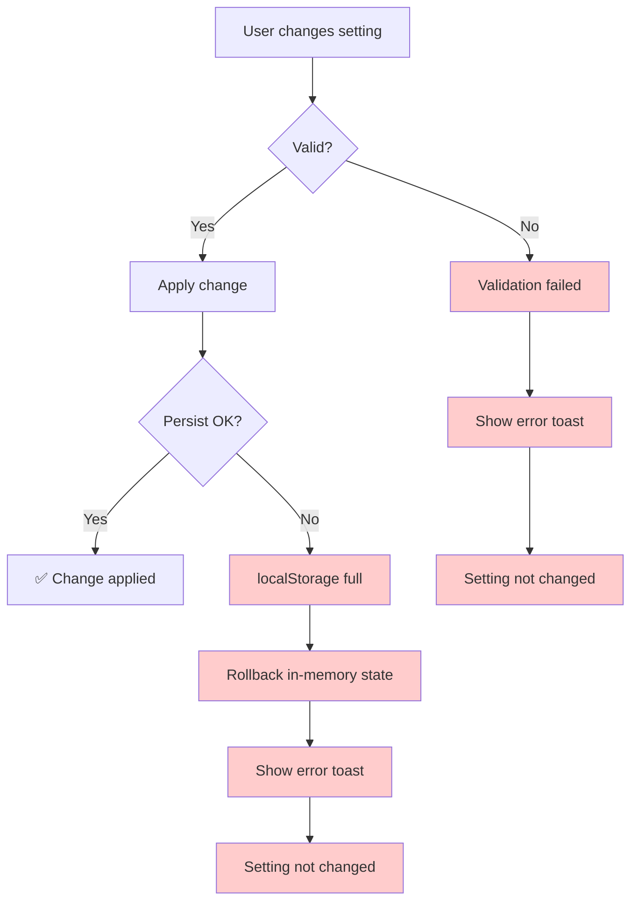

**Recovery Strategies**:
- **Validation Error**: Keep previous value, show message
- **Storage Error**: Rollback in-memory, show warning
- **Apply Error**: Rollback both memory and storage

---

## Conclusion

The workflow system follows a consistent pattern:

1. **User Action** → UI emits event
2. **Validation** → SettingsModule checks
3. **Application** → Handler applies logic
4. **Persistence** → Storage saves
5. **Propagation** → EventBus broadcasts
6. **Response** → Engines update

**Key Benefits**:
- ✅ Predictable flow (always same steps)
- ✅ Error handling at every step
- ✅ Rollback on failure
- ✅ Async-safe (events don't block)
- ✅ Testable (can mock each step)

**Next Steps**:
1. Implement remaining event listeners in engines
2. Add comprehensive error handling
3. Add performance monitoring
4. Write integration tests for workflows
